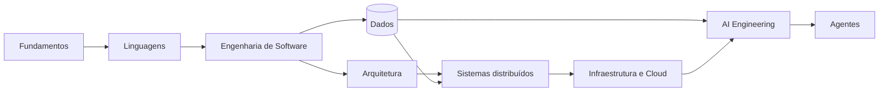

# 🏛️ Alexandria

> **A living library of Software Engineering knowledge.** 
> Learn. Connect. Build. Preserve.

Alexandria é uma universidade open source pessoal para estudar Engenharia de
Software em português brasileiro. Ela conecta fundamentos, prática deliberada,
projetos e referências primárias em percursos que vão do primeiro programa a
decisões de arquitetura de sistemas em produção.

Não é uma lista de links nem um catálogo de ferramentas. Cada Codex procura
responder: **que problema existe, como a solução funciona, quais compromissos
ela impõe, como falha e como comprovamos que funciona?**

## Comece aqui

| Quero… | Entrada recomendada | Resultado esperado |
| --- | --- | --- |
| construir uma base sólida | [Fundamentos](fundamentals/README.md) | modelo mental de computação, redes e engenharia |
| escolher uma linguagem | [Comparação de linguagens](languages/comparison.md) | decisão baseada em contexto e trade-offs |
| seguir um currículo completo | [Atlas](atlas/README.md) | ordem, dependências e marcos verificáveis |
| ver nível e pré-requisitos de cada assunto | [Matriz curricular](CURRICULUM.md) | rota explícita de Beginner a Expert |
| encontrar um assunto | [Pinakes](PINAKES.md) | índice global por domínio e conceito |
| decidir o próximo passo | [Pharos](PHAROS.md) | rotas de continuidade conforme o objetivo |
| aprender construindo | [Projetos](projects/README.md) | portfólio incremental, do monólito ao sistema distribuído |
| consultar fontes confiáveis | [Library](library/README.md) | documentação, livros, papers e RFCs curados |

## Filosofia

Uma tecnologia só entra no currículo quando ocupa um lugar claro no mapa. O
estudo combina quatro movimentos:

1. **Compreender** — princípios, história, internals e vocabulário.
2. **Experimentar** — exemplos pequenos que tornam o mecanismo observável.
3. **Decidir** — alternativas, restrições, falhas e custos operacionais.
4. **Construir** — exercícios e projetos com critérios de conclusão.

Princípios, patterns e arquiteturas são ferramentas de raciocínio, não dogmas.
O contexto decide se uma abstração reduz ou apenas desloca complexidade.

## Atlas

O [Atlas](atlas/README.md) contém os roadmaps completos e define quatro níveis:
**Fundamentos**, **Aplicação**, **Proficiência** e **Sistemas**. Avançar significa
demonstrar capacidade, não apenas terminar leituras. A
[Matriz curricular](CURRICULUM.md) traduz esses estágios para **Beginner**,
**Intermediate**, **Advanced** e **Expert**, registra os pré-requisitos de cada
assunto e mostra em quais trilhas ele participa.

## Trilhas de estudo

A trilha de [Engenharia de Software](atlas/software-engineer.md) fornece a base
geral. Depois dela, ou em paralelo conforme a experiência, o Atlas oferece cinco
especializações canônicas:

| Trilha | Foco | Evidência final |
| --- | --- | --- |
| [Backend Engineer](atlas/backend-engineer.md) | APIs, dados, concorrência, mensageria e confiabilidade | serviço resiliente medido sob falha |
| [Distributed Systems](atlas/distributed-systems-engineer.md) | tempo, replicação, consistência, coordenação e recovery | sistema com falhas parciais reproduzidas |
| [Software Architect](atlas/software-architect.md) | atributos de qualidade, boundaries e evolução | decisões com ADRs e fitness functions |
| [Platform / Cloud Engineer](atlas/platform-cloud-engineer.md) | containers, Kubernetes, cloud, GitOps e plataforma | golden path seguro, observável e operável |
| [AI Engineer](atlas/ai-engineer.md) | evals, LLMs, RAG, tools e agentes | feature avaliada com custo e risco controlados |

Cada trilha começa com diagnóstico, passa por laboratórios e usa os mesmos
[projetos progressivos](projects/README.md) como campo de provas. A conclusão
exige código, falha exercitada, observabilidade, decisão técnica e recuperação,
não apenas páginas lidas.

## Linguagens

| Trilha | Ênfase | Comece por |
| --- | --- | --- |
| [Python](languages/python/README.md) | automação, backend, dados e IA | tipos em runtime, iteradores e modelo de objetos |
| [JavaScript](languages/javascript/README.md) | web, Node.js e programação assíncrona | Event Loop e modelo de execução |
| [TypeScript](languages/typescript/README.md) | sistemas JavaScript com contratos estáticos | narrowing e tipagem estrutural |
| [Go](languages/golang/README.md) | serviços, CLI e infraestrutura | interfaces, goroutines e cancelamento |
| [Kotlin](languages/kotlin/README.md) | JVM, Android e multiplataforma | null safety, coroutines e interoperabilidade |

Veja a [comparação multidimensional](languages/comparison.md). Não existe uma
linguagem universalmente melhor; existem escolhas mais adequadas a restrições
específicas.

## Engenharia de Software

- [Princípios e design](software-engineering/README.md)
- [Design Patterns](design-patterns/README.md)
- [Domain-Driven Design](software-engineering/ddd/README.md)
- [Testing](software-engineering/testing/README.md)
- [System Design](software-engineering/system-design/README.md)
- [Spec-Driven Development](spec-driven-development/README.md)

## Arquitetura e sistemas distribuídos

- [Arquitetura de Software](architecture/README.md): estilos, atributos de
  qualidade, fitness functions e evolução.
- [Sistemas distribuídos](distributed-systems/README.md): tempo, falhas,
  coordenação, consistência e padrões de resiliência.
- [Mensageria](messaging/README.md): Kafka, SQS, entrega, replay e idempotência.
- [Bancos de dados](databases/README.md): modelos, índices, transações,
  replicação e decisões de persistência.

## Infraestrutura

| Área | Questão central |
| --- | --- |
| [Docker](containers/docker/README.md) | como empacotar processos de forma reproduzível e segura? |
| [Kubernetes](kubernetes/README.md) | como reconciliar estado desejado sob falhas? |
| [API Gateways](api-gateways/README.md) | onde aplicar políticas de tráfego sem concentrar domínio? |
| [Observabilidade](observability/README.md) | como inferir o estado interno a partir de sinais externos? |
| [Segurança](security/README.md) | como reduzir risco por desenho e por operação? |
| [Cloud](cloud/README.md) | como equilibrar elasticidade, custo e dependência do provedor? |

## Inteligência Artificial

- [Fundamentos de IA](artificial-intelligence/README.md): ML, Deep Learning,
  Transformers, embeddings e modelos generativos.
- [AI Engineering](ai-engineering/README.md): gateways, RAG, routing,
  guardrails, observabilidade e avaliação.
- [Model Context Protocol](ai-engineering/mcp/README.md): hosts, clients,
  servers, tools, resources e transports.
- [Agentes](agents/README.md): loops, estado, planejamento, ferramentas e
  human-in-the-loop.
- [Skills](skills/README.md): instruções reutilizáveis e progressive disclosure.

## Ferramentas do desenvolvedor

- [Git](developer-tools/git/README.md): do modelo de objetos ao reflog, bisect e
  estratégias de integração.
- [Vim](developer-tools/vim/README.md): linguagem de edição baseada em
  `operator + motion`, não uma lista de atalhos.

## Livros, exercícios e projetos

- [BOOKS.md](BOOKS.md) cataloga obras por assunto sem reproduzir conteúdo
  protegido; os [guias de leitura](books/README.md) propõem sequências.
- [Exercícios](exercises/README.md) define o contrato de prática nos níveis
  Beginner, Intermediate, Advanced e Expert.
- [Projetos](projects/README.md) conecta doze entregas progressivas em uma única
  arquitetura evolutiva.
- [Perguntas de entrevista](interview/README.md) privilegiam raciocínio e
  diagnóstico, não memorização.

## Estado e evolução

Alexandria nasce com a arquitetura completa e Codices iniciais profundos. O
[Roadmap](ROADMAP.md) explicita o que está consolidado, em expansão ou planejado.
Uma página curta pode ser um índice intencional; nunca deve fingir ser um guia
completo. A auditoria automática do currículo compara os guias canônicos com o
nível e o perfil editorial declarados e publica no CI uma fila de páginas que
ainda precisam de aprofundamento. Versões publicadas e mudanças compatíveis
estão registradas no [Changelog](CHANGELOG.md).

## Contribuindo

Leia [CONTRIBUTING.md](CONTRIBUTING.md) antes de propor conteúdo. Toda referência
deve existir, apontar preferencialmente para a fonte oficial e explicar por que
é útil. Use os [templates](templates/README.md) e valide o repositório antes de
abrir uma contribuição.

O conteúdo educacional é licenciado sob [CC BY 4.0](LICENSE); exemplos de código,
sob [MIT](LICENSE-CODE).

---

[Matriz curricular](CURRICULUM.md) · [Índice global](PINAKES.md) · [Próximo: Atlas →](atlas/README.md)
