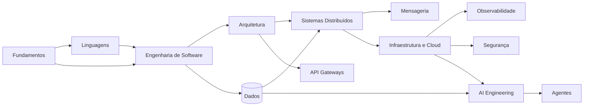

# 🏛️ Alexandria

> **A living library of Software Engineering knowledge.**  
> Learn. Connect. Build. Preserve.

Alexandria é uma **biblioteca open source de engenharia e tecnologia** em português brasileiro. O conteúdo é organizado por temas conectados, não por anos, semestres ou disciplinas obrigatórias. Você pode entrar por Fundamentos, Linguagens, Arquitetura, Sistemas Distribuídos, Dados, Cloud, Segurança, IA ou qualquer outro tema que resolva o problema que está estudando agora.

Não é uma lista de links nem um catálogo de ferramentas. Cada Codex procura responder:

> **Que problema existe, como a solução funciona, quais compromissos ela impõe, como falha e como comprovamos que funciona?**

## Site

A interface temática é mantida em [`docs/`](docs/index.html) e publicada via GitHub Pages quando o Pages do repositório está habilitado.

Ela funciona como PWA, possui tema claro/escuro, progresso local e páginas por tema com:

- mecanismos e conceitos que vale dominar;
- decisões e trade-offs que você deve conseguir justificar;
- laboratórios para tornar o mecanismo observável;
- referências de aprofundamento;
- link direto para o Codex completo no repositório.

A interface não tenta substituir os documentos do repositório. Ela é o mapa; os Codices são o acervo profundo.

## Como navegar

| Quero… | Entrada recomendada | Resultado esperado |
| --- | --- | --- |
| entender os mecanismos básicos | [Fundamentos](fundamentals/README.md) | modelos mentais de CPU, memória, SO, redes e performance |
| comparar linguagens | [Linguagens](languages/comparison.md) | decisão por runtime, tipos, concorrência e contexto |
| melhorar design e testes | [Engenharia de Software](software-engineering/README.md) | boundaries, contratos, testes e evolução mais conscientes |
| tomar decisões arquiteturais | [Arquitetura](architecture/README.md) | trade-offs explícitos, ADRs e fitness functions |
| raciocinar sob falhas parciais | [Sistemas Distribuídos](distributed-systems/README.md) | consistência, coordenação, resiliência e recovery |
| escolher e operar persistência | [Bancos de dados](databases/README.md) | modelos, índices, transações, replicação e migração |
| trabalhar com eventos e filas | [Mensageria](messaging/README.md) | entrega, ordering, replay, idempotência e lag |
| operar em cloud | [Cloud](cloud/README.md) | elasticidade, managed services, custo e confiabilidade |
| estudar containers e orchestration | [Docker](containers/docker/README.md) / [Kubernetes](kubernetes/README.md) | processos reproduzíveis e reconciliation sob falhas |
| aprofundar gateways | [API Gateways](api-gateways/README.md) | Kong, Apigee, auth, quotas e lifecycle de APIs |
| investigar produção | [Observabilidade](observability/README.md) | sinais, OTel, SLOs e diagnóstico por evidência |
| reduzir risco | [Segurança](security/README.md) | threat modeling, identidade, supply chain e resposta |
| construir features de IA | [AI Engineering](ai-engineering/README.md) | evals, RAG, MCP, guardrails, tools e custo |
| estudar sistemas autônomos | [Agentes](agents/README.md) | loops, memória, planejamento, permissões e auditoria |
| aprender construindo | [Projetos](projects/README.md) | prática progressiva com código, falha e recuperação |
| consultar fontes | [Library](library/README.md) | documentação, livros, papers e RFCs curados |

## Método Alexandria

O estudo combina quatro movimentos:

1. **Compreender** — princípios, história, internals e vocabulário.
2. **Experimentar** — exemplos pequenos que tornam o mecanismo observável.
3. **Decidir** — alternativas, restrições, falhas, custo e reversibilidade.
4. **Construir** — exercícios e projetos com critérios verificáveis.

Avançar não significa “terminar uma página”. Significa conseguir explicar o mecanismo, reproduzir um comportamento ou falha, comparar alternativas e produzir evidência revisável: código, teste, benchmark, trace, ADR, diagrama, threat model ou runbook.

## Mapa temático

O [Atlas](atlas/README.md), o [Pinakes](PINAKES.md) e o [Pharos](PHAROS.md) continuam existindo como mapas auxiliares. Eles não definem uma “grade”. Servem para descobrir dependências, localizar conceitos e decidir um próximo aprofundamento.

## Temas principais

### Fundamentos

Representação de dados, estruturas, algoritmos, CPU, caches, memória, processos, threads, I/O, redes, percentis, filas e capacidade.

### Linguagens e runtimes

- [Python](languages/python/README.md)
- [JavaScript](languages/javascript/README.md)
- [TypeScript](languages/typescript/README.md)
- [Go](languages/golang/README.md)
- [Kotlin](languages/kotlin/README.md)
- [Comparação de linguagens](languages/comparison.md)

O objetivo é entender modelo de execução e trade-offs, não eleger “a melhor linguagem”.

### Engenharia de Software

- [Princípios e design](software-engineering/README.md)
- [Design Patterns](design-patterns/README.md)
- [DDD](software-engineering/ddd/README.md)
- [Testing](software-engineering/testing/README.md)
- [System Design](software-engineering/system-design/README.md)
- [Spec-Driven Development](spec-driven-development/README.md)

### Arquitetura e sistemas distribuídos

- [Arquitetura](architecture/README.md): atributos de qualidade, estilos, boundaries e evolução.
- [Sistemas distribuídos](distributed-systems/README.md): tempo, falhas, consistência, coordenação e recovery.
- [Mensageria](messaging/README.md): Kafka, SQS, entrega, replay, ordering e idempotência.
- [Bancos de dados](databases/README.md): modelos, índices, transações, replicação e particionamento.

### Plataforma e operação

- [Docker](containers/docker/README.md)
- [Kubernetes](kubernetes/README.md)
- [Cloud](cloud/README.md)
- [API Gateways](api-gateways/README.md)
- [Observabilidade](observability/README.md)
- [Segurança](security/README.md)

### Inteligência Artificial

- [Fundamentos de IA](artificial-intelligence/README.md)
- [AI Engineering](ai-engineering/README.md)
- [Model Context Protocol](ai-engineering/mcp/README.md)
- [Agentes](agents/README.md)
- [Skills](skills/README.md)

Aqui a régua inclui avaliação, custo, observabilidade, permissões e segurança. Uma demo que “parece funcionar” ainda não é uma feature confiável.

### Ferramentas

- [Git](developer-tools/git/README.md)
- [Vim](developer-tools/vim/README.md)

Ferramentas são estudadas por seus modelos: grafo de objetos no Git, `operator + motion` no Vim, e não como listas de atalhos.

## Aprenda construindo

[Projetos](projects/README.md) conectam os temas em entregas progressivas. A evidência desejada não é somente código rodando. Inclua, quando fizer sentido:

- testes e contratos;
- carga e percentis;
- logs, métricas e traces;
- fault injection;
- SLO e overload policy;
- threat model;
- ADRs;
- runbook e recovery;
- evals e custo para IA.

## Livros e fontes

- [BOOKS.md](BOOKS.md) cataloga obras por assunto.
- [Guias de leitura](books/README.md) propõem sequências.
- [Library](library/README.md) privilegia documentação oficial, RFCs, papers e referências primárias.

Referências não entram apenas como links. O objetivo é deixar claro **por que** uma fonte é útil e qual pergunta ela ajuda a responder.

## Qualidade do acervo

O CI valida estrutura, links, Markdown, diagramas Mermaid e profundidade do acervo. Uma página curta pode ser um índice intencional; não deve fingir ser um guia completo.

O [Roadmap](ROADMAP.md) registra o que está consolidado, em expansão ou planejado. Mudanças publicadas ficam no [Changelog](CHANGELOG.md).

## Contribuindo

Leia [CONTRIBUTING.md](CONTRIBUTING.md). Use os [templates](templates/README.md), explique a utilidade das referências e prefira fontes oficiais ou primárias quando existirem.

O conteúdo educacional é licenciado sob [CC BY 4.0](LICENSE); exemplos de código, sob [MIT](LICENSE-CODE).

---

[Mapa temático](docs/index.html) · [Pinakes](PINAKES.md) · [Atlas](atlas/README.md) · [Projetos](projects/README.md)
