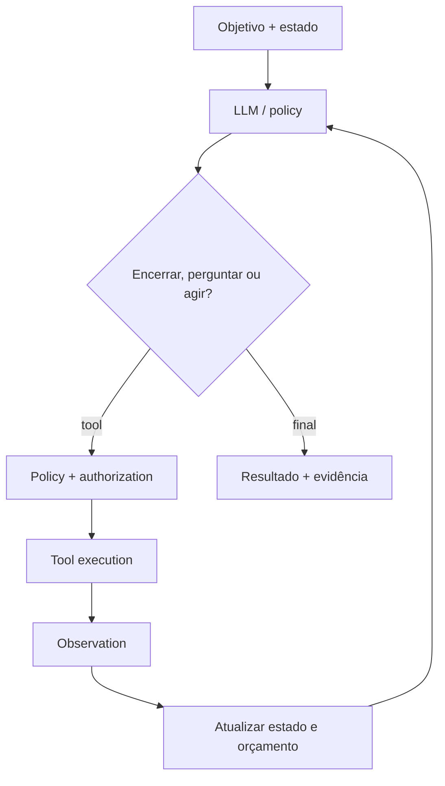

# Agentes

Um agente é um sistema que usa um modelo para escolher ações em função de um
objetivo, executa tools, observa resultados e decide o próximo passo dentro de
limites. O loop acrescenta adaptação, mas também variância, custo e risco.

O problema que justifica um agente aparece quando a próxima ação realmente
precisa ser escolhida em runtime a partir de contexto, linguagem ou estado
incerto. Se a sequência já é conhecida, uma state machine ou workflow costuma
ser mais previsível, barato e auditável.

## Modelo mental: policy adaptativa cercada por limites determinísticos

O modelo não deve “ser o sistema”. Ele participa da policy de decisão dentro de
um envelope controlado pela aplicação.



Separe quatro responsabilidades:

1. **modelo:** propõe próxima ação;
2. **orquestrador:** mantém estado, budgets e condição de parada;
3. **policy gate:** decide se a ação é autorizada;
4. **tool:** executa capacidade estreita e observável.

A segurança e a correção não podem depender apenas de o modelo “lembrar” uma
instrução.

## Workflow, automação, agente e AI Agent

| Conceito | Quem escolhe a próxima transição? | Variância | Use quando |
| --- | --- | --- | --- |
| Automação | código/regras fixas | baixa | tarefa repetível e bem especificada |
| Workflow | state machine/orquestrador | controlada | sequência conhecida com exceções modeláveis |
| Agent | policy adaptativa | variável | ambiente exige seleção dinâmica de ações |
| AI Agent | modelo de IA participa da policy | maior | linguagem/ambiguidade exige generalização |

“Agentic” não é objetivo arquitetural. Comece pelo workflow mínimo e aumente
autonomia apenas quando uma avaliação mostrar ganho.

## Estado canônico

O estado do agente não deve existir apenas dentro da conversa. Mantenha estrutura
explícita para:

- objetivo atual;
- etapa do workflow;
- artifacts produzidos;
- tools já executadas;
- IDs de operações;
- budgets restantes;
- approvals;
- erros;
- resultado final.

Texto do modelo pode resumir o estado, mas não deve ser a única fonte de verdade
para operações críticas.

## Context versus memory

**Context** é informação disponível nesta execução. **Memory** é estado preservado
além dela.

Tipos úteis:

- working state;
- histórico episódico;
- conhecimento semântico recuperável;
- preferências confirmadas;
- artefatos produzidos.

Cada memória precisa de:

- provenance;
- owner/tenant;
- escopo;
- retenção;
- política de edição;
- exclusão;
- freshness.

Guardar tudo aumenta custo, ruído e risco de privacidade.

## Planning

Planejamento pode decompor tarefas, mas plano não é verdade. Observações novas
podem invalidá-lo.

Um padrão seguro é:

```text
observe → decide próximo marco → execute → valide → replaneje
```

Evite plano enorme gerado no início e executado cegamente. Replaneje em
boundaries claros.

## Tools como contratos de capacidade

Uma tool segura possui:

- nome não ambíguo;
- description que distingue capacidades próximas;
- schema estreito;
- tipos e limites;
- autorização externa;
- timeout;
- idempotência quando há efeito;
- resposta estruturada;
- erro canônico;
- observabilidade.

O modelo **propõe** uma chamada. A aplicação resolve identidade, autorização e
alvo real.

### Exemplo: leitura versus escrita

`search_orders(customer_id)` pode ser read-only.

`refund_order(order_id, amount)` muda estado e precisa de:

- autorização;
- limite de valor;
- idempotency key;
- preview;
- confirmação humana em alguns cenários;
- audit log.

Não exponha uma tool genérica `execute_sql` para um agente quando três operações
estreitas resolvem o caso.

## Stop conditions

Todo loop precisa saber quando parar.

Limites comuns:

- número máximo de passos;
- deadline;
- token budget;
- cost budget;
- tool-call budget;
- detector de repetição;
- ausência de progresso;
- número máximo de retries;
- escalation para humano.

Sem stop condition, uma falha simples vira loop caro.

## Progresso observável

Defina o que significa avançar. Exemplos:

- novo artifact produzido;
- task state mudou;
- informação obrigatória obtida;
- hipótese descartada;
- tool result novo.

Se o agente repete ações sem mudar estado, o orquestrador deve interromper.

## Human-in-the-loop

Intervenção humana pode:

- fornecer informação faltante;
- revisar resultado;
- selecionar alternativa;
- autorizar efeito.

Confirmação deve acontecer perto da ação. Mostre:

- qual ação;
- qual alvo;
- qual impacto;
- se é reversível;
- qual valor/quantidade.

Uma aprovação vaga no começo da sessão não é autorização eterna.

## Single-agent

É o default. Menor superfície, menos coordenação e causalidade mais clara.

Antes de multi-agent, tente:

- tools melhores;
- contexto segmentado;
- workflow;
- substeps determinísticos.

## Manager–workers

Um manager divide trabalho entre workers.

É útil para tarefas independentes em paralelo. Requer:

- ownership de artifacts;
- limites de fan-out;
- aggregation policy;
- deduplicação;
- cancellation.

Se dez workers repetem a mesma pesquisa, a arquitetura apenas multiplicou custo.

## Handoff

Um agente transfere estado para especialista quando classificação é clara.

Handoff precisa preservar:

- contexto mínimo;
- provenance;
- objective;
- approvals;
- completed work.

Não copie todo histórico sem necessidade.

## Review/debate

Um segundo modelo pode revisar resultado. Isso pode encontrar falhas, mas modelos
podem compartilhar o mesmo viés.

Use rubrica e checks independentes. “Dois modelos concordaram” não é garantia.

## Multi-agent

Só use quando existirem fronteiras reais:

- tools distintas;
- segurança distinta;
- contextos incompatíveis;
- trabalho paralelo valioso;
- ownership separado.

Custos:

- comunicação;
- estado divergente;
- deadlocks sociais de agents;
- duplicação;
- maior tracing;
- custo.

## Prompt injection

Agentes aumentam risco porque conteúdo não confiável pode influenciar ações.

Considere documento recuperado, página web e resposta de tool como **dados**, não
como autoridade.

Controles:

- separar instrução trusted de conteúdo externo;
- tool allowlist por estado;
- authorization fora do modelo;
- minimizar contexto;
- marcar provenance;
- bloquear secrets do contexto desnecessário;
- confirmar ações de alto impacto.

Prompt injection é problema de trust boundary, não só de prompt melhor escrito.

## Efeito duplicado

Agent retry após timeout pode repetir ação que já aconteceu.

Use:

- idempotency key;
- operation ledger;
- status endpoint;
- conditional update;
- reconciliation.

“Tool retornou timeout” não significa “efeito não ocorreu”.

## Falhas parciais

Uma sequência pode executar 3 de 5 ações e falhar.

Estado precisa registrar o que já aconteceu. Recovery pode:

- retomar;
- compensar;
- pedir intervenção;
- marcar tarefa incompleta.

Não recomece do zero se isso repetir efeitos.

## Guardrails

| Falha | Controle |
| --- | --- |
| loop sem progresso | limite, detector de repetição e escalonamento |
| tool errada | descriptions discriminantes e allowlist |
| argumento perigoso | validação e resolução exata de alvo |
| prompt injection | provenance e policy externa |
| efeito duplicado | idempotency key e ledger |
| contexto excessivo | retrieval seletivo e budget |
| falha parcial | estado persistente e compensação |
| custo explosivo | step/tool/token budget |
| ação irreversível | preview + human approval |

## Avaliação por trajetória

Avalie mais que a resposta final.

Registre:

- task success;
- tools selecionadas;
- argumentos;
- steps;
- retries;
- loop rate;
- recovery;
- violações evitadas;
- human intervention;
- custo;
- latência.

Inclua casos impossíveis em que o comportamento correto é perguntar ou parar.

## Evals determinísticas

Tudo que pode ser verificado sem LLM deve ser:

- schema;
- autorização;
- target;
- budget;
- número de ações;
- ausência de tool proibida;
- idempotency key;
- state transition.

Use model judge para aspectos semânticos, não para substituir invariantes.

## Observabilidade

Cada execução deve ter um trace ou execution ID.

Spans/eventos úteis:

```text
agent.run
  ├─ model.decide
  ├─ policy.check
  ├─ tool.search
  ├─ model.decide
  ├─ approval.wait
  └─ tool.write
```

Atributos:

- agent/version;
- prompt/policy version;
- step number;
- tool name;
- retry number;
- outcome;
- latency;
- token/cost;
- approval state.

Não registre secrets ou dados sensíveis sem necessidade.

### Métricas

- success rate;
- steps/task;
- tool calls/task;
- tool failure rate;
- loop abort rate;
- human escalation rate;
- unauthorized action rejection;
- p95/p99 task duration;
- cost/task;
- retry rate.

Sem observabilidade, comportamento agentic vira uma caixa-preta com conta no fim.

## Performance e custo

Agente pode multiplicar chamadas de modelo e tools. Uma tarefa de 10 passos custa
muito mais que uma chamada única.

Defina budgets:

- máximo de calls;
- limite de parallel workers;
- limite de context size;
- time budget;
- cost budget.

Meça custo por tarefa **bem-sucedida**, incluindo retries e falhas.

## Concorrência

Agentes paralelos podem editar o mesmo artifact ou recurso.

Use:

- ownership explícito;
- optimistic concurrency;
- merge/review;
- lock com timeout quando necessário;
- version IDs.

Não permita last-write-wins silencioso em estado importante.

## Persistência e recovery

Para tarefas longas, persista checkpoints em boundaries relevantes.

Um checkpoint deve permitir responder:

- o que já foi feito?
- qual efeito externo ocorreu?
- qual approval foi obtido?
- qual budget resta?
- qual versão de policy estava ativa?

Recovery precisa ser idempotente.

## Segurança de tools

Tools podem ser o maior risco do sistema.

Princípios:

- least privilege;
- capability-specific credentials;
- network egress restrito;
- sandbox para execução de código;
- file access limitado;
- audit de ações;
- deny-by-default.

Um agente com shell irrestrito + cloud credentials é praticamente um operador
programável. Trate isso como acesso privilegiado.

## Modos de falha

### Loop sem progresso

Sintomas: mesma tool, mesma query, mesma observação.

Controle: detect repetition, stop e escalate.

### Tool errada repetidamente

Descriptions são ambíguas ou policy permite opções demais. Redesenhe interface.

### Context poisoning

Memory antiga ou documento malicioso altera decisão. Marque provenance, scope e
freshness.

### Agent “conclui” sem efeito real

Modelo interpreta texto da tool como sucesso, mas operação falhou. Tool response
deve ter status estruturado e confirmação da autoridade.

### Approval bypass

Loop chama tool de escrita por caminho alternativo sem gate. Authorization deve
estar no executor, não apenas no prompt.

## Testes

- state-transition tests;
- tool contract tests;
- duplicate-effect tests;
- timeout/retry;
- prompt injection fixtures;
- memory poisoning;
- budget exhaustion;
- human approval;
- recovery from checkpoint;
- concurrency conflict;
- provider outage;
- multi-agent conflicting instructions.

## Laboratório progressivo

### Beginner

Transforme um agent loop em state machine fixa e compare previsibilidade.

### Intermediate

Implemente duas tools read-only, estado estruturado, step limit e tracing.

### Advanced

Adicione tool de escrita com preview, autorização, confirmação e idempotência.
Mate execução depois do efeito e antes da resposta; recupere sem duplicar.

### Expert

Monte manager + workers. Injete mensagens conflitantes, worker timeout, prompt
injection, stale memory e budget exhaustion. Meça success, custo e recovery.

## Projeto de síntese

Construa um agente de operação de tickets:

1. lê ticket;
2. busca dados;
3. propõe diagnóstico;
4. executa apenas ações read-only automaticamente;
5. qualquer escrita exige preview e aprovação;
6. state é persistido;
7. toda tool possui idempotência;
8. trace registra trajetória;
9. budget limita passos/custo;
10. eval suite inclui casos impossíveis e adversariais.

Compare com workflow determinístico. Só mantenha agente se ele resolver casos que
o workflow não resolve com custo e risco aceitáveis.

## Critério de conclusão

Você domina agentes quando consegue explicar:

- por que autonomia é necessária;
- qual estado é canônico;
- onde authorization realmente ocorre;
- como parar loops;
- como recuperar falha parcial;
- como provar que efeito não duplica;
- como observar e avaliar trajetória;
- quando remover o agente e voltar a workflow.

## Referências

- [MCP Architecture 2026-07-28](https://modelcontextprotocol.io/specification/2026-07-28/architecture)
- [NIST AI RMF](https://www.nist.gov/itl/ai-risk-management-framework)
- [OWASP GenAI Security Project](https://genai.owasp.org/)
- [Avaliação de AI Engineering](../ai-engineering/evaluation.md)

---

[← MCP](../ai-engineering/mcp/README.md) · [↑ Início](../README.md) · [Skills →](../skills/README.md)
