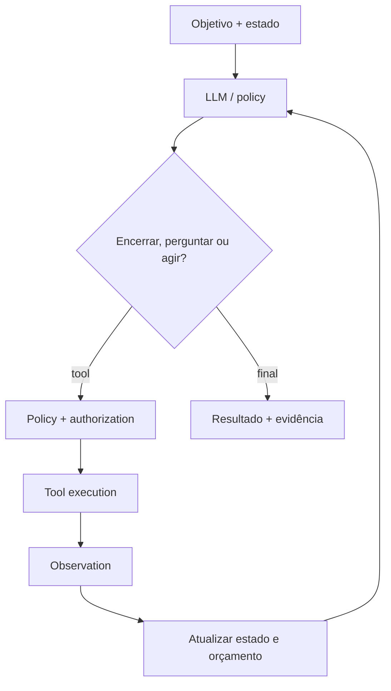

# Agentes

Um agente é um sistema que usa um modelo para escolher ações em função de um
objetivo, executa tools, observa resultados e decide o próximo passo dentro de
limites. O loop acrescenta adaptação, mas também variância e risco.

## Workflow, automação, agente e AI Agent

| Conceito | Quem escolhe a próxima transição? | Variância | Use quando |
| --- | --- | --- | --- |
| Automação | código/regras fixas | baixa | tarefa repetível e bem especificada |
| Workflow | state machine/orquestrador | controlada | sequência conhecida com exceções modeláveis |
| Agent | policy adaptativa | variável | ambiente exige seleção dinâmica de ações |
| AI Agent | modelo de IA participa da policy | maior | linguagem/ambiguidade exige generalização |

“Agentic” não é um objetivo. Comece pelo workflow mínimo e aumente autonomia
somente quando uma avaliação mostrar ganho.

## Componentes

### Tools

São contratos de capacidade. Uma tool segura tem nome não ambíguo, schema
estreito, princípio de least privilege, timeout, idempotência e erros úteis. O
modelo propõe; a aplicação valida autorização e efeito.

### Context e memory

Context é informação disponível nesta execução. Memory é estado preservado além
dela. Diferencie:

- working state do workflow;
- histórico episódico de ações;
- conhecimento semântico recuperável;
- preferências confirmadas do usuário.

Memória precisa de provenance, escopo, retenção, edição e exclusão. Guardar tudo
gera contexto ruidoso e risco de privacidade.

### Planning e state

Planos ajudam a decompor trabalho, mas envelhecem quando observações mudam.
Mantenha estado canônico fora do texto livre do modelo e replaneje em boundaries
claros. Step limit, deadline, token/cost budget e detecção de repetição são
condições de parada, não sugestões.

### Human-in-the-loop

Intervenção humana pode fornecer informação, revisar um resultado ou autorizar
um efeito. Peça confirmação no momento da ação com alvo e consequência claros.
Não transforme uma aprovação inicial vaga em permissão contínua.

## Orquestração

- **single-agent:** menor superfície e causalidade mais simples;
- **manager–workers:** paraleliza tarefas independentes e agrega resultados;
- **handoff:** especialista assume quando classificação é clara;
- **debate/review:** perspectivas independentes podem revelar falhas, com custo;
- **multi-agent:** só separe quando contextos, tools ou trabalho paralelo justificam.

Mais agentes aumentam comunicação, duplicação, inconsistência de estado e custo.
Defina ownership de artefatos para evitar edições concorrentes.

## Falhas e guardrails

| Falha | Controle |
| --- | --- |
| loop sem progresso | limite, detector de repetição e escalonamento |
| tool errada | descriptions discriminantes e allowlist por estado |
| argumento perigoso | validação, resolução exata de alvo e confirmação |
| prompt injection | separar dados/instruções, provenance e policy externa |
| efeito duplicado | idempotency key e ledger de execução |
| contexto excessivo | retrieval seletivo, resumo verificável e budgets |
| falha parcial | estado persistente, retries limitados e compensação |

## Avaliação

Avalie success por tarefa e por trajetória: tools selecionadas, argumentos,
passos, recuperação, violações evitadas, custo e tempo. Inclua casos impossíveis
em que o comportamento correto é perguntar ou parar.

## Exercícios

- **Beginner:** transforme um agent loop em state machine e compare previsibilidade.
- **Intermediate:** implemente duas tools read-only e stop conditions observáveis.
- **Advanced:** adicione uma escrita com preview, confirmação e idempotência.
- **Expert:** red-team um sistema multi-agent sob mensagens conflitantes e falhas parciais.

## Referências

- [MCP Architecture 2026-07-28](https://modelcontextprotocol.io/specification/2026-07-28/architecture)
- [NIST AI RMF](https://www.nist.gov/itl/ai-risk-management-framework)
- [OWASP GenAI Security Project](https://genai.owasp.org/)
- [Avaliação de AI Engineering](../ai-engineering/evaluation.md)

---

[← MCP](../ai-engineering/mcp/README.md) · [↑ Início](../README.md) · [Skills →](../skills/README.md)
