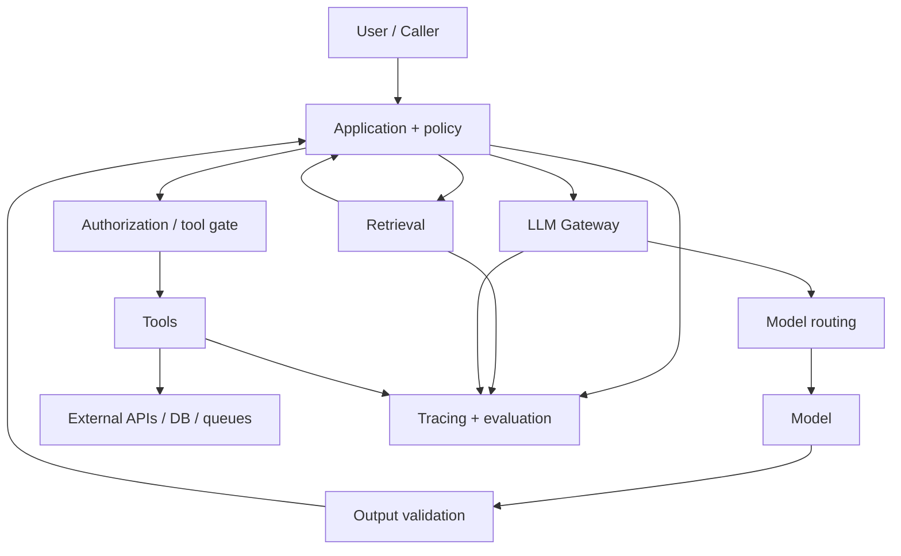

# AI Engineering

AI Engineering integra modelos probabilísticos a software com contratos,
telemetria, segurança, avaliação e controle de custo. O modelo é uma dependência
do sistema, não o sistema inteiro. A qualidade emerge da interação entre dados,
retrieval, prompts, modelos, tools, políticas, UX e operação.

O problema de engenharia aparece quando uma demo precisa virar produto: respostas
variáveis precisam de critérios de aceite, providers falham, custos crescem,
contexto pode conter dados sensíveis e uma tool pode produzir efeitos reais.

## Modelo mental: modelo probabilístico dentro de uma máquina determinística maior

Pense na feature como um pipeline com boundaries explícitos:



A fronteira importante é: **o modelo pode propor, mas a aplicação continua dona
de autorização, contratos, efeitos e estado canônico**.

## Antes da IA: defina o problema

Escreva:

- qual tarefa o usuário quer concluir?
- qual baseline sem LLM existe?
- qual erro é tolerável?
- qual erro é bloqueante?
- qual latência máxima?
- qual custo por tarefa?
- quais dados podem entrar no contexto?
- existe efeito irreversível?

Sem isso, “melhorar o prompt” vira otimização sem objetivo.

## Baseline

Compare a solução de IA contra algo simples:

- search;
- regras;
- template;
- autocomplete;
- modelo pequeno;
- workflow determinístico.

RAG, agente ou modelo maior só devem permanecer se o ganho superar custo e risco.

## Componentes e responsabilidades

| Componente | Responsabilidade | Não deve esconder |
| --- | --- | --- |
| aplicação | regra de produto, autorização, UX e estado | decisão de domínio no prompt |
| LLM gateway | credenciais, quotas, routing comum, telemetry | diferenças semânticas entre modelos |
| model router | rota por capacidade/custo/risco | fallback que muda contrato silenciosamente |
| retrieval | recuperar evidência e provenance | autorização por documento |
| tool adapter | schema, execução, erro, idempotência | credencial ampla ou efeito irreversível |
| evaluation | regressão por versão e slice | uma nota agregada sem casos de erro |
| policy gate | permitir/negar ação | decisão delegada ao modelo |

## Integração com provider

Uma chamada externa precisa ser tratada como qualquer dependency crítica.

Exemplo conceitual:

```text
POST /v1/responses
Authorization: Bearer <secret server-side>
Idempotency-Key: <quando suportado e necessário>

{
  "model": "<versão escolhida>",
  "input": [...],
  "output_schema": {...}
}
```

A aplicação define:

- connect/read timeout;
- deadline total;
- cancellation;
- retry policy;
- máximo de tokens;
- tamanho de input;
- schema esperado;
- fallback;
- budget de custo.

Credencial nunca deve ir ao browser ou log.

## Timeout e retry

Timeout do provider não prova que a operação não consumiu tokens ou que uma tool
não foi chamada em outro boundary.

Retry apenas:

- erro transitório;
- dentro do deadline;
- com backoff/jitter;
- quando efeito é seguro;
- respeitando rate limits.

Retry de uma geração pode produzir resposta diferente. Se downstream espera uma
única decisão, trate isso explicitamente.

## Streaming

Streaming reduz time-to-first-token e melhora UX, mas muda lifecycle.

Quando o usuário fecha a conexão:

- cancele chamada upstream quando possível;
- pare processamento inútil;
- finalize métricas;
- não execute tool de escrita depois que fluxo foi abandonado sem uma state
  transition explícita.

Node.js precisa respeitar backpressure. Python async precisa propagar cancellation.

## Structured outputs

TypeScript types ou dataclasses não validam resposta externa por si só. Use JSON
Schema ou validator runtime.

Fluxo:

```text
model output → parse → schema validate → domain validate → use
```

Schema garante forma, não verdade. `amount: -100` pode ser JSON válido e domínio
inválido.

## Prompt como artefato versionado

Prompt muda comportamento. Trate como código/configuração:

- versionamento;
- review;
- eval antes de release;
- rollback;
- owner;
- changelog quando relevante.

Não esconda regra de negócio crítica em texto que ninguém testa.

## Context engineering

Context window grande não significa que você deve enviar tudo.

Contexto excessivo aumenta:

- custo;
- latência;
- risco de prompt injection;
- exposição de dados;
- competição entre evidências;
- dificuldade de debugging.

Inclua apenas informação necessária, com provenance e escopo.

## Retrieval-Augmented Generation

RAG serve quando conhecimento é privado, recente ou precisa de fonte.

Pipeline:

```text
ingest → parse → chunk → index
query → auth/filter → retrieve → rerank → context → generate → cite
```

Cada etapa precisa de avaliação separada.

### Ingestão

Problemas comuns:

- parsing perde tabela;
- documentos duplicados;
- metadata errada;
- ACL não acompanha chunk;
- índice fica stale.

Mantenha document ID, version, source e ACL.

### Chunking

Chunk pequeno aumenta granularidade e pode perder contexto. Chunk grande aumenta
ruído e custo.

Teste por domínio, não por “500 tokens é padrão”.

### Embeddings

Embedding representa similaridade, não verdade nem autorização.

Mudança de embedding model pode exigir reindexação e comparação de retrieval.

### Hybrid search

Combine lexical e vector quando termos exatos e semântica importam.

### Reranking

Use modelo mais caro em poucos candidatos para melhorar ordem. Meça ganho e
latência.

## Autorização no RAG

Filtre documentos **antes** de entrar no contexto. Não recupere tudo e peça ao
modelo para “não mencionar”.

Authorization precisa considerar:

- user/tenant;
- document ACL;
- classification;
- purpose;
- region quando aplicável.

Vector store é parte da security boundary.

## Grounding

Uma resposta grounded deve estar suportada pela evidência disponível.

Avalie:

- source recall;
- citation correctness;
- unsupported claims;
- abstention quando contexto não basta.

Modelo pode responder corretamente por conhecimento interno mesmo com retrieval
ruim. Isso não prova RAG.

## Tool Calling

Tool calling transforma modelo de gerador em participante de decisões com efeito.

Tool segura:

- capability estreita;
- schema;
- authorization externa;
- timeout;
- idempotency;
- audit;
- resposta canônica.

Separe:

```text
search_order    # leitura
refund_order    # escrita
```

Não exponha shell/SQL genérico quando operações específicas bastam.

## Efeitos irreversíveis

Para escrita de alto impacto, use:

1. modelo propõe;
2. aplicação resolve alvo exato;
3. policy verifica;
4. UI mostra preview;
5. humano confirma quando necessário;
6. executor usa idempotency key;
7. resultado é auditado.

Prompt não é authorization layer.

## Workflows versus agentes

Se sequência é conhecida:

```text
classify → retrieve → validate → generate
```

use workflow.

Agente é justificável quando a próxima ação precisa ser escolhida dinamicamente e
isso melhora tarefa de forma mensurável.

Mais autonomia significa mais:

- variância;
- custo;
- tracing;
- stop conditions;
- security review.

## MCP

[MCP](mcp/README.md) padroniza integração entre hosts, clients e servers.

Ele facilita interoperabilidade, mas não substitui:

- authorization;
- tool design;
- tenant isolation;
- audit;
- input validation.

Use quando vários hosts/servers justificam o protocolo. Uma única integração
interna pode continuar simples.

## LLM Gateway

Gateway pode centralizar:

- provider credentials;
- quotas;
- routing;
- telemetry;
- normalization;
- region policy.

Evite concentrar prompts e lógica de negócio. O gateway deve ser infraestrutura,
não domínio universal.

## Model routing

Escolha modelo por:

- dificuldade;
- modality;
- latency;
- custo;
- safety capability;
- região;
- disponibilidade.

Teste routing. Uma rota errada pode custar mais que usar um modelo único.

## Fallback

Fallback precisa preservar semântica.

Exemplos:

- provider A → provider B equivalente;
- RAG → search-only;
- agent → workflow;
- generation → template seguro.

Nunca faça fallback para modelo que não atende safety policy só porque está
disponível.

## Cache

### Exact cache

Chave por input normalizado + versions + contexto.

### Semantic cache

Reutiliza por similaridade. Inclua tenant, ACL, idioma, versão, freshness e policy.

Erro de namespace pode vazar dados entre usuários.

## Filas e processamento assíncrono

Chamadas caras ou longas podem ir para worker.

Kafka favorece stream/replay. SQS favorece jobs gerenciados.

Consumer precisa de idempotência porque:

```text
modelo conclui → worker cai → ack não acontece → mensagem retorna
```

Persistir resultado por operation ID evita gasto e efeito duplicado.

## Estado e banco

PostgreSQL pode guardar:

- task state;
- prompt/model versions;
- approvals;
- results;
- operation ledger.

Redis pode guardar cache/rate limit, desde que não vire fonte de verdade acidental.

Vector store guarda representação derivada do corpus; o documento original e sua
ACL continuam sendo referência.

## Avaliação

Leia [Avaliação e operação](evaluation.md) antes de otimizar prompts.

Uma suite precisa conter:

- happy paths;
- edge cases;
- adversarial cases;
- recusas;
- long tail;
- incidentes reais.

Versione:

- dataset;
- model;
- prompt;
- retriever;
- embedding;
- tools;
- judge.

## Evals por componente

### Retrieval

Recall@k, nDCG, filtros, empty rate.

### Generation

Correção, groundedness, completeness, citation.

### Tool use

Tool certa, argumentos, autorização, efeito.

### Agent

Trajectory, steps, recovery, stop.

Uma nota única esconde causa.

## Observabilidade

Trace ideal:

```text
request
  ├─ retrieval
  ├─ routing
  ├─ llm.call
  ├─ output.validation
  ├─ policy.check
  └─ tool.call
```

Atributos úteis:

- model/provider/version;
- prompt version;
- retriever/index version;
- retrieval IDs;
- token counts;
- cost;
- queue time;
- tool outcome;
- retry;
- fallback.

Não registre prompt/output sensível indiscriminadamente.

## Métricas operacionais

- task success;
- p50/p95/p99;
- first-token latency;
- tokens/request;
- cost/task;
- provider error;
- rate-limit error;
- fallback rate;
- cache hit;
- retrieval empty rate;
- tool failure;
- human escalation.

## Performance

Faça budget por etapa.

Exemplo conceitual:

```text
retrieval     150 ms
reranking     100 ms
model        1200 ms
tool          300 ms
validation     50 ms
```

Se cada componente usa o budget inteiro, p99 final explode.

Meça queue time separadamente de execution time.

## Custo

Custo por token é apenas parte.

Inclua:

- retries;
- embeddings;
- vector storage;
- reranking;
- tools;
- cache;
- human review;
- observability;
- failed tasks.

Métrica útil: **custo por tarefa concluída corretamente**.

## Rate limits e overload

Provider possui quotas. Seu sistema também precisa limitar fan-out.

Use:

- concurrency limit;
- queue bounded;
- rate limit por tenant;
- retry budget;
- load shedding;
- prioridade.

Agente que dispara 20 chamadas por request pode amplificar pico rapidamente.

## Segurança: prompt injection

Conteúdo externo pode conter instruções maliciosas.

Considere documentos, páginas e tool outputs como dados não confiáveis.

Defesas:

- separar instruções trusted;
- provenance;
- tool allowlist;
- authorization externa;
- least privilege;
- egress limitado;
- secret isolation;
- human approval.

## Segurança de dados

Antes de enviar ao provider:

- classifique dados;
- minimize;
- remova PII desnecessária;
- respeite region/residency;
- conheça retention do provider;
- defina logging policy.

## Supply chain

Models, SDKs, prompt templates e MCP servers são dependências.

Revise:

- source/version;
- permissions;
- package updates;
- model provenance;
- server/tool trust.

## Modos de falha

### Provider lento

Sintomas: p99 e queue crescem. Use deadline, concurrency limit e fallback.

### Retrieval vazio

Não deixe modelo inventar. Responda com abstention/search fallback.

### Índice stale

Document version diverge. Monitore ingest lag e freshness.

### Tool timeout ambíguo

Efeito pode ter ocorrido. Consulte operation status/idempotency antes de retry.

### Semantic cache incorreto

Similarity alta entre perguntas não equivalentes. Invalide e restrinja namespace/
threshold.

### Agent loop

Step budget e progress detector interrompem.

### Judge regressa

Um grader atualizado muda score sem sistema mudar. Versione judge e recalibre.

## Testes

- provider contract;
- timeout/cancellation;
- schema invalid;
- retrieval eval;
- authorization isolation;
- prompt injection;
- tool idempotency;
- cache tenant isolation;
- rate limit;
- provider outage;
- fallback;
- eval regression;
- canary/rollback.

## Laboratório progressivo

### Beginner

Integre um modelo com schema, timeout e métricas. Compare contra baseline sem LLM.

### Intermediate

Adicione RAG com dataset de relevância. Meça retrieval separado da resposta.

### Advanced

Adicione tool read-only e depois uma escrita com policy + idempotency + approval.
Injete timeout após efeito.

### Expert

Crie router/fallback, queue, budgets e canary. Simule provider outage, prompt
injection e index stale. Execute runbook e compare qualidade/custo antes/depois.

## Projeto de síntese

Implemente o [Assistente RAG](../projects/10-rag.md) com:

1. baseline;
2. corpus versionado;
3. ACL por documento;
4. retrieval eval;
5. output schema;
6. tracing;
7. cost budget;
8. threat model;
9. canary.

Só promova para [AI Agent](../projects/11-ai-agent.md) se a avaliação demonstrar
ganho que um workflow determinístico não entrega.

## Critério de conclusão

Você domina AI Engineering quando consegue explicar uma regressão sem culpar
genericamente “o modelo”: identifica se o problema está em dados, retrieval,
prompt, model, policy, tool, operação ou avaliação e sabe qual evidência coletar
para decidir.

## Anti-patterns

- prompt-and-pray;
- retry indiscriminado;
- contexto inteiro porque “cabe”;
- modelo decidindo autorização;
- semantic cache sem tenant/version;
- agente para workflow conhecido;
- logar prompts sensíveis por padrão;
- fallback sem equivalência de safety;
- uma única métrica agregada;
- provider SDK usado sem deadline/cancellation.

## Referências

- [NIST AI RMF](https://www.nist.gov/itl/ai-risk-management-framework)
- [OWASP GenAI Security Project](https://genai.owasp.org/)
- [Model Context Protocol specification 2026-07-28](https://modelcontextprotocol.io/specification/2026-07-28)
- [Retrieval-Augmented Generation paper](https://arxiv.org/abs/2005.11401)

---

[← Generative AI](../artificial-intelligence/generative-ai/README.md) · [↑ Início](../README.md) · [Padrões →](patterns.md)
