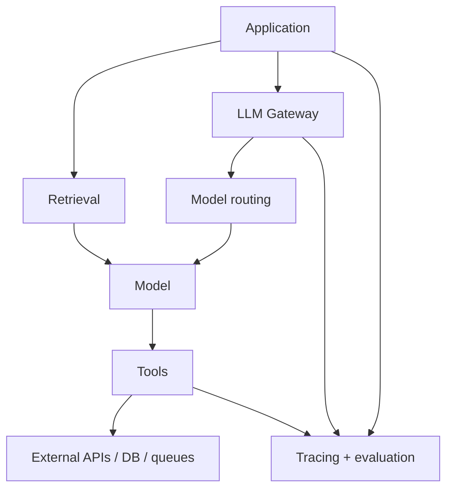

# AI Engineering

AI Engineering integra modelos probabilísticos a software com contratos,
telemetria, segurança, avaliação e controle de custo. O modelo é uma dependência
do sistema; a qualidade emerge do conjunto.



## Componentes e responsabilidades

| Componente | Responsabilidade | Não deve esconder |
| --- | --- | --- |
| aplicação | regra de produto, autorização e UX | decisão de domínio no prompt |
| LLM gateway | políticas comuns, credenciais, quota e telemetria | diferenças semânticas entre modelos |
| model router | escolher rota por capacidade/custo/risco | fallback que muda qualidade silenciosamente |
| retrieval | recuperar evidência com provenance | autorização por documento |
| tool adapter | validar schema, executar e normalizar erro | credenciais amplas ou efeito irreversível |
| evaluation | detectar regressão por versão e slice | uma nota agregada sem casos de erro |

## Integração segura com uma API de LLM

O exemplo é deliberadamente independente de provedor:

```text
POST /v1/responses
Authorization: Bearer <token obtido de secret manager>
Idempotency-Key: <operação lógica, se o provedor suportar>

{
  "model": "<modelo versionado>",
  "input": [{"role": "user", "content": "..."}],
  "output_schema": {"type": "object", "required": ["answer"]}
}
```

A aplicação define connect/read timeout, cancelamento, tamanho máximo, retry
apenas para falhas transitórias e budget total. Valida status, content type,
schema e regra de domínio antes de usar o resultado. Credencial nunca vai ao
browser ou log.

## Python, Node.js e TypeScript

- Em **Python**, cliente assíncrono deve reutilizar conexões e propagar
  cancelamento; CPU local e tokenização não devem bloquear o event loop.
- Em **Node.js**, streaming exige backpressure e encerramento quando o client
  desconecta; Promises não tornam CPU-bound work não bloqueante.
- Em **TypeScript**, types ajudam dentro do programa, mas resposta externa ainda
  precisa de validação runtime por JSON Schema ou biblioteca equivalente.

## Dados, filas e operação

- PostgreSQL guarda estado transacional, versões e resultados auditáveis.
- Vector stores servem retrieval; metadados de autorização devem filtrar antes
  de conteúdo entrar no contexto.
- Redis pode guardar resultado derivado, rate limit ou semantic cache, desde que
  staleness e vazamento entre tenants sejam controlados.
- Kafka favorece streams reproduzíveis; SQS, jobs gerenciados. Consumers precisam
  idempotência porque uma chamada ao modelo pode concluir antes do ack.
- Traces devem registrar rota, versão, latência, tokens, custo, retrieval IDs e
  tool outcomes sem conteúdo sensível.

## Padrões

O [catálogo de padrões](patterns.md) cobre RAG, Agentic RAG, Tool Calling, Prompt
Routing, Model Routing, Semantic Cache, Guardrails e LLM Gateway. [MCP](mcp/README.md)
padroniza uma fronteira de integração; não substitui autorização ou desenho de tool.

## Avaliação

Leia [Avaliação e operação](evaluation.md) antes de otimizar prompts. Crie um
baseline sem IA e um dataset que contenha caminhos felizes, bordas, ataques e
recusas. Versione modelo, prompt, retrieval, tools e julgador.

## Anti-patterns

- “prompt-and-pray” sem dataset ou rollback;
- retry indiscriminado que multiplica custo e efeitos;
- enviar o contexto inteiro porque cabe na window;
- deixar o modelo decidir autorização;
- semantic cache sem tenant, versão ou política de privacidade;
- adicionar agente quando uma state machine resolve o workflow.

## Projeto prático

Implemente o [Assistente RAG](../projects/10-rag.md), instrumente-o e só promova
para o [AI Agent](../projects/11-ai-agent.md) se a avaliação demonstrar ganho.

## Referências

- [NIST AI RMF](https://www.nist.gov/itl/ai-risk-management-framework)
- [OWASP GenAI Security Project](https://genai.owasp.org/)
- [Model Context Protocol specification 2026-07-28](https://modelcontextprotocol.io/specification/2026-07-28)
- [Retrieval-Augmented Generation paper](https://arxiv.org/abs/2005.11401)

---

[← Generative AI](../artificial-intelligence/generative-ai/README.md) · [↑ Início](../README.md) · [Padrões →](patterns.md)
