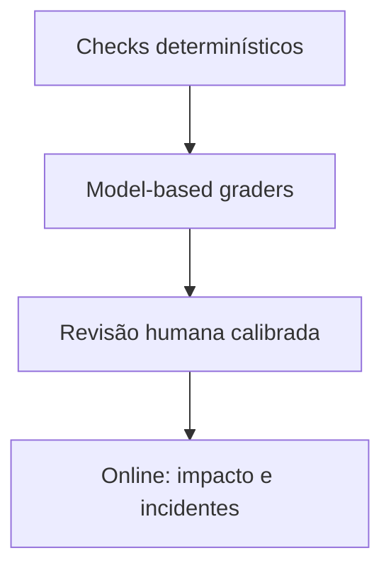

# Avaliação e operação de sistemas de IA

Avaliação é uma especificação executável do comportamento desejado. Sem ela,
trocar prompt ou modelo é uma demonstração, não engenharia.

## Unidade de avaliação

Registre input, contexto autorizado, output esperado ou rubrica, riscos, tags de
slice e provenance. Para agentes, inclua estado, tools disponíveis, trajetória
permitida, efeitos e condição de parada.

## Pirâmide de avaliação

- checks determinísticos: schema, citação existente, autorização, custo e tempo;
- métricas de retrieval: recall/precision/nDCG conforme labels de relevância;
- rubricas: correção, completude, groundedness, estilo, safety e abstention;
- online: task success, correções, abandono, reclamações e dano.

## RAG por etapa

1. A fonte correta estava indexada?
2. A query recuperou candidatos relevantes?
3. Reranking preservou a evidência?
4. O contexto continha suporte suficiente?
5. A resposta ficou restrita ao suporte e citou corretamente?

Uma nota final não localiza o componente a corrigir.

## Agentes por trajetória

Meça seleção de tool, argumentos, passos redundantes, recuperação após erro,
efeitos proibidos evitados, confirmação humana e estado final. Um resultado
correto por uma ação perigosa é falha.

## Operação

- release eval antes do deploy e canary com orçamento limitado;
- trace correlaciona modelo, prompt, índice e tool version;
- quality metrics podem chegar tarde: mantenha amostra para revisão;
- monitore latência por etapa, tokens, custo, retry e queue time;
- kill switch e fallback devem ser testados;
- retenção de prompts/outputs segue minimização e política de dados.

## Exercícios

- **Beginner:** transforme dez exemplos subjetivos em rubrica reproduzível.
- **Intermediate:** compare dois prompts com análise pareada e categorias de erro.
- **Advanced:** calibre um LLM judge contra revisão humana cega.
- **Expert:** desenhe canary com stop conditions para um agente com escrita.

---

[← Padrões](patterns.md) · [↑ AI Engineering](README.md) · [MCP →](mcp/README.md)
