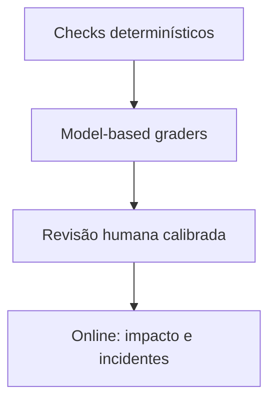

# Avaliação e operação de sistemas de IA

Avaliação é uma especificação executável do comportamento desejado. Sem ela,
trocar prompt, modelo, retriever ou tool é uma demonstração, não engenharia. O
problema central é que sistemas de IA produzem saídas probabilísticas e podem
falhar de formas diferentes para entradas aparentemente semelhantes. Portanto,
“funcionou em alguns exemplos” não é evidência suficiente para release.

## Modelo mental: qualidade é uma distribuição, não um único número

Uma feature de IA recebe inputs de populações diferentes, passa por componentes
com fontes de erro próprias e gera resultados com severidades diferentes. A
avaliação precisa decompor esse caminho:

```text
input → policy/contexto → retrieval → prompt → modelo → tools → pós-processamento
                                                   ↓
                                              efeito real
```

Uma média pode esconder um segmento crítico. Um sistema com 95% de acerto global
pode ter 60% justamente nas perguntas financeiras, jurídicas ou de clientes de
maior valor. Por isso, a unidade de análise é **caso + slice + trajetória + risco**.

## O que uma avaliação deve responder

Antes de escolher métrica, escreva as perguntas de decisão:

- a feature supera um baseline mais simples?
- qual classe de erro aumentou ou diminuiu?
- em quais slices a regressão aparece?
- o sistema sabe se abster quando não possui evidência?
- retrieval encontra a fonte certa?
- tools corretas são escolhidas com argumentos seguros?
- latência e custo cabem no orçamento?
- mudanças no modelo/prompt quebram contratos já aceitos?
- erros graves são detectados antes de chegar ao usuário?

Avaliação boa reduz uma decisão vaga a condições observáveis de promoção ou
bloqueio.

## Unidade de avaliação

Cada caso deve registrar o suficiente para ser reproduzido:

- input original e idioma;
- contexto autorizado disponível ao sistema;
- resposta de referência **ou** rubrica explícita;
- fatos que precisam aparecer e fatos que não podem ser inventados;
- classificação de risco;
- tags de slice, como domínio, tamanho, idioma e dificuldade;
- versão de dataset, prompt, retriever, modelo, tools e policy;
- provenance da fonte quando houver RAG;
- custo e latência esperados quando forem requisitos.

Para agentes, inclua estado inicial, tools disponíveis, ações permitidas,
confirmações humanas necessárias, efeitos observáveis e condição de parada.

## Baseline antes do modelo sofisticado

Sempre compare contra algo mais simples. Exemplos:

- busca lexical sem LLM;
- template determinístico;
- modelo menor sem RAG;
- prompt direto sem agente;
- workflow fixo com duas chamadas de tool.

Se a solução mais complexa não melhora uma métrica relevante, a complexidade
extra não tem justificativa. “Parece mais inteligente” não é critério de aceite.

## Pirâmide de avaliação



Cada camada tem um papel distinto.

### Checks determinísticos

São baratos, rápidos e excelentes para propriedades objetivas:

- JSON/schema válido;
- citação aponta para documento realmente recuperado;
- tool pertence à allowlist;
- argumentos respeitam tipos e limites;
- autorização foi verificada;
- número de tokens e custo não excedem budget;
- latência não ultrapassa timeout interno;
- resposta contém/omite elementos verificáveis.

Eles não avaliam bem nuance semântica, mas devem capturar tudo que **pode** ser
validado sem um modelo.

### Model-based graders

LLM judges escalam avaliações de correção, groundedness, estilo e completude,
mas não são oráculos. Podem ter viés de posição, preferência por respostas mais
longas, sensibilidade ao próprio prompt e correlação com o modelo avaliado.

Use rubrica estreita, exemplos calibrados, saída estruturada e análise por slice.
Nunca trate score do judge como verdade sem comparar uma amostra contra revisão
humana.

### Revisão humana

É necessária quando a propriedade exige interpretação, risco é alto ou o judge
ainda não está calibrado. Para reduzir ruído:

1. defina rubric com critérios observáveis;
2. use exemplos positivos/negativos;
3. faça avaliação cega quando possível;
4. meça concordância entre revisores;
5. discuta casos de discordância e ajuste a rubrica;
6. mantenha amostra de controle em releases futuros.

## Métricas: escolha pelo tipo de decisão

### Classificação e extração

Precision e recall respondem perguntas diferentes. Para “detectar cobrança
fraudulenta”, falso negativo e falso positivo podem ter custos radicalmente
distintos. Defina threshold com matriz de custo, não apenas F1 máximo.

### Retrieval

Para RAG, avalie retrieval separado da geração:

- Recall@k: a fonte relevante apareceu nos candidatos?
- Precision@k: quanto contexto irrelevante entrou?
- MRR/nDCG: documentos relevantes apareceram cedo e na ordem adequada?
- cobertura por filtro/tenant: autorização removeu ou vazou conteúdo?

Sem labels de relevância, uma resposta final boa não prova que retrieval está
correto; o modelo pode responder por memória ou acaso.

### Geração

Rubricas úteis incluem:

- correção factual;
- completude;
- groundedness;
- qualidade de citação;
- aderência à instrução;
- estilo;
- segurança;
- abstention quando falta evidência.

Não agregue automaticamente tudo em um score único. Uma falha de segurança pode
ser bloqueante mesmo com excelente média de qualidade.

## RAG por etapa

Diagnostique o pipeline na ordem:

1. a fonte correta foi ingerida?
2. parsing preservou texto e metadados?
3. chunking manteve a unidade semântica necessária?
4. filtros de autorização foram aplicados antes da exposição?
5. a query recuperou candidatos relevantes?
6. reranking preservou a melhor evidência?
7. o contexto continha suporte suficiente?
8. o prompt instruiu o modelo a usar esse suporte?
9. a resposta ficou restrita ao suporte?
10. a citação aponta para a evidência correta?

Uma nota final não localiza o componente a corrigir. Avaliação por etapa reduz o
espaço de hipóteses durante uma regressão.

## Agentes por trajetória

Para agentes, avaliar apenas o estado final é perigoso. Meça:

- escolha de tool;
- argumentos e validações;
- ordem das ações;
- passos redundantes;
- retry e recuperação após erro;
- uso de dados autorizados;
- efeitos proibidos evitados;
- confirmação humana exigida;
- condição de parada;
- estado final e efeitos externos.

Um resultado correto obtido por uma ação perigosa é falha. Uma transferência
bancária duplicada não vira sucesso porque a mensagem final está bem escrita.

## Garantias e limites da avaliação

Uma suite de evals garante apenas comportamento nos casos cobertos e sob as
versões executadas. Ela **não garante** ausência de falhas no espaço de inputs
real. Os principais limites são:

- dataset pequeno ou pouco representativo;
- labels errados;
- leakage entre treino/prompt e eval;
- mudança de distribuição em produção;
- grader enviesado;
- regressões raras que a amostra não contém;
- dependência externa que muda sem versionamento.

Trate o dataset como produto: versionado, revisado, com provenance e histórico de
incidentes incorporado.

## Construção do dataset

Combine fontes:

1. casos sintéticos para propriedades específicas;
2. exemplos reais anonimizados e autorizados;
3. edge cases coletados em incidentes;
4. adversarial/red-team cases;
5. long-tail de idioma, tamanho e domínio;
6. amostras que o baseline erra e o novo sistema pretende corrigir.

Evite dataset formado apenas pelos “happy paths” usados durante desenvolvimento.
Isso mede familiaridade com o prompt, não generalização.

## Testes de regressão

Toda alteração relevante deve produzir comparação antes/depois com a mesma suite.
Além do score agregado, reporte:

- casos que melhoraram;
- casos que pioraram;
- regressões bloqueantes;
- mudança de custo;
- mudança de latência;
- slices afetados;
- intervalo de incerteza quando amostra for pequena.

Para sistemas estocásticos, execute múltiplas amostras quando a variância importa.
Fixar temperature em zero reduz variabilidade em alguns modelos, mas não transforma
todo pipeline em sistema matematicamente determinístico.

## Segurança e red team

Inclua casos que tentem violar a fronteira de confiança:

- prompt injection em documentos recuperados;
- tool arguments maliciosos;
- tentativa de acessar outro tenant;
- exfiltração de secrets/contexto oculto;
- instrução conflitante em conteúdo externo;
- abuso de operações de escrita;
- conteúdo que deveria disparar recusa ou revisão humana.

O objetivo não é apenas verificar “recusou”, mas confirmar que o sistema não fez
a ação proibida antes da recusa.

## Performance, latência e custo

Qualidade sem orçamento operacional pode inviabilizar o produto. Meça p50/p95/p99
por etapa:

- retrieval;
- reranking;
- fila;
- first-token latency;
- geração;
- tool call;
- pós-processamento.

Registre input/output tokens, número de chamadas, cache hits, retries e custo por
requisição. Para agente, acompanhe custo por tarefa concluída, não só por chamada.

Uma melhoria de 2% em groundedness que triplica p99 e custo talvez seja ruim.
Essa é uma decisão de produto e engenharia, não de benchmark isolado.

## Observabilidade em produção

Trace correlaciona:

`request → prompt version → retrieval → model → tools → response → feedback`

Evite registrar conteúdo sensível por padrão. Prefira IDs, hashes, metadados e
sampling controlado. Métricas operacionais importantes:

- task success;
- abstention;
- fallback rate;
- tool error rate;
- retrieval empty rate;
- latência por etapa;
- tokens e custo;
- retries;
- queue time;
- intervenção humana;
- incidentes por severidade.

Quality metrics podem chegar tarde. Mantenha amostra contínua para revisão e
transforme incidentes confirmados em novos casos da suite.

## Release e canary

Uma promoção segura pode seguir:

1. eval offline bloqueia regressões críticas;
2. shadow traffic compara sem afetar usuário;
3. canary recebe pequena fração de tráfego;
4. stop conditions observam qualidade, segurança, custo e latência;
5. rollout aumenta gradualmente;
6. rollback/fallback permanece disponível.

Kill switch e fallback só contam se forem testados. Um botão nunca exercitado é
hipótese de recuperação.

## Modos de falha comuns

### O score sobe, usuários reclamam

Provável desalinhamento entre dataset/rubrica e objetivo real. Investigue slices
de tráfego, tarefas não representadas e trade-offs escondidos.

### Judge aprova resposta errada

Revise rubrica, exemplos e independência do grader. Adicione check determinístico
para fatos verificáveis em vez de delegar tudo a outro modelo.

### RAG “alucina” mesmo com fonte correta

Separe retrieval de generation. Verifique posição/quantidade do contexto,
instruções conflitantes, contexto irrelevante e se a pergunta exigia inferência
não suportada.

### Agente entra em loop

Observe trajetória, repeated tool calls e estado. Adicione limites de passos,
budget, detecção de progresso e condição de parada explícita.

## Laboratório progressivo

### Beginner

Transforme dez exemplos subjetivos em rubrica com critérios observáveis. Peça a
dois revisores e compare divergências.

### Intermediate

Compare baseline, prompt A e prompt B. Publique matriz de regressão por slice, não
apenas média.

### Advanced

Calibre um LLM judge contra revisão humana cega. Meça onde ele discorda e defina
quais dimensões continuam exigindo humano.

### Expert

Desenhe canary para um agente com ação de escrita. Defina dataset, red-team,
stop conditions, budget, observabilidade, fallback e critério de promoção.

## Critério de conclusão

Você domina esta etapa quando consegue responder **por que** um sistema melhorou
ou piorou, localizar o componente responsável e decidir release usando evidência
reprodutível, não preferência por um modelo ou prompt.

## Referências

- Consulte a [biblioteca de IA](../artificial-intelligence/README.md) para fundamentos de modelos e dados.
- Use [Padrões de AI Engineering](patterns.md) para relacionar evals a RAG, routing, cache e guardrails.
- O [Model Context Protocol](mcp/README.md) ajuda a modelar contratos de tools que também precisam ser avaliados.

---

[← Padrões](patterns.md) · [↑ AI Engineering](README.md) · [MCP →](mcp/README.md)
