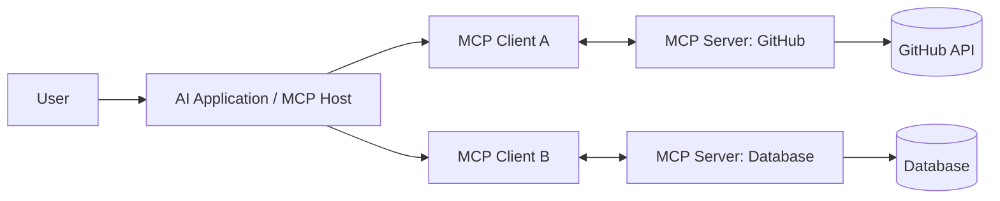
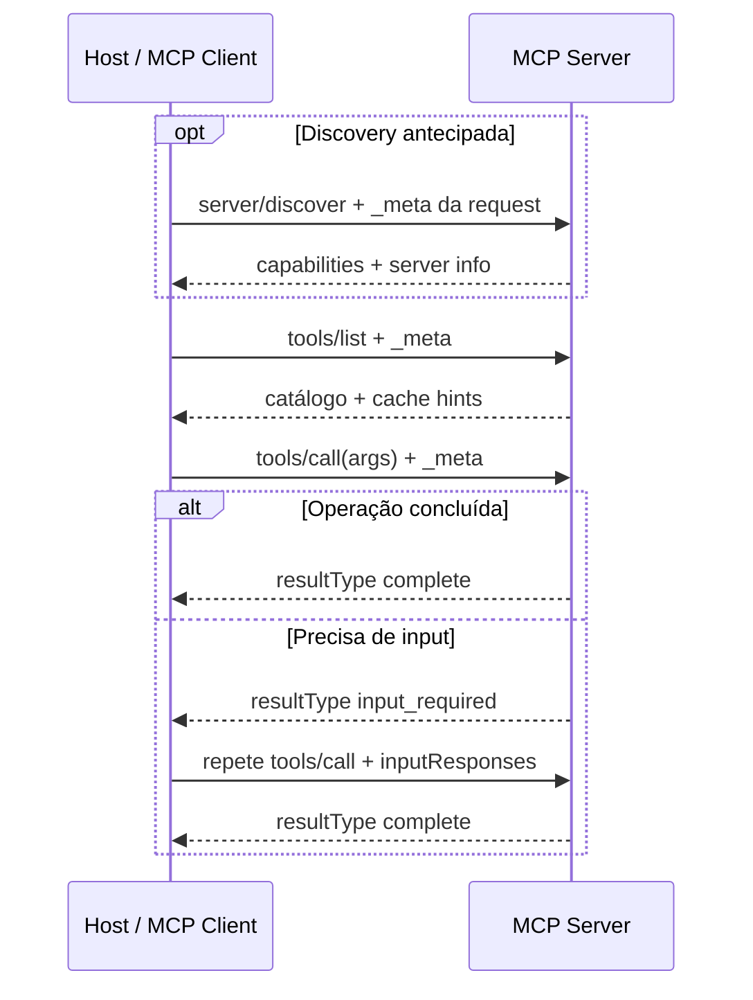

# Model Context Protocol (MCP)

> Versão de referência: especificação final **2026-07-28**.

MCP é um protocolo aberto, baseado em JSON-RPC 2.0, para conectar aplicações de
IA a fontes de contexto e capacidades. Ele padroniza mensagens, descoberta e
contratos; não concede confiança automática a um server nem substitui
autenticação, autorização ou desenho seguro de tools.

## Arquitetura

### Host

Coordena aplicação e modelo, cria clients, decide quais servers podem conectar,
controla consentimento e mantém o contexto global. É o principal ponto de
política, autorização de ações e experiência do usuário.

### Client

Cada client pertence ao host e se comunica com exatamente um server, preservando
a fronteira entre integrações. A relação é 1:1, mas **não é uma sessão do
protocolo**: cada request é autocontida e pode chegar a qualquer instância
compatível do server.

### Server

Expõe capabilities focadas e não deveria receber a conversa inteira nem
enxergar outros servers. Pode ser um processo local ou serviço remoto. Se
precisa preservar estado entre chamadas, deve emitir um identificador explícito
e exigir que o client o envie novamente; conexão ou processo não são identidade
de conversa.

## Core stateless e capabilities

Desde 2026-07-28, não há handshake `initialize`/`initialized` nem
`Mcp-Session-Id`. Toda request carrega em `_meta`:

- `io.modelcontextprotocol/protocolVersion`;
- `io.modelcontextprotocol/clientCapabilities`;
- opcionalmente `io.modelcontextprotocol/clientInfo` e contexto de tracing.

O client pode chamar `server/discover` para conhecer capabilities antes de
agir, mas discovery antecipada é opcional. O server nunca deve presumir
capability a partir de uma conexão anterior.

Essa mudança permite round-robin sem sticky session. Não torna a **aplicação**
stateless: tasks, threads ou recursos duráveis continuam existindo, mas seu
estado precisa de handle explícito.

## Primitivas

| Primitiva | Controle típico | Uso |
| --- | --- | --- |
| Prompts | usuário | templates e workflows selecionados explicitamente |
| Resources | aplicação | dados/contexto lidos por URI |
| Tools | modelo, mediado pelo host | ações e consultas estruturadas |

Resultados de `tools/list`, `prompts/list`, `resources/list` e
`resources/read` podem trazer `ttlMs` e `cacheScope`. Cache reduz
redescoberta, mas precisa respeitar escopo, autorização e invalidação.

## Padrões de mensagem

- **request/response:** o client envia uma operação e recebe resultado ou erro;
- **MRTR (Multi Round-Trip Request):** o server retorna
  `resultType: "input_required"`; o client coleta elicitation/contexto
  autorizado e repete a request com `inputResponses`;
- **subscribe/notify:** o client abre `subscriptions/listen` para tipos de
  notificação escolhidos; o stream pertence à request, não a uma sessão.

Servers não iniciam requests JSON-RPC no core atual. Roots, Sampling e Logging
continuam disponíveis apenas durante a janela de compatibilidade, mas estão
depreciados; novas implementações devem preferir o modelo stateless/MRTR e as
extensions atuais.

## Transports

- **stdio:** mensagens JSON-RPC delimitadas por newline entre o host e um
  subprocesso iniciado pelo client; stderr fica para diagnóstico. O mesmo
  processo pode intercalar requests não relacionadas.
- **Streamable HTTP:** cada mensagem é um `POST` para um endpoint MCP; a
  resposta é JSON ou um stream SSE limitado à request.

No HTTP, `MCP-Protocol-Version`, `Mcp-Method` e `Mcp-Name` espelham
metadados para gateways, rate limiters e WAFs. O corpo continua sendo a fonte de
verdade; divergências devem ser rejeitadas. Transporte resolve framing e
cancelamento, não a confiança entre as partes.

## Lifecycle conceitual atual

Para interoperar com versões antigas, SDKs podem detectar o protocolo anterior
e executar handshake/sessão. Isso é compatibilidade, não o lifecycle recomendado
para um server novo.

## Extensions

O core permanece pequeno e funcionalidades opt-in vivem em extensions
versionadas, como Tasks para trabalho durável, MCP Apps e Skills over MCP. Uma
extension deve ser anunciada por ambas as partes e não autoriza automaticamente
novos efeitos.

## Desenho de tools

- nome, descrição e efeitos não ambíguos;
- input schema estreito, limites, enums e dialect explícito quando necessário;
- erro estruturado que distingue retryable de terminal;
- leitura separada de escrita e efeitos irreversíveis;
- identidade e autorização do usuário validadas a cada request;
- idempotency key para retries de efeitos;
- resposta pequena, com provenance e sem dados excessivos;
- handle explícito para estado que atravessa chamadas.

## Segurança e autorização

Trate cada server, payload, descrição e resultado como uma trust boundary. O
host precisa mostrar o que será compartilhado, solicitar confirmação
proporcional ao efeito e manter controle sobre credenciais. Resource content
pode conter prompt injection; resultado de tool não vira instrução confiável.

Em HTTP, o framework de autorização usa OAuth e Protected Resource Metadata. O
token deve ser enviado em `Authorization`, vinculado ao audience/resource do
server e validado em toda request. Client ID Metadata Documents são preferidos;
Dynamic Client Registration está depreciado. A validação de issuer conforme RFC
9207 reduz ataques de mix-up. `clientInfo` é autodeclarado e não serve para
decisão de segurança.

Riscos incluem confused deputy, tool poisoning, shadow servers, exfiltração,
path traversal, command injection, SSRF e supply-chain compromise. Use least
privilege, allowlist, sandbox, provenance, egress control, auditoria, timeout e
limites de payload/schema.

## Quando utilizar

- múltiplos hosts precisam reutilizar a mesma integração;
- discovery, schemas e capabilities reduzem adapters proprietários;
- resources, prompts e tools formam um limite de responsabilidade claro;
- routing e policy por método/nome ajudam a operar integrações remotas.

Evite quando existe um único caller e uma função local/API já é contrato
suficiente, ou quando o time ainda não consegue operar a nova trust boundary.

## Exercícios

- **Beginner:** modele um server read-only com uma resource e uma tool de busca;
  mostre os metadados obrigatórios por request.
- **Intermediate:** implemente stdio stateless, `server/discover` opcional,
  validação de schema e erros estruturados.
- **Advanced:** adicione autorização por tenant, cache hints e um fluxo MRTR com
  confirmação; teste prompt injection em resource.
- **Expert:** faça threat model de um server HTTP atrás de gateway e ensaie
  revogação, issuer mix-up, replay e migração de 2025 para 2026.

## Documentação oficial

- [MCP Specification 2026-07-28](https://modelcontextprotocol.io/specification/2026-07-28)
- [Architecture](https://modelcontextprotocol.io/specification/2026-07-28/architecture)
- [Base protocol](https://modelcontextprotocol.io/specification/2026-07-28/basic)
- [Transports](https://modelcontextprotocol.io/specification/2026-07-28/basic/transports)
- [Authorization](https://modelcontextprotocol.io/specification/2026-07-28/basic/authorization)
- [Release notes e migração](https://blog.modelcontextprotocol.io/posts/2026-07-28/)
- [Deprecated features](https://modelcontextprotocol.io/specification/2026-07-28/deprecated)

---

[← Avaliação](../evaluation.md) · [↑ AI Engineering](../README.md) · [Agentes →](../../agents/README.md)
