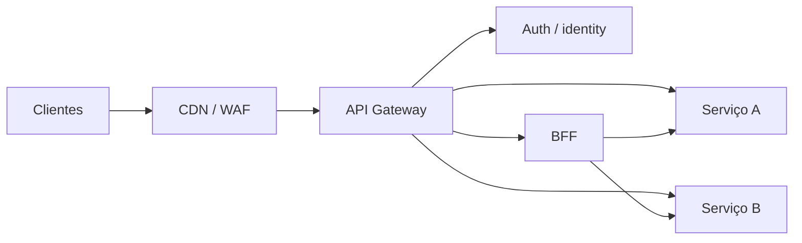

# API Gateways

Um API Gateway é um policy enforcement point na borda: termina/protege tráfego, roteia e observa. Ele não deve concentrar regra de negócio nem criar um monólito invisível.

## Trilha

- [Políticas e padrões](patterns-and-policies.md): routing, auth, limits, transformação e BFF.
- [Kong](kong/README.md): data plane baseado em proxy e extensibilidade por plugins.
- [Apigee](apigee/README.md): API management, policies, analytics e developer experience.
- [Kong versus Apigee](kong-vs-apigee.md): decisão contextual de arquitetura, operação e custo.
- [Operação e exercícios](operations-and-exercises.md): HA, observabilidade, testes e laboratório.

## Posição arquitetural

Gateway centralizado aplica TLS, autenticação preliminar, roteamento, quotas, limites de tamanho, telemetria e rollout de tráfego. Serviço continua responsável pela autorização de recurso/domínio: “token válido” não significa “pode editar este pedido”.

## Gateway, ingress, load balancer e service mesh

| Componente | Escopo típico |
| --- | --- |
| load balancer | distribuição L4/L7 e health |
| ingress/Gateway API | entrada do cluster e routing declarativo |
| API Gateway | lifecycle/policies de APIs e consumidores |
| BFF | composição específica de experiência de cliente |
| service mesh | tráfego service-to-service, identidade e políticas internas |

Produtos podem combinar papéis. Decida por capacidades e ownership, não por nome.

## Princípios

- configuração versionada, revisada, testada e promovida;
- deny by default para routes e métodos;
- preserve correlation/context sem confiar cegamente em headers do cliente;
- limites por consumidor/tenant e limites globais de proteção;
- timeout do gateway maior que budget interno? Não: orçamento precisa caber ponta a ponta;
- mantenha escape hatch e estratégia de rollback de configuração.

## Referências

- IETF. [HTTP Semantics — RFC 9110](https://www.rfc-editor.org/rfc/rfc9110.html).
- Kubernetes. [Gateway API](https://gateway-api.sigs.k8s.io/).
- OWASP. [API Security Top 10](https://owasp.org/API-Security/).

---

[← Kubernetes](../kubernetes/README.md) · [↑ Início](../README.md) · [Políticas e padrões →](patterns-and-policies.md)
