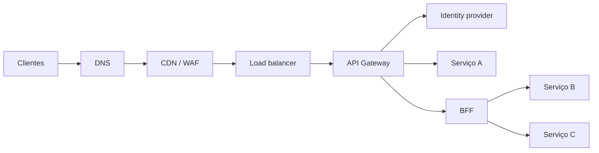
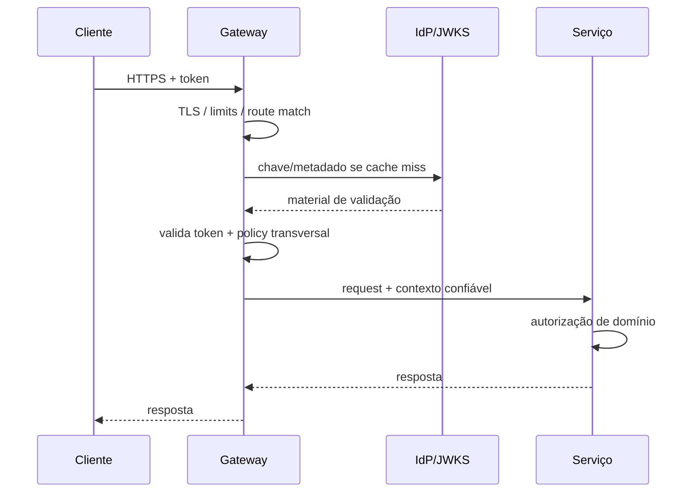

# API Gateways

Um API Gateway é um **policy enforcement point** no caminho de entrada de APIs.
Ele termina ou intermedeia tráfego, aplica políticas, roteia requisições e produz
telemetria. O valor aparece quando políticas realmente são transversais. O risco
aparece quando o gateway vira um backend oculto com regra de negócio, estado e
acoplamento demais.

## Trilha

- [Políticas e padrões](patterns-and-policies.md): routing, auth, limits,
  transformação e BFF.
- [Kong](kong/README.md): data plane baseado em proxy e extensibilidade por
  plugins.
- [Apigee](apigee/README.md): API management, policies, analytics e developer
  experience.
- [Kong versus Apigee](kong-vs-apigee.md): decisão contextual de arquitetura,
  operação e custo.
- [Operação e exercícios](operations-and-exercises.md): HA, observabilidade,
  testes e laboratório.

## 1. Onde o gateway vive



Na prática, produtos podem acumular papéis. Um cloud load balancer pode fazer
routing HTTP; um ingress controller pode validar JWT; um gateway pode integrar
WAF. O nome comercial não é o modelo arquitetural. Liste capacidades, trust
boundaries e ownership.

## 2. Gateway, load balancer, ingress, BFF e service mesh

| Componente | Escopo principal | Estado de decisão típico |
| --- | --- | --- |
| load balancer | distribuir conexões/requests | health e algoritmo de distribuição |
| ingress/Gateway API | entrada de cluster | hosts, paths, TLS e políticas de plataforma |
| API Gateway | lifecycle e policies de APIs/consumidores | auth, quotas, transforms, routing |
| BFF | experiência de um cliente | composição e lógica de apresentação |
| service mesh | tráfego service-to-service | identidade/policy interna e telemetria |

A fronteira fica ruim quando uma mesma regra aparece em vários lugares sem uma
fonte de verdade.

## 3. O caminho de uma request

Considere uma chamada autenticada:



Cada etapa pode consumir budget de latência e falhar de forma diferente. Um
plugin de autenticação que consulta o IdP a cada request pode transformar uma
dependência de controle em dependência crítica de data plane. Cache, TTL e
comportamento durante indisponibilidade precisam ser decididos conscientemente.

## 4. Autenticação não é autorização de domínio

O gateway é bom para políticas que podem ser avaliadas com contexto transversal:

- assinatura/issuer/audience do token;
- mTLS ou identidade de workload;
- API key e consumer identity;
- escopos simples de API;
- quotas e rate limits.

Mas "token válido" não significa "pode editar o pedido 42". Autorização baseada
em ownership, estado do pedido, contrato ou relação entre entidades pertence ao
serviço que possui esse conhecimento, ou a uma policy engine com acesso
controlado às informações necessárias.

Empurrar toda autorização para o gateway produz duas falhas comuns:

1. políticas ficam genéricas demais e permitem excesso;
2. o gateway precisa conhecer dados de todos os domínios e vira ponto de
   acoplamento.

## 5. Headers são uma trust boundary

Headers como `X-User-Id`, `X-Tenant-Id` e `X-Roles` são convenientes, mas perigosos
se o cliente puder fornecê-los e o backend confiar neles.

Uma estratégia segura:

1. remova/normalize headers reservados vindos de fora;
2. valide identidade;
3. derive contexto confiável;
4. injete headers internos com namespace claro;
5. autentique também o hop gateway → serviço quando o threat model exigir.

Não use `X-Forwarded-For` sem definir proxies confiáveis. Cadeias de proxy tornam
origem um problema de confiança, não apenas parsing de string.

## 6. Routing é política, não simples `if path`

Routing pode considerar:

- host;
- path;
- método;
- headers;
- versão;
- tenant;
- peso de rollout;
- região;
- health do upstream.

A ordem/precedência das regras precisa ser previsível. Rotas sobrepostas podem
fazer uma versão receber tráfego inesperado.

### Canary e weighted routing

Enviar 5% do tráfego para uma versão nova parece simples. Pergunte:

- a amostra representa os tenants relevantes?
- sessões precisam de sticky routing?
- operações de escrita toleram alternância entre versões?
- métricas carregam a versão do upstream?
- rollback interrompe requests em andamento?

Percentual sozinho não define um canary seguro.

## 7. Timeout é orçamento ponta a ponta

Suponha deadline do cliente de 2 s. O gateway não deveria dar 5 s ao upstream.
Isso cria trabalho órfão depois que o cliente desistiu.

Pense no budget:

```text
2.000 ms total
  100 ms rede/edge
  100 ms autenticação/policy
1.500 ms upstream
  200 ms margem/serialização
  100 ms variabilidade
```

O número real depende do sistema, mas o princípio é reservar orçamento para cada
hop e propagar deadline/cancelamento quando possível.

### Retry no gateway

Retry pode ajudar em falhas transitórias antes de qualquer efeito ter acontecido.
Pode duplicar efeitos quando o estado do upstream é desconhecido.

Não faça retry automático de POST apenas porque houve timeout. Use idempotency
keys e semântica explícita quando a operação permitir repetição segura.

## 8. Rate limiting e quotas

Existem objetivos diferentes:

- proteger capacidade global;
- garantir fairness entre tenants;
- aplicar contrato comercial;
- conter abuso;
- controlar custo de downstream.

Algoritmos comuns incluem token bucket e leaky bucket. A decisão importante é
onde o estado vive e qual consistência é necessária.

### Limite local versus distribuído

Um limite de 100 req/s aplicado independentemente em 10 instâncias pode permitir
até aproximadamente 1.000 req/s. Para limite global, as instâncias precisam de
estado coordenado ou particionado de maneira consistente.

Coordenação mais forte adiciona latência e disponibilidade. Às vezes um limite
aproximado local é suficiente para proteção, enquanto quota comercial exige
contabilidade mais precisa.

## 9. Circuit breaker e load shedding

Gateway pode proteger upstreams ao recusar cedo quando sinais indicam
indisponibilidade/saturação. Mas circuit breaker global mal configurado pode
bloquear todos os tenants por problema localizado.

Prefira granularidade alinhada à failure unit: rota, upstream, tenant ou região.
Use métricas de erro e latência, além de estados half-open com probes limitados.

Load shedding é diferente: quando capacidade acabou, recuse trabalho de baixa
prioridade de forma controlada em vez de colocar tudo numa fila até expirar.

## 10. Transformação de payload

Transformar headers ou formatos simples pode facilitar compatibilidade. Colocar
orquestração de domínio, acesso a vários bancos e regras de negócio no gateway
cria um "ESB 2.0" difícil de testar e versionar.

Use transformação no gateway quando:

- é mecânica e transversal;
- não exige estado de domínio;
- reduz acoplamento de protocolo;
- tem contrato claro e testes.

Use BFF/serviço quando a composição representa necessidade específica de produto.

## 11. Disponibilidade do gateway

O gateway está no caminho crítico de grande parte do tráfego. Modele:

- múltiplas réplicas e failure domains;
- config distribution;
- comportamento se control plane cair;
- cache de chaves/policies;
- drain em deploy;
- dependências externas de plugins;
- limites de conexão e file descriptors.

Alguns gateways separam **control plane** de **data plane**. O data plane deve
continuar servindo configuração conhecida durante certos problemas de controle.
Entenda exatamente a garantia do produto adotado.

## 12. Configuração é código operacional

Routes, plugins e policies podem derrubar produção sem alterar uma linha do
backend. Trate configuração com:

- versionamento;
- review;
- validação estática;
- ambiente de teste;
- promoção;
- diff legível;
- canary quando possível;
- rollback/roll-forward.

Mudança de policy deve ter owner e evidência, não ser clique manual sem trilha.

## 13. Observabilidade no gateway

O gateway vê o início do caminho e é ótimo para medir:

- request rate por route/consumer;
- status e erro por classe;
- duração total e upstream duration;
- retries;
- rate-limit decisions;
- TLS/auth failures;
- upstream selected/version;
- bytes request/response.

Evite cardinalidade explosiva. `user_id` ou URL crua com IDs não devem virar
labels de métrica. Traces e logs podem carregar contexto de alta cardinalidade
com retenção/amostragem apropriadas.

### Diferencie erro do gateway e erro do upstream

Um `502` pode significar conexão recusada, reset, DNS, TLS ou resposta inválida.
Um `500` do upstream é outra classe. Agregar tudo como "5xx" perde causalidade.

## 14. Segurança e exposição

Checklist de borda:

- TLS forte e lifecycle de certificados;
- métodos/routes deny-by-default;
- limites de body/header;
- validação de host e scheme;
- proteção contra request smuggling conforme stack;
- CORS entendido como política de browser, não autenticação;
- secrets de plugins protegidos;
- admin/control plane fora da exposição pública;
- audit de configuração;
- WAF usado como defesa complementar, não corretor de aplicação insegura.

## 15. Modos de falha

| Falha | Sintoma | Evidência | Mitigação |
| --- | --- | --- | --- |
| JWKS/IdP fora | auth falha em massa | cache miss + dependency errors | cache e política de TTL/fail mode |
| plugin lento | todas as rotas degradam | plugin latency | timeout e isolamento |
| retry storm | upstream sobrecarrega | attempts/request | retry budget e backoff |
| regra de route sobreposta | tráfego na versão errada | matched route/version | testes de precedência |
| rate limit local | quota global excedida | soma por instância | coordenação ou semântica aproximada explícita |
| headers confiados do cliente | escalada de privilégio | request audit | strip + derivação confiável |
| config ruim | outage instantânea | config revision | validação, canary e rollback |

## 16. Testes que realmente ajudam

- teste de match das rotas;
- contratos de headers preservados/removidos;
- token válido, expirado, issuer/audience errados;
- autorização continua no backend;
- timeout e cancelamento;
- retry apenas onde seguro;
- limite por consumidor e global;
- config rollback;
- load test incluindo plugin chain;
- fault injection em DNS, IdP e upstream.

## 17. Quando não centralizar

Não coloque no gateway uma capacidade apenas porque "é transversal". Pergunte:

- todos os serviços realmente precisam da mesma semântica?
- quem consegue evoluir a regra sem bloquear o restante?
- falha nessa regra deve impactar todas as APIs?
- existe estado de domínio escondido?
- o gateway tem ferramentas de teste/debug suficientes?

Centralização economiza duplicação e cria blast radius. O trade-off precisa ser
consciente.

## 18. Laboratórios

### Beginner

- configure duas rotas e prove precedência;
- remova headers reservados do cliente e injete contexto interno;
- implemente rate limit local e observe a semântica.

### Intermediate

- valide JWT com cache de chave e simule indisponibilidade do IdP;
- configure timeout menor que o deadline total;
- faça canary e carregue versão na telemetria.

### Advanced

- provoque upstream lento e compare sem retry, retry ingênuo e retry bounded;
- implemente limite global versus local e meça custo de coordenação;
- faça fault injection em control plane mantendo data plane.

### Expert

Projete gateway multi-tenant com quotas, autenticação, rollout e SLO. Modele um
incidente no IdP e outro no backend. Mostre qual policy degrada, qual continua e
como o blast radius é contido.

## Referências

- IETF. [RFC 9110: HTTP Semantics](https://www.rfc-editor.org/rfc/rfc9110.html).
- Kubernetes. [Gateway API](https://gateway-api.sigs.k8s.io/) define recursos
  expressivos para tráfego de entrada e políticas relacionadas.
- OWASP. [API Security Top 10](https://owasp.org/API-Security/) organiza riscos
  recorrentes de APIs.
- IETF. [OAuth 2.0 Security Best Current Practice](https://www.rfc-editor.org/rfc/rfc9700.html)
  atualiza recomendações de segurança para OAuth 2.0.

---

[← Kubernetes](../kubernetes/README.md) · [↑ Início](../README.md) · [Políticas e padrões →](patterns-and-policies.md)
