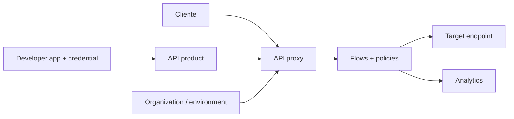

# Apigee

Apigee é uma plataforma de API management do Google Cloud. Ela combina runtime
de proxy, policies, catálogo de produtos, gestão de consumers/apps, analytics e
recursos de publicação.

A abstração central é o **API proxy**: uma fronteira programável entre cliente e
target. A profundidade aparece quando entendemos ordem de flows, variáveis,
fault handling, quotas, cache, deployment e o blast radius de Shared Flows.

## 1. Modelo



### API proxy

Define ProxyEndpoint, TargetEndpoint, flows e policies que processam a request e
a response.

### API product

Agrupa recursos, operações e políticas comerciais/técnicas oferecidas a apps.

### Developer app

Associa credenciais e products a um consumidor registrado no modelo de API
management.

Não confunda app/product do Apigee com authorization de recurso do domínio. O
backend continua responsável por regras como "este cliente pode acessar este
pedido?".

## 2. O lifecycle de uma request

A request atravessa fases de proxy e target. Um modelo conceitual é:

```text
Proxy PreFlow
→ Conditional Flows
→ Proxy PostFlow
→ route/target
→ Target PreFlow/Flows/PostFlow
→ resposta de volta pelo pipeline
```

Policies são executadas nos pontos em que foram anexadas. A ordem importa.

Exemplo: verificar token depois de executar uma ServiceCallout cara desperdiça
capacidade e pode expor uma dependência a tráfego não autenticado.

## 3. Flow conditions

Conditional flows permitem aplicar comportamento somente a determinados paths,
methods, headers ou variáveis.

O risco é transformar configuração em uma linguagem de programação espalhada.
Com dezenas de condições sobrepostas, fica difícil responder "qual policy roda
para esta request?".

Mantenha:

- condições pequenas;
- nomes descritivos;
- ordem documentada;
- testes positivos e negativos;
- routes sem catch-all ambígua.

## 4. Flow variables

Policies leem e escrevem variáveis de contexto. Elas permitem compartilhar
informação entre etapas sem código customizado.

Variável é poder e acoplamento. Documente quais são:

- fornecidas pelo runtime;
- criadas por policy;
- consideradas confiáveis;
- propagadas ao target;
- removidas antes da resposta.

Nunca aceite header do cliente como equivalente automático a uma variável de
identidade verificada.

## 5. Autenticação

Policies podem verificar JWT/OAuth/API key conforme o desenho.

Para JWT, valide:

- assinatura;
- issuer;
- audience;
- algoritmo permitido;
- validade temporal;
- claims obrigatórias.

Se claims viram headers para o backend, sanitize valores externos equivalentes e
proteja o caminho Apigee → target.

## 6. API products e escopo

Product deve expor o menor conjunto necessário de recursos/operações.

Um product gigantesco entregue a todas as apps cria blast radius de credencial.
Separe por capacidade real e lifecycle.

Pergunte:

- qual app precisa desta operação?
- qual quota vale para ela?
- qual ambiente está exposto?
- como revogar acesso sem impactar outros products?

## 7. Quota versus SpikeArrest

Os dois controles resolvem problemas diferentes.

### Quota

Modela orçamento por período/consumidor conforme policy e configuração.

Exemplo conceitual:

```text
10.000 chamadas por dia por app
```

### SpikeArrest

Protege contra taxa instantânea/bursts conforme sua semântica de execução.

Use quota para orçamento e SpikeArrest para proteção de fluxo quando ambos são
necessários. Não assuma que uma quota diária protege upstream contra 10 mil
requests chegando no mesmo segundo.

## 8. Distribuição e consistência de limites

Em runtime distribuído, entenda como a policy escolhida mantém estado entre
message processors/instâncias.

A pergunta importante é: o limite é exato globalmente, aproximado ou local?

Essa diferença afeta:

- contratos comerciais;
- proteção de upstream;
- comportamento durante falha parcial;
- testes de carga.

Não valide quota apenas com uma instância de laboratório se produção é
distribuída.

## 9. AssignMessage e transformações

Policies de transformação são úteis para:

- normalizar headers;
- adaptar path;
- inserir contexto verificado;
- remover informação não permitida;
- sustentar migração de contrato.

Evite reimplementar regra de domínio em dezenas de AssignMessage/JavaScript. A
configuração rapidamente vira um backend invisível.

## 10. ServiceCallout

ServiceCallout permite chamar outro serviço durante o pipeline. É poderoso e
perigoso porque adiciona uma dependência síncrona ao caminho crítico.

Se usado para autorização ou enrichment, modele:

- timeout;
- retry;
- cache;
- failure mode;
- observabilidade;
- proteção contra fan-out;
- dados enviados.

Uma API de 100 ms com callout de p99 500 ms não continua sendo uma API de 100 ms.

## 11. JavaScript e código customizado

Código customizado aumenta flexibilidade, mas também:

- custo por request;
- superfície de bugs;
- complexidade de debug;
- dependência de runtime/versionamento;
- supply chain;
- dificuldade de governança.

Use policy pronta quando a semântica atende. Se a lógica cresce, questione se ela
pertence a um serviço/BFF.

## 12. TargetEndpoint

TargetEndpoint descreve comunicação com backend e pode incluir policies, roteamento
e configuração relacionada ao target.

Separe métricas de:

```text
latência total do proxy
latência até o target
tempo em policies/callouts
```

Sem essa decomposição, qualquer lentidão parece "Apigee lento".

## 13. Timeouts e retries

O proxy precisa de deadline coerente com o cliente e target.

Retry deve considerar:

- idempotência;
- orçamento restante;
- tipo de falha;
- número de tentativas;
- capacidade do backend.

Não coloque retry simultaneamente em cliente, Apigee e backend sem budget
coordenado. Três camadas de retry podem multiplicar uma request em várias
chamadas durante o pior momento possível.

## 14. ResponseCache

Cache no gateway é compartilhado e exige chave correta.

Inclua dimensões relevantes:

- path/query;
- tenant/identidade;
- locale;
- versão;
- headers que mudam representação.

Nunca armazene resposta privada sob chave que omite identidade. Uma otimização de
latência pode virar vazamento entre usuários.

Defina TTL e invalidation conforme staleness aceitável.

## 15. Threat protection

Policies de threat protection podem limitar formatos/payloads e reduzir ataques
de parsing/abuso.

Elas são defesa em profundidade. Não substituem:

- validação de negócio no backend;
- autorização;
- limits de infraestrutura;
- secure coding.

Configure limites com payload real para não transformar proteção em indisponibilidade
para requests legítimas.

## 16. Fault handling

FaultRules e tratamento de erros definem como falhas de policy/target viram
respostas.

Teste explicitamente:

- token inválido;
- quota;
- SpikeArrest;
- callout timeout;
- target timeout;
- policy exception;
- payload inválido.

Erro de policy de segurança nunca deve cair em caminho que pula a proteção.

Padronize error envelope apenas até onde ele não destrói informação operacional
útil.

## 17. Shared Flows

Shared Flow reduz duplicação de policies entre proxies. Isso cria reuso e blast
radius.

Use quando existe uma policy verdadeiramente transversal, com:

- versionamento;
- testes próprios;
- rollout gradual;
- consumidores conhecidos;
- compatibilidade.

Um Shared Flow de autenticação alterado sem canary pode quebrar dezenas de APIs
de uma só vez.

Reuso não é automaticamente desacoplamento.

## 18. Revisions e deployment

API proxies possuem revisions deployáveis. Trate revision como artefato de
configuração.

Pipeline:

```text
source
→ lint/test
→ revision
→ deploy em ambiente de teste
→ smoke/contract/security tests
→ canary/promoção
→ observação
```

Preserve caminho de rollback e compatibilidade com products/shared flows.

## 19. Environments e environment groups

Organização por ambientes ajuda separar lifecycle e exposição. Domínios/hosts e
grupo de ambientes fazem parte da fronteira externa.

Evite diferenças manuais impossíveis de reproduzir. Configuração por ambiente
deve ser explícita e versionada quando possível.

## 20. Managed versus hybrid

A modalidade escolhida altera responsabilidade operacional.

No runtime gerenciado, parte da infraestrutura é responsabilidade do provedor.
Em topologias híbridas, mais componentes ficam sob responsabilidade do time.

Para qualquer modalidade, valide:

- networking;
- data residency;
- scaling;
- upgrade;
- logs/analytics;
- dependências de control plane;
- recovery;
- suporte a versões/policies.

Não reutilize um runbook de deployment gerenciado como se híbrido tivesse o mesmo
failure model.

## 21. Analytics

Analytics responde perguntas de tráfego, latência, erros e adoção. É útil para
produto e operação, mas nem sempre possui a mesma latência/semântica necessária
para alertas de SLO em tempo real.

Use definição estável de SLI e backend adequado ao objetivo. Não confunda
analytics de negócio com sistema de paging sem avaliar atraso e amostragem.

## 22. Developer portal

Portal publica catálogo, documentação e onboarding. Ele faz parte da attack
surface porque lida com identidade, registro de apps e credenciais.

Proteja:

- autenticação;
- recovery de conta;
- autorização de products;
- lifecycle de credenciais;
- conteúdo/documentação;
- dependências de terceiros.

Portal bonito com product excessivamente permissivo continua sendo um problema de
segurança.

## 23. Observabilidade

Métricas úteis por proxy/flow/target:

- requests;
- status class;
- total latency;
- target latency;
- policy/callout failures;
- auth failures;
- quota/SpikeArrest rejects;
- revision;
- cache hit/miss.

Propague trace context quando arquitetura exigir e redija tokens/bodies.

Evite dimensões ilimitadas em métricas.

## 24. Segurança administrativa

Restrinja:

- roles de organização/ambiente;
- service accounts;
- deploy;
- acesso a KVM/secrets;
- analytics sensíveis;
- criação de apps/products.

Audite mudanças e mantenha break-glass separado. Uma credencial administrativa do
API management possui blast radius muito maior que uma credencial de uma API.

## 25. Falhas recorrentes

| Falha | Sintoma | Evidência | Resposta |
| --- | --- | --- | --- |
| Shared Flow quebrado | muitas APIs falham | revision/deploy | rollback/canary |
| callout lento | p99 sobe | callout vs target latency | timeout/cache/remover |
| cache key ruim | dado cruza tenant | cache metadata | corrigir chave/purge |
| fault rule ruim | bypass/resposta errada | trace/debug de flow | testar caminho de erro |
| quota mal modelada | noisy tenant | usage por app | separar quota/rate |
| target timeout | 5xx/latência | target timing | budget/retry bounded |
| config drift | ambientes diferem | revisions/config | source of truth |
| role ampla | risco administrativo | IAM/audit | least privilege |

## 26. Troubleshooting

Quando request falha:

1. host/environment correto?
2. ProxyEndpoint e flow fizeram match?
3. qual policy falhou?
4. auth/credential/product permitem a operação?
5. quota/SpikeArrest rejeitaram?
6. callout adicionou erro/latência?
7. TargetEndpoint foi selecionado?
8. target respondeu?
9. FaultRule transformou o erro?
10. revision ativa é a esperada?

Investigue o fluxo executado, não apenas a mensagem final ao cliente.

## 27. Laboratórios

### Beginner

- crie proxy com product/app/credential;
- adicione JWT ou API key;
- aplique quota e SpikeArrest e compare efeitos.

### Intermediate

- adicione transformação e target timeout;
- crie FaultRules para classes diferentes de erro;
- valide headers de identidade spoofados.

### Advanced

- implemente Shared Flow versionado;
- faça rollout em duas revisions;
- injete ServiceCallout lento e meça impacto.

### Expert

Modele um gateway multi-tenant com product, quota, burst protection, autenticação,
cache e Shared Flow. Injete falha no IdP, target lento, cache key incorreta e nova
revision defeituosa. Prove por métricas e testes que consegue distinguir policy,
proxy e target e fazer rollback sem bypass de segurança.

## Referências oficiais

- Google Cloud. [Apigee documentation](https://cloud.google.com/apigee/docs).
- Google Cloud. [API proxies](https://cloud.google.com/apigee/docs/api-platform/fundamentals/understanding-apis-and-api-proxies).
- Google Cloud. [Policies reference](https://cloud.google.com/apigee/docs/api-platform/reference/policies/reference-overview-policy).
- Google Cloud. [API products](https://cloud.google.com/apigee/docs/api-platform/publish/what-api-product).

---

[← Kong](../kong/README.md) · [↑ API Gateways](../README.md) · [Comparação →](../kong-vs-apigee.md)
