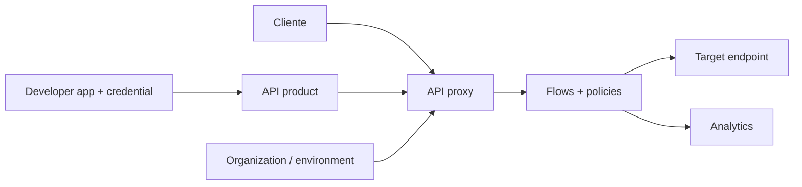

# Apigee

Apigee é uma plataforma de API management do Google Cloud. API proxies recebem tráfego e executam flows/policies; API products agrupam recursos/quotas para consumers/apps; analytics e developer portals suportam operação e onboarding.

## Modelo

PreFlow, conditional flows, PostFlow e fault rules determinam execução. Policies prontas tratam OAuth/JWT, quota, spike arrest, transformation, cache, threat protection e chamadas; JavaScript/Java/custom logic amplia poder e também custo/risco.

## Deployment e gestão

Organizações contêm ambientes, proxies, products e developers/apps. Revisions são deployáveis; promova configuração testada e preserve rollback. Apigee pode ser consumido no Google Cloud com runtime gerenciado/híbrido conforme oferta: valide data residency, networking, lifecycle e responsabilidade operacional para a modalidade vigente.

SpikeArrest protege taxa instantânea por instância/configuração; Quota aplica orçamento por consumidor/período conforme policy. Use as duas quando necessidades diferem. ResponseCache precisa chave completa por identidade/representação; nunca compartilhe resposta privada inadvertidamente.

## Analytics e portal

Analytics ajuda tráfego, latência, erros, consumers e monetização/adoção, mas SLO deve usar definição estável e considerar sampling/atraso. Developer portal publica catálogo, documentação, registro e credentials; é parte da attack surface e lifecycle de acesso. Products devem expor menor conjunto de resources/scopes.

## Segurança e anti-patterns

- restrinja roles administrativas e service accounts;
- proteja key/value maps e secrets; não registre tokens/bodies;
- valide JWT issuer/audience/algorithm e aplique authz no backend;
- evite Shared Flow opaco que quebra todas as APIs em uma mudança;
- não coloque orquestração de domínio longa em policies;
- teste fault rules: erro de policy não pode virar bypass.

## Exercício

Crie proxy de laboratório com API product, app/credential, quota e SpikeArrest, transformação simples e policy JWT. Versione revision, publique especificação e dashboard. Simule quota, target timeout, token inválido, cache key incorreta e rollback.

## Referências oficiais

- Google Cloud. [Apigee documentation](https://cloud.google.com/apigee/docs).
- [API proxies](https://cloud.google.com/apigee/docs/api-platform/fundamentals/understanding-apis-and-api-proxies).
- [Policies reference](https://cloud.google.com/apigee/docs/api-platform/reference/policies/reference-overview-policy).
- [API products](https://cloud.google.com/apigee/docs/api-platform/publish/what-api-product).

---

[← Kong](../kong/README.md) · [↑ API Gateways](../README.md) · [Comparação →](../kong-vs-apigee.md)
