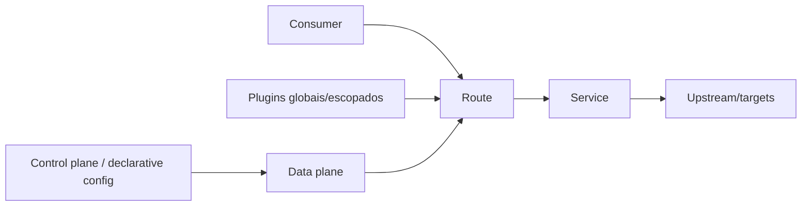

# Kong Gateway

Kong Gateway é um gateway/reverse proxy com data plane baseado em Nginx/OpenResty e configuração por routes, services, upstreams, consumers e plugins. Pode operar com banco, declarativamente/DB-less e em topologias híbridas conforme edição/implantação.

## Modelo

Route faz match de host/path/method/header; Service representa upstream lógico; upstream/targets tratam balanceamento/health. Plugins interceptam fases para auth, rate limit, transformações e telemetria. O escopo e precedência de plugins precisam de testes: policy “global” e override local podem surpreender.

## Modos e operação

- **traditional:** nodes compartilham database para configuração;
- **DB-less:** configuração declarativa carregada em cada node, boa para GitOps e artefato completo;
- **hybrid:** control plane distribui config a data planes, separando gestão de tráfego.

Avalie consistência/propagação de config, comportamento offline do data plane, rollback e compatibilidade de plugins em upgrade. Admin API/Manager são superfícies privilegiadas e não devem ficar públicas. Em Kubernetes, Kong Ingress Controller traduz recursos Kubernetes/Gateway API; valide quem é source of truth.

## Plugins

Use plugins oficiais antes de custom code. Um plugin executa no caminho de toda request: limite I/O, memória e cardinalidade. Custom plugins em Lua precisam lifecycle, testes de fase, upgrade e sandbox operacional. External/plugin server muda falhas e latência. Autorização de objeto continua no serviço.

## Segurança e observabilidade

- TLS/mTLS e credential storage/rotation adequados;
- Admin API autenticada, autorizada e isolada;
- rate limit consistente conforme deployment/strategy;
- sanitize headers de identidade e preserve trace context;
- logs/metrics por route/service/status sem consumer ID ilimitado como label;
- backup/config export e disaster recovery exercitados.

## Exercício

Configure declarativamente duas routes, JWT/OIDC conforme suporte escolhido, rate limit por consumer, timeout e OpenTelemetry. Tente route não declarada, token inválido, upstream lento e config incompatível. Faça canary e rollback do artefato declarativo.

## Referências oficiais

- Kong. [Gateway documentation](https://docs.konghq.com/gateway/).
- Kong. [How Kong Gateway works](https://docs.konghq.com/gateway/latest/get-started/services-and-routes/).
- Kong. [Plugin development](https://docs.konghq.com/gateway/latest/plugin-development/).
- Kong. [Kubernetes Ingress Controller](https://docs.konghq.com/kubernetes-ingress-controller/).

---

[← Políticas](../patterns-and-policies.md) · [↑ API Gateways](../README.md) · [Apigee →](../apigee/README.md)
