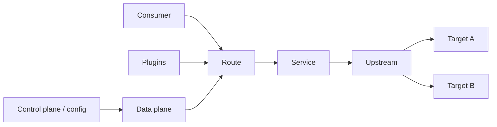

# Kong Gateway

Kong Gateway é um gateway/reverse proxy com data plane baseado em
Nginx/OpenResty e configuração expressa por entidades como Routes, Services,
Upstreams, Consumers e Plugins.

A melhor forma de estudá-lo não é decorar plugins. É entender duas coisas:

1. como uma request atravessa o data plane;
2. como configuração chega a esse data plane sem criar um incidente global.

## 1. Modelo de configuração



### Route

Define como uma request é reconhecida, por host, path, method, headers ou outros
matchers suportados.

### Service

Representa o upstream lógico para o qual a Route encaminha tráfego.

### Upstream e targets

Modelam conjunto de destinos, balanceamento e health conforme configuração.

### Consumer

Representa uma identidade consumidora no modelo do gateway quando plugins e
credenciais usam esse conceito. Não confunda Consumer do Kong com usuário de
domínio da aplicação.

## 2. O caminho da request

Conceitualmente, uma request pode atravessar fases como:

```text
TLS/protocolo
→ route matching
→ plugins de acesso/autenticação
→ transformação/rate limit
→ seleção de upstream
→ chamada ao target
→ plugins de resposta/log
```

Plugins executados em fases diferentes possuem capacidades e custos diferentes.
Um plugin que faz I/O remoto antes de cada upstream adiciona essa dependência ao
p99 de toda request afetada.

Por isso plugin é código de produção no caminho crítico, não mera configuração.

## 3. Precedência e escopo de plugins

Plugins podem ser aplicados em escopos diferentes conforme recurso e versão do
produto. Combinações globais e específicas podem produzir comportamento que não
é óbvio pela leitura isolada de uma Route.

Mantenha testes para responder:

- qual plugin efetivamente vale nesta Route?
- existe override por Service/Consumer?
- duas policies do mesmo tipo podem coexistir?
- uma mudança global afeta quantas APIs?

Uma configuração global tem blast radius global.

## 4. Traditional mode

Em topologia tradicional, nodes usam database para persistir/obter configuração
conforme arquitetura do deployment.

Vantagem: administração dinâmica centralizada.

Custos operacionais:

- database entra no lifecycle da plataforma;
- migrations precisam de cuidado;
- upgrade precisa considerar compatibilidade entre schema e nodes;
- backup/restore da configuração precisa ser testado.

Não trate o banco do gateway como detalhe descartável se ele é o source of truth.

## 5. DB-less

No modo DB-less, configuração declarativa completa pode ser carregada no node.
Isso combina bem com GitOps e promoção de artefato imutável.

O trade-off muda:

- config fica fácil de versionar e revisar;
- atualização tende a ser mais "snapshot" do que CRUD incremental;
- o processo de distribuição do arquivo/config vira parte do control plane;
- conflitos manuais precisam ser evitados.

Uma boa prática é validar e testar o artefato declarativo antes de carregá-lo.

## 6. Hybrid mode

Em topologia híbrida, control plane e data planes são separados. O control plane
gerencia configuração; data planes atendem tráfego.

Perguntas operacionais obrigatórias:

- quanto demora config nova chegar aos DPs?
- o que acontece se CP fica indisponível?
- DPs continuam servindo última configuração válida?
- como detectar DP desatualizado?
- como rollback é propagado?
- versões de CP/DP/plugins são compatíveis?

Separar control e data plane reduz algumas dependências no request path, mas
introduz consistência e rollout distribuído de configuração.

## 7. Route matching

Routes sobrepostas são fonte comum de surpresa. Mantenha contratos explícitos para
host/path/method e teste casos negativos.

Exemplo:

```text
/api/orders
/api/orders/admin
/api/{catch-all}
```

Uma catch-all mal definida pode absorver tráfego que deveria passar por policy
mais restritiva.

Trate route table como código executável.

## 8. Load balancing

Upstreams podem distribuir tráfego entre targets usando estratégias suportadas.
A escolha afeta afinidade, fairness e recovery.

Considere:

- targets lentos, não apenas mortos;
- conexões persistentes;
- peso desigual;
- zonas;
- draining durante deploy;
- retry para outro target.

Balanceamento não corrige uma pool inteira saturada. Quando todos estão lentos,
retry entre targets só multiplica carga.

## 9. Health checking

Health pode ser ativo, passivo ou combinado conforme configuração.

Ativo gera probes. Passivo aprende com tráfego real.

Evite checks profundos que dependem de todo o ecossistema. Se o banco compartilhado
cai e health remove todos os targets, o gateway pode converter uma dependência
degradada em indisponibilidade total.

Defina o que significa "este target deve receber tráfego agora".

## 10. Timeouts e retries

Configure timeouts de conexão, escrita e leitura segundo o orçamento da API.

Retry precisa respeitar:

- idempotência;
- deadline total;
- tipo de falha;
- número máximo de tentativas;
- capacidade do upstream.

Não use o gateway para repetir POST destrutivo sem contrato de idempotência.

## 11. Rate limiting

A estratégia de rate limit precisa refletir topologia.

Um contador local por data plane é rápido, mas o limite global efetivo pode
crescer com número de DPs. Um datastore compartilhado melhora coordenação e
adiciona dependência/latência.

Defina se a policy precisa ser:

- exata globalmente;
- aproximada;
- por Consumer;
- por credencial;
- por Route;
- por tenant derivado de identidade confiável.

Rate limit não substitui concurrency limit do upstream.

## 12. Autenticação e identidade

Plugins podem validar API keys, JWT, OIDC ou outros mecanismos conforme oferta e
configuração.

Mesmo quando o gateway autentica:

- authorization de recurso continua no backend;
- claims precisam de issuer/audience/tempo corretos;
- headers externos de identidade devem ser removidos;
- credenciais do gateway precisam de lifecycle e rotação.

Não encaminhe bearer token amplo para todos os serviços se eles não precisam
dele.

## 13. mTLS upstream

mTLS pode proteger comunicação gateway → upstream e fornecer identidade de
workload. Ele ajuda a estabelecer que tráfego realmente veio do gateway
esperado.

Isso é especialmente útil quando o backend confia em contexto de identidade
injetado pelo proxy. Ainda assim, authorization de negócio permanece no serviço.

## 14. Plugins customizados

Use plugin oficial/configuração declarativa quando resolve o problema. Custom
plugin aumenta a superfície de manutenção.

Para plugin próprio, trate:

- lifecycle de versão;
- compatibilidade com upgrade do gateway;
- fase de execução;
- timeout;
- memória;
- I/O;
- dependências externas;
- testes de concorrência;
- observabilidade;
- rollout/rollback.

Uma chamada externa de 50 ms em plugin aplicado globalmente adiciona um imposto a
toda a plataforma.

## 15. Falha de plugin

Defina se a falha deve ser fail-open ou fail-closed conforme política.

Exemplos:

- autenticação normalmente não deve liberar acesso porque o IdP/cache falhou;
- telemetria secundária talvez possa falhar sem derrubar request;
- policy de segurança deve ter comportamento explícito, não depender de exception
  acidental.

Essa decisão precisa aparecer em testes e runbook.

## 16. Kubernetes Ingress Controller

Kong Ingress Controller traduz recursos Kubernetes/Gateway API para configuração
do gateway.

Isso cria uma cadeia:

```text
Git manifest
→ Kubernetes API
→ controller
→ Kong configuration
→ data plane
```

Ao diagnosticar rota ausente, descubra em qual etapa a intenção parou.

Evite manter a mesma Route simultaneamente por Admin API manual e controller
GitOps. Dois sources of truth produzem drift e reconciliação inesperada.

## 17. Config rollout

Uma configuração segura passa por:

```text
lint/schema
→ testes de route/policy
→ ambiente de teste
→ canary de config/DP
→ métricas
→ promoção
```

Valide também rollback. Se uma nova policy exige plugin/schema incompatível com
DP antigo, rollback pode não ser trivial.

## 18. Admin plane

Admin API e interfaces de gestão são superfícies privilegiadas.

Proteja com:

- rede restrita;
- autenticação forte;
- RBAC;
- audit logs;
- credenciais curtas;
- separação de funções;
- backup/export quando necessário.

Expor Admin API à internet é um risco muito diferente de expor proxy traffic.

## 19. Observabilidade

Meça por dimensões bounded:

- Route;
- Service;
- upstream/target;
- status class;
- latency total;
- upstream latency;
- retries;
- rate-limit rejects;
- auth failures;
- config revision/DP version.

Trace context deve atravessar o gateway. Evite labels com Consumer ID ilimitado
quando cardinalidade explode; use logs/traces para detalhe.

## 20. Falhas recorrentes

| Falha | Sintoma | Evidência | Resposta |
| --- | --- | --- | --- |
| Route sobreposta | upstream incorreto | route match | teste/reestruture regras |
| DP desatualizado | comportamento difere por node | config sync/version | corrigir propagação |
| plugin global lento | p99 de todas APIs sobe | plugin timing | remover/otimizar |
| rate limit local | quota global excede | counters por DP | estratégia consistente |
| target flapping | tráfego oscila | health events | rever health/threshold |
| retry storm | upstream piora | retry count | budget/idempotência |
| Admin plane exposto | risco crítico | network/RBAC | isolar imediatamente |
| drift KIC/manual | config volta sozinha | controller events | source of truth único |

## 21. Troubleshooting

Quando request não chega ao backend:

1. DNS/TLS chegam ao proxy?
2. Route fez match?
3. plugin bloqueou?
4. Service aponta ao upstream esperado?
5. target está healthy?
6. timeout ocorre no gateway ou upstream?
7. retry está mascarando falha?
8. data plane possui config atual?

Quando só uma réplica do gateway falha, compare config revision, plugins e
conectividade daquele DP.

## 22. Laboratórios

### Beginner

- crie duas Routes e Services declarativas;
- adicione autenticação e rate limit;
- prove que Route não declarada falha.

### Intermediate

- configure dois targets;
- derrube um e observe health/balanceamento;
- injete upstream lento e ajuste timeout sem retry storm.

### Advanced

- rode DB-less/GitOps e faça rollback do mesmo artefato;
- compare rate limit local e coordenado;
- valide trace propagation e cardinalidade.

### Expert

Simule topologia híbrida com múltiplos data planes. Introduza config incompatível,
perda temporária do control plane, target lento e plugin que chama dependência
externa. Demonstre quais requests continuam, como detectar DP stale e como
reverter sem editar configuração manualmente.

## Referências oficiais

- Kong. [Gateway documentation](https://docs.konghq.com/gateway/).
- Kong. [Services and Routes](https://docs.konghq.com/gateway/latest/get-started/services-and-routes/).
- Kong. [Plugin development](https://docs.konghq.com/gateway/latest/plugin-development/).
- Kong. [Kubernetes Ingress Controller](https://docs.konghq.com/kubernetes-ingress-controller/).

---

[← Políticas](../patterns-and-policies.md) · [↑ API Gateways](../README.md) · [Apigee →](../apigee/README.md)
