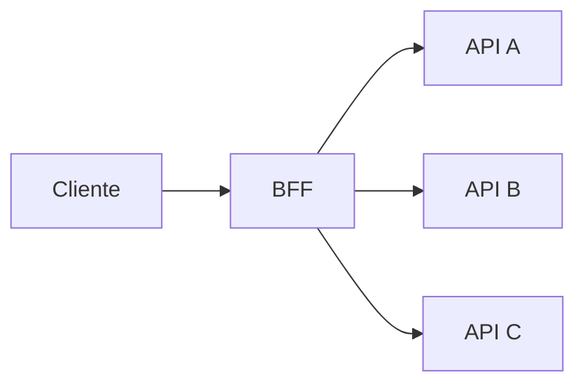

# Padrões e políticas de gateway

Um gateway fica no caminho crítico de muitas APIs. Isso o torna um bom lugar para
políticas transversais e um péssimo lugar para lógica de domínio sem limites.

O princípio central é: faça no gateway o que depende da fronteira de tráfego,
identidade técnica e proteção compartilhada. Mantenha decisões de negócio onde o
modelo de domínio e os dados necessários existem.

## 1. Pipeline de request


A ordem muda segurança, custo e semântica.

Exemplos:

- limite tamanho antes de parsing caro;
- valide identidade antes de aplicar quota por consumer;
- mantenha proteção de origem/IP para tráfego ainda anônimo;
- sanitize headers de identidade antes de encaminhar;
- defina deadline antes de fazer retry;
- redija dados sensíveis antes de log/export.

## 2. Normalização e ambiguidade

Proxies, gateways e servidores podem interpretar HTTP de forma diferente. Quando
componentes discordam sobre framing, path ou headers, surgem classes de problema
como request smuggling e bypass de policy.

Evite "corrigir" entrada ambígua silenciosamente. Defina política para:

- headers duplicados;
- `Content-Length`/transfer encoding;
- encoding de path;
- barras e dot segments;
- tamanho de header/body;
- métodos permitidos;
- nomes de host esperados.

Quanto mais intermediários existem, mais importante é reduzir interpretações
possíveis.

## 3. Authentication não é authorization de domínio

Autenticação responde quem apresentou a credencial. Autorização responde se
pode executar a ação.

O gateway consegue validar claims e escopos técnicos, por exemplo:

```text
scope = orders:read
```

Mas normalmente não sabe se o usuário pode ler **aquele pedido específico**. A
regra de ownership continua no serviço que possui o domínio.

Não confunda "JWT válido" com "request autorizado".

## 4. Validação de JWT

Valide pelo menos:

- assinatura;
- issuer esperado;
- audience correta;
- algoritmo permitido;
- validade temporal;
- claims obrigatórias;
- escopo/role quando usado como policy técnica.

JWKS precisa de cache e rotação. Uma falha temporária no identity provider não
deveria exigir buscar chave remotamente para cada request.

Defina comportamento quando uma nova `kid` aparece e o endpoint de chaves está
indisponível. Segurança e disponibilidade entram em tensão real aqui.

## 5. Headers de identidade

Nunca aceite do cliente um header interno como:

```text
X-User-Id: admin
X-Role: superuser
```

Se o upstream confia em identidade propagada pelo gateway:

1. remova headers externos equivalentes;
2. valide a credencial;
3. injete contexto autenticado;
4. proteja o canal gateway → upstream;
5. documente a boundary de confiança.

mTLS ou workload identity podem reforçar que o header veio do proxy autorizado.

## 6. Rate limiting: qual problema está sendo resolvido?

Rate limit pode proteger:

- plataforma contra abuso;
- tenant contra noisy neighbor;
- custo de operação cara;
- plano comercial;
- upstream com limite conhecido.

A unidade pode ser:

- request;
- byte;
- token de IA;
- item processado;
- custo estimado.

`100 requests/s` não significa muita coisa se uma rota custa 1 ms e outra dispara
um relatório de 30 segundos.

## 7. Algoritmos de rate limit

### Fixed window

Conta dentro de janelas fixas. É simples, mas permite burst na borda:

```text
99 requests no fim da janela
+ 99 no começo da próxima
```

### Sliding window

Aproxima taxa ao longo de uma janela móvel, com custo maior de estado/cálculo.

### Token bucket

Tokens acumulam até uma capacidade. Cada operação consome tokens. Permite burst
controlado enquanto mantém taxa média.

### Leaky bucket

Modela saída suavizada a uma taxa definida, útil quando o objetivo é regular
fluxo.

Escolha pelo comportamento desejado, não pelo nome mais sofisticado.

## 8. Rate limit distribuído

Com vários data planes, a consistência do contador importa.

Opções conceituais:

- contador local por instância;
- datastore compartilhado;
- divisão aproximada da quota;
- sincronização eventual.

Contador local é rápido e resiliente, mas o limite global pode ser multiplicado
pelo número de instâncias. Contador central é mais consistente, mas adiciona rede
e dependência no caminho crítico.

Defina se o requisito é uma barreira exata ou proteção aproximada.

## 9. Rate limit não é concurrency limit

Considere 100 req/s, cada uma durando 30 s. Mesmo respeitando a taxa, o sistema
pode acumular milhares de operações concorrentes.

Concurrency limit protege trabalho em voo.

Use em conjunto:

```text
rate limit → controla chegada
concurrency limit → controla trabalho simultâneo
queue/backpressure → controla espera
```

Sem essa distinção, uma API lenta pode morrer "dentro da quota".

## 10. Quotas

Quota representa orçamento por período ou contrato, diferente de proteção
instantânea.

Exemplos:

- 1 milhão de requests/mês;
- 10 mil operações de relatório/dia;
- orçamento de tokens por workspace.

Gateway pode aplicar quota técnica, mas billing/comercial frequentemente exige
ledger mais forte do que um contador volátil no proxy.

## 11. Deadlines

Cada request deve ter orçamento de tempo. O gateway não deve esperar upstream
indefinidamente.

Um deadline total precisa ser dividido entre:

- conexão;
- tentativa principal;
- retries possíveis;
- transformação;
- resposta ao cliente.

Se o cliente aceita 2 s e a primeira tentativa usa 1,9 s, não existe orçamento
real para retry de 2 s.

Propague deadline/cancelamento quando o stack suporta. Trabalho que o cliente já
abandonou continua consumindo capacidade se ninguém cancelar.

## 12. Retries

Retry é multiplicador de carga. Quando upstream está lento, retry sem controle
pode aumentar exatamente a pressão que causou o timeout.

Faça retry apenas quando:

- erro é plausivelmente transitório;
- operação é idempotente ou protegida por idempotency key;
- existe orçamento de deadline;
- tentativas são limitadas;
- backoff/jitter reduz sincronização.

Nunca transforme todo `5xx` em retry automático por reflexo.

## 13. Idempotency

GET/PUT possuem semânticas HTTP conhecidas, mas efeitos reais ainda dependem da
implementação. POST pode ser seguro para retry quando possui uma idempotency key
persistida pelo domínio.

Gateway pode encaminhar a key e exigir formato, mas quem decide se duas operações
são o mesmo efeito geralmente é o serviço.

## 14. Circuit breaker

Circuit breaker evita continuar chamando uma dependência que está claramente
falhando durante um período/condição.

Ele precisa de:

- sinal de falha;
- threshold;
- janela;
- estado aberto;
- tentativa de recuperação;
- observabilidade.

Breaker mal configurado pode abrir por erros de cliente e derrubar tráfego
saudável. Classifique status e timeouts conforme semântica.

## 15. Load balancing e health

Gateway pode escolher entre upstream targets usando round-robin, least
connections, hash ou estratégia suportada.

Health check passivo observa requests reais; health check ativo gera probes.

Uma dependência pode estar "TCP saudável" e semanticamente incapaz de responder
com qualidade. Por outro lado, health check profundo que depende de todo o mundo
pode retirar todos os targets durante falha compartilhada.

Health precisa responder uma pergunta operacional específica.

## 16. Routing

Rotas podem usar:

- host;
- path;
- method;
- headers;
- identidade;
- peso.

Evite regras sobrepostas difíceis de prever. Mantenha testes de precedência.

Uma rota muito genérica pode capturar tráfego antes de uma específica dependendo
do produto/configuração. A configuração precisa ser tratada como código.

## 17. Canary

Canary envia fração do tráfego para nova versão. A divisão deve usar sinal
confiável.

Possibilidades:

- peso aleatório;
- tenant allowlist;
- header interno assinado/controlado;
- cohort persistente.

Se o cliente pode enviar o header de canary livremente, ele pode escolher uma
versão que deveria estar restrita.

Compare por versão:

- error rate;
- latency;
- saturation;
- métricas de negócio;
- incompatibilidades específicas.

## 18. Shadow traffic

Shadow replica requests para uma versão que não controla a resposta principal.
É útil para validar compatibilidade/performance, mas possui riscos:

- duplicar efeitos;
- duplicar custo;
- expor PII;
- sobrecarregar dependências;
- gerar logs/alerts falsos.

Shadow target deve ser incapaz de produzir efeitos perigosos ou usar dados
sanitizados/sandbox conforme cenário.

## 19. Transformação

Gateway pode renomear header, path ou adaptar envelope durante migração.
Transformação pequena pode desacoplar rollout de clientes.

Evite construir um ESB oculto com dezenas de regras de domínio em policy. Quanto
mais lógica existe no gateway:

- maior blast radius;
- pior testabilidade;
- debug dividido entre equipes;
- acoplamento ao produto de gateway.

Se a transformação precisa consultar várias fontes e aplicar regra de negócio,
provavelmente merece código de aplicação/BFF.

## 20. BFF e composição

Backend for Frontend pode adaptar APIs para um cliente específico e compor
chamadas.

Ao fazer fan-out:



Defina:

- concorrência máxima;
- deadline por dependência;
- resposta parcial;
- cache;
- fallback;
- autorização de cada dado.

Três APIs com disponibilidade de 99,9% não produzem automaticamente composição
de 99,9% quando todas são obrigatórias.

## 21. Cache no gateway

Cache compartilhado exige chave completa da representação.

Inclua dimensões relevantes como:

- path/query normalizados;
- tenant/identidade quando resposta é privada;
- locale;
- versão;
- headers definidos por `Vary`/contrato equivalente.

Erro de cache key pode virar vazamento entre usuários. Para dados privados, o
threat model precede a otimização.

## 22. Configuração como artefato

Routes e policies devem ser versionadas, revisadas e promovidas.

Pipeline ideal:

```text
source
→ lint/schema
→ contract tests
→ security tests
→ render/config artifact
→ canary
→ observação
→ promoção
```

Evite edição manual no dashboard sem reconciliação com source of truth. Config
drift no gateway é especialmente perigoso porque afeta muitas APIs.

## 23. Contract testing

Valide pelo menos:

- rota e método;
- status;
- headers;
- auth;
- quota;
- timeout;
- transformação;
- CORS quando aplicável;
- erros/fault mapping;
- upstream correto.

Teste também o negativo: rota não declarada, token inválido, header spoofado,
payload grande e timeout.

## 24. Observabilidade

Gateway deve produzir sinais por dimensões bounded:

- route/service;
- status class;
- upstream;
- versão/config revision;
- latency total e upstream;
- auth failures;
- rate limit rejects;
- retries;
- circuit state.

Evite consumer/user ID como label de métrica de alta cardinalidade. Use logs ou
traces para detalhe.

Propague trace context e diferencie:

```text
latência no gateway
latência do upstream
latência total
```

Sem isso, o gateway vira suspeito universal de qualquer lentidão.

## 25. Segurança operacional

Proteja superfícies administrativas separadamente do tráfego de dados.

- Admin API não pública;
- RBAC administrativo mínimo;
- audit logs;
- secrets fora de config em claro;
- rollout de policy testado;
- backup/export da configuração quando aplicável;
- plugins/extensions com supply chain controlada.

Uma policy compartilhada errada pode quebrar todas as APIs simultaneamente.
Blast radius deve influenciar a estratégia de rollout.

## 26. Falhas recorrentes

| Falha | Sintoma | Evidência | Resposta |
| --- | --- | --- | --- |
| retry storm | upstream piora após erro | retries/request | limitar e usar budget |
| quota local inesperada | limite global excedido | contadores por DP | alinhar estratégia |
| header spoofing | identidade falsa | raw vs injected headers | sanitize + trust boundary |
| cache leak | usuário recebe dado alheio | cache key | incluir identidade/disable |
| config ruim | várias APIs falham juntas | revision/deploy | canary + rollback |
| auth provider lento | p99 do gateway sobe | auth/JWKS latency | cache e failure mode |
| route overlap | tráfego vai ao upstream errado | route match logs | testes de precedência |
| plugin pesado | CPU/p99 cresce | plugin timing | remover/otimizar |

## 27. Laboratórios

### Beginner

- configure duas routes;
- limite tamanho de request;
- valide JWT e remova header de identidade externo.

### Intermediate

- implemente token bucket e compare com fixed window;
- configure timeout e retry bounded;
- prove que POST sem idempotency key não deve ser repetido automaticamente.

### Advanced

- faça canary por peso e por cohort;
- crie shadow traffic sem efeitos;
- teste cache key multi-tenant.

### Expert

Construa um gateway na frente de duas APIs, uma delas degradável. Injete latência,
5xx, falha do identity provider, config ruim e noisy tenant. Demonstre limites de
taxa e concorrência, retry budget, breaker, canary/rollback e telemetria capaz de
atribuir tempo entre gateway e upstream.

## Referências

- IETF. [OAuth 2.0 Bearer Token Usage: RFC 6750](https://www.rfc-editor.org/rfc/rfc6750.html).
- IETF. [RateLimit header fields: RFC 9333](https://www.rfc-editor.org/rfc/rfc9333.html).
- OpenAPI Initiative. [Specification](https://spec.openapis.org/oas/latest.html).

---

[← API Gateways](README.md) · [↑ API Gateways](README.md) · [Operação e exercícios →](operations-and-exercises.md)
