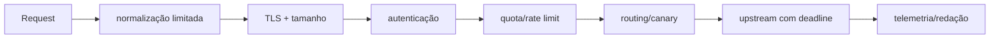

# Padrões e políticas de gateway

## Pipeline de request

A ordem afeta risco e custo. Limite tamanho antes de parsing caro; autenticação antes de quotas por identidade, mas mantenha proteção por IP/rede para tráfego anônimo. Rejeite ambiguidade de headers, path e encoding para reduzir request smuggling.

## Rate limiting

Token bucket permite burst limitado; leaky bucket suaviza; fixed window é simples e tem borda; sliding window aproxima justiça. Defina chave (tenant, client, rota), unidade (request, token, byte/custo), consistência e resposta `429` com política de retry. Rate limit não substitui concurrency limit no serviço.

## Auth e identidade

Valide issuer, audience, assinatura, algoritmo permitido e tempo do token. Faça cache de JWKS com rotação segura e comportamento definido em falha. Remova headers de identidade do cliente e injete contexto verificado. mTLS/workload identity pode proteger upstream; não repasse bearer token amplo sem necessidade.

## Transformação e composição

Transformações simples mantêm compatibilidade durante migração. Lógica complexa cria coupling e debugging difícil. BFF pode compor chamadas específicas do cliente, mas precisa deadline, concorrência limitada e resposta parcial explícita. Cache no gateway requer chave completa (`Vary`, auth/tenant), invalidation e proteção contra dados privados compartilhados.

## Versionamento e rollout

Prefira evolução compatível; versão major quando semântica quebra. Canary por header/identity precisa evitar spoofing. Shadow traffic deve remover PII quando possível, impedir efeitos no destino e ser rate-limited. Contract tests validam rotas, schemas, status e headers.

## Anti-patterns

- plugin customizado para toda regra de domínio;
- retry de `POST` não idempotente;
- header de user/role aceito do cliente;
- uma quota global que permite noisy neighbor;
- logs de body/token;
- configuração manual sem source of truth.

## Referências

- IETF. [OAuth 2.0 Bearer Token Usage — RFC 6750](https://www.rfc-editor.org/rfc/rfc6750.html).
- IETF. [RateLimit header fields — RFC 9333](https://www.rfc-editor.org/rfc/rfc9333.html).
- OpenAPI Initiative. [Specification](https://spec.openapis.org/oas/latest.html).

---

[← API Gateways](README.md) · [↑ API Gateways](README.md) · [Operação e exercícios →](operations-and-exercises.md)
