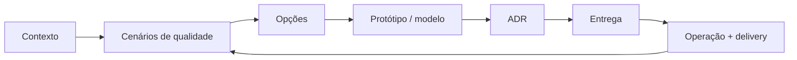

# Arquitetura de Software

Arquitetura reúne decisões caras de reverter: limites, direção de dependências, propriedade de dados, unidades de deploy e trade-offs de atributos de qualidade. Um diagrama sozinho não é arquitetura; decisão, restrições, evidência e feedback importam.

O objetivo deste guia é desenvolver a capacidade de **explicar por que um desenho funciona, onde ele falha e qual evidência justificaria mudá-lo**. Arquitetura não é um catálogo de formas prontas. É um processo de reduzir incerteza sob restrições técnicas, organizacionais e econômicas.

## Mapa da trilha

| Guia | Foco |
| --- | --- |
| [Catálogo de estilos](styles.md) | Layered, monolith, serverless, microkernel, pipeline, BFF, API Gateway, service mesh e relação Clean/Hexagonal/Onion |
| [Comparação arquitetural](comparison.md) | Matriz de decisão e evolução |
| [Monólito modular](modular-monolith/README.md) | Fronteiras internas fiscalizadas em um deployável |
| [Microsserviços](microservices/README.md) | Autonomia, ownership de dados e operação |
| [Clean + Hexagonal](clean-hexagonal/README.md) | Dependency inversion, ports, adapters e use cases |
| [Event-driven](event-driven/README.md) | Notification, event-carried state, stream e entrega |
| [CQRS + Event Sourcing](cqrs-event-sourcing/README.md) | Modelos separados e persistência por eventos, decisões independentes |
| [Architecture Decision Records](decision-records.md) | Memória leve e durável de decisões |
| [Exercícios](exercises.md) | Quatro níveis progressivos |

## O problema que arquitetura resolve

Software cresce em três dimensões ao mesmo tempo:

- **produto:** mais regras, fluxos e exceções;
- **sistema:** mais tráfego, dados, integrações e falhas;
- **organização:** mais pessoas, ownership e ciclos de entrega.

Sem limites claros, o custo de coordenação cresce mais rápido que o valor entregue. Toda mudança toca muitos componentes, qualquer deploy exige sincronização e incidentes ficam difíceis de localizar. Arquitetura existe para tornar essa complexidade **compreensível, testável e evolutiva**.

O desenho certo depende do problema. Um sistema interno de 500 requests por dia não precisa da mesma topologia que uma plataforma multi-região. Um produto regulado pode aceitar mais latência para obter auditabilidade. Uma equipe de cinco pessoas pode perder mais velocidade operando vinte serviços do que ganharia com deploy independente.

## Modelo mental: forças, limites e evidência

Pense em três camadas:

1. **Drivers:** objetivos de negócio, atributos de qualidade, restrições e riscos.
2. **Decisões:** limites, dados, comunicação, deployment e operação.
3. **Evidência:** métricas, experimentos, incidentes e feedback de entrega.

Uma decisão sem driver é preferência. Um driver sem medida vira slogan. Uma arquitetura sem feedback envelhece silenciosamente.

## Método para decisões

1. **Explicite restrições:** topologia de equipe, compliance, prazo, skills, orçamento e reversibilidade.
2. **Priorize atributos de qualidade:** use cenários, não slogans, por exemplo “recuperar 99% das requests em 5 min após perda de uma zona”.
3. **Liste opções:** ownership, consistência, interfaces, deployment e isolamento de falha.
4. **Prototipe a suposição mais arriscada:** latência, operação, migração, throughput ou workflow.
5. **Registre:** contexto, alternativas, consequências, fitness functions e gatilho de revisão.
6. **Observe:** lead time, incidentes, coupling, SLO e custo realimentam o design.

## Atributos de qualidade são trade-offs

| Atributo | Pergunta mensurável |
| --- | --- |
| Disponibilidade | Qual failure unit? Qual SLO, RTO e RPO? |
| Performance | Qual percentil, payload, concorrência e carga? |
| Escalabilidade | Qual recurso satura e como particionar trabalho? |
| Modificabilidade | Qual mudança deve ficar em um módulo/equipe/deploy? |
| Segurança | Quais trust boundaries, ativos, atores e abusos? |
| Operabilidade | Operador detecta, explica, mitiga e recupera? |
| Custo | O que é fixo/variável, inclusive pessoas e coordenação? |

Não existe “alta disponibilidade” isolada de custo, consistência e complexidade. Replicar entre regiões pode aumentar disponibilidade geográfica, mas também adiciona conflito, latência e custo de dados. Cache reduz latência, mas introduz staleness e invalidação. Fila absorve pico, mas converte sobrecarga em backlog e exige política de recuperação.

Um arquiteto precisa explicar **qual atributo ganhou, qual perdeu e por quê**.

## Limites arquiteturais

Os limites mais importantes aparecem em quatro eixos:

### Limite de código

Define o que pode importar o quê. Pode ser package, módulo ou camada. Fitness functions conseguem verificar ciclos e imports proibidos.

### Limite de dados

Define quem pode ler e escrever determinado estado. Banco compartilhado sem ownership costuma virar contrato oculto. Dados são uma das dependências mais difíceis de desfazer.

### Limite de deployment

Define o que muda e falha junto. Um monólito pode ter módulos fortes com um deploy; microsserviços oferecem deploy independente ao custo de rede e operação.

### Limite de confiança

Define onde autenticação, autorização, isolamento e proteção de dados precisam ser reforçados. Trust boundary não precisa coincidir com microservice boundary.

Confundir esses eixos gera decisões ruins. Separar código em repositórios não cria autonomia se banco e release continuam acoplados. Colocar dois módulos no mesmo processo não significa que seus modelos precisem se misturar.

## Fluxo crítico antes do diagrama geral

Comece pelo principal fluxo de negócio e marque:

- entrada e identidade;
- decisões de domínio;
- estado lido/escrito;
- chamadas remotas;
- filas e eventos;
- retries e timeouts;
- confirmação ao usuário;
- telemetria e recuperação.

Depois desenhe o sistema. Isso evita diagramas bonitos que escondem exatamente os pontos de latência e falha.

Para cada seta remota, pergunte: **qual timeout? Pode repetir? É idempotente? O que acontece se o caller desistir e o callee concluir?** Para cada estado, pergunte: **quem é a fonte de verdade e como reconciliar divergência?**

## Falhas e blast radius

Arquitetura precisa ser avaliada no pior dia, não apenas no happy path.

Exemplos de failure modes:

- dependência lenta causa pool exhaustion e cascata;
- retry em várias camadas amplifica carga;
- banco primário falha durante migração;
- consumer para e backlog supera retenção;
- cache retorna dado stale para operação sensível;
- região fica isolada com writes concorrentes;
- configuração inválida é propagada globalmente;
- uma credencial comprometida atravessa limites demais.

Para cada falha, defina detecção, contenção, degradação, recuperação e teste. “Tem três réplicas” não é plano de recuperação. Backup não é restore até ser ensaiado.

## Capacidade e performance

Arquitetura avançada exige números de ordem de grandeza. Antes de escolher particionamento ou cache, estime:

- requests/s média e pico;
- tamanho de payload;
- writes e reads por request;
- crescimento diário de storage;
- conexões concorrentes;
- bandwidth;
- memória/cache working set;
- orçamento de latência por hop.

Se o SLO é p99 < 300 ms e o fluxo chama quatro serviços em série, cada hop não pode “usar 250 ms”. O orçamento precisa incluir rede, filas, retries e margem. Tail latency se compõe de forma cruel.

Também modele saturação. CPU a 40% não prova folga se um pool de 20 conexões está em 100%. A arquitetura precisa conhecer o recurso limitante.

## Segurança como arquitetura

Segurança não é uma etapa posterior. No desenho, identifique:

- ativos e dados sensíveis;
- atores e identidades;
- trust boundaries;
- superfícies externas;
- permissões de serviço;
- caminhos de exfiltração;
- secrets e ciclo de rotação;
- supply chain e dependências.

Least privilege deve aparecer na topologia. Um serviço que só lê catálogo não precisa credencial para alterar pagamentos. Um evento público para dezenas de consumers não deve carregar PII sem necessidade.

Threat modeling é especialmente importante em decisões de plataforma: gateway, mesh, broker e control plane podem concentrar blast radius.

## Observabilidade e fitness functions

A arquitetura precisa ser observável em duas dimensões.

**Runtime:** SLO, latência, erro, saturation, traces, backlog, disponibilidade e custo.

**Evolução:** lead time, frequência de deploy, changes coordenadas, ciclos de dependência e incidentes por boundary.

Fitness functions transformam intenção em verificação:

| Intenção | Fitness function |
| --- | --- |
| módulos independentes | CI rejeita imports proibidos |
| compatibilidade | contract/schema tests em toda mudança |
| recovery | restore drill periódico dentro do RTO |
| performance | teste de carga com orçamento p99 |
| segurança | authorization tests + policy-as-code |
| custo | budget/alert por workload e unidade de negócio |

Sem fitness functions, princípios arquiteturais viram cartazes na parede.

## Princípios sem dogma

- Prefira a menor arquitetura que atende restrições atuais e mantém evolução crível.
- Alinhe limites a capability e ownership, não só camadas técnicas.
- Torne chamada remota, entrega assíncrona e consistência explícitas.
- Desacople logicamente antes de distribuir fisicamente.
- Automatize fitness functions: imports proibidos, compatibilidade, SLO e recovery.
- Trate migração de dados e observabilidade como design.
- Não troque um problema de domínio por uma plataforma mais complexa.

## Migração e reversibilidade

Grandes decisões raramente precisam ser big bang. Use passos reversíveis:

1. caracterize comportamento atual;
2. introduza abstraction seam;
3. duplique leitura/escrita quando necessário;
4. reconcilie resultados;
5. direcione tráfego gradualmente;
6. observe SLO e erros;
7. remova caminho antigo só depois da estabilidade.

Migração de dados precisa de owner, checkpoint, compatibilidade e reconciliação. Rollback de código não desfaz deleção de coluna nem evento já publicado.

## Checklist transversal

- **Segurança:** threat model, least privilege, rotação de secrets, identidade de workload e audit.
- **Confiabilidade:** timeout, retry bounded com jitter, idempotência, backpressure, degradação e restore drills.
- **Observabilidade:** traces/logs/metrics correlacionados, resultado de negócio, lag e SLO burn rate.
- **Testes:** domínio puro, adapters/contratos, integração real e poucos E2E críticos.
- **Entrega:** migração reversível, janela de compatibilidade, canary/flags e rollback/roll-forward.

## Laboratório de arquitetura

Pegue um sistema de pedidos inicialmente monolítico.

1. Defina três drivers: p99, disponibilidade e velocidade de mudança.
2. Modele Pedidos, Pagamentos e Notificações em um monólito modular.
3. Crie fitness tests de dependência e ownership de dados.
4. Injete latência em Pagamentos e meça efeito na jornada.
5. Introduza outbox para Notificações e compare acoplamento temporal.
6. Extraia apenas Notificações para serviço separado.
7. Meça antes/depois: latência, deploy, incidentes, custo e complexidade.
8. Escreva um ADR dizendo se manteria a extração ou retornaria ao módulo local.

O objetivo não é terminar em microsserviços. É provar que uma decisão foi tomada com evidência.

## Anti-patterns

- escolher estilo porque uma big tech usa, sem equivalência de contexto;
- “microsserviços” com banco e release compartilhados;
- layers onde toda mudança cruza tudo e domínio desaparece;
- eventos sem owner, schema, idempotência ou replay policy;
- Clean Architecture com pass-through interfaces e nenhuma fronteira volátil;
- ADR como burocracia de aprovação, não memória;
- adicionar cache, fila ou service mesh sem driver mensurável;
- confundir disponibilidade do componente com disponibilidade da jornada.

## Próximos estudos

- [DDD](../software-engineering/ddd/README.md) para descobrir limites.
- [Testing](../software-engineering/testing/README.md) para verificar riscos.
- [System Design](../software-engineering/system-design/README.md) para síntese ponta a ponta.
- [Sistemas distribuídos](../distributed-systems/README.md) para raciocinar sobre falha parcial e consistência.
- [Observabilidade](../observability/README.md) para transformar runtime em evidência.

## Biblioteca recomendada

| Livro | Por que ler |
| --- | --- |
| *Clean Architecture* | direção de dependência e fronteiras de política ([Pearson](https://www.pearson.com/en-us/subject-catalog/p/clean-architecture-a-craftsmans-guide-to-software-structure-and-design/P200000009528/9780134494166)) |
| *Fundamentals of Software Architecture* | atributos, estilos e habilidades de arquiteto ([O'Reilly](https://www.oreilly.com/library/view/fundamentals-of-software/9781492043447/)) |
| *Software Architecture: The Hard Parts* | decisões sem solução universal ([O'Reilly](https://www.oreilly.com/library/view/software-architecture-the/9781492086888/)) |
| *Building Evolutionary Architectures* | fitness functions e mudança incremental ([O'Reilly](https://www.oreilly.com/library/view/building-evolutionary-architectures/9781492097532/)) |
| *Designing Data-Intensive Applications* | dados, replicação, particionamento e consistência ([O'Reilly](https://www.oreilly.com/library/view/designing-data-intensive-applications/9781491903063/)) |
| *Domain-Driven Design* / *Implementing Domain-Driven Design* | limites estratégicos e modelagem tática ([Domain Language](https://www.domainlanguage.com/ddd/), [Pearson](https://www.pearson.com/en-us/subject-catalog/p/implementing-domain-driven-design/P200000009616/9780321834577)) |
| *Patterns of Enterprise Application Architecture* | catálogo de arquitetura de aplicações ([site do autor](https://martinfowler.com/books/eaa.html)) |
| *Release It!*, 2ª ed. | estabilidade e operação em produção ([Pragmatic Bookshelf](https://pragprog.com/titles/mnee2/release-it-second-edition/)) |
| *Building Microservices*, 2ª ed. | decomposição, integração e operação ([O'Reilly](https://www.oreilly.com/library/view/building-microservices-2nd/9781492034018/)) |

## Referências

- Richards & Ford. *Fundamentals of Software Architecture*. [O'Reilly](https://www.oreilly.com/library/view/fundamentals-of-software/9781492043447/).
- Ford et al. *Software Architecture: The Hard Parts*. [O'Reilly](https://www.oreilly.com/library/view/software-architecture-the/9781492086888/).
- Ford, Parsons & Kua. *Building Evolutionary Architectures*, 2ª ed. [O'Reilly](https://www.oreilly.com/library/view/building-evolutionary-architectures/9781492097532/).
- Fowler. [Software Architecture Guide](https://martinfowler.com/architecture/).
- SEI. [Software Architecture](https://www.sei.cmu.edu/our-work/software-architecture/).

---

[← Alexandria](../README.md) · [↑ Índice principal](../README.md) · [Catálogo de estilos →](styles.md)
