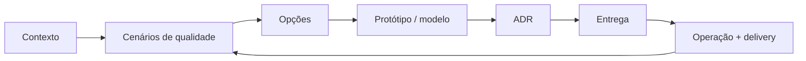

# Arquitetura de Software

Arquitetura reúne decisões caras de reverter: limites, direção de dependências, propriedade de dados, unidades de deploy e trade-offs de atributos de qualidade. Um diagrama sozinho não é arquitetura; decisão, restrições, evidência e feedback importam.

## Mapa da trilha

| Guia | Foco |
| --- | --- |
| [Catálogo de estilos](styles.md) | Layered, monolith, serverless, microkernel, pipeline, BFF, API Gateway, service mesh e relação Clean/Hexagonal/Onion |
| [Comparação arquitetural](comparison.md) | Matriz de decisão e evolução |
| [Monólito modular](modular-monolith/README.md) | Fronteiras internas fiscalizadas em um deployável |
| [Microsserviços](microservices/README.md) | Autonomia, ownership de dados e operação |
| [Clean + Hexagonal](clean-hexagonal/README.md) | Dependency inversion, ports, adapters e use cases |
| [Event-driven](event-driven/README.md) | Notification, event-carried state, stream e entrega |
| [CQRS + Event Sourcing](cqrs-event-sourcing/README.md) | Modelos separados e persistência por eventos—decisões independentes |
| [Architecture Decision Records](decision-records.md) | Memória leve e durável de decisões |
| [Exercícios](exercises.md) | Quatro níveis progressivos |

## Método para decisões

1. **Explicite restrições:** topologia de equipe, compliance, prazo, skills, orçamento e reversibilidade.
2. **Priorize atributos de qualidade:** use cenários, não slogans—“recuperar 99% das requests em 5 min após perda de uma zona”.
3. **Liste opções:** ownership, consistência, interfaces, deployment e isolamento de falha.
4. **Prototipe a suposição mais arriscada:** latência, operação, migração, throughput ou workflow.
5. **Registre:** contexto, alternativas, consequências, fitness functions e gatilho de revisão.
6. **Observe:** lead time, incidentes, coupling, SLO e custo realimentam o design.

## Lente de atributos de qualidade

| Atributo | Pergunta mensurável |
| --- | --- |
| Disponibilidade | Qual failure unit? Qual SLO, RTO e RPO? |
| Performance | Qual percentil, payload, concorrência e carga? |
| Escalabilidade | Qual recurso satura e como particionar trabalho? |
| Modificabilidade | Qual mudança deve ficar em um módulo/equipe/deploy? |
| Segurança | Quais trust boundaries, ativos, atores e abusos? |
| Operabilidade | Operador detecta, explica, mitiga e recupera? |
| Custo | O que é fixo/variável, inclusive pessoas e coordenação? |

## Princípios sem dogma

- Prefira a menor arquitetura que atende restrições atuais e mantém evolução crível.
- Alinhe limites a capability e ownership, não só camadas técnicas.
- Torne chamada remota, entrega assíncrona e consistência explícitas.
- Desacople logicamente antes de distribuir fisicamente.
- Automatize fitness functions: imports proibidos, compatibilidade, SLO e recovery.
- Trate migração de dados e observabilidade como design.

## Checklist transversal

- **Segurança:** threat model, least privilege, rotação de secrets, identidade de workload e audit.
- **Confiabilidade:** timeout, retry bounded com jitter, idempotência, backpressure, degradação e restore drills.
- **Observabilidade:** traces/logs/metrics correlacionados, resultado de negócio, lag e SLO burn rate.
- **Testes:** domínio puro, adapters/contratos, integração real e poucos E2E críticos.
- **Entrega:** migração reversível, janela de compatibilidade, canary/flags e rollback/roll-forward.

## Anti-patterns

- escolher estilo porque uma big tech usa, sem equivalência de contexto;
- “microsserviços” com banco e release compartilhados;
- layers onde toda mudança cruza tudo e domínio desaparece;
- eventos sem owner, schema, idempotência ou replay policy;
- Clean Architecture com pass-through interfaces e nenhuma fronteira volátil;
- ADR como burocracia de aprovação, não memória.

## Próximos estudos

- [DDD](../software-engineering/ddd/README.md) para descobrir limites.
- [Testing](../software-engineering/testing/README.md) para verificar riscos.
- [System Design](../software-engineering/system-design/README.md) para síntese ponta a ponta.

## Biblioteca recomendada

| Livro | Por que ler |
| --- | --- |
| *Clean Architecture* | direção de dependência e fronteiras de política ([Pearson](https://www.pearson.com/en-us/subject-catalog/p/clean-architecture-a-craftsmans-guide-to-software-structure-and-design/P200000009528/9780134494166)) |
| *Fundamentals of Software Architecture* | atributos, estilos e habilidades de arquiteto ([O'Reilly](https://www.oreilly.com/library/view/fundamentals-of-software/9781492043447/)) |
| *Software Architecture: The Hard Parts* | decisões sem solução universal ([O'Reilly](https://www.oreilly.com/library/view/software-architecture-the/9781492086888/)) |
| *Building Evolutionary Architectures* | fitness functions e mudança incremental ([O'Reilly](https://www.oreilly.com/library/view/building-evolutionary-architectures/9781492097532/)) |
| *Designing Data-Intensive Applications* | dados, replicação, particionamento e consistência ([O'Reilly](https://www.oreilly.com/library/view/designing-data-intensive-applications/9781491903063/)) |
| *Domain-Driven Design* / *Implementing Domain-Driven Design* | limites estratégicos e modelagem tática ([Domain Language](https://www.domainlanguage.com/ddd/), [Pearson](https://www.pearson.com/en-us/subject-catalog/p/implementing-domain-driven-design/P200000009616/9780321834577)) |
| *Patterns of Enterprise Application Architecture* | catálogo de arquitetura de aplicações ([site do autor](https://martinfowler.com/books/eaa.html)) |
| *Release It!*, 2ª ed. | estabilidade e operação em produção ([Pragmatic Bookshelf](https://pragprog.com/titles/mnee2/release-it-second-edition/)) |
| *Building Microservices*, 2ª ed. | decomposição, integração e operação ([O'Reilly](https://www.oreilly.com/library/view/building-microservices-2nd/9781492034018/)) |

## Referências

- Richards & Ford. *Fundamentals of Software Architecture*. [O'Reilly](https://www.oreilly.com/library/view/fundamentals-of-software/9781492043447/).
- Ford et al. *Software Architecture: The Hard Parts*. [O'Reilly](https://www.oreilly.com/library/view/software-architecture-the/9781492086888/).
- Ford, Parsons & Kua. *Building Evolutionary Architectures*, 2ª ed. [O'Reilly](https://www.oreilly.com/library/view/building-evolutionary-architectures/9781492097532/).
- Fowler. [Software Architecture Guide](https://martinfowler.com/architecture/).
- SEI. [Software Architecture](https://www.sei.cmu.edu/our-work/software-architecture/).

---

[← Alexandria](../README.md) · [↑ Índice principal](../README.md) · [Catálogo de estilos →](styles.md)
