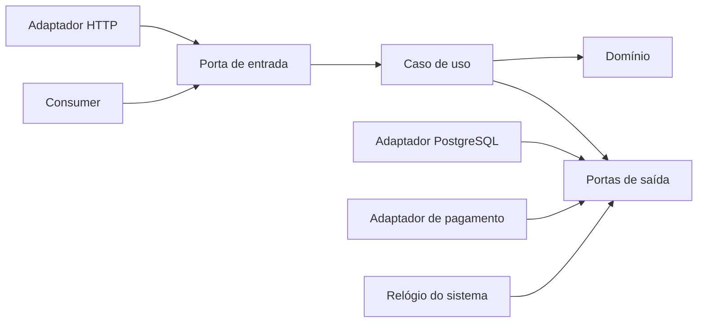

# Clean Architecture e Arquitetura Hexagonal

Clean, Hexagonal (Ports and Adapters) e Onion compartilham uma ideia central: **política de negócio não depende de framework, transporte ou persistência**. Elas enfatizam aspectos diferentes, mas podem ser implementadas com o mesmo grafo de dependências.

## Problema e intenção

Quando casos de uso importam diretamente ORM, HTTP, relógio do sistema e SDKs, testar regras exige infraestrutura e substituir uma fronteira contamina o núcleo. A inversão de dependência cria contratos do ponto de vista do consumidor e mantém decisões voláteis nas bordas.

- **Hexagonal:** aplicações possuem portas de entrada (driving) e saída (driven); adaptadores conectam o mundo.
- **Clean:** entidades e use cases são políticas internas; detalhes dependem para dentro.
- **Onion:** domínio ocupa o centro, cercado por serviços de aplicação e infraestrutura.

Isso é uma família de restrições, não uma taxonomia de pastas obrigatória.

## Componentes

| Papel | Responsabilidade | Exemplo |
| --- | --- | --- |
| Domínio | invariantes e linguagem do negócio | `Order`, `Money`, política de desconto |
| Aplicação/use case | orquestra uma intenção e transação | `PlaceOrder` |
| Porta de entrada | contrato oferecido pela aplicação | comando/handler |
| Porta de saída | necessidade declarada pelo consumidor | `Orders`, `PaymentAuthorizer`, `Clock` |
| Adaptador de entrada | traduz protocolo para a porta | HTTP controller, CLI, consumer |
| Adaptador de saída | implementa uma porta com tecnologia | PostgreSQL repository, SDK de pagamento |
| Composição | cria objetos e escolhe implementações | bootstrap/DI module |



As setas representam dependência de código: os adaptadores implementam contratos definidos perto do caso de uso. Em runtime, o caso de uso chama o adaptador pela porta.

## Fluxo: `PlaceOrder`

1. Controller autentica/valida formato e cria um comando sem tipos HTTP.
2. Caso de uso carrega o agregado pela porta `Orders`.
3. Domínio aplica regras e produz resultado/eventos.
4. Caso de uso persiste pela porta e confirma a unidade de trabalho.
5. Adaptador converte resultado/erro para HTTP; o domínio não conhece status code.

Erros também fazem parte do contrato: diferencie rejeição de negócio, conflito de concorrência, indisponibilidade transitória e defeito. Não reduza tudo a `Exception`/500.

## Onde criar uma porta

Uma porta se justifica quando há uma fronteira de efeito, volatilidade ou teste relevante: banco, broker, tempo, identificadores, pagamento, serviço externo. Não crie `IOrderService` para uma implementação estável só para “obedecer ao diagrama”. Interfaces pertencem ao consumidor e podem ser pequenas, por caso de uso.

```text
interface LoadOrder { load(OrderId): Order? }
interface SaveOrder { save(Order, expectedVersion): void }
```

Separar leitura/escrita ajuda testes e capacidade, mas uma única porta coesa também pode ser correta. O critério é a necessidade do caso de uso.

## Vantagens, desvantagens e trade-offs

| Vantagem | Custo / cuidado |
| --- | --- |
| regras testáveis sem infraestrutura | mapeamentos e composição explícitos |
| tecnologia substituível na fronteira | troca total de banco raramente é “gratuita” |
| dependências e efeitos visíveis | excesso de interfaces vira cerimônia |
| múltiplos adaptadores sobre mesmos use cases | contrato pode esconder capacidades importantes do storage |

**Use quando:** domínio e integrações têm complexidade; longevidade/portabilidade/teste justificam; múltiplos adaptadores existem.

**Não use como molde completo quando:** aplicação é CRUD simples e curta; framework já oferece limites suficientes; equipe paga mais em tradução do que recupera em mudança. Ainda assim, isolar efeitos e regras úteis continua valendo.

## Persistência e transação

- o modelo de domínio não precisa ser o modelo ORM;
- mapeamento explícito impede anotações, lazy loading e identidade de sessão de vazarem;
- a unidade de trabalho costuma ser responsabilidade da aplicação/adaptador;
- agregados protegem invariantes; não carregue um grafo infinito;
- use optimistic concurrency (`expectedVersion`) quando duas gravações podem competir.

Separar modelos não é dogma: para CRUD sem invariantes, um modelo compartilhado pode ser o trade-off consciente. Registre o gatilho para separar.

## Testes

- **domínio:** exemplos e propriedades sem mocks;
- **caso de uso:** fakes pequenos para portas, verificando estado/resultados, não detalhes de chamadas;
- **adaptador:** teste de integração/contrato contra PostgreSQL, broker ou sandbox real;
- **wiring:** smoke test da composição para detectar dependência não registrada;
- **arquitetura:** regra de imports garante que domínio/aplicação não importem frameworks.

Um fake em memória não prova semântica de transação, collation, lock ou SQL. O mesmo conjunto de testes de contrato deve rodar sobre fake e adaptador real quando equivalência importa.

## Observabilidade

Tracing, métricas e logs são detalhes de borda, mas resultados de negócio precisam sair do caso de uso de forma explícita. Instrumente adaptadores para latência/erro e o handler para resultado. Não espalhe SDK de telemetry pelo domínio; passe contexto/correlação quando semanticamente necessário.

## Deployment e segurança

Clean/Hexagonal não define topologia: pode viver em monólito, função ou serviço. No bootstrap, valide configuração, registre adaptadores e falhe cedo. Nas portas, modele identidade e autorização necessárias ao caso de uso; não passe um objeto HTTP ou claims genéricas ao domínio. Adaptadores validam input não confiável e escapam output; o núcleo mantém autorização/invariantes de negócio.

## Evolução

1. Comece separando regra pura de I/O em um caso doloroso.
2. Defina uma porta mínima na linguagem do caso de uso.
3. Mova o acesso existente para um adaptador; preserve comportamento com testes de caracterização.
4. Faça a composição no limite do processo.
5. Adicione fitness test de dependência.

Essa sequência permite branch by abstraction sem reescrever por camadas.

## Anti-patterns

- quatro DTOs idênticos atravessando camadas sem tradução semântica;
- `UseCase` que apenas chama `Repository.save`;
- domínio anêmico e todas as regras em um application service gigante;
- porta genérica `Repository<T>` impondo CRUD a agregados diferentes;
- service locator escondido no núcleo;
- mocks de cada método e testes acoplados à implementação;
- acreditar que inverter import remove latência/limitações reais da tecnologia.

## Exercício orientado

Pegue um checkout acoplado ao framework. Extraia apenas cálculo e autorização de pagamento. Implemente porta de relógio, repositório com concorrência otimista e adaptador de PSP. Depois simule timeout após o PSP capturar: desenhe idempotência/recuperação; a inversão de dependência sozinha não resolve o efeito distribuído.

## Referências

- Alistair Cockburn. [Hexagonal Architecture](https://alistair.cockburn.us/hexagonal-architecture/).
- Robert C. Martin. [The Clean Architecture](https://blog.cleancoder.com/uncle-bob/2012/08/13/the-clean-architecture.html).
- Robert C. Martin. *Clean Architecture*. [Pearson](https://www.pearson.com/en-us/subject-catalog/p/clean-architecture-a-craftsmans-guide-to-software-structure-and-design/P200000009528/9780134494166).
- Palermo. [The Onion Architecture](https://jeffreypalermo.com/2008/07/the-onion-architecture-part-1/).

---

[← Microsserviços](../microservices/README.md) · [↑ Índice](../README.md) · [Event-driven →](../event-driven/README.md)
