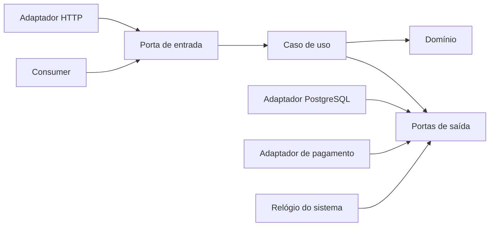

# Clean Architecture e Arquitetura Hexagonal

Clean, Hexagonal (Ports and Adapters) e Onion compartilham uma ideia central: **política de negócio não depende de framework, transporte ou persistência**. Elas enfatizam aspectos diferentes, mas podem ser implementadas com o mesmo grafo de dependências.

O objetivo não é empilhar camadas. É tornar efeitos, regras e fronteiras visíveis o suficiente para que a aplicação possa mudar sem espalhar detalhes voláteis por todo o código.

## Problema e intenção

Quando casos de uso importam diretamente ORM, HTTP, relógio do sistema e SDKs, testar regras exige infraestrutura e substituir uma fronteira contamina o núcleo. A inversão de dependência cria contratos do ponto de vista do consumidor e mantém decisões voláteis nas bordas.

- **Hexagonal:** aplicações possuem portas de entrada (driving) e saída (driven); adaptadores conectam o mundo.
- **Clean:** entidades e use cases são políticas internas; detalhes dependem para dentro.
- **Onion:** domínio ocupa o centro, cercado por serviços de aplicação e infraestrutura.

Isso é uma família de restrições, não uma taxonomia de pastas obrigatória.

## Componentes

| Papel | Responsabilidade | Exemplo |
| --- | --- | --- |
| Domínio | invariantes e linguagem do negócio | `Order`, `Money`, política de desconto |
| Aplicação/use case | orquestra uma intenção e transação | `PlaceOrder` |
| Porta de entrada | contrato oferecido pela aplicação | comando/handler |
| Porta de saída | necessidade declarada pelo consumidor | `Orders`, `PaymentAuthorizer`, `Clock` |
| Adaptador de entrada | traduz protocolo para a porta | HTTP controller, CLI, consumer |
| Adaptador de saída | implementa uma porta com tecnologia | PostgreSQL repository, SDK de pagamento |
| Composição | cria objetos e escolhe implementações | bootstrap/DI module |



As setas representam dependência de código: os adaptadores implementam contratos definidos perto do caso de uso. Em runtime, o caso de uso chama o adaptador pela porta.

## Fluxo: `PlaceOrder`

1. Controller autentica/valida formato e cria um comando sem tipos HTTP.
2. Caso de uso carrega o agregado pela porta `Orders`.
3. Domínio aplica regras e produz resultado/eventos.
4. Caso de uso persiste pela porta e confirma a unidade de trabalho.
5. Adaptador converte resultado/erro para HTTP; o domínio não conhece status code.

Erros também fazem parte do contrato: diferencie rejeição de negócio, conflito de concorrência, indisponibilidade transitória e defeito. Não reduza tudo a `Exception`/500.

## Onde criar uma porta

Uma porta se justifica quando há uma fronteira de efeito, volatilidade ou teste relevante: banco, broker, tempo, identificadores, pagamento, serviço externo. Não crie `IOrderService` para uma implementação estável só para “obedecer ao diagrama”. Interfaces pertencem ao consumidor e podem ser pequenas, por caso de uso.

```text
interface LoadOrder { load(OrderId): Order? }
interface SaveOrder { save(Order, expectedVersion): void }
```

Separar leitura/escrita ajuda testes e capacidade, mas uma única porta coesa também pode ser correta. O critério é a necessidade do caso de uso.

## Vantagens, desvantagens e trade-offs

| Vantagem | Custo / cuidado |
| --- | --- |
| regras testáveis sem infraestrutura | mapeamentos e composição explícitos |
| tecnologia substituível na fronteira | troca total de banco raramente é “gratuita” |
| dependências e efeitos visíveis | excesso de interfaces vira cerimônia |
| múltiplos adaptadores sobre mesmos use cases | contrato pode esconder capacidades importantes do storage |

**Use quando:** domínio e integrações têm complexidade; longevidade/portabilidade/teste justificam; múltiplos adaptadores existem.

**Não use como molde completo quando:** aplicação é CRUD simples e curta; framework já oferece limites suficientes; equipe paga mais em tradução do que recupera em mudança. Ainda assim, isolar efeitos e regras úteis continua valendo.

## Garantias e limites reais

Clean/Hexagonal garante principalmente **direção de dependência no código**. Ela não garante:

- consistência distribuída;
- idempotência;
- performance;
- isolamento de falha;
- segurança automática;
- ausência de coupling semântico;
- facilidade de troca de qualquer tecnologia.

Uma porta `Payments` não torna o PSP substituível se a regra de negócio depende de capture, partial refund ou dispute com semânticas específicas. Uma porta genérica demais pode esconder justamente as diferenças que deveriam orientar a aplicação.

Abstraia o que o caso de uso precisa, não uma fantasia de equivalência entre fornecedores.

## Persistência e transação

- o modelo de domínio não precisa ser o modelo ORM;
- mapeamento explícito impede anotações, lazy loading e identidade de sessão de vazarem;
- a unidade de trabalho costuma ser responsabilidade da aplicação/adaptador;
- agregados protegem invariantes; não carregue um grafo infinito;
- use optimistic concurrency (`expectedVersion`) quando duas gravações podem competir.

Separar modelos não é dogma: para CRUD sem invariantes, um modelo compartilhado pode ser o trade-off consciente. Registre o gatilho para separar.

### Boundary de transação

O caso de uso precisa saber **qual efeito está dentro da transação local**. Exemplo: salvar pedido e gravar outbox pode ocorrer atomicamente; chamar PSP externo não. Se o adaptador esconde essa diferença atrás de uma interface aparentemente simples, o desenho perde informação crítica.

```text
BEGIN
  save(order)
  insert(outbox_event)
COMMIT

call_external_payment()  # outra boundary, outra semântica
```

Esse detalhe orienta retry, compensação e reconciliação.

## Falhas e erros como parte da arquitetura

Defina um vocabulário de falhas entre aplicação e adaptadores. Um exemplo:

- `BusinessRejected`: regra de negócio negou a operação;
- `Conflict`: versão/estado mudou concorrente;
- `DependencyUnavailable`: falha transitória;
- `RateLimited`: downstream pede redução de carga;
- `InvalidExternalResponse`: contrato externo violado;
- `UnknownOutcome`: timeout após possível efeito.

`UnknownOutcome` é especialmente importante. Se uma chamada de pagamento estoura timeout, a aplicação não sabe se o provedor capturou. Retry cego pode duplicar efeito. A porta deve permitir idempotency key ou consulta/reconciliação.

## Performance e capacidade

Arquitetura limpa pode introduzir custo de CPU e alocação por mapeamentos, mas geralmente o maior risco é **ocultar comportamento caro atrás de interfaces elegantes**.

Exemplos:

- `orders.findAll()` carrega milhões de registros;
- `customer.orders()` dispara N+1 por lazy loading;
- `repository.save()` faz dezenas de queries;
- `payment.authorize()` tem p99 de 2 s e bloqueia thread;
- mapper copia payload grande várias vezes.

Portas devem expressar capacidade e limites relevantes: paginação, batch, streaming, consistency level e cancellation. O domínio não precisa conhecer SQL, mas a aplicação não pode fingir que I/O é gratuito.

Meça spans por adaptador, queries por use case, bytes, latência e saturation. Uma abstração boa torna o custo observável.

## Testes

- **domínio:** exemplos e propriedades sem mocks;
- **caso de uso:** fakes pequenos para portas, verificando estado/resultados, não detalhes de chamadas;
- **adaptador:** teste de integração/contrato contra PostgreSQL, broker ou sandbox real;
- **wiring:** smoke test da composição para detectar dependência não registrada;
- **arquitetura:** regra de imports garante que domínio/aplicação não importem frameworks.

Um fake em memória não prova semântica de transação, collation, lock ou SQL. O mesmo conjunto de testes de contrato deve rodar sobre fake e adaptador real quando equivalência importa.

### Testes de failure mode

Além do happy path, teste:

- timeout do adaptador;
- resposta inválida;
- conflito de versão;
- retry após `UnknownOutcome`;
- indisponibilidade parcial;
- cancelamento do caller;
- duplicate message no adapter de fila.

O caso de uso deve manter invariantes mesmo quando infraestrutura falha.

## Observabilidade

Tracing, métricas e logs são detalhes de borda, mas resultados de negócio precisam sair do caso de uso de forma explícita. Instrumente adaptadores para latência/erro e o handler para resultado. Não espalhe SDK de telemetry pelo domínio; passe contexto/correlação quando semanticamente necessário.

Uma distribuição útil de spans:

```text
HTTP POST /orders
└── PlaceOrder
    ├── Orders.load
    ├── Payment.authorize
    ├── Orders.save
    └── Outbox.append
```

Isso mantém o domínio livre de SDK e ainda permite localizar custo e falha. Métricas de negócio podem ser emitidas pelo application layer a partir de resultados explícitos.

## Deployment e segurança

Clean/Hexagonal não define topologia: pode viver em monólito, função ou serviço. No bootstrap, valide configuração, registre adaptadores e falhe cedo. Nas portas, modele identidade e autorização necessárias ao caso de uso; não passe um objeto HTTP ou claims genéricas ao domínio. Adaptadores validam input não confiável e escapam output; o núcleo mantém autorização/invariantes de negócio.

### Trust boundaries

Uma boundary arquitetural de código não é necessariamente trust boundary. Controller, application service e domínio podem estar no mesmo processo e compartilhar privilégios. Se uma integração executa código não confiável ou manipula segredo de alto risco, pode precisar de processo, sandbox ou identidade separada.

Não coloque token de infraestrutura dentro de entidade de domínio. Credenciais ficam nos adaptadores/composição e devem seguir least privilege.

## Evolução

1. Comece separando regra pura de I/O em um caso doloroso.
2. Defina uma porta mínima na linguagem do caso de uso.
3. Mova o acesso existente para um adaptador; preserve comportamento com testes de caracterização.
4. Faça a composição no limite do processo.
5. Adicione fitness test de dependência.

Essa sequência permite branch by abstraction sem reescrever por camadas.

### Quando remover uma abstração

Abstrações também envelhecem. Se uma porta só tem uma implementação, nunca muda, não melhora teste e força dezenas de mappers sem semântica, simplificar pode ser a decisão correta. Arquitetura evolutiva inclui apagar fronteiras que não protegem nada.

## Anti-patterns

- quatro DTOs idênticos atravessando camadas sem tradução semântica;
- `UseCase` que apenas chama `Repository.save`;
- domínio anêmico e todas as regras em um application service gigante;
- porta genérica `Repository<T>` impondo CRUD a agregados diferentes;
- service locator escondido no núcleo;
- mocks de cada método e testes acoplados à implementação;
- acreditar que inverter import remove latência/limitações reais da tecnologia;
- criar interface para cada classe sem driver de volatilidade;
- esconder transação, retry ou consistência atrás de uma API “limpa”.

## Laboratório progressivo

Pegue um checkout inicialmente acoplado ao framework.

1. **Caracterização:** crie testes que preservem comportamento atual.
2. **Domínio:** extraia cálculo de preço e regras de confirmação.
3. **Portas:** crie `Orders`, `PaymentAuthorizer` e `Clock` a partir das necessidades do caso de uso.
4. **Persistência:** implemente adapter PostgreSQL com optimistic concurrency.
5. **Falha:** simule timeout após o PSP capturar e modele `UnknownOutcome` + idempotência.
6. **Observabilidade:** produza trace do caso de uso sem importar SDK no domínio.
7. **Performance:** injete N+1 no repository, detecte por métricas e corrija sem vazar ORM para o núcleo.
8. **Segurança:** restrinja credenciais do adapter e teste autorização de negócio separada da autenticação HTTP.
9. **Evolução:** substitua o adapter de pagamento por um fake contratual e depois por um segundo provedor, documentando quais diferenças não cabem na mesma porta.

O relatório deve mostrar quais abstrações protegeram uma mudança real e quais seriam cerimônia se o sistema fosse CRUD simples.

## Perguntas de revisão

- Qual decisão volátil esta porta protege?
- O contrato expressa capacidades relevantes ou esconde limitações?
- Onde começa e termina a transação?
- O que acontece após timeout com efeito possivelmente concluído?
- Qual erro é de negócio e qual é de infraestrutura?
- Como medir custo/latência por adapter?
- A boundary de código também precisa ser boundary de confiança?

## Referências

- Alistair Cockburn. [Hexagonal Architecture](https://alistair.cockburn.us/hexagonal-architecture/).
- Robert C. Martin. [The Clean Architecture](https://blog.cleancoder.com/uncle-bob/2012/08/13/the-clean-architecture.html).
- Robert C. Martin. *Clean Architecture*. [Pearson](https://www.pearson.com/en-us/subject-catalog/p/clean-architecture-a-craftsmans-guide-to-software-structure-and-design/P200000009528/9780134494166).
- Palermo. [The Onion Architecture](https://jeffreypalermo.com/2008/07/the-onion-architecture-part-1/).

---

[← Microsserviços](../microservices/README.md) · [↑ Índice](../README.md) · [Event-driven →](../event-driven/README.md)
