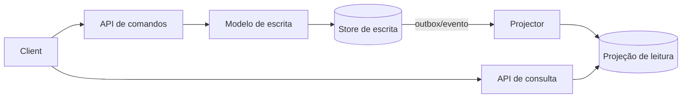
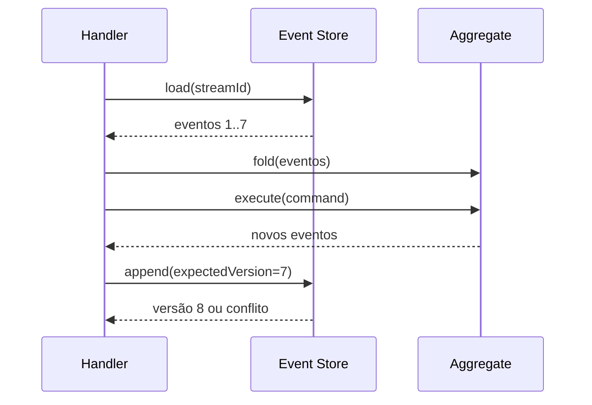

# CQRS e Event Sourcing

CQRS e Event Sourcing resolvem problemas diferentes e só devem entrar quando o
problema exige o custo adicional.

- **CQRS** separa modelos ou caminhos de comando e consulta quando suas
  necessidades divergem de forma relevante.
- **Event Sourcing (ES)** persiste eventos de domínio como fonte de verdade e
  deriva estado atual por `fold`/projeção.

Eles podem coexistir, mas um não exige o outro. Adotar ambos por padrão adiciona
consistência eventual, armazenamento, evolução de schema, tooling, replay e
operação sem benefício garantido.

## Modelo mental

Há três ideias que precisam ficar separadas:

```text
comando → decisão de domínio → fatos persistidos → projeções derivadas → consultas
```

No CQRS, a separação pode existir apenas no código. No Event Sourcing, os fatos
persistidos passam a ser a história canônica do agregado. A projeção é uma
interpretação dessa história, não a verdade original.

A pergunta central é: **qual parte precisa ser fonte de verdade e qual parte pode
ser derivada, atrasada ou reconstruída?**

## CQRS

### Problema que resolve

Um modelo único pode ficar preso entre duas forças:

- escrita rica em invariantes e comportamento;
- leitura denormalizada, agregada, pesquisável ou com escala diferente.



Separar command/query não significa automaticamente dois bancos. Comece pela
separação lógica. Distribua stores/processos apenas quando autonomia, escala ou
segurança justificarem.

### Garantias e limites

O write model protege invariantes de escrita. A read model normalmente oferece uma
visão derivada e possivelmente atrasada.

CQRS não garante:

- consistência imediata entre write/read models;
- melhor performance por si só;
- menor complexidade;
- independência operacional se deploy e schema continuarem acoplados.

O benefício aparece quando os dois caminhos realmente possuem requisitos
incompatíveis em um único modelo.

### Consistência e UX

Após um comando aceito, a projeção pode estar atrás. Opções:

- resposta do comando inclui representação atual;
- read-your-writes temporário na fonte de escrita;
- cliente aguarda `projection_version >= command_version`;
- UI exibe estado pendente;
- operação crítica consulta write model.

Defina um **freshness SLO**. “Eventual” precisa virar número e comportamento:
“95% das projeções em até 2 s, 99.9% em até 30 s” é muito mais útil que “consistência
eventual”.

### Performance

CQRS pode otimizar consultas porque a read model é construída para o acesso
necessário. Mas há custo adicional:

- write amplification;
- storage duplicado;
- projector compute;
- lag;
- rebuild;
- cache e índices adicionais.

Meça:

- command latency;
- projection lag em tempo;
- query latency por visão;
- throughput do projector;
- tamanho da fila/backlog;
- tempo de rebuild;
- custo de storage por projeção.

### Segurança

Read model não deve vazar dados que o write model protegeria. Materializações
precisam manter autorização, tenancy e classificação de dados.

Evite copiar secrets ou PII para toda projeção “por conveniência”. Uma projeção
especializada deve conter apenas o necessário para a consulta.

## Event Sourcing

### Fonte de verdade como sequência de fatos

Um stream por agregado contém fatos imutáveis ordenados:

```text
OrderPlaced(v1)
→ ItemAdded(v2)
→ PaymentAuthorized(v3)
→ OrderConfirmed(v4)
```

O estado atual é:

`state = fold(events)`

Esse modelo preserva história e permite reconstrução, mas torna cada evento parte
do contrato temporal do sistema.

## Command handling por dentro



O handler:

1. carrega história;
2. reidrata aggregate;
3. aplica comando;
4. aggregate decide novos fatos;
5. append usa versão esperada;
6. conflito exige nova decisão, não overwrite.

## Concorrência otimista

`expectedVersion` é uma forma de compare-and-set no stream. Se dois writers
carregam versão 7, apenas um deve anexar versão 8.

O segundo recebe conflito e precisa:

- recarregar;
- reavaliar comando;
- rejeitar se intenção não faz mais sentido;
- ou tentar novamente se operação for segura.

Retry cego pode violar intenção. “Adicionar item” talvez seja repetível; “aprovar
esta versão da proposta” pode não ser.

## Invariantes entre agregados

Event Sourcing não cria transação global. Se a regra atravessa agregados, opções
incluem:

- redesenhar aggregate boundary;
- reserva com expiração;
- process manager/saga;
- autoridade única;
- reconciliação;
- coordenação forte quando realmente necessária.

A necessidade frequente de transação entre vários streams pode indicar boundaries
errados.

## Eventos são contratos históricos

Um evento persistido precisa ser compreensível daqui a anos, porque snapshots,
rebuilds e auditoria dependem dele.

Evite eventos técnicos como:

`FieldChanged(name="status", old="A", new="B")`

Prefira linguagem de domínio:

`OrderCancelled(reason="payment_timeout")`

O segundo carrega significado que continua útil mesmo se a estrutura interna
mudar.

## Evolução de eventos

Estratégias:

### Upcasting

Transforma versão antiga em representação esperada pelo código atual durante a
leitura. Deve ser determinístico e não depender de rede/estado mutável.

### Evento corretivo

Novo fato corrige interpretação ou dado anterior sem apagar história.

### Nova projeção

Reinterpreta todas as versões em uma nova read model.

### Migração de stream

Mais arriscada. Reescreve história ou cria nova geração de streams. Exige backup,
reconciliação e rastreabilidade.

Não edite eventos antigos silenciosamente em produção.

## Snapshots

Snapshot reduz tempo de reidratação:

```text
snapshot(version=100) + events 101..120
```

Ele é cache derivado. Se for perdido, a história deve permitir reconstrução.

Meça:

- tamanho médio do stream;
- tempo de fold;
- custo de snapshot;
- frequência ideal;
- compatibilidade do snapshot entre versões.

Snapshot precoce demais adiciona complexidade sem resolver gargalo real.

## Projeções

Projector consome eventos e atualiza uma visão.

O checkpoint precisa ser coordenado com o efeito local. Se atualizar projeção e
salvar checkpoint separadamente, um crash pode perder ou duplicar aplicação.

Padrões:

- transação `projection + checkpoint` no mesmo banco;
- idempotência por event ID/version;
- reconstrução determinística.

## Rebuild sem downtime

Para nova versão de projeção:

1. crie `orders_view_v2`;
2. processe histórico desde zero;
3. monitore lag e erros;
4. compare invariantes/checksums com v1;
5. dual-read em amostra;
6. troque alias/roteamento;
7. mantenha v1 até janela segura;
8. decommission depois.

Nunca rebuild in-place se isso impedir rollback.

## Replay e efeitos externos

Replay deve recomputar estado derivado. Ele não deve:

- reenviar email;
- refazer cobrança;
- chamar webhook;
- criar side effect irreversível.

Separe projectors puros de effect handlers ou use modo explícito de replay que
bloqueie integrações externas.

## Temporal queries

Event Sourcing permite perguntas como:

- qual era o estado na versão 40?
- quando esta regra passou a valer?
- quais fatos levaram ao estado atual?

Mas isso só funciona se eventos preservarem semântica suficiente. Guardar apenas
“estado inteiro atualizado” pode tecnicamente permitir replay e ainda assim ter
baixo valor de domínio.

## CQRS + ES juntos

Combinação típica:

```text
command → aggregate → append event → projector → read model
```

Ela é adequada quando:

- histórico é parte do produto;
- domínio é orientado a fatos;
- leitura possui modelos distintos;
- reconstrução de novas visões tem valor;
- equipe consegue operar lag/replay/versionamento.

É excesso quando CRUD e audit log resolvem.

## Trade-offs

| Benefício | Preço |
| --- | --- |
| auditoria temporal | contrato histórico permanente |
| reconstrução de visões | replay e tooling |
| concorrência por versão | conflitos explícitos |
| modelos de leitura específicos | storage e lag |
| explicabilidade de mudança | volume de eventos e evolução |
| autonomia de leitura | consistência eventual |

## Performance e capacidade

### Write path

Custo depende de:

- tamanho do stream;
- append latency;
- indexação do event store;
- payload;
- número de eventos por comando;
- concorrência no mesmo aggregate.

### Read path

Read model pode ser muito rápida, mas o custo foi pago antes em projeção e
storage.

### Rebuild

É uma operação de capacidade. Calcule:

`tempo ≈ total de eventos / throughput sustentável do projector`

Se existem 2 bilhões de eventos e projector sustenta 20 mil/s, rebuild completo
leva muitas horas antes de considerar throttling e dependências.

Planeje paralelismo por stream/partition e proteja sistemas downstream.

## Observabilidade

Métricas de Event Sourcing:

- append latency;
- optimistic concurrency conflicts;
- stream length;
- rehydration time;
- snapshot age;
- unknown event versions;
- event-store error rate.

Métricas de CQRS/projeção:

- projection lag;
- checkpoint age;
- projector throughput;
- retries/DLQ;
- rebuild ETA;
- query latency;
- divergence checks.

Use causation/correlation IDs para ligar comando → evento → projeção.

## Modos de falha

### Evento desconhecido durante deploy

Novo producer publica antes de todos consumers serem compatíveis. Use rollout
expand/contract: readers primeiro, producers depois.

### Projector trava em poison event

Fila inteira pode parar se ordering for obrigatório. Quarentena precisa preservar
ordem ou permitir tratamento por stream.

### Snapshot incompatível

Código novo não consegue ler snapshot antigo. Mantenha versionamento ou descarte e
reconstrua a partir do stream.

### Event store indisponível

Write path para. Read models podem continuar servindo dados stale, se a semântica
permitir. Defina comportamento explícito.

### Rebuild derruba produção

Projector sem rate limit satura banco/search. Trate rebuild como workload de
backfill, com budget e observabilidade próprios.

## Segurança e privacidade

Event store é arquivo histórico sensível. Controles:

- append-only para writers autorizados;
- acesso de leitura restrito por necessidade;
- criptografia;
- backups protegidos;
- auditoria;
- segregation por tenant quando necessário;
- minimização de PII.

“Evento é imutável” não revoga obrigação de privacidade. Modele referências,
tokenização ou crypto-shredding quando o domínio exigir exclusão.

## Testes

- Given eventos históricos / When comando / Then novos eventos;
- fold determinístico;
- expected version conflict;
- fixtures de versões antigas;
- projector sob duplicidade e restart;
- event gap e unknown version;
- rebuild completo;
- snapshot restore;
- recovery do event store;
- rollout reader-before-writer.

## Laboratório progressivo

### Beginner

Implemente aggregate em memória com `fold(events)` e comandos que emitem fatos.

### Intermediate

Persista streams com expected version. Execute dois writers concorrentes e trate
conflito.

### Advanced

Crie duas projeções com checkpoints, mate o projector durante atualização e prove
idempotência.

### Expert

Gere histórico grande, introduza `v2` de evento, faça upcast, snapshot, rebuild de
`view_v2`, canary e rollback. Meça ETA, lag e custo.

## Projeto de síntese

Modele uma carteira com:

- `AccountOpened`;
- `FundsReserved`;
- `ReservationReleased`;
- `DebitSettled`.

Implemente:

1. append com versão esperada;
2. idempotência por command ID;
3. snapshots;
4. duas projeções;
5. event versioning;
6. rebuild paralelo;
7. métricas;
8. fault injection;
9. ADR explicando por que Event Sourcing é justificável.

Para dinheiro real, discuta por que ledger de partidas dobradas, reconciliação,
controles contábeis e requisitos regulatórios continuam necessários.

## Quando usar e quando evitar

**Use ES quando:** histórico é valor de negócio, explicabilidade temporal importa,
novas projeções são benefício real e domínio expressa fatos naturalmente.

**Evite ES quando:** CRUD resolve, payloads mutáveis são grandes, equipe não opera
replay/versionamento ou audit log tradicional atende.

**Use CQRS quando:** leitura e escrita têm necessidades realmente diferentes.

**Evite CQRS distribuído quando:** separação lógica no mesmo store já resolve.

## Anti-patterns

- CRUD disfarçado de evento;
- projeção usada para validar invariante forte;
- stream global do sistema;
- snapshot tratado como verdade;
- upcaster dependente de rede;
- replay com efeitos externos;
- CQRS “dois bancos porque é padrão”;
- event store próprio sem necessidade;
- eventos técnicos que vazam estrutura interna.

## Referências

- Fowler. [CQRS](https://martinfowler.com/bliki/CQRS.html).
- Fowler. [Event Sourcing](https://martinfowler.com/eaaDev/EventSourcing.html).
- Microsoft. [CQRS pattern](https://learn.microsoft.com/en-us/azure/architecture/patterns/cqrs).
- Microsoft. [Event Sourcing pattern](https://learn.microsoft.com/en-us/azure/architecture/patterns/event-sourcing).
- Young. [CQRS Documents](https://cqrs.files.wordpress.com/2010/11/cqrs_documents.pdf).

---

[← Event-driven](../event-driven/README.md) · [↑ Índice](../README.md) · [ADRs →](../decision-records.md)
