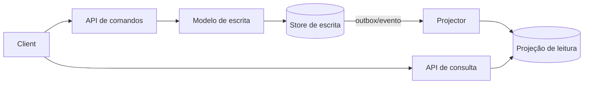
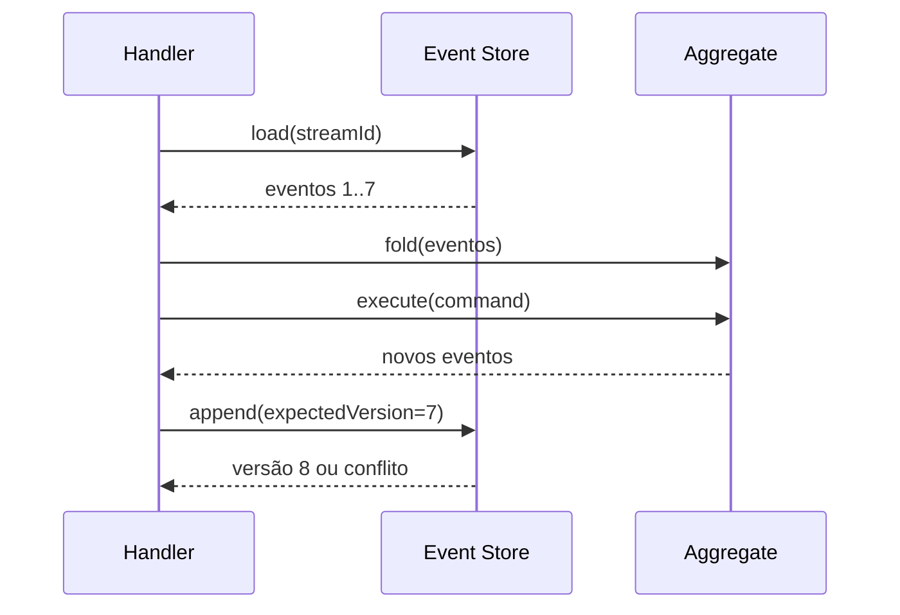

# CQRS e Event Sourcing

CQRS e Event Sourcing resolvem problemas diferentes:

- **CQRS** separa os modelos/caminhos de comando e consulta quando suas necessidades divergem.
- **Event Sourcing (ES)** persiste eventos de domínio como fonte de verdade e deriva o estado atual por fold/projeção.

Eles podem coexistir, mas um não exige o outro. Adotar ambos por padrão adiciona consistência eventual, armazenamento, evolução e operação sem benefício garantido.

## CQRS

### Problema e componentes

Um modelo único pode ficar preso entre escrita rica em invariantes e leituras denormalizadas, filtros, busca ou escala muito diferentes.



Separação pode ser apenas classes/objetos no mesmo banco, ou stores/processos distintos. Comece logicamente; distribua apenas por escala/autonomia comprovada.

### Consistência e UX

Após um comando aceito, a projeção pode estar atrasada. Opções:

- resposta inclui a nova representação/versão;
- read-your-writes roteia temporariamente à fonte de escrita;
- cliente aguarda `projection_version >= command_version` com timeout;
- UI mostra estado pendente e converge;
- operação que exige consistência lê o write model.

Defina SLA de frescor e comportamento sob lag; “eventual” não significa “um dia”.

### Quando usar/evitar

**Use:** leitura e escrita têm modelos, escala, segurança ou otimização claramente assimétricos; projeções especializadas têm valor.

**Evite:** CRUD simples, equipe sem operação de projeções, ou requisitos que demandam toda leitura imediatamente consistente. CQRS com dois bancos duplica modelos, falhas, migração e monitoramento.

## Event Sourcing

### Modelo

Um stream por agregado contém fatos imutáveis ordenados. O estado é `fold(events)`. Um append usa a versão esperada para concorrência otimista.

```text
OrderPlaced(v1) → ItemAdded(v2) → PaymentAuthorized(v3) → OrderConfirmed(v4)
fold([e1..e4]) = Order(status=CONFIRMED, version=4)
```



Eventos de domínio armazenados são parte do contrato histórico. Não são logs técnicos nem snapshots. Snapshot é cache de reconstrução: o stream continua sendo a verdade e precisa ser validado.

### Concorrência e invariantes

`append(stream, expectedVersion, events)` falha se outro writer avançou o stream. O handler recarrega e decide se pode reaplicar; retry cego pode violar intenção. Invariantes que atravessam agregados exigem reserva, processo/saga ou modelo de limite diferente—ES não cria transação global.

### Evolução de eventos

Nunca “editar passado” casualmente. Estratégias:

- **upcasting:** traduz versão antiga ao ler;
- **eventos corretivos:** preservam auditabilidade;
- **nova projeção:** interpreta todas as versões;
- **transformação/migração de stream:** excepcional, versionada, reconciliada e auditada.

Mantenha fixture de streams históricos (“golden masters”) e teste que a versão atual os reidrata. Separe schema estrutural de significado semântico.

### Projeções e rebuild

Projectors são consumidores idempotentes; checkpoint + atualização da projeção devem ser atômicos. Para rebuild, crie `orders_view_v2`, leia desde zero, monitore lag/erros, compare invariantes, troque alias e retenha v1 até segurança. Bloqueie efeitos externos durante replay.

### Quando usar/evitar

**Use:** histórico completo tem valor de negócio/auditoria; regras temporais e explicabilidade são centrais; reconstruir novas visões é benefício real; domínio naturalmente fala em fatos.

**Evite:** CRUD, payloads grandes e mutáveis, obrigação de exclusão incompatível sem desenho, baixa maturidade operacional, ou quando audit log tradicional atende. ES torna debugging histórico poderoso, mas exige ferramentas para inspeção, correção, replay e privacidade.

## Trade-offs combinados

| Benefício | Preço |
| --- | --- |
| auditoria temporal e novas projeções | evolução permanente de eventos |
| escrita otimizada a invariantes | leituras assíncronas e UX de staleness |
| reconstrução/explicabilidade | replay, snapshots e tooling |
| concorrência por versão | conflitos e agregados bem delimitados |

## Testes

- Given eventos históricos / When comando / Then novos eventos ou rejeição;
- propriedades: fold determinístico, versão monotônica, invariantes preservadas;
- fixtures de todas as versões históricas;
- concorrência: dois writers com mesma versão esperada;
- projector: duplicidade, lacuna, fora de ordem, restart no checkpoint;
- rebuild e switch de projeção ensaiados com volume realista;
- restauração do event store e verificação de checksum.

## Observabilidade, deployment e segurança

Meça append latency/conflitos, tamanho e idade do stream, tempo de reidratação, checkpoint/lag de cada projeção, eventos desconhecidos e rebuild ETA. Traces ligam comando → evento → projeção por causation/correlation IDs.

Deploy de nova versão primeiro torna leitores compatíveis, depois publica novos eventos. Faça canary de projector e dual-read de projeções. Event store requer append-only autorizado, criptografia, backup imutável, controle de acesso por stream/tenant e trilha de acesso. Minimize segredo/PII; imutabilidade não revoga legislação de privacidade.

## Anti-patterns

- CRUD codificado como `FieldChanged` sem evento de domínio;
- consultar projeção eventualmente consistente para validar invariante de escrita;
- um stream global para todo sistema;
- snapshot tratado como verdade e evento antigo descartado sem política;
- `upcaster` dependendo de rede/banco mutável;
- replay que repete efeitos externos;
- CQRS “dois bancos” onde uma tabela normalizada resolveria;
- event store construído internamente sem necessidade de domínio.

## Projeto prático

Modele uma carteira com `AccountOpened`, `FundsReserved`, `ReservationReleased` e `DebitSettled`. Implemente append com versão esperada, idempotência por command ID, snapshot a cada N eventos e duas projeções. Injete duplicidade e conflito; reconstrua `balance_v2`; prove saldo/invariantes por propriedade. Discuta por que dinheiro real também exige ledger de partidas dobradas, reconciliação e controles regulatórios.

## Referências

- Fowler. [CQRS](https://martinfowler.com/bliki/CQRS.html).
- Fowler. [Event Sourcing](https://martinfowler.com/eaaDev/EventSourcing.html).
- Microsoft. [CQRS pattern](https://learn.microsoft.com/en-us/azure/architecture/patterns/cqrs).
- Microsoft. [Event Sourcing pattern](https://learn.microsoft.com/en-us/azure/architecture/patterns/event-sourcing).
- Young. [CQRS Documents](https://cqrs.files.wordpress.com/2010/11/cqrs_documents.pdf).

---

[← Event-driven](../event-driven/README.md) · [↑ Índice](../README.md) · [ADRs →](../decision-records.md)
