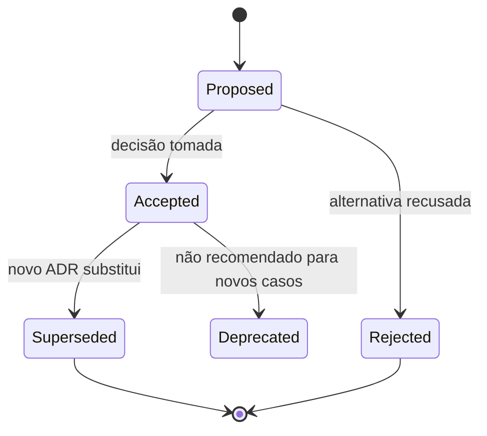

# Architecture Decision Records (ADR)

Um ADR preserva uma decisão arquitetural significativa junto de seu **contexto, alternativas e consequências**. Ele não congela a arquitetura: torna explícito por que uma escolha fazia sentido e como substituí-la com responsabilidade.

O template do repositório está em [`../templates/adr.md`](../templates/adr.md).

## Quando registrar

Registre escolhas caras de reverter ou que afetam várias pessoas: limites de módulos/serviços, armazenamento, protocolo, consistência, identidade, observabilidade, estratégia de deploy e exceções a padrões.

Não crie ADR para formatação, dependência trivial ou decisão já imposta sem alternativa relevante. Se uma restrição externa determina tudo, registre-a apenas quando a memória do contexto for valiosa.

## Modelo mental: decisão é hipótese contextual

Um ADR não diz “esta tecnologia é a melhor”. Ele diz: **dadas estas forças, alternativas e evidências disponíveis neste momento, escolhemos este caminho e aceitamos estas consequências**.

Isso permite que outra pessoa revise a escolha quando o contexto mudar sem precisar adivinhar a motivação original.

```text
contexto + drivers + alternativas
              ↓
            decisão
              ↓
 consequências + validação
              ↓
       evidência em produção
              ↓
 manter / revisar / substituir
```

A arquitetura fica mais saudável quando decisões importantes têm gatilho de revisão, não validade infinita.

## Ciclo de vida



Nunca apague ou reescreva silenciosamente um ADR aceito. Corrija erros menores com histórico; para mudar a decisão, crie outro ADR e conecte `supersedes` / `superseded by`.

## Estrutura recomendada

```markdown
# ADR-004: Usar outbox para publicação de eventos de pedidos

- Status: Accepted
- Date: 2026-08-21
- Owners: Orders team
- Supersedes: none

## Context
Qual força e restrição exigem uma decisão? Inclua evidência e qualidade mensurável.

## Decision
O que faremos, em qual escopo e a partir de quando?

## Alternatives
Quais opções viáveis foram comparadas e por que não foram escolhidas?

## Consequences
Benefícios, custos, riscos, trabalho operacional e efeitos de segunda ordem.

## Validation
Fitness function, métrica, experimento e gatilho/data para revisão.
```

O template mínimo pedido pelo Alexandria contém Context, Decision, Alternatives e Consequences; os metadados e Validation são extensões úteis, não burocracia obrigatória.

## Drivers e evidência

Contexto bom contém fatos que realmente discriminam alternativas:

- SLO e volume;
- RPO/RTO;
- topologia de equipe;
- limite regulatório;
- custo operacional;
- benchmark;
- incidentes anteriores;
- dependências existentes;
- prazo e capacidade de migração.

Evite escrever “Kafka escala melhor” sem dizer qual volume/replay exige Kafka. Evite “PostgreSQL é mais simples” sem dizer qual transação, equipe ou operação torna simplicidade relevante.

Se não há dados suficientes, registre hipótese: “esperamos até 2 mil writes/s no horizonte de 12 meses; revisar se >8 mil”. Hipótese explícita envelhece melhor que certeza inventada.

## Processo leve

1. Autor abre ADR como `Proposed` antes de a decisão estar consolidada.
2. Pessoas afetadas revisam contexto, alternativas e consequências; comentários ficam no PR.
3. Owner explícito resolve discordâncias e marca `Accepted` ou `Rejected`.
4. Código, diagrama e runbook apontam para o ADR; o ADR aponta para evidência estável, não para chat efêmero.
5. Fitness function e data/gatilho provocam revisão.

Prefira um documento curto que permite decidir. Benchmarks, ameaça detalhada e protótipos podem ser anexos/referências.

## Como escrever bem

- Título é uma decisão: “Usar outbox…”, não “Mensageria”.
- Contexto descreve forças sem antecipar a solução: volume, SLO, ownership, restrição regulatória.
- Alternativas são plausíveis, incluindo “não mudar”. Não construa uma opção-palha.
- Consequências têm sinal positivo e negativo; inclua migração, segurança, custo e operação.
- Escopo diz onde a decisão **não** se aplica.
- Quantifique: p99, RPO, custo mensal, janela de compatibilidade, pessoas on-call.

## Consequências de segunda ordem

Uma decisão frequentemente produz efeitos além do objetivo inicial.

Exemplo: adotar Kafka para replay pode trazer:

- schema governance;
- partition planning;
- capacidade/on-call;
- retenção de PII;
- novos dashboards;
- custos de rede/storage;
- necessidade de idempotência nos consumers.

ADR intermediário não precisa prever tudo, mas deve mostrar que a decisão cria responsabilidades. “Escolhemos X porque é escalável” é muito menos útil que “ganhamos replay por consumer group e aceitamos operar partitions, retenção e schema”.

## Exemplo condensado

### Context

Pedidos grava estado no PostgreSQL e publica `OrderPlaced`. A escrita dupla perdeu 3 eventos em testes de kill entre commit e publish. O fluxo aceita até 60 s de atraso, deve tolerar redelivery e não pode usar transação distribuída com o broker.

### Decision

Persistir evento em `orders_outbox` na mesma transação do pedido. Um relay publica com at-least-once; consumidores deduplicam por `event_id`. Retenção de outbox publicada: 14 dias.

### Alternatives

- Publicar antes do commit: consumidor pode observar pedido inexistente.
- Publicar depois: mantém a janela de perda observada.
- 2PC: broker/stack e operação não oferecem suporte aceitável.
- CDC: viável, mas a equipe ainda não opera a plataforma; reavaliar com >5 produtores.

### Consequences

Elimina a janela de perda entre duas escritas, não duplicidade. Adiciona relay, lag/SLO, limpeza, idempotência, alerta e reconciliação. O banco absorve mais escrita. Um teste de falha entre cada etapa e um alerta `oldest_unpublished_age > 60s` validam a decisão.

## Validation e fitness functions

Toda decisão importante deveria ter alguma forma de confronto com realidade.

Exemplos:

- decisão de cache: p99 cai sem ultrapassar staleness permitido;
- decisão de microservice: lead time/autonomia melhora e SLO permanece;
- decisão de banco: teste de carga suporta pico com margem;
- decisão de multi-region: failover drill cabe no RTO;
- decisão de modularidade: CI bloqueia import cruzado.

Se não há forma de validar, talvez a consequência esteja vaga demais.

## Gatilhos de revisão

Inclua algo como:

- revisar após 6 meses;
- revisar quando tráfego ultrapassar 5 mil req/s;
- revisar quando houver segunda região;
- revisar se mais de três equipes precisarem coordenar releases;
- revisar se custo superar R$ X/mês;
- revisar após incidente ligado à decisão.

Isso evita tanto dogma quanto revisão constante sem motivo.

## ADR e incidentes

Incidentes são fonte de evidência arquitetural. Depois de um evento, não reescreva o ADR antigo para parecer que a decisão sempre foi ruim. Crie novo contexto:

1. qual hipótese falhou?
2. qual consequência não foi prevista?
3. a decisão continua válida com novo controle?
4. precisa ser superseded?

Preservar história permite aprender sem apagar contexto.

## ADR e segurança

Decisões de identidade, criptografia, exposição de APIs e armazenamento precisam registrar threat assumptions e consequências operacionais. Não coloque secrets nem dados sensíveis no ADR. Referencie threat model quando necessário.

Exemplo: “usar JWT de 15 min” precisa considerar revogação, audience, key rotation e impacto de comprometimento, não apenas conveniência do framework.

## Organização e navegação

- numere de forma monotônica: `0004-use-transactional-outbox.md`;
- um índice lista status, título, owner e substituição;
- mantenha ADR perto do código afetado ou em `docs/adr/`, mas escolha uma convenção única;
- links relativos conectam decisões dependentes;
- IDs nunca são reutilizados, mesmo para ADR rejeitado.

## Anti-patterns

- **arqueologia reversa:** ADR escrito depois para justificar decisão já tomada;
- **catálogo de tecnologia:** descreve Kafka, mas não registra uma escolha/contexto;
- **só benefícios:** esconde custo operacional e migração;
- **cemitérios Proposed:** nenhum owner ou prazo decide;
- **imutabilidade absoluta:** erro factual não pode ser corrigido e links apodrecem;
- **aprovação central:** comitê distante vira gargalo para toda decisão local;
- **sem validação:** hipótese nunca confrontada com produção;
- **ADR para tudo:** decisões triviais criam ruído e fazem as importantes desaparecerem.

## Laboratório

Escolha uma decisão real, como “PostgreSQL versus DynamoDB para idempotency store”.

1. Liste drivers e restrições mensuráveis.
2. Inclua “não criar novo datastore” como alternativa.
3. Faça pequeno benchmark ou experimento de concorrência.
4. Registre custo operacional e segurança.
5. Escreva ADR `Proposed`.
6. Peça revisão adversarial de alguém que prefira outra opção.
7. Aceite/rejeite com base em evidência.
8. Crie uma fitness function ligada à decisão.
9. Simule mudança de requisito e escreva ADR que supersede o primeiro sem apagá-lo.

## Checklist de revisão

- A decisão e o escopo cabem em uma frase?
- Drivers são verificáveis e alternativas são reais?
- Dados, segurança, entrega, operação e reversibilidade aparecem?
- Existe owner e mecanismo para medir sucesso?
- O gatilho de substituição está claro?
- Um novo integrante entenderá “por quê” sem abrir o código histórico?
- Quais hipóteses poderiam invalidar esta decisão?

## Referências

- Michael Nygard. [Documenting Architecture Decisions](https://cognitect.com/blog/2011/11/15/documenting-architecture-decisions).
- ADR GitHub organization. [ADR resources](https://adr.github.io/).
- Joel Parker Henderson. [Architecture Decision Record repository](https://github.com/joelparkerhenderson/architecture-decision-record).
- Thoughtworks Technology Radar. [Lightweight Architecture Decision Records](https://www.thoughtworks.com/radar/techniques/lightweight-architecture-decision-records).

---

[← CQRS + Event Sourcing](cqrs-event-sourcing/README.md) · [↑ Índice](README.md) · [Exercícios →](exercises.md)
