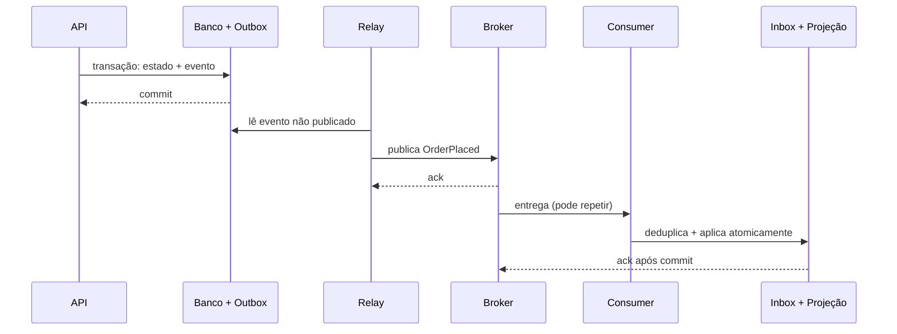

# Arquitetura orientada a eventos

Um evento registra algo relevante que **já aconteceu**. Produtores publicam fatos; consumidores decidem suas reações. Isso desacopla tempo e fan-out, mas troca o raciocínio de chamada/resposta por entrega, ordem, duplicidade, schema, atraso e reconstrução.

## Primeiro: qual forma de “evento”?

| Forma | Conteúdo | Acoplamento | Uso típico |
| --- | --- | --- | --- |
| Notificação | identidade + fato mínimo | consumidor consulta produtor | poucos consumidores, dado atual necessário |
| Event-carried state transfer | fato + estado necessário | consumidor mantém projeção local | autonomia de leitura e menor acoplamento temporal |
| Streaming | sequência particionada e reprocessável | consumidores calculam continuamente | analytics, integrações, materializações |
| Comando assíncrono | pedido dirigido a um dono | remetente conhece intenção/receptor lógico | trabalho demorado ou amortecido |

Não nomeie comando no passado (`CreateInvoiceRequested` não é fato concluído). Eventos usam linguagem de domínio e não presumem consumidor: `OrderPlaced`, não `SendEmail`.

## Componentes e fluxo confiável



Outbox fecha a lacuna “gravei estado, falhei antes de publicar”. Ela normalmente oferece **at-least-once**; consumidores ainda precisam idempotência. Inbox registra `event_id` junto do efeito local. Efeitos externos exigem chave idempotente do provedor ou reconciliação.

## Contrato de evento

Envelope mínimo, sem colocar todo o domínio:

```json
{
  "event_id": "01J...",
  "event_type": "commerce.order.placed.v1",
  "occurred_at": "2026-08-21T13:30:00Z",
  "producer": "orders",
  "correlation_id": "...",
  "aggregate_id": "order-123",
  "aggregate_version": 7,
  "data": { "order_id": "order-123", "total_cents": 2590, "currency": "BRL" }
}
```

Defina tipos, unidade, nulabilidade, significado, classificação de dados, chave de partição e compatibilidade. Schema Registry valida forma; revisão semântica ainda é humana. Prefira evolução aditiva, defaults significativos e eventos novos para mudança semântica.

## Ordenação, particionamento e tempo

Ordem global costuma custar escala e disponibilidade. Particione por agregado quando apenas a ordem do pedido importa. `aggregate_version` detecta lacuna/fora de ordem. Horário de ocorrência e horário de processamento são diferentes; relógios distribuídos não estabelecem causalidade total.

Consumidores devem decidir: bufferizar uma lacuna, consultar fonte, reprocessar, ou rejeitar. Documente o comportamento em vez de assumir ordenação do broker.

## Entrega, retries e backpressure

- confirme (ack) apenas após efeito durável;
- retry com backoff, jitter e limite; preserve erro/classificação;
- mensagens inválidas não melhoram com retry: quarentena/DLQ + ferramenta de inspeção e redrive;
- limite concorrência e faça pause quando dependências saturam;
- monitore lag em **tempo e quantidade**, idade da mensagem mais antiga e taxa de redelivery;
- retenção deve cobrir pior indisponibilidade e replay planejado.

DLQ não é lixeira: precisa owner, alerta, dado seguro, procedimento de correção/redrive e prevenção de ordem inválida.

## Vantagens, desvantagens e decisão

| Vantagem | Custo / risco |
| --- | --- |
| desacoplamento temporal e fan-out | consistência eventual e fluxo implícito |
| absorção de picos | lag, backpressure e capacidade de retenção |
| consumidores evoluem separadamente | contratos e semântica precisam governança |
| replay/auditoria quando log é retido | efeitos duplicados e reprocessamento perigoso |

**Use quando:** reações podem ser assíncronas; vários consumidores independentes; picos precisam buffer; histórico/replay tem valor.

**Não use quando:** usuário precisa confirmação forte imediata; fluxo é curto e síncrono; equipe não opera broker, schemas e incidentes; “desacoplamento” apenas esconde dependência obrigatória.

## Testes

- serializer/schema e compatibilidade no CI;
- produtor prova que publica o fato correto após commit;
- consumidor prova idempotência, fora de ordem e versão desconhecida;
- integração com broker real para ack, retry e rebalance;
- replay em ambiente isolado com efeitos externos bloqueados;
- caos: matar entre efeito e ack, indisponibilizar dependência, saturar partição.

## Observabilidade e segurança

Propague `traceparent`, mas não confie que uma única trace sobreviva a retenção longa; use correlation/causation IDs. Métricas: publish rate/error, consumer rate/error, lag/idade, retries, DLQ, tamanho de payload e tempo até efeito de negócio.

Autentique produtores/consumidores, autorize por tópico, criptografe transporte/repouso, minimize PII e defina retenção/eliminação. Eventos imutáveis conflitam com direito de exclusão: armazene referência/tokenização, criptografia com destruição de chave ou eventos redigidos conforme a obrigação—com revisão jurídica.

## Evolução e migração

Para introduzir eventos em sistema existente: use outbox + CDC/relay, publique sombra, compare projeção com fonte, habilite consumidores por etapa e só então remova leitura antiga. Rebuilds usam uma nova versão de projeção em paralelo; troque alias após reconciliar contagens, checksums e invariantes.

## Anti-patterns

- **dual write:** gravar banco e broker separadamente;
- evento genérico `EntityUpdated` com payload opaco;
- tópico compartilhado sem dono e sem schema;
- consumidor não idempotente sob “exactly once” do broker;
- coreografia longa sem visão de estado, timeout e compensação;
- evento consultando o produtor para quase todo dado (acoplamento temporal reaparece);
- replay em produção disparando emails/cobranças novamente.

## Referências

- Fowler. [What do you mean by “Event-Driven”?](https://martinfowler.com/articles/201701-event-driven.html).
- AWS. [Transactional Outbox](https://docs.aws.amazon.com/prescriptive-guidance/latest/cloud-design-patterns/transactional-outbox.html).
- CloudEvents. [Specification](https://cloudevents.io/).
- AsyncAPI. [Specification](https://www.asyncapi.com/docs/reference/specification/latest).
- Hohpe & Woolf. *Enterprise Integration Patterns*. [Catalog](https://www.enterpriseintegrationpatterns.com/).

---

[← Clean + Hexagonal](../clean-hexagonal/README.md) · [↑ Índice](../README.md) · [CQRS + Event Sourcing →](../cqrs-event-sourcing/README.md)
