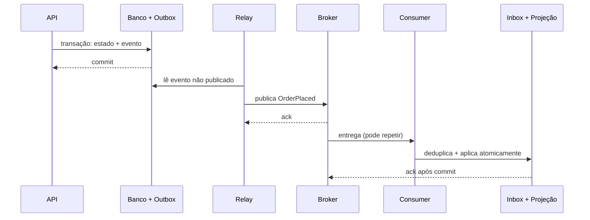

# Arquitetura orientada a eventos

Arquitetura orientada a eventos resolve um problema recorrente: permitir que uma
capacidade anuncie um fato e outras capacidades reajam **sem exigir que todas
estejam disponíveis, conhecidas e sincronizadas naquele instante**. Esse
benefício cobra um preço: o fluxo deixa de ser uma pilha síncrona fácil de seguir
e passa a depender de entrega, ordem, duplicidade, schema, atraso, replay e
reconciliação.

Um evento registra algo relevante que **já aconteceu**. Produtores publicam
fatos; consumidores decidem suas reações. Se a mensagem pede que um destinatário
faça algo, ela é mais próxima de comando assíncrono que de evento de domínio.

## Modelo mental: fatos propagam estado no tempo

Em chamada síncrona, o caller espera uma resposta agora. Em evento, o produtor
confirma apenas o que controla e publica uma evidência durável para o restante do
sistema reagir depois.

```text
transação local → fato durável → publicação → entrega → efeitos locais → convergência
```

A consequência principal é que o sistema pode ficar em estados intermediários.
Isso não é necessariamente erro. O design precisa dizer **quais estados são
aceitáveis, por quanto tempo e como detectamos quando a convergência parou**.

## Primeiro: qual forma de “evento”?

| Forma | Conteúdo | Acoplamento | Uso típico |
| --- | --- | --- | --- |
| Notificação | identidade + fato mínimo | consumidor consulta produtor | poucos consumidores, dado atual necessário |
| Event-carried state transfer | fato + estado necessário | consumidor mantém projeção local | autonomia de leitura e menor acoplamento temporal |
| Streaming | sequência particionada e reprocessável | consumidores calculam continuamente | analytics, integrações, materializações |
| Comando assíncrono | pedido dirigido a um dono | remetente conhece intenção/receptor lógico | trabalho demorado ou amortecido |

Não nomeie comando no passado (`CreateInvoiceRequested` não é fato concluído).
Eventos usam linguagem de domínio e não presumem consumidor: `OrderPlaced`, não
`SendEmail`.

## Evento de domínio versus evento de integração

Um evento de domínio expressa algo relevante dentro do modelo. Um evento de
integração é o contrato publicado para outras fronteiras. Eles podem coincidir,
mas não precisam.

Separar os dois permite:

- manter detalhes internos fora do contrato público;
- traduzir nomes e payloads;
- remover PII desnecessária;
- manter compatibilidade enquanto o domínio interno evolui.

Publicar diretamente toda alteração de entidade transforma o modelo interno em
API distribuída e aumenta acoplamento.

## Fluxo confiável com outbox

O problema clássico é o dual write:

1. aplicação grava pedido no banco;
2. tenta publicar evento;
3. processo cai entre as duas operações.

O estado existe, mas o evento foi perdido.



Outbox fecha a lacuna “gravei estado, falhei antes de publicar”. Ela normalmente
oferece **at-least-once**. O relay pode publicar e cair antes de marcar o item
como enviado. Consumidores ainda precisam idempotência.

Inbox registra `event_id` junto do efeito local. Efeitos externos, como email ou
pagamento, exigem chave idempotente do provedor ou reconciliação.

## Garantias: declare a fronteira

Antes de implementar, documente:

- delivery: at-most-once ou at-least-once?
- ordering: global, por partição, por aggregate ou nenhuma?
- retenção: por quanto tempo replay é possível?
- durability: quando o broker considera uma mensagem confirmada?
- freshness: qual atraso máximo é aceitável?
- schema compatibility: quais versões convivem?

“Exactly once” precisa sempre completar a frase: exatamente uma vez **onde**?
Um broker pode evitar duplicidade dentro de sua transação, mas não controla um
email, webhook ou API externa fora da fronteira.

## Contrato de evento

Envelope mínimo, sem colocar todo o domínio:

```json
{
  "event_id": "01J...",
  "event_type": "commerce.order.placed.v1",
  "occurred_at": "2026-08-21T13:30:00Z",
  "producer": "orders",
  "correlation_id": "...",
  "causation_id": "...",
  "aggregate_id": "order-123",
  "aggregate_version": 7,
  "data": {
    "order_id": "order-123",
    "total_cents": 2590,
    "currency": "BRL"
  }
}
```

Defina tipos, unidade, nulabilidade, significado, classificação de dados, chave
de partição e compatibilidade. Schema Registry valida forma; revisão semântica
ainda é humana.

## Evolução de schema

Prefira mudanças aditivas. Adicionar campo opcional costuma ser mais simples que
renomear ou mudar significado.

Estratégias:

- consumidor ignora campo desconhecido;
- produtor mantém campo antigo durante transição;
- novo evento quando a semântica realmente muda;
- upcaster/adapter em fronteira controlada;
- contratos versionados com janela explícita de compatibilidade.

O maior risco não é JSON inválido. É campo com o mesmo nome e significado novo.
Compatibilidade sintática não garante compatibilidade semântica.

## Ordenação e particionamento

Ordem global custa escala e disponibilidade. Pergunte qual entidade realmente
precisa de ordem.

Para pedido, particionar por `order_id` permite preservar ordem local enquanto
pedidos diferentes processam em paralelo.

`aggregate_version` ajuda a detectar:

- lacuna;
- duplicidade;
- mensagem fora de ordem.

O consumidor precisa decidir o que faz diante da lacuna: bufferiza, consulta a
fonte, reprocessa ou rejeita. Não dependa de “o broker deve entregar certo” sem
documentar a garantia.

## Tempo de evento e tempo de processamento

`occurred_at` representa quando o fato ocorreu. O consumidor pode processá-lo
segundos ou horas depois.

Em analytics e streaming, isso muda janelas e agregações. Um evento atrasado pode
pertencer a uma janela já fechada. Watermarks e políticas de lateness tornam essa
decisão explícita.

Relógio físico não estabelece causalidade total entre serviços. Correlation e
causation IDs ajudam a reconstruir relação lógica.

## Idempotência do consumidor

Um consumer correto sob at-least-once precisa tolerar redelivery.

Opções:

- inbox com `event_id` único;
- conditional update por version;
- operação naturalmente idempotente;
- chave idempotente no downstream;
- recomputar projeção a partir de fonte durável.

Deduplicação em memória não basta se o processo reinicia.

## Retry e poison messages

Erros transitórios podem receber retry com backoff e jitter. Erros permanentes,
como schema inválido, não melhoram com 10 mil tentativas.

Classifique:

- transient dependency failure;
- rate limit;
- timeout ambíguo;
- payload inválido;
- versão desconhecida;
- violação de regra local.

DLQ/quarentena precisa de owner, alerta, ferramenta de inspeção, retenção e
procedimento seguro de redrive. Ela não é cemitério.

## Backpressure e overload

Broker absorve picos, não cria capacidade infinita. Se chegada permanece maior
que processamento, lag cresce.

Meça:

- producer rate;
- consumer rate;
- lag em quantidade;
- **idade da mensagem mais antiga**;
- queue depth;
- retry rate;
- DLQ rate;
- saturation de dependências.

Autoscaling baseado apenas em número de mensagens pode reagir mal a mensagens com
custos muito diferentes. Tempo por item e idade ajudam a modelar capacidade.

## Replay

Replay é um dos maiores benefícios e também um dos maiores riscos.

Antes de reprocessar:

1. defina range/offset;
2. garanta idempotência;
3. bloqueie efeitos externos não repetíveis;
4. limite taxa para não derrubar dependências;
5. monitore progresso;
6. mantenha forma de interromper;
7. reconcilie estado final.

Replay em produção que envia novamente emails ou cobranças é um anti-pattern
operacional grave.

## Coreografia versus orquestração

Em coreografia, cada consumidor reage a eventos e publica próximos fatos. O fluxo
emerge da composição.

Vantagens:

- autonomia;
- menos coordenador central;
- extensibilidade por novos consumidores.

Custos:

- estado global difícil de visualizar;
- timeouts/compensações espalhados;
- debugging de jornada complexo.

Orquestração mantém um estado explícito do workflow. Introduz um coordenador, mas
torna progresso, retry e compensação mais visíveis.

Fluxos longos precisam de visão de estado independentemente do estilo.

## Consistência eventual e UX

Se uma projeção atrasa, o usuário pode:

- ver estado “processando”;
- receber representação retornada pelo comando;
- fazer read-your-writes em fonte mais forte;
- esperar versão mínima;
- aceitar dado stale com indicador.

A UX precisa participar da arquitetura. “Eventual” não é permissão para estado
inexplicável.

## Performance e capacidade

Dimensione o sistema a partir do fluxo:

- eventos por segundo;
- tamanho médio e p99 de payload;
- partitions/shards;
- tempo de processamento;
- retenção;
- replay worst-case;
- crescimento de storage;
- fan-out por evento.

Se cada evento dispara cinco consumidores e cada consumer faz três calls, o custo
real é muito maior que a taxa do producer.

## Observabilidade

Propague `traceparent` quando fizer sentido, mas não suponha que uma única trace
sobrevive a retenção longa. Use também correlation e causation IDs.

Métricas:

- publish rate/error/latency;
- ack latency;
- consumer rate/error;
- lag e idade;
- redelivery;
- retry;
- DLQ;
- tamanho de payload;
- tempo evento → efeito de negócio.

Um dashboard por jornada é mais útil que apenas dashboards por broker.

## Segurança e privacidade

Eventos atravessam mais sistemas que uma chamada síncrona direta. Minimize dados.

Controles:

- autenticação de produtores/consumidores;
- autorização por topic/stream;
- criptografia;
- schema policy;
- retenção proporcional;
- auditoria;
- segregação por tenant;
- prevenção de PII desnecessária.

Eventos imutáveis podem conflitar com obrigações de exclusão. Estratégias incluem
referência indireta, tokenização, destruição de chave e eventos redigidos, sempre
conforme requisitos jurídicos e de dados.

## Modos de falha

### Producer commitou, relay parou

Outbox cresce. Estado de negócio existe, efeitos assíncronos atrasam. Monitore
idade da outbox e reinicie/repare relay sem perder idempotência.

### Consumer faz efeito e cai antes do ack

Mensagem reaparece. Inbox/idempotency precisa impedir duplicação.

### Uma partition fica quente

Lag concentra em uma chave. Investigue partition key e workload. Adicionar
consumers não ajuda quando ordering exige uma única partition.

### Schema novo quebra consumer antigo

Pause rollout, restaure compatibilidade, reprocese mensagens incompatíveis em
quarentena e melhore contract tests.

### Broker volta após outage

Consumers podem criar thundering herd e sobrecarregar banco. Faça ramp-up e
limite concorrência.

## Testes

- serializer/schema e compatibilidade no CI;
- produtor prova que publica o fato correto após commit;
- consumer prova idempotência;
- duplicidade e fora de ordem;
- versão desconhecida;
- integração com broker real para ack/retry/rebalance;
- replay em ambiente isolado;
- fault injection entre efeito e ack;
- saturation de dependency;
- recovery após backlog grande.

## Laboratório progressivo

### Beginner

Implemente producer e consumer simples. Duplique manualmente um evento e observe o
efeito incorreto antes de adicionar idempotência.

### Intermediate

Adicione outbox e inbox. Mate producer depois do commit e consumer depois do
efeito. Prove que não há perda nem duplicação do efeito lógico.

### Advanced

Particione por aggregate. Injete mensagem fora de ordem e uma lacuna. Implemente
política explícita para cada caso e monitore lag em tempo.

### Expert

Crie backlog grande, derrube dependência, recupere broker e execute replay. Use
rate limit, autoscaling, DLQ, dashboards e runbook. Meça quanto tempo o sistema
leva para voltar ao SLO sem provocar nova cascata.

## Projeto de síntese

Modele `OrderPlaced → PaymentAuthorized → OrderConfirmed → FulfillmentRequested`.

Requisitos:

1. estado + outbox atômicos;
2. schemas versionados;
3. consumers idempotentes;
4. order por `order_id`;
5. saga com timeout/compensação;
6. DLQ operável;
7. replay seguro;
8. SLO de tempo evento → efeito;
9. canary de nova versão de consumer;
10. ADR justificando onde **não** usar evento.

## Quando usar e quando evitar

**Use quando:** reações podem ser assíncronas; vários consumidores independentes;
picos precisam buffer; histórico/replay tem valor; autonomy compensa operação.

**Evite quando:** usuário precisa confirmação forte imediata; fluxo é curto e
síncrono; equipe não opera broker/schemas; consistência eventual viola a
invariante; “desacoplamento” apenas esconde dependência obrigatória.

## Anti-patterns

- dual write banco + broker;
- evento `EntityUpdated` opaco;
- tópico sem owner;
- consumidor não idempotente confiando em “exactly once”;
- coreografia longa sem estado visível;
- evento consultando produtor para quase todo dado;
- replay com efeitos externos ativos;
- payload contendo PII “porque pode ser útil depois”;
- dezenas de microeventos técnicos para uma única mudança de domínio.

## Referências

- Fowler. [What do you mean by “Event-Driven”?](https://martinfowler.com/articles/201701-event-driven.html).
- AWS. [Transactional Outbox](https://docs.aws.amazon.com/prescriptive-guidance/latest/cloud-design-patterns/transactional-outbox.html).
- CloudEvents. [Specification](https://cloudevents.io/).
- AsyncAPI. [Specification](https://www.asyncapi.com/docs/reference/specification/latest).
- Hohpe & Woolf. *Enterprise Integration Patterns*. [Catalog](https://www.enterpriseintegrationpatterns.com/).

---

[← Clean + Hexagonal](../clean-hexagonal/README.md) · [↑ Índice](../README.md) · [CQRS + Event Sourcing →](../cqrs-event-sourcing/README.md)
