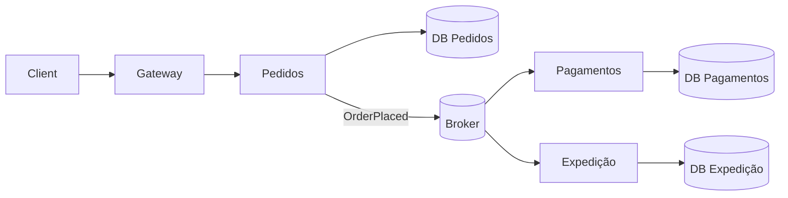

# Microsserviços

Microsserviços são serviços **independentemente implantáveis**, alinhados a capacidades de negócio, com propriedade explícita de dados e operação. “Pequeno” é contextual; autonomia e limites são mais importantes que contagem de endpoints.

## Problema e contexto

Um único deployável pode limitar equipes ou cargas que precisam evoluir, escalar e falhar separadamente. Dividir o processo compra autonomia ao preço de rede, latência, segurança entre serviços, consistência distribuída, observabilidade e maior plataforma.

O limite deve seguir uma capacidade/Bounded Context e um proprietário. Separar `frontend-service`, `business-service` e `database-service` distribui camadas, não responsabilidades, e normalmente cria deploy coordenado.

## Componentes

- contrato síncrono (HTTP/gRPC) e/ou assíncrono versionado;
- armazenamento de propriedade exclusiva;
- pipeline de build/deploy e SLO do serviço;
- identidade de workload, autorização e gestão de segredos;
- telemetria correlacionada e runbook;
- plataforma comum: descoberta, configuração, entrega, observabilidade e políticas.

## Comunicação e consistência

Use chamada síncrona quando a resposta é necessária agora e a dependência cabe no orçamento de latência/disponibilidade. Use evento quando o produtor anuncia um fato e pode prosseguir sem confirmação imediata.

Para cada chamada remota defina timeout a partir do orçamento total, retry apenas para falhas transitórias e operações idempotentes, backoff com jitter, limite de concorrência e circuit breaker quando seus estados são observáveis. Multiplicar retries em várias camadas causa tempestade.

Cada serviço confirma apenas sua transação local. Fluxos multi-serviço usam:

- **outbox** para persistir estado + intenção de publicar atomicamente;
- **inbox/idempotência** para tolerar redelivery;
- **saga** orquestrada ou coreografada para etapas e compensações;
- reconciliação periódica para detectar divergência inevitável.

Não prometa “exactly once” de ponta a ponta sem definir o efeito externo; transporte exatamente-uma-vez não torna cobrança ou email exatamente uma vez.

## Vantagens e desvantagens

| Potencial ganho | Custo inevitável |
| --- | --- |
| deploy e ownership independentes | compatibilidade e coordenação de contratos |
| escala/tecnologia por workload | frota heterogênea e plataforma |
| isolamento de alguns tipos de falha | novas falhas de rede e cascatas |
| limites organizacionais claros | consistência eventual e reconciliação |

**Use quando:** capacidades e equipes têm limites maduros; autonomia/escala/isolamento têm evidência; entrega e observabilidade estão automatizadas.

**Não use quando:** produto e domínio ainda mudam rapidamente; equipe é pequena; transações globais são regra; não há capacidade de operar incidentes e contratos; um modular monolith atende os drivers.

## Decomposição

1. Faça event storming/domain analysis; identifique linguagem, invariantes e dono.
2. Analise mudança conjunta no histórico e dependências de dados.
3. Escolha um “seam” de baixo acoplamento e valor operacional claro.
4. Defina contrato, SLO, modelo de falhas e propriedade de dados.
5. Extraia com strangler e reconciliação; não faça rewrite total.

Tamanho: o serviço deve caber no entendimento e ownership de uma equipe, mas não ser tão fino que uma mudança de negócio exija uma transação e um release distribuídos por toda a frota.

## Testes

- testes de unidade/componente dentro do serviço;
- integração com banco/broker reais efêmeros;
- testes de contrato do provedor e consumidor em CI;
- E2E apenas para jornadas que atravessam fronteiras relevantes;
- testes de resiliência: atraso, timeout, resposta parcial, duplicidade, fora de ordem;
- smoke/canary e verificação de rollback em produção.

Mocks de outros serviços verificam sua suposição, não o contrato real. Combine stubs controlados com compatibilidade de schema/consumer-driven contracts.

## Observabilidade e operação

Propague trace context e correlação de negócio; registre resultado e latência sem vazar dados sensíveis. Monitore RED por serviço, saturação de pools, fila/lag, retries, circuit state e SLOs de jornada. Mantenha catálogo de serviços, proprietário, dependências, dashboards e runbooks.

Um serviço sem owner acionável ou sem capacidade de deploy/recovery independente é passivo operacional.

## Deployment e evolução de contratos

- backward/forward compatibility durante a janela de rollout;
- APIs aditivas antes de remoções; consumidores observados antes de sunset;
- migrações expand/contract e backfill com checkpoint;
- canary por tráfego/tenant e rollback automatizado;
- versionamento semântico sozinho não coordena sistemas em execução;
- eventos são contratos imutáveis: nova versão/novo evento quando a semântica muda.

## Segurança

Defina trust boundaries: autenticação externa não elimina autorização interna. Use identidade curta por workload, mTLS quando o risco justifica, least privilege em rede e dados, rotação de segredo, validação de input em toda fronteira e auditabilidade. Aumentar serviços aumenta superfície e inventário de dependências.

## Anti-patterns

- **distributed monolith:** release coordenado, chamadas em cadeia e schema compartilhado;
- serviço por entidade/tabela ou por camada técnica;
- chatty APIs e “n+1” remoto;
- banco compartilhado como contrato informal;
- broker usado como RPC sem timeout/ownership;
- fallback que devolve dado incorreto e mascara falha;
- service mesh adotado para resolver domínio e API ruins;
- “you build it, outra equipe runs it”.

## Projeto prático

Extraia Notificações de um monólito modular. Requisitos: outbox, consumidor idempotente, schema compatível, DLQ/quarentena, trace de origem, canary por tenant e reconciliação. Critério: matar o produtor após commit e o consumidor durante envio não perde nem duplica o efeito observável.

## Referências

- Newman. *Building Microservices*, 2nd ed. [O'Reilly](https://www.oreilly.com/library/view/building-microservices-2nd/9781492034018/).
- Newman. *Monolith to Microservices*. [O'Reilly](https://www.oreilly.com/library/view/monolith-to-microservices/9781492047834/).
- Fowler & Lewis. [Microservices](https://martinfowler.com/articles/microservices.html).
- Microsoft. [Microservices architecture style](https://learn.microsoft.com/en-us/azure/architecture/guide/architecture-styles/microservices).
- NIST. [Zero Trust Architecture — SP 800-207](https://csrc.nist.gov/publications/detail/sp/800-207/final).

---

[← Monólito modular](../modular-monolith/README.md) · [↑ Índice](../README.md) · [Clean + Hexagonal →](../clean-hexagonal/README.md)
