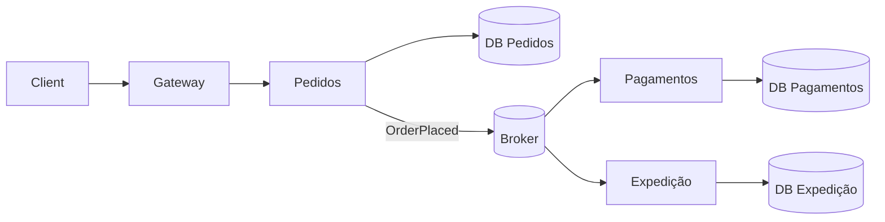

# Microsserviços

Microsserviços são serviços **independentemente implantáveis**, alinhados a
capacidades de negócio, com propriedade explícita de dados e operação. “Pequeno”
é contextual; autonomia e limites são mais importantes que contagem de endpoints.

O problema que esse estilo tenta resolver é permitir que partes de um produto
mudem, escalem e falhem de forma mais independente. O preço é trocar chamadas em
memória e transações locais por rede, contratos, observabilidade distribuída,
identidade entre workloads, consistência eventual e uma plataforma operacional
mais sofisticada.

## Modelo mental: distribuir é comprar autonomia com complexidade

Um monólito saudável compartilha processo, deploy e frequentemente banco. Isso
reduz custo de coordenação em runtime, mas pode aumentar coordenação entre equipes
quando o sistema cresce.

Microsserviços deslocam parte desse acoplamento:

```text
acoplamento de código/processo
        ↓
contratos + rede + dados + operação + organização
```

A distribuição só vale quando o novo tipo de acoplamento é mais barato para o
problema real.

## Drivers legítimos

Considere microsserviços quando existe evidência de um ou mais drivers:

- equipes precisam deploy independente com alta frequência;
- capacidades de negócio possuem ownership claro;
- workloads têm perfis de escala muito diferentes;
- requisitos de segurança/isolamento divergem;
- tecnologia especializada traz benefício mensurável;
- falha de uma capacidade precisa ser isolada;
- parte do sistema possui ciclo de vida muito diferente.

“Netflix usa” não é driver.

## Quando um monólito modular é melhor

Mantenha monólito quando:

- domínio ainda muda rápido;
- boundaries ainda são incertos;
- equipe é pequena;
- transações globais são frequentes;
- plataforma/observabilidade ainda são imaturas;
- custo operacional supera autonomia esperada.

Um monólito modular pode fornecer boundaries de código, ownership e testes sem
introduzir rede.

## Boundaries: capacidade antes de tabela

O limite deve seguir uma capacidade/Bounded Context e um proprietário.

Ruim:

- `users-service` só porque existe tabela users;
- `database-service`;
- `business-service`;
- serviço por camada MVC.

Melhor:

- Orders;
- Payments;
- Fulfillment;
- Loyalty.

Cada boundary deve possuir linguagem, invariantes e dados que façam sentido juntos.

## Conway e arquitetura sociotécnica

Arquitetura e organização se influenciam. Se cinco equipes precisam aprovar toda
mudança em um “microserviço independente”, o boundary técnico não produziu
autonomia.

Para cada serviço, defina:

- equipe dona;
- on-call;
- repositório/pipeline;
- SLO;
- dados;
- contratos;
- dependências;
- processo de decommissioning.

Serviço órfão é passivo operacional.

## Arquitetura básica



Cada serviço possui seu estado e expõe contratos. O broker desacopla reações que
não precisam ser síncronas.

## Independência de deploy como teste de realidade

Pergunte:

> Posso implantar Orders sem coordenar release simultâneo de Payments?

Se a resposta é não porque:

- schema é compartilhado;
- API muda de forma incompatível;
- evento quebra consumidor;
- deployment exige versão exata de outro serviço;

então existe um distributed monolith.

## Comunicação síncrona

Use HTTP/gRPC quando a resposta é necessária agora.

Para cada chamada remota defina:

- deadline;
- timeout;
- retry policy;
- idempotência;
- concurrency limit;
- observabilidade;
- fallback, se semanticamente válido.

Uma cadeia `A → B → C → D` compõe latência e disponibilidade.

Se cada serviço tem 99.9% de disponibilidade e todos são necessários, a
jornada inteira pode ter disponibilidade menor que cada componente isolado.

## Fan-out e tail latency

Um endpoint que chama 20 serviços em paralelo fica sensível ao mais lento. Mesmo
que cada dependência tenha p99 aceitável, o máximo entre muitas chamadas aumenta
a chance de uma cauda ruim.

Reduza fan-out no caminho crítico:

- agregue dados previamente;
- use materialized views;
- cache com semântica explícita;
- mova efeitos não críticos para assíncrono;
- reavalie boundaries excessivamente finos.

## Comunicação assíncrona

Use evento quando produtor anuncia fato e pode prosseguir sem confirmação
imediata.

Vantagens:

- desacoplamento temporal;
- buffering;
- fan-out;
- replay.

Custos:

- consistência eventual;
- duplicidade;
- ordering;
- schemas;
- lag;
- debugging distribuído.

Assíncrono não significa “sem dependência”. Apenas muda quando e como ela aparece.

## Dados por serviço

“Database per service” significa ownership exclusivo do modelo de persistência,
não necessariamente uma instância física dedicada para cada serviço.

Outros serviços não devem consultar tabelas internas diretamente. Isso preserva
capacidade de mudar schema sem coordenar consumidores ocultos.

Alternativas de compartilhamento:

- API;
- evento;
- materialized view;
- data product dedicado para analytics.

## Consistência entre serviços

Cada serviço confirma sua transação local. Um workflow maior precisa decidir como
converge.

### Outbox

Persiste estado e intenção de publicar na mesma transação.

### Inbox/idempotência

Torna redelivery seguro.

### Saga

Coordena etapas locais e compensações.

### Reconciliação

Compara estado esperado e observado depois.

Não prometa exactly-once fim a fim sem definir a fronteira do efeito.

## Sagas

### Orquestrada

Um coordenador mantém estado explícito:

```text
OrderCreated
→ authorize payment
→ reserve stock
→ confirm
```

É fácil visualizar progresso, mas o orchestrator conhece workflow.

### Coreografada

Serviços reagem a eventos. Reduz coordenador central, mas o fluxo pode ficar
espalhado.

Compensação não é rollback temporal. `RefundPayment` é nova operação com novas
falhas possíveis.

## API contracts

Compatibilidade durante rollout é requisito de runtime.

Use:

- mudanças aditivas;
- campos opcionais;
- defaults explícitos;
- deprecation observada;
- consumer-driven contract quando útil;
- expand/contract.

Versionamento semântico em repositório não coordena automaticamente processos
executando versões diferentes.

## Eventos como contratos

Eventos persistidos podem sobreviver mais que APIs. Trate schema e semântica com
cuidado.

Producer deve publicar fato estável. Consumer não deve depender de campos
acidentais do domínio interno.

## Decomposição orientada a evidência

Um processo seguro:

1. identifique bounded context;
2. analise histórico de mudanças conjuntas;
3. encontre seam de baixo acoplamento;
4. defina ownership de dados;
5. documente contrato e SLO;
6. modele failure modes;
7. extraia incrementalmente;
8. compare antes/depois.

Se a extração não melhora um driver mensurável, talvez não tenha valido.

## Strangler pattern

Em vez de rewrite:

```text
cliente → facade/gateway → monólito
                       ↘ novo serviço
```

Migração progressiva:

1. nova rota em shadow;
2. dual-read comparativo;
3. pequena porcentagem;
4. expandir tráfego;
5. retirar caminho antigo.

Rollback precisa permanecer possível até convergência comprovada.

## Migração de dados

É uma das partes mais difíceis da extração.

Estratégia comum:

1. backfill inicial;
2. CDC/outbox mantém mudanças novas;
3. compare checksums/invariantes;
4. dual-read em amostra;
5. troca de autoridade;
6. bloqueia escrita antiga;
7. remove sincronização temporária.

Dual write sem mecanismo transacional é fonte de divergência.

## Observabilidade distribuída

Cada serviço precisa de RED:

- Rate;
- Errors;
- Duration.

Também monitore:

- saturation;
- pool usage;
- retries;
- circuit state;
- queue lag;
- dependency latency;
- SLO da jornada.

Trace context liga chamadas, mas correlation IDs de negócio ajudam workflows
longos.

Um trace bonito não corrige ausência de ownership. Dashboard deve apontar quem
atua.

## SLO por serviço versus jornada

Um SLO local pode estar verde enquanto a experiência falha.

Exemplo:

- Orders responde 99.95%;
- Payments 99.95%;
- Inventory 99.95%;
- jornada precisa dos três.

Defina SLO da jornada e error budget. Isso evita otimizar componentes que não são
o gargalo do usuário.

## Performance e capacidade

Distribuição adiciona:

- serialization;
- TLS;
- network hops;
- connection pools;
- retries;
- sidecars/proxies;
- filas.

Meça antes/depois de extrair:

- p50/p95/p99;
- throughput;
- CPU/memória;
- network bytes;
- chamadas por jornada;
- custo por request;
- deploy frequency;
- lead time;
- change failure rate.

Arquitetura é sociotécnica: uma extração pode piorar latência e ainda ser boa se
reduzir drasticamente coordenação e blast radius. Torne o trade-off explícito.

## Resiliência

Cada chamada remota deve assumir:

- timeout;
- resposta ambígua;
- partial failure;
- DNS/rede degradada;
- dependência saturada.

Use deadline, idempotência, backoff/jitter, concurrency limit, shedding e
circuit breaker quando apropriado.

Retry em todas as camadas cria amplificação.

## Failure containment

Microsserviços não isolam falhas automaticamente. Se todos compartilham:

- mesmo banco;
- mesmo cluster sem quotas;
- mesma fila quente;
- mesmo downstream crítico;

uma falha ainda pode derrubar a frota inteira.

Use bulkheads e capacity limits para tornar isolation real.

## Segurança

Mais serviços aumentam superfície.

Controles:

- workload identity;
- least privilege;
- mTLS quando ameaça justificar;
- autorização em cada boundary;
- secret rotation;
- network policy;
- audit;
- supply-chain policy.

Autenticação no gateway não elimina autorização interna. Um serviço comprometido
não deve ganhar confiança universal por estar “na rede privada”.

## Service mesh

Mesh pode padronizar:

- mTLS;
- telemetry;
- retry/timeout;
- traffic shaping.

Mas adiciona control plane, proxies, configuração e failure modes. Não resolve:

- boundaries ruins;
- API chatty;
- ownership confuso;
- invariantes distribuídas.

Adote por necessidade operacional comprovada.

## Testes

### Unidade/componente

Valida lógica local.

### Integração

Use banco/broker reais efêmeros para semânticas importantes.

### Contract tests

Verificam compatibilidade entre provider/consumer.

### E2E

Reserve para jornadas críticas. E2E demais cria suite lenta e frágil.

### Resiliência

Injete:

- atraso;
- timeout;
- 500;
- connection reset;
- duplicidade;
- out-of-order;
- dependency saturation.

### Deploy

Teste canary e rollback.

## Operação

Mantenha catálogo de serviços com:

- owner;
- tier/criticidade;
- SLO;
- dashboards;
- runbook;
- dependências;
- dados;
- repositório;
- lifecycle.

Sem inventário, a organização perde capacidade de entender a própria arquitetura.

## Incident response

Quando uma jornada degrada:

1. localize o primeiro boundary que viola SLO;
2. compare erro e latência de dependencies;
3. verifique retry amplification;
4. examine saturation/queue;
5. aplique shedding/fallback seguro;
6. reduza blast radius;
7. recupere;
8. transforme a falha em teste.

Evite reiniciar tudo sem hipótese: isso pode apagar evidência e aumentar carga.

## Deployment

Uma mudança segura precisa considerar versões simultâneas.

Use:

- expand/contract de schema;
- API backward compatible;
- reader-before-writer para eventos;
- canary por tenant/tráfego;
- feature flag;
- rollback.

Migrations destrutivas só depois que nenhuma versão antiga depende do campo.

## Custos organizacionais

Cada serviço cria trabalho contínuo:

- dependabot/dependencies;
- CI;
- secrets;
- dashboards;
- alerts;
- on-call;
- capacity;
- patches;
- upgrades;
- ownership transfer.

Se ninguém contabiliza esse custo, a arquitetura parece mais barata no diagrama
do que na vida real.

## Team Topologies e plataforma

Uma plataforma interna pode oferecer golden paths:

- template de serviço;
- CI/CD;
- observabilidade;
- identity;
- secrets;
- deployment;
- policy.

O objetivo é reduzir carga cognitiva, não criar uma equipe central que precisa
aprovar cada deploy.

## Anti-patterns

- distributed monolith;
- serviço por entidade/tabela;
- banco compartilhado como contrato;
- chatty APIs;
- cascata de calls síncronas;
- broker usado como RPC oculto;
- fallback incorreto;
- mesh para compensar API ruim;
- “you build it, outra equipe runs it”;
- dezenas de serviços para equipe pequena;
- extração sem métrica de sucesso.

## Laboratório progressivo

### Beginner

Separe um módulo dentro do monólito e imponha boundary de dependências sem rede.

### Intermediate

Extraia uma capacidade simples para processo separado. Adicione contrato, timeout,
trace e health check.

### Advanced

Migre dados com backfill + CDC/outbox. Faça dual-read e reconciliação antes de
mudar autoridade.

### Expert

Injete brownout, backlog, deploy incompatível e perda de dependency. Execute
canary, rollback, SLO e runbook. Compare métricas técnicas e de entrega antes e
depois da extração.

## Projeto de síntese

Extraia Notificações de um monólito modular.

Requisitos:

1. boundary de domínio explícito;
2. ownership de dados;
3. outbox;
4. consumer idempotente;
5. schema compatível;
6. DLQ/quarentena;
7. trace de origem;
8. canary por tenant;
9. reconciliação;
10. SLO;
11. runbook;
12. ADR comparando monólito modular e serviço separado.

Critério de falha: matar produtor depois do commit e consumer durante envio não
pode perder nem duplicar o efeito lógico.

Critério arquitetural: prove qual driver melhorou. Se nada melhorou além de “agora
é microserviço”, o experimento falhou de forma útil.

## Referências

- Newman. *Building Microservices*, 2nd ed. [O'Reilly](https://www.oreilly.com/library/view/building-microservices-2nd/9781492034018/).
- Newman. *Monolith to Microservices*. [O'Reilly](https://www.oreilly.com/library/view/monolith-to-microservices/9781492047834/).
- Fowler & Lewis. [Microservices](https://martinfowler.com/articles/microservices.html).
- Microsoft. [Microservices architecture style](https://learn.microsoft.com/en-us/azure/architecture/guide/architecture-styles/microservices).
- NIST. [Zero Trust Architecture — SP 800-207](https://csrc.nist.gov/publications/detail/sp/800-207/final).

---

[← Monólito modular](../modular-monolith/README.md) · [↑ Índice](../README.md) · [Clean + Hexagonal →](../clean-hexagonal/README.md)
