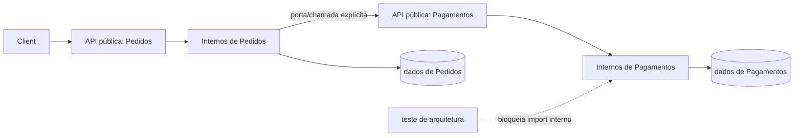

# Monólito modular

Um monólito modular combina **um deployável** com módulos de negócio que possuem contrato, modelo e dados bem delimitados. Ele preserva transações locais e uma operação simples sem aceitar o acoplamento irrestrito de um “monólito acidental”.

## Problema e contexto

Produtos novos precisam aprender rápido, e equipes pequenas raramente se beneficiam de rede, descoberta de serviço e consistência distribuída desde o primeiro dia. Ao mesmo tempo, separar apenas em controllers, services e repositories permite que qualquer funcionalidade leia qualquer tabela e importe qualquer classe.

Use módulos para alinhar mudança, linguagem e propriedade: Catálogo, Pedidos e Pagamentos são candidatos melhores do que `utils`, `services` e `models`.

## Componentes e regras

Cada módulo contém:

- uma **API pública** pequena: comandos, consultas e eventos aceitos;
- um **modelo interno** que não é importável por outros módulos;
- propriedade explícita sobre tabelas/esquemas;
- adaptadores para HTTP, mensageria e persistência;
- testes de arquitetura que bloqueiam dependências proibidas.

```text
src/
  orders/
    api/                 # contrato importável
    application/
    domain/
    infrastructure/
  payments/
    api/
    application/
    domain/
    infrastructure/
  bootstrap/             # composição, rotas, migrações
```



## Fluxo de exemplo

1. O adaptador HTTP transforma `POST /orders` em `PlaceOrder`.
2. Pedidos valida regras e grava a transação em suas tabelas.
3. Após o commit, publica `OrderPlaced` em um barramento **em processo** ou em uma outbox.
4. Pagamentos reage por sua API pública. Se a reação for síncrona, falha e atomicidade precisam estar explícitas; se assíncrona, duplicidade e atraso também.

Evite compartilhar entidades ORM. Passe identificadores e DTOs imutáveis; o consumidor não deve depender da representação interna do produtor.

## Dados e transações

Há três níveis crescentes de isolamento:

1. tabelas com prefixo e convenção de propriedade;
2. schemas e credenciais por módulo no mesmo servidor;
3. bancos separados, ainda no mesmo deployável.

Comece pelo nível que as ferramentas conseguem fiscalizar. Uma transação entre módulos pode ser pragmática, mas deve ser rara e registrada: ela é uma dependência que dificultará extração. Para fluxos longos, prefira estado explícito, outbox e compensações.

## Vantagens, custos e decisão

| Benefício | Custo / tensão |
| --- | --- |
| chamada e transação locais | um deploy e, em geral, um domínio de falha |
| depuração e ambiente simples | disciplina/ferramentas precisam proteger fronteiras |
| refatoração entre módulos ainda possível | autonomia de release é limitada |
| custo operacional menor | escala normalmente ocorre no processo inteiro |

**Use quando:** produto/equipe ainda aprendem limites; regras precisam de consistência local; um processo atende a escala; velocidade operacional importa.

**Não use quando:** cargas exigem runtime ou escala incompatíveis; isolamento regulatório/de falha pede processos separados; equipes realmente necessitam ciclos de deploy independentes e o custo distribuído é aceitável.

## Falhas que um monólito modular ainda pode ter

Modularidade reduz acoplamento de mudança, mas não cria isolamento físico. Um leak de memória, deadlock global, exaustão de pool ou CPU saturada pode afetar todos os módulos no mesmo processo. Isso muda a pergunta operacional: o objetivo não é fingir que cada módulo é um serviço, mas **tornar o consumo e a causalidade visíveis antes de distribuir**.

Algumas falhas típicas:

- um módulo abre transações longas e aumenta lock contention para os demais;
- um job de importação ocupa threads ou event loop e degrada APIs interativas;
- um pool compartilhado de conexões mascara qual módulo monopoliza o banco;
- listeners em processo acumulam backlog sem uma fila bounded;
- exceção não tratada em bootstrap impede todo o deployável de iniciar;
- um feature flag global ativa comportamento incompatível em múltiplos módulos.

Mitigue com limites explícitos de concorrência, filas bounded, pools ou quotas por workload quando fizer sentido, deadlines e métricas por módulo. Se a necessidade de isolamento se torna dominante e persistente, isso é evidência para separar o processo, não para adicionar mais abstrações internas.

## Performance e capacidade

O custo de uma chamada entre módulos é menor que uma chamada de rede, mas não é zero. Serialização desnecessária, cópias de objetos, ORM preguiçoso, N+1 e locks continuam existindo. Meça o caminho crítico por módulo:

- CPU por caso de uso;
- duração e quantidade de queries;
- lock wait e tempo de transação;
- utilização de pool;
- filas internas e tempo de espera;
- memória e cardinalidade de caches locais.

Evite “escalar o monólito” como sinônimo de aumentar réplicas. Mais instâncias podem pressionar banco, cache e filas. Faça capacity planning do conjunto: se cada pod abre 50 conexões e o banco suporta 400, oito pods já consomem todo o orçamento antes de considerar jobs ou migrações.

## Testes

- **Unidade:** invariantes e políticas internas sem I/O.
- **Módulo:** use cases pela API pública com banco real isolado.
- **Contrato interno:** garante compatibilidade de comandos/eventos consumidos.
- **Arquitetura:** grafo de imports, propriedade de schema e ausência de acesso cruzado.
- **Poucos E2E:** jornadas críticas entre módulos.

Um teste de arquitetura deve falhar se `orders.internal.*` for importado por Pagamentos ou se uma consulta acessar tabela de outro proprietário.

Além disso, mantenha um teste que constrói o grafo completo de módulos e detecta ciclos. `orders -> payments -> orders` pode funcionar em runtime e ainda tornar deploy, ownership e evolução confusos. Para banco, rode testes que usem credenciais reais por módulo quando essa barreira fizer parte da arquitetura.

## Observabilidade

Um processo único ainda precisa de contexto por módulo: `module`, `use_case`, `trace_id`, duração, resultado e métricas de negócio. Meça filas internas, pools, lock contention e consumo por módulo para detectar “noisy neighbor”. Trace chamadas entre módulos como spans, mesmo sem rede; isso revela acoplamento antes de uma extração.

Crie dashboards que permitam responder: “qual módulo aumentou a latência?”, “quem está segurando conexões?”, “qual fluxo cruza mais fronteiras?” e “qual erro derruba mais jornadas?”. Logs que só mostram `application=monolith` escondem exatamente a informação que a modularidade pretende preservar.

## Deployment e segurança

- migrações são compatíveis com a versão anterior durante rollout;
- inicialização valida configuração e contratos internos;
- feature flags permitem ativar alterações por módulo;
- handlers drenam antes do encerramento;
- autorização ocorre na API do módulo, não apenas no controller externo;
- credenciais de banco por módulo reforçam propriedade quando viável;
- dados sensíveis não atravessam eventos “por conveniência”.

O rollback de binário não reverte automaticamente uma migração destrutiva. Use expand/contract: adicionar, preencher, alternar leitores/escritores e só depois remover.

Segurança interna também precisa de threat model. Um módulo comprometido dentro do mesmo processo frequentemente herda memória, filesystem, env vars e identidade do processo. Se o requisito exige isolamento forte entre domínios de confiança, o mesmo processo pode ser a boundary errada. Modularidade de código não substitui sandbox, processo, conta cloud ou política de rede quando a ameaça exige separação física.

## Evolução para serviços

Extraia por evidência: escala independente, ownership, isolamento ou cadence de entrega, não pelo número de linhas.


Use branch by abstraction/strangler. Crie outbox antes do corte, defina uma fonte de verdade, mantenha compatibilidade, reconcilie contagens e valores, e preserve uma rota de retorno.

Antes de extrair, registre o baseline: latência, throughput, taxa de mudança conjunta, incidentes e lead time. Depois da extração, compare. Se a autonomia não melhora e a latência/complexidade cresce, a decisão precisa ser revista.

## Laboratório progressivo

Construa `orders`, `payments` e `notifications` em um único deployável.

1. **Fronteiras:** bloqueie imports de internals e acesso cruzado a tabelas.
2. **Concorrência:** execute duas confirmações do mesmo pedido e proteja com versão/lock apropriado.
3. **Falha:** faça Notificações travar por 10 s e demonstre que a API de Pedidos não acumula trabalho sem limite.
4. **Observabilidade:** gere traces entre módulos e atribua queries, CPU e erros ao owner correto.
5. **Migração:** mova Notificações para processo separado atrás do mesmo contrato, use outbox e compare SLO antes/depois.
6. **Rollback:** interrompa a migração no meio e prove como retornar ao caminho local sem perder eventos.

O relatório do laboratório deve explicar qual evidência justificaria manter tudo junto e qual justificaria nova extração. A conclusão correta pode ser “não separar”.

## Anti-patterns

- “módulo” que é só uma pasta e importa internals de todos os outros;
- banco compartilhado sem dono, joins cruzados e triggers intermodulares;
- barramento em processo usado para esconder fluxo crítico e síncrono;
- `shared` crescendo como um domínio sem proprietário;
- construir contratos de rede para toda chamada “pensando no futuro”;
- extrair o módulo mais acoplado primeiro.

## Perguntas de revisão

- Uma mudança de preço toca quantos módulos?
- Qual módulo autoriza e grava cada dado?
- Quais dependências são sincrônicas e por quê?
- O que falharia ou escalaria junto?
- Há um motivo mensurável para cruzar o limite de processo?
- Quais recursos são globais hoje e poderiam criar noisy neighbor?
- O isolamento necessário é de código, dados, processo ou confiança?

## Referências

- Kamil Grzybek. [Modular Monolith with DDD](https://github.com/kgrzybek/modular-monolith-with-ddd) — implementação de referência aberta.
- Microsoft. [Domain analysis for microservices](https://learn.microsoft.com/en-us/azure/architecture/microservices/model/domain-analysis).
- Fowler. [Monolith First](https://martinfowler.com/bliki/MonolithFirst.html).
- Newman. *Monolith to Microservices*. [O'Reilly](https://www.oreilly.com/library/view/monolith-to-microservices/9781492047834/).

---

[← Comparação](../comparison.md) · [↑ Índice](../README.md) · [Microsserviços →](../microservices/README.md)
