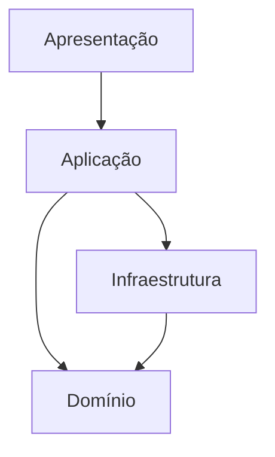
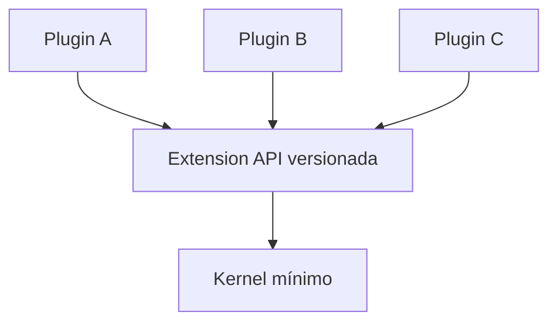

# Catálogo de estilos arquiteturais

Estilos coexistem em escalas distintas: monólito modular pode usar layers em um módulo, ports/adapters noutro, pipeline para importação e eventos entre capabilities. Sempre nomeie o escopo da escolha.

## Layered Architecture

Agrupa apresentação, aplicação, domínio e infraestrutura. Oferece mapa previsível e atende CRUD, mas uma mudança pode atravessar todas as layers e regras vazarem para controllers/persistência.

- **Use:** workflows estáveis, equipe pequena, tooling convencional.
- **Evite:** quando ownership independente ou domínio variável domina.
- **Guardrail:** dependências seguem política; agrupe capabilities dentro das layers; apresentação não chama persistence diretamente.
- **Evolução:** extraia módulos verticais coesos antes de serviços.

## Monolith

Um deployável não é inerentemente desorganizado. Monólito minimiza rede, transação distribuída e coordenação de deploy. Vira problema quando coupling interno, build, ownership ou contenção excedem a capacidade de mudança segura.

- **Vantagens:** transação/chamada local, debug/deploy simples, recursos compartilhados.
- **Desvantagens:** uma unidade de release/falha/escala, risco de erosão de limites.
- **Use:** produto novo, time pequeno/médio, workflow transacional forte.
- **Evite:** workloads/equipes que comprovadamente precisam escalar ou implantar separadamente.

Veja [monólito modular](modular-monolith/README.md).

## Hexagonal, Ports and Adapters, Clean e Onion

Protegem política central invertendo dependências nas bordas.

| Estilo | Ênfase | Vocabulário |
| --- | --- | --- |
| Hexagonal / Ports & Adapters | fronteiras inbound/outbound simétricas | driving/driven ports, adapters |
| Clean Architecture | policy layers e dependency rule | entities, use cases, interface adapters, frameworks |
| Onion | modelo de domínio no centro | domain, application services, infrastructure |

Não exigem interface por classe nem pastas copiando diagrama. Crie fronteira quando volatilidade, teste ou substituição justificam. Veja [Clean + Hexagonal](clean-hexagonal/README.md).

## Microservices

Serviços independentemente deployáveis, alinhados a capabilities e donos de seus dados/operação. Benefício central: autonomia e escala diferenciada; custo: sistemas distribuídos e organização. Uma “layer” separada por rede ou schema comum não é autônoma. Veja [Microsserviços](microservices/README.md).

## Event-Driven Architecture

Produtores publicam fatos/notificações e consumidores reagem assincronamente. Melhora desacoplamento temporal/fan-out, introduz consistência eventual, duplicidade, schema evolution, ordem limitada e causalidade difícil. Veja [Event-driven](event-driven/README.md).

## CQRS e Event Sourcing

CQRS separa modelos read/write; Event Sourcing persiste sequência de eventos como verdade. Podem ser usados isoladamente e têm custo de projeção, consistência e evolução. Veja [CQRS + Event Sourcing](cqrs-event-sourcing/README.md).

## Serverless

Usa runtime/serviços gerenciados com escala por evento/request e cobrança por consumo. Functions são só parte; fila, workflow, banco e identidade definem a arquitetura.

- **Use:** carga bursty, automação, experimento e equipe que aceita limites do provider.
- **Trade-offs:** menos infra versus cold start, quotas, telemetry fragmentada, lock-in e custo de carga constante.
- **Operação/segurança:** identidade least-privilege, concurrency bound, handler idempotente, DLQ e trace.
- **Anti-pattern:** “sem servidor” entendido como sem capacity/recovery.

## Microkernel (plug-in)

Core estável oferece extension points a plug-ins independentes; IDEs, rule systems e plataformas de produto são exemplos.

- **Use:** kernel estável + capacidades variáveis por cliente/produto.
- **Trade-offs:** extensibilidade/isolamento versus compatibilidade, trust, discovery e version skew.
- **Guardrails:** capability API, assinatura/sandbox quando código é hostil, versão e quota.
- **Anti-pattern:** kernel conhece todos os plug-ins e acumula feature logic.

## Pipeline

Transforma dados por estágios ordenados (compiler, media, ETL). Etapa tem contrato input/output e pode ser local ou distribuída.

- **Use:** transformações sequenciais, stream e escala/teste por estágio.
- **Trade-offs:** composição versus schema handoff, buffering, recovery e latência total.
- **Guardrails:** backpressure, fila bounded, checkpoint/restart, poison quarantine e telemetry.
- **Anti-pattern:** materialização intermediária ilimitada ou ordem implícita.

## Backend for Frontend (BFF)

Backend específico molda API/orquestração para web, mobile ou partner.

- **Use:** experiências têm payload, latência, release ou agregação diferentes.
- **Evite:** duplicar regra/autorização por cliente; um cliente fino não justifica serviço.
- **Trade-offs:** autonomia/contrato otimizado versus duplicação operacional.
- **Ownership:** geralmente com client team; regra de domínio fica na capability.

## API Gateway

Entrada compartilhada para TLS, autenticação, autorização grossa, rate limit, routing e request shaping.

- **Use:** vários serviços precisam de borda north–south controlada.
- **Trade-offs:** política consistente versus bottleneck/blast radius central.
- **Evite:** orquestração e regra de domínio em configuração opaca.
- **Segurança:** edge valida identidade; serviço ainda autoriza ação de domínio.

## Service Mesh

Gerencia tráfego service-to-service com data-plane proxies e control plane, oferecendo mTLS, telemetry e traffic policy.

- **Use:** frota grande, requisitos east–west uniformes e platform team capaz de operar.
- **Evite:** poucos serviços onde libraries/plataforma bastam.
- **Trade-offs:** política uniforme versus latência/recurso de proxy, certificados e debug.
- **Limite:** mesh melhora transporte; não resolve ownership, API, idempotência ou transação distribuída.

## Perguntas de seleção

1. O que precisa deploy, falha, escala e ownership independentes?
2. Onde transação deve ser fortemente consistente?
3. Que chamada pode ser assíncrona e qual staleness é aceitável?
4. Quais fronteiras tecnológicas são voláteis o suficiente para inverter?
5. A equipe opera essa topologia no pior dia?

## Referências

- Fowler. [Microservices guide](https://martinfowler.com/microservices/)
- Cockburn. [Hexagonal Architecture](https://alistair.cockburn.us/hexagonal-architecture/)
- AWS. [Serverless Applications Lens](https://docs.aws.amazon.com/wellarchitected/latest/serverless-applications-lens/welcome.html)
- Istio. [What is Istio?](https://istio.io/latest/docs/overview/what-is-istio/)

---

[← Arquitetura](README.md) · [↑ Índice](README.md) · [Comparação →](comparison.md)
