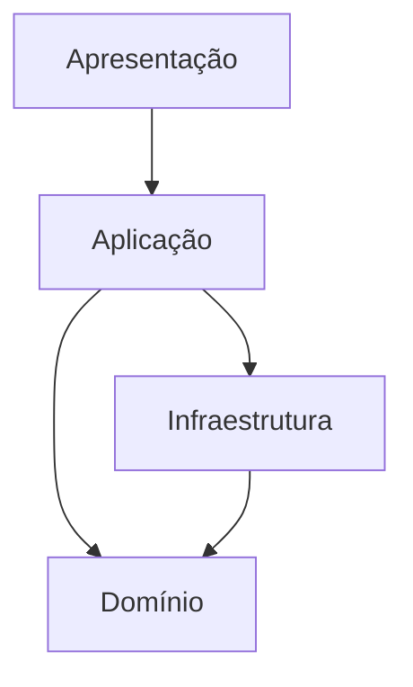
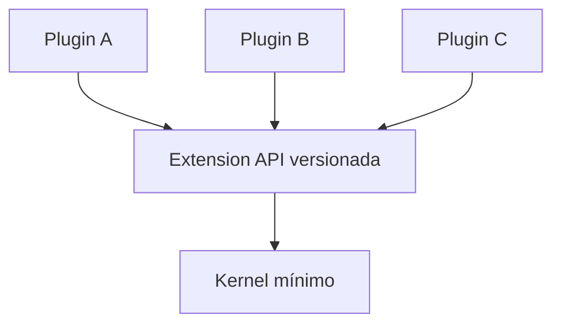
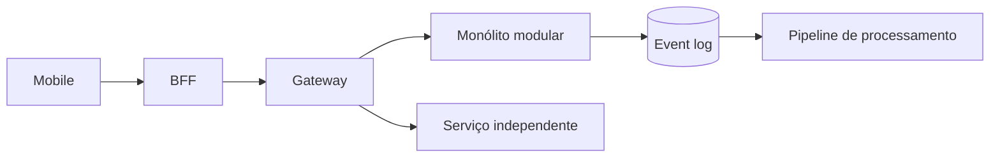

# Catálogo de estilos arquiteturais

Estilos coexistem em escalas distintas: monólito modular pode usar layers em um módulo, ports/adapters noutro, pipeline para importação e eventos entre capabilities. Sempre nomeie o escopo da escolha.

Um estilo não é um pacote de tecnologias. Ele é uma **restrição estrutural** que favorece certos atributos e cobra outros. A pergunta correta é: qual força do problema este estilo organiza melhor, e qual dívida ele introduz?

## Como ler este catálogo

Para cada estilo, avalie cinco pontos:

1. **força dominante:** o que ele tenta otimizar;
2. **unidade de mudança:** o que tende a evoluir junto;
3. **unidade de falha:** o que pode degradar junto;
4. **garantia que não oferece:** o que precisa de outro mecanismo;
5. **gatilho de saída:** que evidência mostraria que o estilo deixou de servir.

Isso evita transformar nomes arquiteturais em identidades permanentes.

## Layered Architecture

Agrupa apresentação, aplicação, domínio e infraestrutura. Oferece mapa previsível e atende CRUD, mas uma mudança pode atravessar todas as layers e regras vazarem para controllers/persistência.

- **Use:** workflows estáveis, equipe pequena, tooling convencional.
- **Evite:** quando ownership independente ou domínio variável domina.
- **Guardrail:** dependências seguem política; agrupe capabilities dentro das layers; apresentação não chama persistence diretamente.
- **Evolução:** extraia módulos verticais coesos antes de serviços.

### Failure mode típico

“Layered” pode virar uma rede horizontal em que qualquer feature toca controller, service, repository e dezenas de utilitários. O deploy continua simples, mas a unidade de mudança explode. Meça arquivos/módulos tocados por feature e ciclos entre packages. Se toda mudança atravessa o sistema, a separação deixou de conter complexidade.

## Monolith

Um deployável não é inerentemente desorganizado. Monólito minimiza rede, transação distribuída e coordenação de deploy. Vira problema quando coupling interno, build, ownership ou contenção excedem a capacidade de mudança segura.

- **Vantagens:** transação/chamada local, debug/deploy simples, recursos compartilhados.
- **Desvantagens:** uma unidade de release/falha/escala, risco de erosão de limites.
- **Use:** produto novo, time pequeno/médio, workflow transacional forte.
- **Evite:** workloads/equipes que comprovadamente precisam escalar ou implantar separadamente.

Veja [monólito modular](modular-monolith/README.md).

### Performance e operação

Monólito elimina hops de rede internos, mas compartilha CPU, memória, pools e runtime. Um job pesado pode virar noisy neighbor. Antes de separar, tente quotas, filas bounded, pools por workload e profiling. Extraia só quando isolamento ou autonomia realmente justificar a nova boundary.

## Hexagonal, Ports and Adapters, Clean e Onion

Protegem política central invertendo dependências nas bordas.

| Estilo | Ênfase | Vocabulário |
| --- | --- | --- |
| Hexagonal / Ports & Adapters | fronteiras inbound/outbound simétricas | driving/driven ports, adapters |
| Clean Architecture | policy layers e dependency rule | entities, use cases, interface adapters, frameworks |
| Onion | modelo de domínio no centro | domain, application services, infrastructure |

Não exigem interface por classe nem pastas copiando diagrama. Crie fronteira quando volatilidade, teste ou substituição justificam. Veja [Clean + Hexagonal](clean-hexagonal/README.md).

### Garantia e limite

Inverter dependência de código melhora testabilidade e isolamento da política, mas **não remove semântica da infraestrutura**. Um repository abstrato ainda precisa lidar com transação, lock, collation e paginação. Uma porta de pagamento não torna o PSP idempotente. Abstração não apaga física.

## Microservices

Serviços independentemente deployáveis, alinhados a capabilities e donos de seus dados/operação. Benefício central: autonomia e escala diferenciada; custo: sistemas distribuídos e organização. Uma “layer” separada por rede ou schema comum não é autônoma. Veja [Microsserviços](microservices/README.md).

### Falhas novas

- latência e timeout entre serviços;
- retry storms;
- consistência eventual;
- version skew de contratos;
- descoberta/configuração;
- tracing distribuído;
- ownership de incidentes cruzados.

Microsserviços não são “monólito em várias caixas”. Se release, banco e decisões continuam coordenados, você ganhou rede sem ganhar autonomia.

## Event-Driven Architecture

Produtores publicam fatos/notificações e consumidores reagem assincronamente. Melhora desacoplamento temporal/fan-out, introduz consistência eventual, duplicidade, schema evolution, ordem limitada e causalidade difícil. Veja [Event-driven](event-driven/README.md).

### Garantias que precisam ser explícitas

- at-most-once, at-least-once ou outra semântica de entrega;
- ordering por key/partition;
- retenção e replay;
- idempotência do efeito;
- compatibilidade de schema;
- comportamento sob lag.

Um evento não “desacopla” se o produtor precisa conhecer e coordenar todos os consumers para qualquer mudança.

## CQRS e Event Sourcing

CQRS separa modelos read/write; Event Sourcing persiste sequência de eventos como verdade. Podem ser usados isoladamente e têm custo de projeção, consistência e evolução. Veja [CQRS + Event Sourcing](cqrs-event-sourcing/README.md).

CQRS é útil quando leitura e escrita realmente têm necessidades diferentes. Event Sourcing é útil quando o histórico dos fatos é parte central do domínio. Usá-los para CRUD simples cria tooling, replay e evolução sem retorno proporcional.

## Serverless

Usa runtime/serviços gerenciados com escala por evento/request e cobrança por consumo. Functions são só parte; fila, workflow, banco e identidade definem a arquitetura.

- **Use:** carga bursty, automação, experimento e equipe que aceita limites do provider.
- **Trade-offs:** menos infra versus cold start, quotas, telemetry fragmentada, lock-in e custo de carga constante.
- **Operação/segurança:** identidade least-privilege, concurrency bound, handler idempotente, DLQ e trace.
- **Anti-pattern:** “sem servidor” entendido como sem capacity/recovery.

### Capacity planning continua existindo

Se a função escala para 2.000 concorrências e o banco aceita 200 conexões, a plataforma pode acelerar sua própria falha. Concurrency limits, queues e connection pooling continuam necessários.

## Microkernel (plug-in)

Core estável oferece extension points a plug-ins independentes; IDEs, rule systems e plataformas de produto são exemplos.

- **Use:** kernel estável + capacidades variáveis por cliente/produto.
- **Trade-offs:** extensibilidade/isolamento versus compatibilidade, trust, discovery e version skew.
- **Guardrails:** capability API, assinatura/sandbox quando código é hostil, versão e quota.
- **Anti-pattern:** kernel conhece todos os plug-ins e acumula feature logic.

### Segurança

Plug-ins ampliam a trust boundary. Se executam no mesmo processo, podem herdar memória, filesystem e credenciais. Para código de terceiros, considere sandbox/processo separado, assinatura, allowlist de capabilities e egress control.

## Pipeline

Transforma dados por estágios ordenados, como compiler, media ou ETL. Etapa tem contrato input/output e pode ser local ou distribuída.

- **Use:** transformações sequenciais, stream e escala/teste por estágio.
- **Trade-offs:** composição versus schema handoff, buffering, recovery e latência total.
- **Guardrails:** backpressure, fila bounded, checkpoint/restart, poison quarantine e telemetry.
- **Anti-pattern:** materialização intermediária ilimitada ou ordem implícita.

### Observabilidade

Meça throughput e latência por estágio, tamanho de fila entre stages, taxa de erro, retry e skew de particionamento. O pipeline total é limitado pelo estágio mais lento e pelo buffer disponível.

## Backend for Frontend (BFF)

Backend específico molda API/orquestração para web, mobile ou partner.

- **Use:** experiências têm payload, latência, release ou agregação diferentes.
- **Evite:** duplicar regra/autorização por cliente; um cliente fino não justifica serviço.
- **Trade-offs:** autonomia/contrato otimizado versus duplicação operacional.
- **Ownership:** geralmente com client team; regra de domínio fica na capability.

Um BFF pode compor dados, mas não deve virar novo domínio. Se ele decide desconto, crédito ou estoque, a regra está vazando da capability dona.

## API Gateway

Entrada compartilhada para TLS, autenticação, autorização grossa, rate limit, routing e request shaping.

- **Use:** vários serviços precisam de borda north-south controlada.
- **Trade-offs:** política consistente versus bottleneck/blast radius central.
- **Evite:** orquestração e regra de domínio em configuração opaca.
- **Segurança:** edge valida identidade; serviço ainda autoriza ação de domínio.

Gateway é parte do caminho crítico. Mudança de policy precisa de canary, rollback, observabilidade e limites de propagação.

## Service Mesh

Gerencia tráfego service-to-service com data-plane proxies e control plane, oferecendo mTLS, telemetry e traffic policy.

- **Use:** frota grande, requisitos east-west uniformes e platform team capaz de operar.
- **Evite:** poucos serviços onde libraries/plataforma bastam.
- **Trade-offs:** política uniforme versus latência/recurso de proxy, certificados e debug.
- **Limite:** mesh melhora transporte; não resolve ownership, API, idempotência ou transação distribuída.

## Estilos compostos

Sistemas reais combinam estilos. Exemplo:

A composição é válida quando cada peça resolve uma força específica. Ela vira problema quando estilos se acumulam por moda. Cada nova boundary adiciona mecanismo, operação e failure modes.

## Matriz de decisão

| Driver | Opção inicial comum | Evolua quando |
| --- | --- | --- |
| produto novo e domínio incerto | monólito modular | autonomia/isolamento medidos |
| bordas tecnológicas voláteis | ports/adapters | múltiplos adapters justificam |
| fan-out assíncrono | eventos | replay/streaming exigem log mais rico |
| UXs muito diferentes | BFF | composição específica reduz custo real |
| frota grande com policy east-west | mesh | escala operacional justifica control plane |
| plugins por cliente | microkernel | sandbox/versionamento tornam-se críticos |
| transformação em etapas | pipeline | stages precisam escalar/recuperar isoladamente |

## Migração entre estilos

Mudança arquitetural deve preservar comportamento e permitir retorno.

### Monólito → serviços

1. fiscalize módulo interno;
2. estabilize contrato;
3. separe ownership de dados;
4. introduza outbox/adapter remoto;
5. faça canary;
6. reconcilie;
7. remova caminho antigo.

### Síncrono → event-driven

1. identifique reação que não precisa bloquear o usuário;
2. grave outbox junto à transação;
3. publique em sombra;
4. compare efeito antigo e novo;
5. habilite consumer por tenant;
6. mantenha replay e rollback.

### Layered → vertical/modular

Comece pela capability com maior coesão. Mova regras, dados e testes juntos. Bloqueie novos imports cruzados antes de tentar refatorar todo o legado.

## Testes e fitness functions por estilo

- **Layered/modular:** dependência e ciclos de packages.
- **Microservices:** contract tests, fault injection e deploy independente.
- **Event-driven:** idempotência, schema, replay e out-of-order.
- **Serverless:** quotas, concurrency, cold start e DLQ.
- **Microkernel:** compatibilidade de plugin e sandbox.
- **Pipeline:** backpressure, checkpoint e restart.
- **Gateway/mesh:** policy tests, canary e blast radius.

A arquitetura deve ser verificável por automação, não apenas revisada em diagramas.

## Perguntas de seleção

1. O que precisa deploy, falha, escala e ownership independentes?
2. Onde transação deve ser fortemente consistente?
3. Que chamada pode ser assíncrona e qual staleness é aceitável?
4. Quais fronteiras tecnológicas são voláteis o suficiente para inverter?
5. A equipe opera essa topologia no pior dia?
6. Qual é a unidade de rollback?
7. Qual estilo cria o menor número de novas failure modes para este problema?

## Laboratório

Use um sistema de pedidos como base.

1. Modele-o primeiro como layered monolith.
2. Introduza módulos de Pedidos, Pagamentos e Notificações.
3. Meça changes coordenadas e latência.
4. Troque Notificações por evento assíncrono com outbox.
5. Extraia Pagamentos para serviço remoto com timeout/idempotência.
6. Adicione gateway apenas se houver driver de edge compartilhado.
7. Compare o sistema em cada estágio: complexidade, falhas, SLO, custo e autonomia.
8. Escreva um ADR dizendo em qual estágio você pararia e por quê.

O melhor resultado pode ser interromper a evolução antes da topologia mais distribuída.

## Referências

- Fowler. [Microservices guide](https://martinfowler.com/microservices/)
- Cockburn. [Hexagonal Architecture](https://alistair.cockburn.us/hexagonal-architecture/)
- AWS. [Serverless Applications Lens](https://docs.aws.amazon.com/wellarchitected/latest/serverless-applications-lens/welcome.html)
- Istio. [What is Istio?](https://istio.io/latest/docs/overview/what-is-istio/)
- Richards & Ford. *Fundamentals of Software Architecture*. [O'Reilly](https://www.oreilly.com/library/view/fundamentals-of-software/9781492043447/)

---

[← Arquitetura](README.md) · [↑ Índice](README.md) · [Comparação →](comparison.md)
