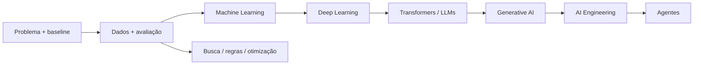
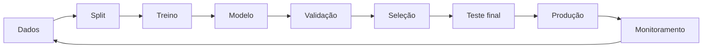
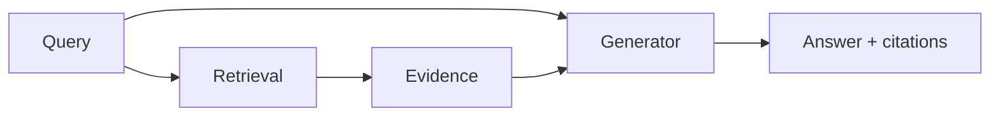
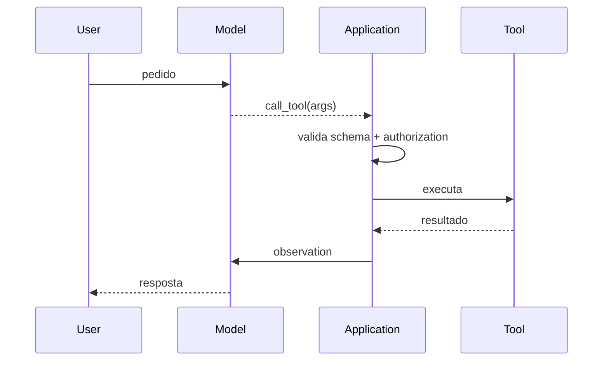

# Inteligência Artificial

Inteligência Artificial é um conjunto amplo de técnicas para construir sistemas
que percebem padrões, estimam resultados, buscam soluções, geram conteúdo ou
escolhem ações. LLMs ocupam uma parte importante do cenário atual, mas não são a
definição de IA.

Esta trilha trata IA como engenharia sob incerteza. O objetivo é saber quando um
modelo ajuda, como medir seu valor, por que ele falha e como integrar comportamento
probabilístico a sistemas que ainda precisam de contratos e controles.

## Mapa



| Codex | Pergunta central | Artefato de prática |
| --- | --- | --- |
| [Fundamentos](fundamentals/README.md) | o problema pede IA e como mediremos valor? | baseline e protocolo de avaliação |
| [Machine Learning](machine-learning/README.md) | o modelo generaliza além do treino? | pipeline sem leakage |
| [Deep Learning](deep-learning/README.md) | representação aprendida compensa dados e compute? | treinamento diagnosticável |
| [LLMs](llm/README.md) | como tokens viram distribuição sobre continuações? | análise de tokenização e contexto |
| [Generative AI](generative-ai/README.md) | como integrar saída probabilística com controle? | saída estruturada avaliada |
| [AI Engineering](../ai-engineering/README.md) | como operar modelos dentro de produto real? | sistema instrumentado e avaliado |
| [Agentes](../agents/README.md) | quando vale permitir escolha dinâmica de ações? | agent loop com limites e evidência |

## 1. Comece pelo problema, não pelo modelo

Uma ideia de IA precisa virar uma decisão mensurável.

Exemplo vago:

> Quero usar IA para melhorar atendimento.

Exemplo engenheirável:

> Dado o texto inicial de uma solicitação e o histórico permitido, classificar o
> caso em uma das 12 filas de suporte, reduzindo tempo até o primeiro atendimento
> sem aumentar roteamento incorreto acima de um limite.

Agora existem:

- input;
- output;
- população;
- baseline;
- custo de erro;
- métrica;
- guardrail.

Sem isso, trocar modelo só produz demos diferentes.

## 2. IA compete com soluções determinísticas

Antes de treinar ou chamar um modelo, compare alternativas:

- regra;
- SQL/query;
- full-text search;
- ranking heurístico;
- otimização clássica;
- workflow;
- modelo estatístico simples;
- modelo complexo.

Uma regra de 20 linhas pode vencer um LLM em exatidão, custo e auditabilidade
quando o domínio é fechado. Um modelo pode vencer quando o padrão é difícil de
codificar e existe tolerância a erro.

### Baseline é parte da ciência

Sem baseline, "92% de accuracy" não diz se houve avanço. Se a regra atual faz
94%, o modelo piorou. Se random/chance faria 8%, 92% pode ser forte.

Baselines úteis:

- comportamento atual;
- regra simples;
- classe majoritária;
- retrieval sem geração;
- modelo menor/barato.

## 3. Machine Learning em uma frase operacional

Machine Learning aprende parâmetros a partir de dados para minimizar um objetivo
e generalizar a exemplos não vistos.

Pipeline simplificado:



A palavra mais importante é **generalizar**. Memorizar treino não resolve o
problema de produção.

## 4. Supervisionado, não supervisionado e reinforcement learning

### Supervisionado

Há exemplos com targets/labels. Tarefas comuns: classificação, regressão,
ranking.

### Não supervisionado/self-supervised

O sistema encontra estrutura ou cria objetivos a partir dos próprios dados. Boa
parte do treinamento moderno de modelos de linguagem usa objetivos
self-supervised sobre grandes corpora.

### Reinforcement learning

Um agente escolhe ações e recebe feedback/reward ao longo de trajetórias. O
desafio envolve crédito temporal, exploração e segurança das ações.

Essas categorias se combinam. Não tente classificar todo sistema moderno em uma
única caixa.

## 5. Treino e inferência são sistemas diferentes

### Treino

Consome datasets, compute e otimização para ajustar parâmetros. Preocupa-se com:

- throughput de dados;
- memória de acelerador;
- checkpoint;
- loss;
- estabilidade numérica;
- experiment tracking.

### Inferência

Executa parâmetros aprendidos para servir previsão/geração. Preocupa-se com:

- latency;
- throughput;
- batching;
- cache;
- disponibilidade;
- custo por operação;
- segurança de input/output.

Uma otimização de treino não necessariamente melhora serving.

## 6. Loss não é valor de produto

Loss é o objetivo matemático usado na otimização. Métrica offline mede
comportamento em dataset. Métrica de produto mede resultado real.

Exemplo de classificador de fraude:

```text
loss de treino → cross entropy
métrica offline → precision/recall por threshold
métrica operacional → chargebacks evitados
impacto negativo → compras legítimas bloqueadas
```

O produto exige múltiplas lentes porque erros têm custos diferentes.

## 7. Dados são parte do modelo

Qualidade de modelo não pode ser separada de:

- quem foi incluído;
- como labels foram produzidos;
- quando features estavam disponíveis;
- quais exemplos foram removidos;
- como train/test foram separados;
- qual população aparece em produção.

### Leakage

Leakage acontece quando informação que não deveria estar disponível no momento
real chega ao treino/avaliação.

Exemplo: prever cancelamento usando um campo atualizado somente depois do
cancelamento. O score pode parecer excelente e ser inutilizável.

### Split por unidade real

Se várias linhas do mesmo usuário/documento aparecem em treino e teste, o modelo
pode reconhecer entidades em vez de generalizar. Em dados temporais, futuro não
deve vazar para passado.

## 8. Distribution shift e drift

Produção muda:

- comportamento de usuários;
- mix de regiões;
- catálogo;
- fraude/adversários;
- linguagem;
- políticas;
- fontes de dados.

### Data drift

Distribuição dos inputs muda.

### Concept drift

Relação entre input e target muda.

### Label drift

Distribuição do target muda.

Detectar drift não prova queda de qualidade. Ele sinaliza que a validade da
avaliação precisa ser revista.

## 9. Bias e fairness precisam de contexto

"Remover atributos sensíveis" não elimina automaticamente viés, porque outras
features podem funcionar como proxies.

Avaliação responsável pergunta:

- quem recebe benefício ou dano?
- taxas de erro mudam por grupos relevantes?
- labels históricos incorporam decisões enviesadas?
- existe recurso/contestação?
- uma única métrica de fairness é compatível com o objetivo?

Algumas métricas de fairness são matematicamente incompatíveis quando taxas base
diferem. A escolha exige contexto social, legal e de produto, não apenas
otimização.

## 10. Deep Learning: representação aprendida

Redes neurais compõem transformações parametrizadas e usam gradient-based
optimization para ajustar pesos.

A vantagem central é aprender representações úteis diretamente de dados em
escala, especialmente imagens, áudio e linguagem.

O preço inclui:

- grande volume de dados/compute;
- debugging mais difícil;
- sensibilidade a distribuição;
- maior custo de experimentação;
- interpretabilidade limitada em muitos casos.

Use quando o ganho frente a modelos simples justifica essa operação.

## 11. Transformer e atenção

Transformers processam sequências usando attention para construir
representações dependentes do contexto.

Em termos simplificados, cada posição produz vetores de query, key e value.
Similaridade entre query e keys determina pesos usados para combinar values.

```text
Attention(Q, K, V) = softmax(QKᵀ / √d) V
```

A fórmula não significa que o modelo "procura fatos" como banco. Ela descreve
uma operação diferenciável de combinação de representações.

Multi-head attention permite padrões diferentes em espaços de representação
diferentes.

## 12. LLM: distribuição sobre próximas unidades

Um modelo de linguagem autoregressivo recebe tokens e estima distribuição para o
próximo token. Geração repete o processo:

```text
contexto → distribuição → escolha token → novo contexto → ...
```

Isso explica propriedades importantes:

- saída é probabilística;
- texto fluente não garante verdade;
- prompt muda condicionamento, não reprograma pesos;
- temperatura/sampling alteram diversidade;
- context window é recurso finito;
- tokenização muda custo e representação.

## 13. Pretraining, fine-tuning e prompting

### Pretraining

Aprende padrões gerais em grandes datasets.

### Fine-tuning

Ajusta comportamento/parâmetros para objetivo ou domínio com dados adicionais.

### Prompting / in-context learning

Fornece instruções e exemplos no contexto sem necessariamente alterar pesos.

### Retrieval

Adiciona evidência externa no momento da inferência.

São alavancas diferentes. Use retrieval para conhecimento mutável/proprietário;
fine-tuning pode ser melhor para comportamento/formato recorrente. A fronteira
não é absoluta e deve ser avaliada.

## 14. RAG não é "colocar PDF no prompt"

Retrieval-Augmented Generation separa recuperação de evidência e geração.



Qualidade pode falhar em várias etapas:

- documento relevante não foi indexado;
- chunking destruiu contexto;
- embedding/ranking recuperou coisa errada;
- autorização permitiu documento indevido;
- contexto relevante entrou, mas modelo ignorou;
- resposta inventou além da evidência.

Avalie retrieval e generation separadamente.

## 15. Embeddings

Embeddings mapeiam itens para vetores onde proximidade tenta capturar semelhança
útil para o objetivo do modelo.

Eles habilitam:

- semantic search;
- clustering;
- retrieval;
- deduplicação aproximada;
- features para modelos downstream.

Cosine similarity alta não significa identidade nem verdade. O espaço foi
aprendido para certas regularidades e pode falhar fora delas.

## 16. Vector database não substitui banco transacional

Vector search resolve nearest-neighbor retrieval. Sistemas reais ainda precisam
de:

- ownership de documento;
- metadata;
- autorização;
- versionamento;
- deleção;
- transações de origem;
- audit.

Muitas arquiteturas mantêm fonte de verdade relacional/documental e vector index
como projeção reconstruível.

## 17. Generative AI e structured output

Texto livre é flexível e difícil de integrar. Para automação, prefira contratos
estruturados quando possível.

```json
{
  "category": "refund_request",
  "confidence": 0.81,
  "reason": "..."
}
```

Mesmo quando provider suporta schema/structured output, valide runtime e regra de
domínio. JSON válido pode conter decisão inválida.

## 18. Hallucination não é um bug isolado

Modelos gerativos produzem continuações plausíveis condicionadas ao contexto.
Quando o produto exige verdade factual, o sistema precisa de mecanismos
adicionais:

- retrieval/provenance;
- tool lookup;
- restrição de domínio;
- citations verificáveis;
- abstention;
- human review;
- evals focadas em factualidade.

"Prompt melhor" pode reduzir erro em dataset específico, mas não transforma
modelo probabilístico em banco de fatos.

## 19. Tool calling

O modelo pode produzir uma intenção estruturada de tool. A aplicação executa.
Essa separação é crítica.



O modelo não deve ser autoridade final para autorização. Tool adapter precisa de
schema estreito, timeout, least privilege, idempotência e confirmação para ações
de alto impacto.

## 20. Agentes: autonomia aumenta espaço de falha

Um workflow fixo escolhe transições por código. Um agente permite que policy
baseada em modelo escolha próximos passos.

Isso ajuda quando ambiente exige adaptação. Também aumenta:

- número de trajetórias possíveis;
- custo;
- dificuldade de reproduzir;
- risco de loops;
- superfície de tool use;
- necessidade de stop conditions.

Comece com workflow determinístico. Adicione autonomia onde eval demonstra ganho.

## 21. Prompt injection é problema de trust boundary

Se conteúdo externo entra no contexto, ele pode conter texto tentando alterar o
comportamento do modelo.

O problema é estrutural: dados e instruções compartilham canal interpretável pelo
modelo.

Defesas:

- tratar conteúdo recuperado como não confiável;
- policy/authorization fora do modelo;
- tools allowlisted por estado;
- validação de argumentos;
- confirmação para efeitos sensíveis;
- minimização de secrets/context;
- monitoring e evals adversariais.

Não existe uma frase de system prompt que torne qualquer tool segura.

## 22. Avaliação: dataset antes de prompt tuning infinito

Crie conjunto representativo com:

- happy paths;
- edge cases;
- casos raros importantes;
- inputs adversariais;
- recusas corretas;
- diferentes segmentos/idiomas quando relevantes.

Versione:

- modelo;
- prompt;
- retrieval;
- tools;
- dataset;
- métrica/judge.

Sem versionamento, uma melhora aparente pode vir de outra variável.

## 23. Métricas de IA em camadas

### Qualidade

- accuracy/F1/recall;
- retrieval precision/recall;
- factuality;
- task success;
- human preference;
- policy compliance.

### Operação

- latency;
- time to first token;
- throughput;
- error rate;
- tokens;
- cache hit;
- tool failure;
- retries.

### Produto

- resolução;
- conversão;
- tempo economizado;
- escalonamento humano;
- custo de erro.

Uma nota agregada não substitui slices. Um sistema pode ter 95% geral e 40% em
um grupo crítico.

## 24. Custo

Custo de inferência depende de fatores como:

- tokens de input/output;
- modelo;
- cache;
- batching;
- retrieval;
- tools;
- retries;
- quantidade de passos de agente.

A unidade útil é custo por tarefa bem-sucedida, não apenas custo por request.
Modelo barato que exige três retries pode custar mais.

## 25. Latência

Uma resposta de IA pode somar:

```text
gateway + retrieval + rerank + model queue + prefill + decode + tools + network
```

Streaming melhora percepção, não reduz necessariamente tempo total até conclusão.

Para agentes, latências se acumulam por step. Limite de passos e parallelização
de tools independentes podem ser importantes.

## 26. Privacidade e dados

Pergunte:

- dados podem sair para provider externo?
- provider retém conteúdo?
- logs internos guardam prompts/respostas?
- embeddings contêm informação sensível?
- usuário pode solicitar deleção?
- dados de um tenant podem aparecer para outro?
- retrieval aplica authorization antes de contexto?

Minimize dados enviados ao modelo. Não use prompt como depósito invisível de PII.

## 27. Human-in-the-loop

Intervenção humana pode ocorrer para:

- fornecer informação ausente;
- revisar resultado;
- aprovar ação;
- tratar exceção.

A aprovação deve mostrar alvo e consequência concretos. "Permitir agente" uma
vez não deve virar autorização indefinida para ações futuras sensíveis.

## 28. Modos de falha

| Falha | Sintoma | Evidência | Mitigação |
| --- | --- | --- | --- |
| leakage | offline alto, prod ruim | split/audit de features | split correto |
| drift | qualidade cai por período/segmento | data + eval monitoring | reavaliar/retrain/rollback |
| retrieval ruim | resposta sem base | retrieval metrics | chunk/index/rerank |
| hallucination | afirmação sem evidência | grounded eval | tool/RAG/abstention |
| prompt injection | tool/policy desviada | trace da trajetória | policy externa + least privilege |
| agent loop | custo/latência explode | steps/repetition | stop conditions |
| output inválido | integração quebra | schema validation | structured output + runtime validation |
| provider outage | feature indisponível | dependency SLI | timeout/fallback/degradation |
| custo runaway | fatura sobe | tokens/steps/retries | budgets, routing e limits |

## 29. Quando não usar IA

Prefira solução determinística quando:

- comportamento deve ser exato;
- regra é legível e estável;
- dados suficientes não existem;
- erro é inaceitável sem revisão;
- não existe forma de avaliar;
- latência/custo não cabem;
- explicação/audit exige regra explícita;
- automation simples resolve.

"Todo mundo está colocando IA" não é requisito funcional.

## 30. Projeto transversal

Escolha uma tarefa real e implemente três versões:

1. baseline determinístico;
2. modelo/LLM simples;
3. sistema enriquecido com retrieval/tool apenas se necessário.

Meça:

- qualidade por slice;
- latência;
- custo por tarefa útil;
- taxa de fallback/erro;
- segurança/abuse cases;
- manutenção.

Faça pelo menos uma falha deliberada: provider lento, retrieval indisponível,
prompt injection ou output inválido. O projeto só termina quando o sistema
falha de maneira compreensível.

## 31. Checkpoints

- **Beginner:** diferencia baseline, treino, inferência, métrica e generalização.
- **Intermediate:** constrói avaliação sem leakage e explica precision/recall,
  embeddings e LLM generation.
- **Advanced:** opera RAG/tool calling com tracing, segurança e custo.
- **Expert:** projeta evals, threat model e estratégia de degradação para sistema
  probabilístico em produção.

## Referências

- Google. [Machine Learning Crash Course](https://developers.google.com/machine-learning/crash-course/)
  cobre fundamentos práticos de ML.
- Google. [Rules of ML](https://developers.google.com/machine-learning/guides/rules-of-ml)
  conecta modelagem à evolução de sistemas de ML.
- NIST. [AI Risk Management Framework](https://www.nist.gov/itl/ai-risk-management-framework)
  estrutura governança e gestão de risco.
- Vaswani et al. [Attention Is All You Need](https://arxiv.org/abs/1706.03762)
  introduziu a arquitetura Transformer.
- Lewis et al. [Retrieval-Augmented Generation](https://arxiv.org/abs/2005.11401)
  formaliza uma arquitetura clássica de RAG.
- OWASP. [GenAI Security Project](https://genai.owasp.org/) organiza riscos de
  aplicações generativas e agentes.

---

[← Bancos de dados](../databases/README.md) · [↑ Início](../README.md) · [Fundamentos de IA →](fundamentals/README.md)
