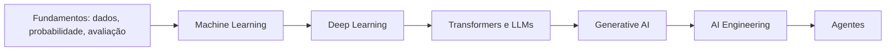

# Inteligência Artificial

Esta trilha ensina o suficiente de modelos e avaliação para tomar decisões de
engenharia. IA não é sinônimo de LLM: regras, busca, otimização, modelos
estatísticos e redes neurais ocupam regiões diferentes do espaço de soluções.

## Mapa

| Codex | Pergunta central | Artefato de prática |
| --- | --- | --- |
| [Fundamentos](fundamentals/README.md) | o problema pede IA e como mediremos valor? | baseline e protocolo de avaliação |
| [Machine Learning](machine-learning/README.md) | o modelo generaliza além do treino? | pipeline sem leakage |
| [Deep Learning](deep-learning/README.md) | representação aprendida compensa dados e compute? | treinamento diagnosticável |
| [LLMs](llm/README.md) | como tokens viram uma distribuição sobre continuações? | análise de tokenização e contexto |
| [Generative AI](generative-ai/README.md) | como integrar saída probabilística com controle? | saída estruturada avaliada |

## Quatro separações essenciais

1. **Treino ≠ inferência:** aprender parâmetros é diferente de executar o modelo.
2. **Loss ≠ métrica de produto:** otimização matemática não garante utilidade.
3. **Modelo ≠ sistema:** dados, retrieval, tools, UX e política produzem o efeito.
4. **Fluência ≠ verdade:** texto plausível pode não estar apoiado por evidência.

## Quando não usar IA

Prefira regra, consulta, busca ou workflow determinístico quando o comportamento
deve ser exato, a lógica cabe em código legível ou erros têm custo alto sem
revisão. Use um modelo quando padrões são difíceis de expressar e existe dado,
métrica, fallback e valor que justifique variância e operação adicional.

## Projeto transversal

Escolha uma tarefa de classificação ou recuperação. Implemente um baseline
determinístico, um modelo simples e uma abordagem mais complexa. Compare
qualidade, latência, custo, explicabilidade, manutenção e impacto de erros.

## Referências primárias

- [Machine Learning Crash Course](https://developers.google.com/machine-learning/crash-course/) — curso oficial prático com módulos de generalização, redes e embeddings.
- [Artificial Intelligence Risk Management Framework](https://www.nist.gov/itl/ai-risk-management-framework) — estrutura voluntária do NIST para governar, mapear, medir e gerenciar risco.
- [Attention Is All You Need](https://arxiv.org/abs/1706.03762) — paper que introduziu a arquitetura Transformer.

---

[← Bancos de dados](../databases/README.md) · [↑ Início](../README.md) · [Fundamentos de IA →](fundamentals/README.md)
