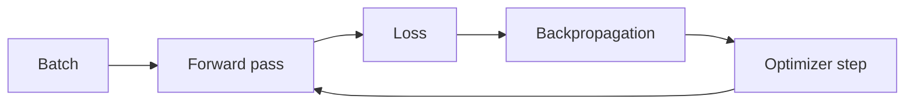

# Deep Learning

Deep Learning usa redes neurais com múltiplas transformações para aprender
representações. Pode absorver padrões em texto, imagem e áudio, mas exige dados,
compute, controle de experimentos e diagnóstico proporcional à complexidade.

## Como funciona

Uma camada aplica transformação linear e não linear. A forward pass produz
predição e loss; backpropagation calcula gradientes pela regra da cadeia; um
optimizer atualiza parâmetros. Batch, learning rate, inicialização,
normalização e precisão numérica afetam estabilidade.

## Arquiteturas como inductive bias

- convoluções exploram localidade e compartilhamento espacial;
- recorrência modela sequência com estado, mas limita paralelismo;
- attention relaciona posições dinamicamente;
- Transformers combinam attention, MLP, residual connections e normalization.

Arquitetura não substitui dados nem avaliação. Um modelo pré-treinado menor pode
ser melhor quando latência, privacidade ou custo dominam.

## Diagnóstico

Observe curvas de treino/validação, gradientes, distribuição de ativações,
throughput, utilização e exemplos de erro. Na inferência, meça qualidade por
slice, batching, filas, cold start e custo. Reprodutibilidade requer seeds,
versões, ambiente e dados; ainda pode haver não determinismo de hardware.

## Segurança

Modelos e checkpoints são artefatos de supply chain. Verifique procedência,
formato de serialização e execução de código ao carregar. Considere poisoning,
evasion, extração, exposição de dados e dependência de modelos remotos.

## Exercícios

- **Beginner:** treine uma MLP pequena e relacione cada curva a uma hipótese.
- **Intermediate:** compare regularização e early stopping sob overfitting induzido.
- **Advanced:** profile treino e inferência; melhore throughput sem violar qualidade.
- **Expert:** avalie distillation/quantization com qualidade por segmento e custo.

## Referências

- [PyTorch documentation](https://pytorch.org/docs/stable/index.html)
- [Deep Learning — Goodfellow, Bengio e Courville](https://www.deeplearningbook.org/)
- [NIST Adversarial Machine Learning Taxonomy](https://doi.org/10.6028/NIST.AI.100-2e2025)

---

[← Machine Learning](../machine-learning/README.md) · [↑ Inteligência Artificial](../README.md) · [LLMs →](../llm/README.md)
