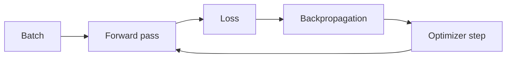

# Deep Learning

Deep Learning usa redes neurais com múltiplas transformações para aprender
representações. Ele é poderoso porque pode extrair features diretamente de dados
complexos, mas o problema de engenharia não é apenas “treinar uma rede”. É
conseguir explicar **por que ela aprende, quando deixa de generalizar, onde o
compute é gasto, como diagnosticar instabilidade e quais garantias o sistema não
oferece**.

## Modelo mental

Uma rede neural é uma função parametrizada. Durante treino, escolhemos parâmetros
que reduzem uma função de erro em dados observados. Durante inferência, congelamos
esses parâmetros e usamos a função aprendida para estimar uma saída.

```text
dados → forward pass → predição → loss → gradientes → optimizer → novos parâmetros
```

O ciclo parece simples, mas cada etapa carrega hipóteses: distribuição dos dados,
escala das features, capacidade do modelo, função de loss, precisão numérica e
estratégia de otimização. Deep Learning não remove essas escolhas, apenas as
empurra para um espaço de parâmetros muito maior.

## Como funciona por dentro

Uma camada densa típica calcula:

`y = activation(Wx + b)`

A composição de muitas camadas cria uma função capaz de representar relações
complexas. A forward pass calcula a saída e a loss. Backpropagation aplica a
regra da cadeia para obter o gradiente da loss em relação a cada parâmetro. O
optimizer usa esses gradientes para atualizar pesos.



A backpropagation não “descobre a solução”. Ela fornece uma direção local de
mudança. O optimizer decide como transformar essa direção em passo.

## Gradientes, escala e estabilidade

Gradientes podem desaparecer ou explodir quando atravessam muitas operações.
Residual connections, normalization, inicialização cuidadosa e arquiteturas
modernas ajudam a manter sinal útil.

Observe:

- norma dos gradientes;
- distribuição de ativações;
- proporção de parâmetros quase sem atualização;
- loss por batch e por epoch;
- ocorrência de `NaN`/`Inf`;
- sensibilidade ao learning rate.

Gradient clipping pode limitar explosões, mas não corrige uma modelagem errada.
Uma loss que cai enquanto a métrica de negócio piora também é um sinal de
objetivo desalinhado.

## Otimização

### Learning rate

É um dos hiperparâmetros mais importantes. Alto demais pode oscilar ou divergir;
baixo demais desperdiça compute e pode prender o treino em regiões ruins.
Schedulers ajustam o passo ao longo do treinamento.

### Batch size

Batch maior aumenta paralelismo e reduz ruído do gradiente, mas consome memória e
não garante melhor generalização. Batch menor introduz ruído que às vezes ajuda
exploração. O “melhor” batch depende de hardware, dados e objetivo.

### Optimizers

SGD, Momentum, Adam e variantes implementam compromissos diferentes. Adam costuma
ser conveniente em muitos cenários, mas o optimizer não substitui análise de
dados, normalização ou escolha de loss.

## Generalização: treino não é o objetivo final

Um modelo pode memorizar exemplos de treino e falhar em dados novos. A pergunta
central é a diferença entre **erro de treino e erro de generalização**.

Sinais de overfitting:

- loss de treino continua caindo enquanto validação piora;
- desempenho excelente em exemplos frequentes e ruim no long tail;
- sensibilidade excessiva a pequenas mudanças irrelevantes;
- gap forte entre ambientes ou populações.

Mitigações incluem:

- mais dados representativos;
- regularização;
- data augmentation;
- early stopping;
- redução de capacidade;
- validação por slices;
- revisão do leakage entre treino e validação.

## Dataset e leakage

Uma rede não aprende “o problema real”; ela aprende padrões presentes nos dados.
Se o dataset contém informação que não estará disponível em produção, o modelo
pode parecer ótimo offline e falhar no mundo real.

Exemplos de leakage:

- dividir aleatoriamente séries temporais e deixar futuro no treino;
- cópias quase idênticas em treino e teste;
- target codificado em uma feature indireta;
- exemplos de um mesmo usuário espalhados entre splits quando isso viola a
  hipótese de independência.

Antes de sofisticar arquitetura, valide o pipeline de dados.

## Arquiteturas como inductive bias

Arquitetura expressa hipóteses sobre a estrutura do problema.

### Convolutional Neural Networks

Convoluções exploram localidade e compartilhamento de parâmetros. Funcionam bem
quando padrões locais importam, especialmente em visão e sinais.

### Redes recorrentes

RNNs e variantes mantêm estado sequencial. Modelam dependências temporais, mas o
processamento passo a passo limita paralelismo e torna dependências longas mais
difíceis.

### Attention

Attention permite que uma posição combine informação de outras posições de forma
dinâmica. O custo clássico da self-attention cresce quadraticamente com o número
de posições, o que importa para sequências longas.

### Transformers

Transformers combinam attention, MLPs, residual connections e normalization. A
arquitetura favorece paralelismo durante treino e se tornou dominante em texto e
muitos cenários multimodais.

Arquitetura não substitui dados nem avaliação. Um modelo menor e bem ajustado
pode vencer outro maior quando latência, privacidade ou custo dominam.

## Precisão numérica

Treino moderno frequentemente usa FP32, FP16, BF16 ou combinações. Menor precisão
reduz memória e aumenta throughput, mas pode introduzir underflow, overflow e
instabilidade.

Mixed precision mantém operações sensíveis em precisão maior e usa formatos
menores onde seguro. A validação deve comparar **qualidade e estabilidade**, não
apenas velocidade.

## Compute e memória

O custo de uma iteração inclui:

- parâmetros;
- gradientes;
- estados do optimizer;
- ativações necessárias para backprop;
- input batches;
- comunicação em treino distribuído.

Checkpointing de ativações troca compute por memória ao recalcular partes da
forward pass. Gradient accumulation simula batch maior usando múltiplos passos
antes do optimizer update.

## Treino distribuído

### Data parallelism

Cada worker recebe parte do batch e mantém cópia do modelo. Gradientes são
agregados antes do update. O gargalo pode migrar de GPU para rede.

### Model/tensor parallelism

Divide o próprio modelo entre dispositivos quando ele não cabe em um único
accelerator. Aumenta comunicação e complexidade de execução.

### Pipeline parallelism

Distribui grupos de camadas e processa microbatches como pipeline. Bolhas de
pipeline e balanço desigual reduzem utilização.

Escalar de 1 para 8 GPUs não implica 8x de throughput. Meça eficiência de escala,
comunicação e tempo ocioso.

## Garantias e limites

Deep Learning não garante:

- causalidade porque aprendeu correlação;
- robustez fora da distribuição observada;
- explicabilidade suficiente para qualquer domínio;
- fairness entre populações não representadas;
- invariância a pequenas perturbações;
- reprodutibilidade bit a bit em todo hardware;
- melhoria por simplesmente aumentar parâmetros.

Qualquer garantia precisa estar ligada a um teste, domínio de entrada e versão do
modelo.

## Diagnóstico de treino

Quando o treino falha, investigue por camadas.

### Loss não cai

Verifique:

1. labels e preprocessing;
2. range das features;
3. learning rate;
4. gradientes zero/NaN;
5. função de loss;
6. capacidade do modelo;
7. bug no loop de treino.

Tente primeiro overfit em um batch minúsculo. Se o modelo não consegue memorizar
um conjunto pequeno, há forte chance de bug ou objetivo incompatível.

### Treino instável

Procure spikes de loss, exploding gradients, batch anômalo, precision overflow,
normalização errada ou mudança de distribuição.

### Validação piora

Compare slices, leakage, regularização e diferença entre pipeline de treino e de
inferência.

## Inferência

Na produção, o gargalo muda. Não há backpropagation, mas há requisitos de
latência, disponibilidade, memória e custo.

Meça:

- p50/p95/p99 de latência;
- throughput por dispositivo;
- batch size efetivo;
- queue time;
- utilização de GPU/CPU;
- memória máxima;
- cold start;
- custo por mil inferências;
- qualidade por slice.

Dynamic batching aumenta throughput ao agrupar requisições, mas adiciona espera.
A decisão depende do budget de latência.

## Quantization, pruning e distillation

### Quantization

Representa pesos/ativações com menos bits. Pode reduzir memória e melhorar
throughput, mas a perda de qualidade precisa ser medida por slice.

### Pruning

Remove parâmetros/conexões com pouca contribuição aparente. Ganho real depende
do hardware e do formato de sparsity suportado.

### Distillation

Treina um modelo menor para aproximar comportamento de um modelo maior. O
student pode ficar mais barato, mas herda parte dos vieses do teacher e precisa
de avaliação própria.

## Observabilidade

Durante treino, registre:

- versão do código e dataset;
- seed e hiperparâmetros;
- curvas de loss/métricas;
- gradientes;
- utilização e memória;
- throughput;
- checkpoints;
- falhas de worker.

Durante inferência, monitore:

- latência;
- erros;
- saturação;
- drift de input;
- distribuição de outputs;
- qualidade amostrada;
- versão do modelo;
- fallback rate.

Logs não devem armazenar dados sensíveis sem necessidade. Prefira metadados,
identificadores e amostragem controlada.

## Segurança

Modelos e checkpoints são artefatos de supply chain. Verifique procedência,
formato de serialização e execução de código ao carregar. Considere:

- poisoning de dados;
- backdoors em modelos;
- evasion/adversarial examples;
- model extraction;
- membership inference;
- exposição de dados memorizados;
- dependência de endpoints remotos comprometidos.

Um checkpoint vindo de fonte desconhecida não deve ser tratado como um arquivo de
dados inerte se o formato pode executar código durante desserialização.

## Testes

Combine diferentes níveis:

- teste do pipeline de preprocessing;
- shape/dtype invariants;
- overfit em dataset minúsculo;
- teste de gradient sanity;
- comparação contra baseline;
- regressão por slice;
- compatibilidade de checkpoint;
- teste de export/inference runtime;
- benchmark de latência e memória;
- stress de batch/concurrency;
- adversarial/red-team quando o risco justificar.

## Modos de falha em produção

### O modelo ficou lento sem mudar pesos

Investigue batcher, fila, runtime, driver, hardware compartilhado, tamanho dos
inputs e mudança de concorrência.

### Métrica offline permanece boa, negócio piora

Procure drift, mudança de população, proxy metric desalinhada ou diferença entre
feedback real e dataset de avaliação.

### Nova quantização reduz média só 1%, mas reclamações aumentam

Analise slices. Uma pequena queda média pode concentrar grande dano em um grupo
específico.

### Worker de treino morre repetidamente

Verifique OOM, fragmentation, checkpoint frequency, data loader e comunicação
entre workers. Recovery deve evitar reiniciar todo o job quando a plataforma
suporta retomada segura.

## Laboratório progressivo

### Beginner

Treine uma MLP pequena. Faça overfit deliberado em poucos exemplos e relacione
cada curva a uma hipótese.

### Intermediate

Induza overfitting em dataset controlado. Compare weight decay, dropout e early
stopping, mantendo o mesmo split.

### Advanced

Profile treino e inferência. Meça throughput, memória e latência; aplique mixed
precision ou batching e prove que a qualidade permaneceu dentro do limite.

### Expert

Compare modelo base, quantized e distilled por qualidade, p99, memória e custo.
Defina critério de promoção e rollback e simule drift em um slice importante.

## Projeto

Construa um pequeno serviço de classificação ou embeddings com pipeline
reproduzível:

1. dataset versionado;
2. baseline simples;
3. treino com métricas por slice;
4. export do modelo;
5. endpoint de inferência;
6. benchmark de capacidade;
7. monitoramento de drift;
8. canary entre duas versões;
9. rollback documentado.

O projeto só está concluído quando você consegue explicar **qual mecanismo limita
qualidade, memória e latência**.

## Referências

- [PyTorch documentation](https://pytorch.org/docs/stable/index.html)
- [Deep Learning — Goodfellow, Bengio e Courville](https://www.deeplearningbook.org/)
- [NIST Adversarial Machine Learning Taxonomy](https://doi.org/10.6028/NIST.AI.100-2e2025)

---

[← Machine Learning](../machine-learning/README.md) · [↑ Inteligência Artificial](../README.md) · [LLMs →](../llm/README.md)
