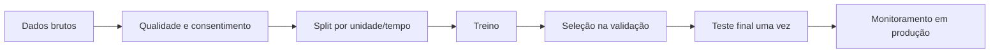

# Fundamentos de Inteligência Artificial

Inteligência Artificial não começa com modelo. Começa com uma decisão que queremos melhorar usando dados. O objetivo deste capítulo é construir um **modelo mental básico** para distinguir problema, dados, aprendizado, avaliação e operação antes de entrar em Machine Learning, Deep Learning ou LLMs.

## Enquadrar antes de modelar

Converta a ideia em uma decisão: qual input existe no momento da previsão, qual output altera o produto, quem sofre com falsos positivos/negativos e qual baseline atual precisa ser superado. Se a resposta correta exige informação indisponível no input, trocar o modelo não corrige o problema.

Exemplo: “prever se um cliente vai cancelar” é amplo demais. Uma formulação melhor seria: “a cada manhã, estimar a probabilidade de cancelamento nos próximos 30 dias usando apenas dados disponíveis até aquele instante para decidir quem recebe uma ação de retenção”. Agora temos tempo, input, output e ação.

## Modelo mental: aprender uma função a partir de exemplos

Em muitos sistemas de ML, temos exemplos `x` e queremos produzir uma saída `y`. O treinamento ajusta parâmetros de uma função `f(x; θ)` para reduzir uma loss sobre exemplos conhecidos. Depois usamos os parâmetros aprendidos para inferência em exemplos novos.

```text
exemplos + objetivo
      ↓
treinamento → parâmetros
      ↓
novo input → modelo → previsão → decisão
```

O ponto crucial é **generalização**. Memorizar o treino não basta; o modelo precisa manter qualidade em dados que não viu. Por isso separar treino, validação e teste é parte do raciocínio, não burocracia estatística.

## Vocabulário mínimo

- **feature:** representação usada como entrada;
- **label/target:** resultado usado como supervisão;
- **parameter:** valor aprendido pelo treino;
- **hyperparameter:** escolha externa ao processo de otimização;
- **loss:** objetivo numérico otimizado;
- **inference:** aplicação do modelo a novos dados;
- **generalization:** desempenho sobre exemplos fora do treino;
- **distribution shift:** produção deixa de refletir a distribuição avaliada;
- **baseline:** solução simples contra a qual o modelo precisa provar valor;
- **threshold:** ponto de corte que transforma score/probabilidade em ação discreta.

## Tipos de problema

- **classificação:** escolher categoria, como fraude/não fraude;
- **regressão:** prever quantidade contínua, como demanda;
- **ranking:** ordenar opções por relevância;
- **clustering:** agrupar exemplos sem label explícito;
- **geração:** produzir texto, imagem, áudio ou outra estrutura;
- **recomendação:** selecionar itens relevantes para usuário/contexto.

O tipo técnico não define sozinho a solução. Duas classificações podem ter custos de erro completamente diferentes.

## Dados e splits

Separe treino, validação e teste pela unidade real de generalização. Em séries temporais, treino no passado e teste no futuro. Se registros do mesmo usuário ou documento aparecem nos dois lados, o score pode refletir leakage, não aprendizado.



Data leakage acontece quando o modelo recebe informação que não existiria no momento real da decisão. Um exemplo clássico é usar `cancellation_date` para prever cancelamento. O score offline fica excelente, mas o modelo aprendeu uma pista impossível em produção.

## Métricas e custos de erro

Accuracy esconde classes raras. Para classificação, examine matriz de confusão, precision, recall, F1, ROC-AUC e PR-AUC conforme decisão. Calibração pergunta se eventos previstos com 70% ocorrem aproximadamente 70% das vezes. Métrica offline é proxy: defina também resultado de produto e guardrail de dano.

Exemplo: em detecção de fraude, falso negativo pode custar dinheiro; falso positivo pode bloquear cliente legítimo. Não existe threshold “correto” sem discutir esse custo.

Uma matriz simples ajuda:

| | Real positivo | Real negativo |
| --- | --- | --- |
| Previsto positivo | true positive | false positive |
| Previsto negativo | false negative | true negative |

Precision pergunta “dos que marquei positivos, quantos eram?”. Recall pergunta “dos positivos reais, quantos encontrei?”.

## Garantias e limites

Um modelo **não garante verdade**. Ele produz uma saída condicionada aos dados, ao objetivo e à distribuição observada. Mesmo uma probabilidade bem calibrada não diz que um indivíduo específico “vai acontecer”; ela descreve frequência esperada sob condições semelhantes.

Também não há garantia de que qualidade offline continue em produção. Dados mudam, comportamento muda, upstream muda e decisões do próprio modelo podem alterar o ambiente. Por isso ML é um sistema contínuo de dados, avaliação e monitoramento.

## Baseline antes de complexidade

Antes de treinar algo sofisticado, compare com alternativas simples:

- regra fixa;
- média histórica;
- regressão linear/logística;
- busca lexical;
- decisão humana existente.

Se o modelo complexo ganha 0,2% em métrica offline e triplica custo operacional, talvez não seja uma melhoria. O baseline dá contexto ao ganho.

## Treino, validação e teste

- **treino:** ajusta parâmetros;
- **validação:** escolhe hyperparameters, threshold e versão;
- **teste:** estima qualidade final em dados não usados na seleção.

Usar o teste repetidamente para escolher modelo faz o teste virar validação disfarçada. Em produção, mantenha avaliação online e datasets de regressão porque o mundo real continua mudando.

## Risco ao longo do ciclo

- proveniência, licença, consentimento e representatividade dos dados;
- vieses de medição e de seleção;
- privacidade e memorization;
- robustez a inputs adversariais;
- transparência sobre limites e recurso para contestação;
- drift, rollback e retirement do modelo.

## Observação em produção

Mesmo no nível básico, acompanhe pelo menos:

- distribuição de inputs principais;
- taxa de previsões por classe/score;
- latência e erro de inferência;
- qualidade quando labels chegam;
- resultado de negócio relacionado;
- diferenças importantes entre segmentos.

Uma mudança brusca na distribuição pode sinalizar bug de pipeline antes de qualquer queda visível em accuracy.

## Laboratório inicial

Use um dataset pequeno de churn ou spam.

1. Defina a decisão e um baseline sem ML.
2. Faça split correto evitando leakage.
3. Treine um modelo simples.
4. Calcule matriz de confusão em dois thresholds.
5. Explique quem sofre com cada tipo de erro.
6. Simule mudança na distribuição de uma feature.
7. Descreva quais métricas alertariam sobre a mudança.

O objetivo não é maximizar score. É conseguir explicar o caminho **problema → dados → modelo → decisão → risco**.

## Exercícios

- **Beginner:** calcule precision/recall para dois thresholds e explique quem é afetado.
- **Intermediate:** construa split que evita leakage por usuário e compare o score ingênuo.
- **Advanced:** defina métricas, baseline e plano de rollback para uma decisão real.
- **Expert:** execute threat modeling e análise de impacto com stakeholders afetados.

## Perguntas de revisão

- Qual informação existe no momento da previsão?
- Qual baseline o modelo precisa superar?
- Por que accuracy pode enganar?
- O que diferencia treino, validação e teste?
- O que é leakage?
- Por que um bom score offline não garante sucesso em produção?

## Referências

- [NIST AI RMF 1.0](https://doi.org/10.6028/NIST.AI.100-1)
- [Google — Rules of ML](https://developers.google.com/machine-learning/guides/rules-of-ml)
- [Google — Problem Framing](https://developers.google.com/machine-learning/problem-framing)

---

[← Visão geral](../README.md) · [↑ Inteligência Artificial](../README.md) · [Machine Learning →](../machine-learning/README.md)
