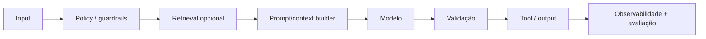
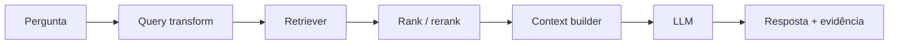
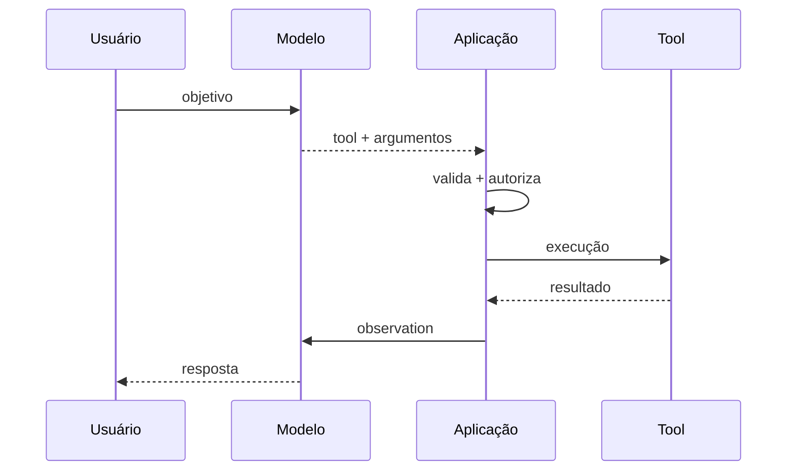

# Generative AI

Generative AI produz texto, imagem, áudio, vídeo ou estruturas condicionadas a
input. Em aplicações, o problema interessante começa depois da primeira demo:
como controlar contexto, variância, conhecimento, custo, direitos, segurança e
efeitos downstream.

Um sistema generativo de produção raramente é apenas `prompt → modelo → texto`.
Ele costuma ter retrieval, políticas, tools, validação, observabilidade, fallback
e avaliação contínua.

## 1. Padrões de aplicação

| Padrão | Adequado para | Controle principal |
| --- | --- | --- |
| transformação | resumir, classificar, extrair | schema e casos avaliados |
| geração assistida | rascunho, explicação, código | revisão e provenance |
| RAG | conhecimento mutável/privado | retrieval e grounding |
| tool calling | consultar ou agir em sistemas | autorização fora do modelo |
| workflow | sequência conhecida | estado/transições explícitas |
| agent | escolha adaptativa de ações | budgets, sandbox e evals |

Comece pela solução menos autônoma que atende ao requisito. Um workflow
determinístico com uma etapa de geração é mais fácil de prever que um agent loop
quando a sequência de passos já é conhecida.

## 2. O pipeline real



Cada seta é uma boundary de falha. Um erro atribuído ao "LLM" pode, na prática,
vir de retrieval ruim, contexto truncado, schema permissivo ou tool autorizada de
forma excessiva.

## 3. Prompt engineering como engenharia de interface

Um prompt útil define:

- tarefa;
- contexto confiável;
- dados não confiáveis;
- restrições;
- formato;
- critérios de abstention;
- exemplos representativos.

Versione prompts como código e associe versão a métricas. Evite otimizar prompt
olhando apenas três exemplos felizes.

### Instrução versus dado

Conteúdo recuperado, email, HTML e texto do usuário são dados não confiáveis.
Mesmo que contenham frases imperativas, não devem ganhar autoridade só porque
foram concatenados ao prompt.

Separe claramente:

```text
policy/instruções do sistema
contexto recuperado
input do usuário
```

Essa separação ajuda o modelo, mas não é uma security boundary suficiente para
ações privilegiadas.

## 4. Structured outputs

Schema reduz variância de forma, não garante verdade semântica.

Exemplo:

```json
{
  "decision": "approve",
  "confidence": 0.97
}
```

Mesmo JSON válido pode conter uma decisão proibida ou confidence sem significado
calibrado.

Depois do parse:

1. valide tipos e limites;
2. valide invariantes de negócio;
3. resolva identificadores contra fonte confiável;
4. autorize o efeito;
5. registre evidência suficiente.

Nunca envie texto gerado diretamente para shell, SQL, template HTML ou API
privilegiada.

## 5. RAG: separar conhecimento de comportamento

Retrieval-Augmented Generation recupera conteúdo e o apresenta ao modelo durante
a inferência.



RAG é especialmente útil quando conhecimento:

- muda com frequência;
- é privado;
- precisa de provenance;
- é grande demais para contexto fixo;
- não deveria ser codificado nos pesos.

## 6. Ingestão em RAG

Antes da busca existe um pipeline de dados:

```text
source
→ autorização/licença
→ parsing
→ normalização
→ chunking
→ metadata
→ embedding/index
→ versionamento
```

Erro de ingestão vira erro de resposta semanas depois. Preserve provenance:
source, versão, timestamp, tenant e permissões.

Um índice sem lineage é uma caixa-preta difícil de corrigir.

## 7. Chunking

Chunk pequeno melhora precisão local, mas pode perder contexto. Chunk grande
preserva contexto, mas dilui sinal e consome janela.

Não existe tamanho universal. Avalie por tipo de documento.

Para documentação técnica, estrutura semântica pode importar mais que um corte a
cada N caracteres:

- heading;
- seção;
- função/classe;
- tabela;
- parágrafo relacionado.

Teste retrieval, não escolha chunking por superstição.

## 8. Embeddings

Embedding representa conteúdo em um espaço vetorial onde proximidade busca
capturar semelhança relevante ao modelo.

Isso não significa que distância vetorial seja verdade ou autorização.

Cuidados:

- modelo de embedding e versão;
- idioma/domínio;
- normalização;
- dimensão/custo;
- rebuild do índice em migração;
- isolamento entre tenants;
- remoção de dados.

Trocar embedding model pode exigir reindexação e nova avaliação.

## 9. Retrieval híbrido

Busca vetorial funciona bem para semântica, mas lexical é forte em:

- IDs;
- nomes exatos;
- códigos de erro;
- versões;
- símbolos de programação.

Combinar lexical + vetorial pode melhorar cobertura. Reranking pode reordenar um
conjunto inicial com modelo mais caro.

Arquitetura típica:

```text
broad retrieval barato
→ candidate set
→ rerank mais preciso
→ contexto pequeno e relevante
```

## 10. Metadata filtering

Filtre antes ou durante retrieval por metadata confiável:

- tenant;
- ACL;
- produto;
- data;
- idioma;
- versão.

Não recupere documento proibido para depois pedir ao LLM "não mencionar". A
boundary de autorização precisa acontecer antes de conteúdo sensível entrar no
contexto.

## 11. Context building

Mais contexto não é automaticamente melhor. Contexto excessivo aumenta:

- custo;
- latência;
- conflito;
- distração;
- risco de prompt injection;
- chance de truncar informação crítica.

Monte contexto por budget. Preserve fonte e posição para citações.

Se documentos se contradizem, a aplicação precisa definir política de freshness
e autoridade, em vez de esperar que o modelo adivinhe.

## 12. Grounding e citações

Pedir citações é útil somente se a aplicação consegue verificar de onde cada
afirmação veio.

Avalie separadamente:

- **answer correctness:** resposta está correta?
- **faithfulness:** resposta é sustentada pelo contexto?
- **retrieval recall:** a evidência necessária foi recuperada?
- **citation correctness:** a citação realmente sustenta a frase?

Um modelo pode citar um documento real que não prova a conclusão.

## 13. Falhas de RAG

| Falha | Sintoma | Onde investigar |
| --- | --- | --- |
| documento ausente | resposta inventa/falha | ingestão/retrieval recall |
| chunk ruim | evidência fragmentada | parsing/chunking |
| filtro errado | dado cruza tenant | metadata/authz |
| ranking ruim | fonte certa fica abaixo | retriever/reranker |
| contexto enorme | resposta ignora fonte | context builder |
| fonte antiga | resposta desatualizada | freshness/version |
| injection em documento | modelo desvia | policy/tool authorization |

RAG precisa de observabilidade por etapa.

## 14. Tool calling

Tool calling permite que o modelo selecione uma capacidade estruturada.



O modelo **propõe**. A aplicação valida.

## 15. Design de tools

Uma tool robusta possui:

- nome discriminante;
- descrição sem ambiguidade;
- schema estreito;
- enum quando espaço é finito;
- IDs resolvidos por fonte confiável;
- timeout;
- idempotency key para escrita;
- erro estruturado;
- menor permissão possível.

Evite tool `execute_anything(command: string)`. Ela transforma erro de linguagem
em capacidade arbitrária.

## 16. Read versus write tools

Read-only possui risco menor, mas ainda pode expor dados privados. Write tools
podem causar efeitos irreversíveis.

Para ações sensíveis, aplique:

```text
proposta
→ preview do alvo/efeito
→ autorização contextual
→ confirmação quando necessária
→ execução idempotente
→ receipt/audit
```

Não reutilize confirmação vaga feita no começo da conversa para qualquer ação
futura.

## 17. Prompt injection

Prompt injection ocorre quando conteúdo não confiável tenta alterar o
comportamento do modelo.

Em sistemas com retrieval/tools, a defesa real é arquitetura:

- dados não ganham autoridade de policy;
- tools possuem least privilege;
- argumentos são validados;
- acesso a dados é autorizado fora do modelo;
- efeitos sensíveis pedem confirmação/policy;
- output não vira código executável diretamente;
- provenance é preservado.

"Ignore instruções do documento" é orientação útil, não sandbox.

## 18. Model routing

Nem toda tarefa precisa do modelo mais caro.

Routing pode considerar:

- complexidade;
- modalidade;
- contexto necessário;
- sensibilidade;
- latência;
- custo;
- região/compliance.

Mantenha fallback sem criar loop:

```text
modelo pequeno
→ baixa confiança/falha definida
→ modelo maior
→ abstention/humano
```

Fallback infinito é apenas retry caro.

## 19. Caching

Cache pode atuar em:

- resposta determinística;
- retrieval;
- embeddings;
- prefix/context;
- tool read-only.

A chave precisa refletir tudo que muda semântica, incluindo tenant, versão de
prompt/modelo e permissão quando relevante.

Cache multi-tenant mal particionado é risco de vazamento.

## 20. Avaliação offline

Construa dataset a partir de casos reais e falhas conhecidas.

Inclua:

- casos normais;
- edge cases;
- adversariais;
- dados incompletos;
- situações impossíveis;
- inputs em que abstention é correto;
- slices por idioma/tenant/tipo.

Evite dataset composto somente pelos exemplos usados durante prompt tuning.

## 21. Métricas determinísticas

Quando tarefa permite, prefira avaliação objetiva:

- exact match;
- schema validity;
- unit tests para código;
- retrieval recall;
- citation match;
- tool/argument correctness;
- policy violations.

Essas métricas são baratas para regressão e reduzem dependência de julgamento
subjetivo.

## 22. Model-based grading

LLM-as-judge pode escalar avaliação qualitativa, mas precisa de calibração.

Compare judge com humanos e observe:

- viés por estilo/comprimento;
- preferência por determinado modelo;
- sensibilidade à ordem;
- instabilidade;
- dificuldade em detectar fatos fora de seu conhecimento.

Judge é uma métrica, não a verdade.

## 23. Human evaluation

Use rubrica explícita. Exemplo:

```text
correção factual: 0-2
cobertura: 0-2
grounding: 0-2
clareza: 0-2
segurança: pass/fail
```

Faça amostragem cega quando possível. Comentário livre ajuda descoberta, mas
score reproduzível precisa de critérios.

## 24. Online evaluation

Produção adiciona sinais que offline não captura:

- task success;
- abandon/retry;
- escalation;
- latency;
- cost;
- tool errors;
- safety events;
- user correction;
- business outcome.

Não otimize apenas thumbs-up. Métricas de satisfação podem conflitar com
correção, segurança ou custo.

## 25. Custo

Custo fim a fim pode incluir:

```text
input tokens
+ output tokens
+ embeddings
+ reranking
+ vector/search infra
+ tool calls
+ retries
+ observabilidade
```

Meça por tarefa bem-sucedida, não apenas por request.

Um modelo barato que exige três retries pode custar mais que um modelo melhor na
primeira tentativa.

## 26. Latência

Decomponha:

```text
queue
+ retrieval
+ rerank
+ prompt assembly
+ model TTFT
+ generation
+ tools
+ validation
```

Streaming melhora percepção, mas não reduz necessariamente tempo até conclusão
da tarefa.

Defina deadline e cancellation. Se usuário abandona a resposta, não mantenha
model/tool calls caros sem necessidade.

## 27. Privacidade

Antes de enviar dado a um modelo ou index:

- classifique;
- minimize;
- verifique base legal/política interna;
- defina retenção;
- controle região/tenant;
- redija secrets;
- considere logs e traces do provedor.

Embeddings derivados de dados sensíveis também fazem parte do lifecycle daquele
dado.

## 28. Direitos e provenance

Para conteúdo gerado/recuperado, registre quando necessário:

- fonte;
- licença/permissão;
- modelo/versão;
- prompt/revision;
- documentos usados;
- transformações;
- revisão humana.

Isso facilita investigação, remoção e auditoria.

## 29. Observabilidade

Registre com cuidado:

- modelo e versão lógica;
- prompt revision;
- latency por etapa;
- token usage;
- retrieval IDs seguros;
- tool selected/result class;
- validation failure;
- fallback;
- evaluation outcome.

Não capture prompt/resposta integral por padrão quando podem conter PII ou
segredos.

## 30. Falhas recorrentes

| Falha | Sintoma | Evidência | Mitigação |
| --- | --- | --- | --- |
| retrieval ruim | hallucination com fonte existente | recall/rank | melhorar ingestão/retrieval |
| contexto demais | resposta dispersa | context size/attention | reduzir/rerank |
| tool excessiva | efeito perigoso | tool audit | least privilege/policy |
| output inválido | parser quebra | schema failure | structured output + validation |
| model drift | regressão após troca | eval por version | gate de avaliação |
| custo explode | tokens/retries | cost/task | routing/budget/cache |
| injection | tool desviada | provenance/trajectory | boundary externa |
| vazamento | dado cruza tenant | retrieval filters | authz antes do contexto |

## 31. Laboratórios

### Beginner

- faça extração estruturada com schema;
- catalogue outputs inválidos;
- defina quando o sistema deve abstain.

### Intermediate

- construa RAG pequeno;
- meça retrieval recall separado de answer correctness;
- adicione citações verificáveis.

### Advanced

- combine vector + lexical + rerank;
- implemente tool read-only com autorização;
- teste prompt injection vindo de documento recuperado.

### Expert

Construa um assistente com RAG multi-tenant e uma tool de escrita. Crie eval set
com casos reais/adversariais, injete documento malicioso, fonte desatualizada,
filtro de tenant incorreto, tool timeout e troca de modelo. Demonstre que a
arquitetura bloqueia acesso indevido, mede regressão e consegue explicar custo e
latência por etapa.

## Referências

- NIST. [Generative AI Profile](https://doi.org/10.6028/NIST.AI.600-1).
- OWASP. [GenAI LLM Top 10](https://genai.owasp.org/initiative/owasp-top-10-for-llm-and-genai/).
- [AI Engineering](../../ai-engineering/README.md).

---

[← LLMs](../llm/README.md) · [↑ Inteligência Artificial](../README.md) · [AI Engineering →](../../ai-engineering/README.md)
