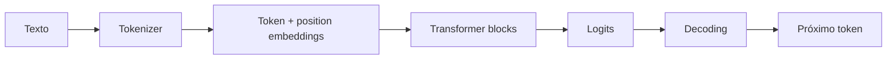

# Large Language Models

Um LLM estima uma distribuição sobre próximos tokens condicionada ao contexto.
Essa interface simples emerge de tokenização, embeddings, várias camadas
Transformer e uma estratégia de decoding; não equivale a banco de fatos ou
executor confiável.

## Do texto à saída

### Tokens

Tokenizers mapeiam texto a IDs de um vocabulário. Palavras, espaços e Unicode
podem ocupar números diferentes de tokens; limite e custo devem ser calculados
com o tokenizer do modelo, não por caracteres.

### Attention e Transformer

Self-attention cria queries, keys e values e pondera relações entre posições.
Multi-head attention permite relações distintas; máscara causal impede olhar
tokens futuros. Residual connections, normalization e feed-forward layers
compõem o bloco. Attention tradicional cresce quadraticamente com sequência,
motivando limites e variantes.

### Context window

É a capacidade máxima de tokens processados em uma interação, incluindo
instruções, histórico, dados, tool schemas e resposta reservada. Caber não
significa ser usado com igual fidelidade: relevância, posição, ruído e conflito
afetam qualidade.

### Decoding

Temperature transforma a distribuição; top-p/top-k restringem candidatos.
Parâmetros menores reduzem variação, mas não criam garantia factual. Outputs
estruturados restringem forma; validação semântica ainda é responsabilidade da
aplicação.

## Adaptação

- **prompting:** muda contexto, barato e rápido, sem alterar pesos;
- **RAG:** recupera evidência atualizável e oferece provenance;
- **fine-tuning:** ajusta comportamento/estilo/tarefa nos pesos;
- **distillation/quantization:** troca capacidade ou precisão por eficiência.

Fine-tuning não é a primeira resposta para conhecimento mutável. Compare sempre
contra baseline, RAG e modelo menor.

## Falhas

Hallucination, contexto ignorado, instruction conflict, prompt injection,
exposição de dados, viés, loops de geração e custo imprevisível. Mitigações
combinam arquitetura, política, retrieval, validação, autorização, UX e revisão;
um prompt isolado não constitui boundary de segurança.

## Exercícios

- **Beginner:** inspecione tokenização de português, emoji, código e whitespace.
- **Intermediate:** compare decoding em tarefa criativa e extração estruturada.
- **Advanced:** construa avaliação que distingue correção, citação e abstention.
- **Expert:** compare prompting, RAG e fine-tuning sob drift, custo e privacidade.

## Papers e fontes

- [Attention Is All You Need](https://arxiv.org/abs/1706.03762)
- [Language Models are Few-Shot Learners](https://arxiv.org/abs/2005.14165)
- [Hugging Face Transformers documentation](https://huggingface.co/docs/transformers/index)

---

[← Deep Learning](../deep-learning/README.md) · [↑ Inteligência Artificial](../README.md) · [Generative AI →](../generative-ai/README.md)
