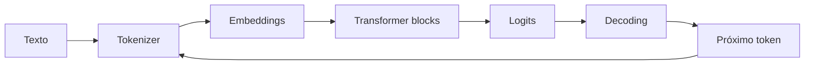

# Large Language Models

Um LLM estima uma distribuição sobre próximos tokens condicionada ao contexto.
Essa interface simples emerge de tokenização, embeddings, várias camadas
Transformer e uma estratégia de decoding.

O ponto mais importante é também o mais fácil de esquecer: o modelo gera a
continuação estatisticamente provável segundo seus pesos e contexto. Ele não é,
por natureza, banco de fatos, executor confiável, sistema de autorização ou
máquina de prova.

## 1. Do texto à saída



Na geração autoregressiva, a saída volta ao contexto e o processo se repete até
critério de parada.

## 2. Tokenização

Tokenizer converte texto em IDs de um vocabulário. Tokens não equivalem a
palavras.

Espaços, acentos, Unicode, código e idiomas diferentes podem ser segmentados de
formas diferentes.

Consequências práticas:

- custo deve ser calculado pelo tokenizer/modelo real;
- "10 mil caracteres" não é uma unidade estável de contexto;
- nomes raros podem ocupar vários tokens;
- código e JSON têm perfil diferente de prosa;
- mudança de tokenizer altera comprimento e comportamento.

Teste seu corpus, especialmente português, código e dados estruturados.

## 3. Embeddings de tokens

Cada token ID é mapeado para um vetor. O modelo opera sobre representações
numéricas, não sobre strings diretamente.

Informação de posição também precisa entrar no modelo de alguma forma para que:

```text
"cão morde homem"
```

não seja indistinguível de:

```text
"homem morde cão"
```

Arquiteturas usam mecanismos posicionais específicos. O princípio é que attention
sozinha precisa saber a relação entre posições.

## 4. Self-attention

Em uma camada de attention, representações produzem queries, keys e values.
Intuitivamente:

- query representa o que uma posição procura;
- key representa como outra posição pode ser encontrada;
- value carrega informação a combinar.

Scores entre query e keys determinam pesos usados sobre values.

```text
attention(Q, K, V) = softmax(QKᵀ / √d) V
```

A fórmula ajuda a entender custo: comparar muitas posições entre si cria trabalho
que cresce fortemente com comprimento da sequência em attention densa.

## 5. Máscara causal

Modelos autoregressivos não devem olhar tokens futuros durante treinamento de
next-token prediction.

A máscara causal impede uma posição de usar informação posterior.

Isso preserva a mesma direção disponível na inferência: prever token seguinte a
partir do prefixo.

## 6. Multi-head attention

Múltiplas heads permitem que o bloco represente relações diferentes em paralelo.
Não interprete cada head como uma regra humana estável e simples, mas o mecanismo
aumenta capacidade de combinar sinais distintos.

Depois de attention, projeções, MLP/feed-forward, residual connections e
normalization formam o bloco Transformer.

## 7. Residual connections

Residual connections permitem que uma camada aprenda uma transformação sobre
representação que também possui caminho de identidade.

Elas ajudam otimização e fluxo de gradiente em redes profundas.

Normalization estabiliza escalas das ativações conforme arquitetura.

Esses componentes parecem detalhes matemáticos, mas afetam profundamente
trainability e eficiência.

## 8. Treinamento de next-token prediction

Dado um corpus tokenizado, o modelo aprende a aumentar probabilidade do próximo
token observado.

Exemplo simplificado:

```text
input:  "Kubernetes usa control"
target: "loops"
```

Em sequência real, vários targets podem ser calculados paralelamente durante o
treinamento porque os tokens corretos anteriores são conhecidos.

Inferência é diferente: o próximo token gerado precisa existir antes do seguinte.
Essa diferença explica por que training e decoding possuem perfis de performance
distintos.

## 9. Loss e perplexity

Cross-entropy mede quão bem a distribuição do modelo atribui probabilidade aos
tokens observados.

Perplexity deriva dessa loss e é útil para comparar modelagem de sequência em
condições compatíveis.

Perplexity menor não garante automaticamente:

- melhor factualidade;
- melhor tool use;
- maior segurança;
- melhor experiência em uma tarefa específica.

Avaliação de produto precisa medir a tarefa.

## 10. Pretraining

Pretraining expõe o modelo a grande volume de dados e aprende padrões gerais de
linguagem, código e conhecimento presente no corpus.

A qualidade depende de muito mais que quantidade:

- curadoria;
- duplicação;
- diversidade;
- licença/proveniência;
- mistura de domínios;
- tokenizer;
- compute;
- otimização.

Pesos resultantes comprimem padrões estatísticos. Eles não preservam uma tabela
consultável de fontes.

## 11. Post-training

Modelos destinados a interação passam por etapas adicionais para seguir
instruções, preferências e políticas.

Técnicas podem incluir supervised fine-tuning e otimização com feedback/preference
data.

Post-training altera comportamento, mas não cria garantias formais. Um modelo
bem alinhado ainda precisa de authorization e validation externas quando pode
agir.

## 12. Context window

Context window é o orçamento máximo de tokens processados em uma interação,
incluindo potencialmente:

- system instructions;
- developer/user messages;
- histórico;
- documentos recuperados;
- tool schemas;
- tool results;
- tokens reservados para saída.

Caber na janela não significa que cada trecho terá igual influência.

## 13. Context engineering

A aplicação decide o que merece entrar no contexto.

Um bom context builder prioriza:

- instruções necessárias;
- estado atual;
- evidência relevante;
- exemplos discriminantes;
- schema de tools realmente disponíveis.

Remova ruído. Contexto gigantesco pode aumentar custo e piorar decisão.

## 14. Lost-in-the-middle e conflitos

Modelos podem usar informação de forma desigual conforme posição, relevância e
conflitos internos.

Não esconda um requisito crítico entre dezenas de documentos. Estruture e
priorize.

Quando duas fontes contradizem, defina autoridade/freshness na aplicação. Não
espere que o modelo determine governança documental sozinho.

## 15. KV cache

Na geração autoregressiva, recomputar attention de todo prefixo a cada token seria
caro. Implementações armazenam keys/values de tokens anteriores em KV cache.

Isso troca compute por memória.

Consequências:

- contexto longo aumenta memória por request;
- concorrência pode ser limitada por KV cache, não apenas FLOPs;
- batching de requests com comprimentos diferentes precisa scheduling cuidadoso;
- prefix caching pode reduzir custo quando grande prefixo se repete.

## 16. Prefill versus decode

Inferência possui dois perfis úteis.

### Prefill

Processa o contexto inicial. Pode aproveitar paralelismo sobre tokens de entrada.
Contextos enormes aumentam tempo até primeiro token.

### Decode

Gera tokens sequencialmente. Cada novo token depende do anterior e usa KV cache.

Por isso duas métricas são importantes:

- **TTFT:** time to first token;
- **tokens/s:** velocidade depois que geração começou.

Uma otimização pode melhorar throughput total e piorar TTFT.

## 17. Batching

Servidores agrupam requests para usar acelerador de forma eficiente.

Batching aumenta throughput, mas requests heterogêneas podem bloquear umas às
outras. Continuous batching tenta inserir/remover sequências conforme avançam.

O scheduler de inferência é parte importante do sistema de serving.

## 18. Quantization

Quantization reduz precisão numérica de pesos/ativações em diferentes graus para
diminuir memória e acelerar inferência em hardware compatível.

Trade-off:

```text
menos bits
→ menor memória / potencial maior throughput
→ possível perda de qualidade
```

Não avalie somente benchmark agregado. Compare tarefas e slices reais.

## 19. Distillation

Distillation treina modelo menor para aproximar comportamento/capacidade de um
modelo maior em determinado escopo.

É útil quando:

- custo domina;
- latência é crítica;
- tarefa é mais estreita;
- deployment local importa.

Modelo menor especializado pode ser melhor produto que modelo enorme genérico.

## 20. Fine-tuning

Fine-tuning altera pesos para adaptar comportamento.

É adequado para:

- estilo/formato consistente;
- tarefa repetitiva;
- domain behavior;
- redução de prompt/examples.

Não é primeira escolha para conhecimento que muda toda semana. RAG mantém fatos
externos atualizáveis e citáveis.

## 21. Prompting versus RAG versus fine-tuning

| Necessidade | Primeira opção a testar |
| --- | --- |
| instrução/comportamento simples | prompting |
| conhecimento mutável/privado | RAG |
| comportamento repetitivo especializado | fine-tuning |
| custo/latência | modelo menor/routing/quantization |

Combinações são comuns. A decisão deve sair de evals, não de moda.

## 22. Decoding greedy

Greedy escolhe token mais provável a cada passo.

É determinístico sob condições estáveis de execução, mas escolha local ótima não
garante sequência globalmente melhor.

Pode ser útil em tarefas estruturadas com baixa necessidade de diversidade.

## 23. Temperature

Temperature altera quão concentrada fica a distribuição antes da amostragem.

Menor temperatura reduz diversidade; maior aumenta.

`temperature = 0` não transforma o modelo em fonte factual. Ele apenas muda
estratégia de seleção.

## 24. Top-p e top-k

Top-k restringe candidatos aos k mais prováveis. Top-p mantém menor conjunto cuja
massa acumulada alcança um threshold.

Esses controles afetam criatividade/variância, mas não substituem validação.

Para JSON/tool calls, restrições estruturais são mais confiáveis que tentar
"baixar a criatividade".

## 25. Stop conditions

Geração precisa parar por:

- end token;
- stop sequence;
- tamanho máximo;
- timeout;
- orçamento de custo;
- condição do workflow.

Saída truncada deve ser tratada explicitamente. JSON cortado no limite não é
resposta válida.

## 26. Structured generation

Decoding restrito/schema-aware pode impedir tokens que violam gramática/JSON.

Isso melhora validade sintática, mas o modelo ainda pode preencher:

```json
{"country_code": "ZZ"}
```

quando domínio não aceita `ZZ`.

Validação de domínio continua fora do modelo.

## 27. Hallucination

Hallucination é geração não sustentada ou incorreta apresentada de forma
plausível.

Ela nasce do próprio objetivo generativo: produzir continuação provável, não
executar lookup garantido.

Mitigações:

- retrieval;
- tools;
- fontes citáveis;
- abstention;
- validação;
- UX que mostra incerteza/evidência;
- evals por factualidade.

Nenhuma elimina completamente o problema em uso aberto.

## 28. Calibration e confidence

Probabilidade de token não é automaticamente probabilidade calibrada de a
resposta inteira estar correta.

Não exponha `0.97 confidence` inventado pelo próprio modelo como probabilidade
estatística sem calibração externa.

Quando decisão exige threshold confiável, construa sinal mensurável e valide em
dataset representativo.

## 29. Tool calling

Modelo pode gerar nome de tool e argumentos estruturados.

Isso cria uma separação importante:

```text
modelo decide/propõe intenção
aplicação valida e executa capacidade
```

A aplicação deve:

- verificar se tool está permitida;
- validar schema;
- resolver IDs;
- autorizar caller;
- impor timeout;
- usar idempotência;
- registrar efeito.

Nunca dê ao modelo credencial onipotente e chame isso de guardrail.

## 30. Prompt injection

Conteúdo do usuário ou RAG pode tentar se passar por instrução privilegiada.

O modelo pode não distinguir perfeitamente intenção legítima de texto hostil.

Defesa real inclui:

- hierarquia de instruções;
- dados tratados como não confiáveis;
- least privilege;
- policy externa;
- autorização de tool;
- separação por tenant;
- confirmação de efeitos sensíveis.

## 31. Jailbreak e policy evasion

Jailbreak tenta induzir comportamento proibido por reformulação/contexto.

Não dependa apenas de prompt para controles de alto impacto. Use filtros,
classificadores, policy engine, sandbox e revisão conforme risco.

Segurança é defesa em profundidade.

## 32. Data exfiltration

Um modelo conectado a documentos e tools pode ser induzido a revelar informação
que conseguiu acessar.

Regra fundamental:

> dado que o usuário não pode acessar não deve entrar no contexto acessível àquela
> execução.

Authorization antes do retrieval/tool é mais forte que pedir ao modelo para
esconder depois.

## 33. Memorization

Modelos podem memorizar trechos do treinamento em determinados cenários. Sistemas
que treinam/fine-tunam com dados privados precisam avaliar privacidade,
proveniência e potencial exposição.

Minimize dados, aplique controles de acesso e não use dataset sensível sem
lifecycle claro.

## 34. Evals

Avalie o sistema por tarefa, não apenas o modelo em benchmark genérico.

Inclua:

- correctness;
- grounding;
- format validity;
- tool selection;
- argument correctness;
- abstention;
- safety;
- latency;
- cost.

Cada mudança em modelo, prompt, context builder, retrieval ou tool pode gerar
regressão.

## 35. Determinismo e regressão

Mesmo com parâmetros conservadores, providers, kernels e modelos podem mudar.
Testes não devem depender de texto byte-a-byte quando múltiplas respostas são
válidas.

Prefira invariantes:

- JSON válido;
- campos corretos;
- cálculo correto;
- citação suportando afirmação;
- nenhuma tool proibida;
- resposta dentro da rubrica.

## 36. Model routing

Arquitetura multimodelo pode escolher modelo por:

- dificuldade;
- modalidade;
- contexto;
- sensibilidade;
- região;
- custo;
- latência.

Routing também precisa eval. Classificador ruim pode enviar caso difícil ao
modelo barato e deteriorar qualidade de forma invisível.

## 37. Fallback

Fallback deve responder a falhas específicas:

```text
rate limit → outro deployment
modelo incapaz/baixa qualidade definida → modelo mais forte
provider indisponível → fallback compatível
```

Não faça fallback cego entre modelos com tool/schema diferentes sem contract
tests.

## 38. Caching

Cache pode reduzir custo em prompts repetidos, embeddings e prefixos.

Chave precisa considerar:

- modelo/version;
- prompt revision;
- tenant;
- contexto;
- tool availability;
- parâmetros de decoding.

Resposta gerada com permissão de um usuário não pode ser cache global por texto da
pergunta apenas.

## 39. Observabilidade

Meça:

- input/output tokens;
- TTFT;
- generation time;
- tokens/s;
- queue time;
- error/rate limit;
- model/version;
- prompt revision;
- tool calls;
- validation failures;
- fallback;
- eval outcome.

Evite logar conteúdo completo por padrão. Prompt e resposta podem conter secrets,
PII e dados proprietários.

## 40. Capacity e concorrência

Em serving próprio, capacidade pode ser limitada por:

- memória dos pesos;
- KV cache;
- largura de banda de memória;
- compute;
- tamanho de contexto;
- tamanho do batch;
- output length.

Duas requests com mesmo número de tokens de entrada podem ter custo muito
diferente se uma gera 10 tokens e outra 5 mil.

Modele tokens/s e memória por workload, não apenas requests/s.

## 41. Custos de API

Em modelos hospedados, custo pode combinar input/output, ferramentas, caching,
retrieval e retries.

A métrica útil é:

```text
custo por tarefa bem-sucedida
```

Preço por milhão de tokens isolado não captura loops e falhas.

## 42. Latência de produto

Decomponha:

```text
queue
+ context build
+ prefill/TTFT
+ decode
+ tools
+ validation
```

Streaming melhora percepção de resposta, mas não reduz tempo até uma tool
concluir ou até o resultado final estar validado.

## 43. Modelos locais

Self-hosting pode ser atraente por:

- privacidade;
- controle de latency;
- custo em volume alto;
- customização;
- operação offline.

O custo passa para:

- GPUs/accelerators;
- scheduling;
- autoscaling;
- model loading;
- observabilidade;
- patching;
- supply chain;
- capacidade ociosa.

Compare TCO, não apenas preço por token.

## 44. Segurança de modelos e checkpoints

Pesos/checkpoints são artefatos de supply chain.

Verifique:

- origem;
- licença;
- hash/assinatura quando disponível;
- formato de serialização;
- código remoto executável;
- dependências;
- scanner/policy.

Carregar artefato de origem desconhecida pode executar código em alguns formatos e
stacks.

## 45. Falhas recorrentes

| Falha | Sintoma | Evidência | Resposta |
| --- | --- | --- | --- |
| contexto enorme | TTFT/custo alto | input tokens | retrieval/summarization |
| KV cache saturado | concorrência cai | memory/request | limitar context/batch |
| hallucination | fatos inventados | eval/grounding | RAG/tools/abstention |
| tool insegura | efeito indevido | trajectory/audit | policy + least privilege |
| model drift | regressão após troca | eval por version | release gate |
| output truncado | JSON quebrado | stop reason | budget/schema |
| injection | instrução desviada | input/provenance | boundary externa |
| retry caro | custo/latência explode | attempts/task | bounded fallback |

## 46. Troubleshooting: ficou caro

1. input context cresceu?
2. output ficou maior?
3. retries/fallback aumentaram?
4. RAG envia chunks demais?
5. tool loop repete passos?
6. cache hit caiu?
7. modelo maior passou a receber casos simples?
8. erro de schema está regenerando saída?

## 47. Troubleshooting: ficou pior após trocar modelo

Compare mantendo dataset e pipeline fixos:

- tokenizer/context length;
- tool calling behavior;
- structured output;
- refusal;
- latency;
- cost;
- slices de idioma/domínio;
- prompt sensitivity.

Modelo "mais novo" não garante regressão zero no seu caso.

## 48. Laboratórios

### Beginner

- tokenize português, emoji, JSON e código;
- compare comprimento por conteúdo;
- varie temperature/top-p e observe diversidade.

### Intermediate

- construa geração estruturada com schema;
- force truncamento e validação inválida;
- implemente retry somente da etapa correta.

### Advanced

- meça TTFT e tokens/s variando contexto/output;
- compare prompting, RAG e fine-tuning para conhecimento mutável;
- crie tool com authorization/idempotência.

### Expert

Monte um serviço multimodelo com routing e fallback. Gere workload com contextos
curtos/longos, tool calls e respostas extensas. Meça TTFT, throughput, custo por
tarefa, erro e qualidade. Depois injete prompt injection, provider failure,
context explosion e mudança de modelo e prove que evals e budgets impedem
regressão silenciosa.

## Papers e fontes

- Vaswani et al. [Attention Is All You Need](https://arxiv.org/abs/1706.03762).
- Brown et al. [Language Models are Few-Shot Learners](https://arxiv.org/abs/2005.14165).
- Hugging Face. [Transformers documentation](https://huggingface.co/docs/transformers/index).

---

[← Deep Learning](../deep-learning/README.md) · [↑ Inteligência Artificial](../README.md) · [Generative AI →](../generative-ai/README.md)
