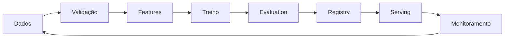

# Machine Learning

Machine Learning ajusta um modelo a partir de dados para realizar previsões ou decisões. O ganho aparece quando regras explícitas não capturam bem o padrão e há feedback suficiente para avaliar generalização.

O salto entre fundamentos e ML intermediário é aprender a tratar o modelo como **um componente probabilístico dentro de um sistema de dados**. O algoritmo importa, mas pipeline, validação, segurança e operação frequentemente determinam se o sistema funciona fora do notebook.

## Famílias

| Família | Sinal de aprendizagem | Exemplos |
| --- | --- | --- |
| supervisionado | labels conhecidos | classificação, regressão, ranking |
| não supervisionado | estrutura dos próprios dados | clustering, redução de dimensão |
| self-supervised | alvo derivado do dado | previsão de token, representação |
| reinforcement learning | recompensa por trajetórias | controle e decisão sequencial |

## Pipeline

1. enquadre decisão e baseline;
2. versione dados e valide schema/distribuição;
3. construa features somente com informação disponível no instante correto;
4. treine primeiro um modelo simples;
5. selecione na validação, reporte uma vez no teste;
6. empacote preprocessing e modelo juntos;
7. monitore input, output, qualidade atrasada e resultado de produto.

## Bias, variance e regularização

Underfitting indica representação/modelo incapaz ou treino insuficiente. Overfitting aparece quando performance de treino melhora sem generalização. Regularização, mais dados relevantes, validação adequada e modelos mais simples podem reduzir variance; complexidade extra só ajuda quando fecha uma lacuna real.

Curvas de aprendizado ajudam a distinguir os casos. Se treino e validação estão ruins, aumentar regularização raramente resolve. Se treino está excelente e validação piora, há sinal de variance/leakage/distribuição inadequada.

## Features e leakage

Feature engineering precisa respeitar o tempo real da decisão. Uma média “dos últimos 30 dias” deve ser calculada somente com eventos disponíveis naquele instante. Pipelines offline que consultam a tabela atual podem vazar futuro.

Também existe leakage indireto:

- ID quase único que codifica grupo/tempo;
- feature produzida depois do evento-alvo;
- preprocessing calculado usando dataset completo antes do split;
- labels revisadas manualmente com informações futuras.

Teste o pipeline usando timestamps e fixtures que simulam o serving real.

## Garantias e limites

ML fornece **garantias condicionais e estatísticas**, não certeza individual. Uma métrica de 95% no teste significa desempenho observado naquele conjunto e sob aquela distribuição, não promessa universal de 95% em produção.

A qualidade depende de hipóteses:

- o teste representa a população futura;
- o label mede o conceito desejado;
- preprocessing é equivalente entre treino e serving;
- a distribuição não mudou além do tolerado;
- o threshold continua alinhado ao custo de erro.

Quando essas hipóteses quebram, o modelo pode degradar mesmo sem bug no código.

## Métricas e threshold

Escolha métrica pela decisão. Para classificação rara, PR-AUC pode ser mais informativa que accuracy. Para ranking, use métricas como nDCG/recall em posições relevantes. Para regressão, MAE e RMSE penalizam erros de maneiras diferentes.

Threshold também é parte do produto. Um modelo pode retornar score contínuo, enquanto a ação precisa decidir “bloquear”, “revisar” ou “aprovar”. O threshold deve refletir custo e capacidade operacional.

Se a fila humana só revisa 1.000 casos/dia, escolher threshold que gera 20.000 alertas destrói o sistema mesmo com boa precision.

## Calibração

Scores não são necessariamente probabilidades calibradas. Se decisões usam risco quantitativo, compare previsão e frequência observada por bins/segmentos. Recalibração pode ser necessária quando distribuição muda.

## Produção

Training-serving skew ocorre quando features são calculadas de forma diferente. Feedback loops surgem quando a previsão muda os dados futuros. Além de drift, observe missing values, faixas, categorias novas, taxa de fallback, calibração e qualidade por segmentos relevantes.

### Batch versus online

- **batch inference:** adequado quando decisão tolera minutos/horas de atraso e favorece throughput;
- **online inference:** necessário quando decisão é síncrona e exige baixa latência;
- **streaming:** útil quando features/eventos mudam continuamente.

A escolha afeta feature freshness, custo e failure modes.

## Drift

Diferencie:

- **data drift:** distribuição de input muda;
- **prediction drift:** distribuição de output muda;
- **concept drift:** relação entre input e target muda;
- **label drift:** frequência do target muda.

Drift não significa automaticamente retreinar. Pode ser campanha legítima, bug de upstream ou mudança desejada. Alertas precisam de investigação e contexto.

## Segurança

Sistemas de ML ampliam a superfície de ataque.

### Data poisoning

Atacante manipula dados de treino para degradar ou direcionar o modelo. Controles: provenance, validação, acesso restrito ao pipeline, revisão de fontes e análise de outliers.

### Evasion/adversarial inputs

Inputs são construídos para explorar fronteiras do modelo. O impacto depende do domínio; detecção de fraude e visão computacional podem exigir testes específicos.

### Model extraction

APIs públicas podem permitir reconstrução aproximada do modelo por muitas queries. Rate limit, monitoramento e redução de informação de output podem ajudar conforme risco.

### Membership/privacy

Modelos podem memorizar ou revelar informação sobre dados de treino. Minimize dados, controle acesso, avalie privacidade e não exponha artefatos de treino indiscriminadamente.

### Supply chain

Modelo serializado é artefato. Formatos que executam código durante load merecem tratamento como software não confiável. Verifique origem, hash, assinatura e ambiente de carregamento.

## Fairness e slices

Média agregada pode esconder degradação em grupos importantes. Avalie por slices definidos por produto/risco e investigue diferenças. A escolha de grupos e métricas exige contexto de domínio, ética e legislação; não existe uma única métrica universal de fairness.

## Deployment

Promova modelos como artefatos versionados com:

- dataset/version de features;
- código de preprocessing;
- hyperparameters;
- métricas;
- owner;
- critérios de aprovação.

Estratégias:

- **shadow:** modelo recebe tráfego sem decidir;
- **canary:** pequena fração usa a nova versão;
- **A/B:** mede impacto de produto quando desenho experimental permite;
- **rollback:** rota volta à versão anterior sem reconstruir pipeline.

## Observabilidade

Monitore quatro camadas:

1. **sistema:** latência, erro, CPU/GPU, memória e filas;
2. **dados:** missing, ranges, categorias, drift;
3. **modelo:** scores, calibração, qualidade quando labels chegam;
4. **produto:** conversão, fraude evitada, revisão humana, reclamações.

Sem labels imediatas, use proxies com cuidado e mantenha pipeline para avaliação atrasada.

## Anti-patterns

- escolher algoritmo antes de definir a decisão;
- otimizar leaderboard enquanto a label é proxy inadequada;
- fazer preprocessing antes do split;
- usar o test set repetidamente como validação;
- promover modelo sem shadow/canary e rollback;
- atribuir causalidade a uma correlação preditiva;
- retreinar automaticamente a cada drift sem diagnóstico;
- comparar modelos em datasets/splits diferentes;
- expor modelo serializado não confiável no runtime.

## Laboratório

Use um dataset tabular de churn ou fraude.

1. Crie baseline de regra e regressão logística.
2. Faça split por tempo/usuário.
3. Introduza leakage intencional e mostre o ganho falso.
4. Compare modelo simples e árvore/boosting no mesmo split.
5. Escolha threshold usando custo de falso positivo/negativo.
6. Empacote preprocessing + modelo em um único pipeline.
7. Faça serving local e compare features offline/online.
8. Simule data drift alterando uma distribuição.
9. Crie dashboard com latência, drift e prediction rate.
10. Modele threat de poisoning/extraction para o cenário.

O relatório deve dizer por que a versão escolhida supera o baseline **e em quais condições essa conclusão deixa de valer**.

## Exercícios

- **Beginner:** compare regra, regressão logística e árvore no mesmo dataset.
- **Intermediate:** introduza leakage intencional e detecte-o pelo pipeline.
- **Advanced:** crie monitor de drift e determine quais alertas exigem label atrasada.
- **Expert:** desenhe experimento que separa ganho do modelo do efeito da interface.

## Referências

- [scikit-learn User Guide](https://scikit-learn.org/stable/user_guide.html)
- [Google Machine Learning Crash Course](https://developers.google.com/machine-learning/crash-course/)
- [TensorFlow — Responsible AI](https://www.tensorflow.org/responsible_ai)
- [NIST Adversarial Machine Learning Taxonomy](https://doi.org/10.6028/NIST.AI.100-2e2025)

---

[← Fundamentos](../fundamentals/README.md) · [↑ Inteligência Artificial](../README.md) · [Deep Learning →](../deep-learning/README.md)
