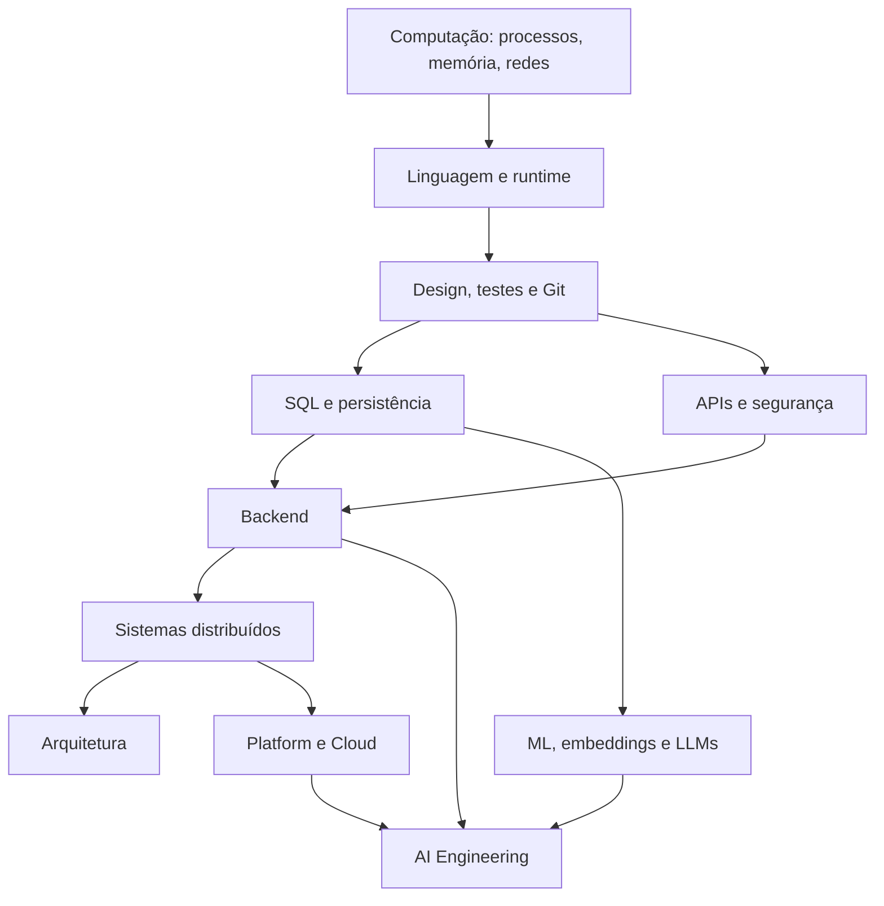

# Atlas do conhecimento

O Atlas converte assuntos em percursos. As setas representam pré-requisitos
conceituais, não barreiras rígidas: é normal alternar leitura, experimento e
projeto quando uma lacuna aparece.

A unidade de progresso não é uma página lida. É uma **evidência produzida**.
Cada etapa deve terminar em código, benchmark, ADR, runbook, post-mortem,
diagrama explicado, experimento ou decisão defendida com dados.

## Níveis

| Nível | Evidência de domínio | Armadilha comum |
| --- | --- | --- |
| 1 · Fundamentos | explica mecanismo e executa exemplo isolado | confundir familiaridade com compreensão |
| 2 · Aplicação | entrega funcionalidade testada e documentada | copiar receita sem medir resultado |
| 3 · Proficiência | diagnostica falhas e compara alternativas | otimizar sem requisito explícito |
| 4 · Sistemas | projeta, opera e evolui sob restrições reais | tratar operação como etapa posterior |

O [contrato dos exercícios](../exercises/README.md) define critérios para os
quatro níveis. O [Pharos](../PHAROS.md) ajuda a decidir quando aprofundar,
avançar ou voltar a um fundamento.

## Como uma trilha funciona

Cada trilha especializada usa o mesmo ciclo:

1. **Diagnóstico:** responda às perguntas de entrada sem consultar material.
2. **Modelo mental:** leia apenas o necessário para explicar o mecanismo.
3. **Laboratório:** isole uma propriedade e torne-a observável.
4. **Projeto:** integre a habilidade a um sistema com restrições reais.
5. **Falha:** injete ou reproduza um modo de falha relevante.
6. **Operação:** defina sinais, SLO, alertas e procedimento de recuperação.
7. **Decisão:** registre trade-offs e uma alternativa rejeitada.
8. **Checkpoint:** explique, implemente, diagnostique e defenda a solução.

Se o leitor consegue apenas repetir definições, o marco ainda não foi concluído.

## Mapa principal

## Trilhas canônicas

| Trilha | Pergunta central | Projeto de síntese |
| --- | --- | --- |
| [Backend Engineer](backend-engineer.md) | como preservar contratos e dados sob concorrência e falha? | API assíncrona resiliente |
| [Software Architect](software-architect.md) | como decidir e evoluir sistemas sob restrições? | evolução arquitetural com ADRs e fitness functions |
| [Distributed Systems](distributed-systems-engineer.md) | como raciocinar quando tempo, rede e nós podem falhar? | serviço replicado com caos e recovery |
| [Platform / Cloud Engineer](platform-cloud-engineer.md) | como oferecer uma plataforma segura e operável para outros times? | golden path com Kubernetes, GitOps e SLOs |
| [AI Engineer](ai-engineer.md) | como integrar modelos probabilísticos com qualidade, custo e segurança? | RAG avaliado evoluído para tools/agente apenas com evidência |

A trilha de [Engenharia de Software](software-engineer.md) continua como percurso
geral e serve de base para quem ainda não quer escolher uma especialização.

## Evidências mínimas por trilha

Uma trilha especializada só deve ser considerada concluída quando existir:

- pelo menos um projeto executável e reproduzível;
- testes de comportamento e de falha;
- uma medição de performance ou capacidade;
- um ADR com alternativa rejeitada;
- um SLO ou objetivo operacional mensurável;
- um runbook exercitado;
- uma análise de segurança proporcional ao domínio;
- uma retrospectiva explicando o que mudou no modelo mental.

## Cadência sugerida

Para 6–8 horas semanais, use blocos de duas semanas:

- **semana 1:** teoria mínima, laboratório e perguntas de controle;
- **semana 2:** integração no projeto, falha, observabilidade e decisão.

Não existe duração fixa. Uma trilha pode levar meses porque experiência de
produção, incidentes e revisão de decisões não é comprimível por calendário.

## Como navegar

1. Escolha a trilha que corresponde ao tipo de problema que quer resolver.
2. Faça o diagnóstico de entrada e marque lacunas concretas.
3. Comece no primeiro marco que ainda não consegue demonstrar.
4. Consulte Codices e Library sob demanda, não em leitura linear obrigatória.
5. Use os [projetos progressivos](../projects/README.md) como laboratório comum.
6. Use [entrevistas](../interview/README.md) para testar explicação e trade-offs.
7. Registre decisões, falhas e descobertas; consulte o Pharos ao terminar.

## Dependências que merecem atenção

- Concorrência pressupõe processos, threads, memória, scheduling e I/O.
- Microservices pressupõem bom desenho modular e capacidade operacional.
- Kubernetes pressupõe containers, redes, health checks e observabilidade.
- Event Sourcing pressupõe domínio, consistência, schema evolution e logs.
- RAG pressupõe recuperação de informação, avaliação e segurança de dados.
- Agentes pressupõem workflows determinísticos, tools seguras e limites de
  autonomia.
- Multi-region pressupõe entender failure domains, consistência e recuperação.

---

[← Início](../README.md) · [↑ Atlas](README.md) · [Backend →](backend-engineer.md)
