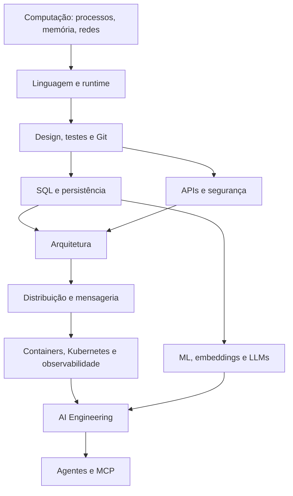

# Atlas do conhecimento

O Atlas converte assuntos em percursos. As setas representam pré-requisitos
conceituais, não barreiras rígidas: é normal alternar leitura e projeto conforme
uma lacuna aparece.

## Níveis

| Nível | Evidência de domínio | Armadilha comum |
| --- | --- | --- |
| 1 · Fundamentos | explica o mecanismo e executa um exemplo isolado | confundir familiaridade com compreensão |
| 2 · Aplicação | entrega uma funcionalidade testada e documentada | copiar uma receita sem medir o resultado |
| 3 · Proficiência | diagnostica falhas e escolhe entre alternativas | otimizar sem requisitos explícitos |
| 4 · Sistemas | projeta, opera e evolui sob restrições reais | tratar distribuição como detalhe de implementação |

Cada etapa deve produzir um artefato: código, explicação, benchmark, ADR,
runbook ou retrospectiva. O [contrato dos exercícios](../exercises/README.md)
define critérios para os quatro níveis.

## Mapa principal

## Percursos por objetivo

| Percurso | Duração sugerida¹ | Projeto de síntese |
| --- | ---: | --- |
| [Engenharia de Software](software-engineer.md) | 9–15 meses | serviço observável evoluído por ADRs |
| [Backend](backend-engineer.md) | 6–12 meses | API assíncrona resiliente |
| [Arquitetura](software-architect.md) | 6–10 meses | proposta e evolução de uma plataforma |
| [AI Engineering](ai-engineer.md) | 5–9 meses | RAG avaliado com tools e guardrails |

¹ A duração é apenas uma referência para 6–8 horas semanais. Evidência vale mais
que calendário.

## Como navegar

1. Faça o diagnóstico do percurso escolhido.
2. Comece no primeiro marco que ainda não consegue demonstrar.
3. Leia o Codex e consulte a Library sob demanda.
4. Resolva pelo menos um exercício prático.
5. Integre a habilidade ao projeto corrente.
6. Registre decisões e lacunas; consulte o [Pharos](../PHAROS.md).

## Dependências que merecem atenção

- Concorrência pressupõe um modelo de processos, threads, memória e I/O.
- Microservices pressupõem bom desenho modular e capacidade operacional.
- Kubernetes pressupõe containers, redes, health checks e observabilidade.
- Event Sourcing pressupõe modelagem de domínio, consistência e operação de logs.
- RAG pressupõe recuperação de informação, avaliação e segurança de dados.
- Agentes pressupõem workflows determinísticos, contratos de tools e limites de
  autonomia.

---

[← Início](../README.md) · [↑ Atlas](README.md) · [Engenharia de Software →](software-engineer.md)
