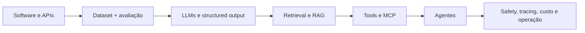

# Percurso: AI Engineering

## Resultado

Integrar modelos probabilísticos a produtos confiáveis, avaliáveis, observáveis
e economicamente sustentáveis. A trilha prioriza baseline, avaliação e controle
de efeitos antes de adicionar autonomia.

## Diagnóstico de entrada

Tente responder sem consultar material:

- como provar que um LLM melhora o produto em relação ao baseline atual?
- como separar erro de retrieval, geração, tool e integração?
- quando RAG é melhor que contexto estático ou fine-tuning?
- que dado não deveria entrar em prompt, log ou vector store?
- quando um agente é necessário e quando um workflow determinístico é melhor?

## Mapa

## Marcos

| Marco | Estude | Evidência de conclusão |
| --- | --- | --- |
| Baseline | problema, métrica, dataset, custo do erro | solução sem LLM ou baseline mensurável |
| Modelo | tokens, contexto, decoding, structured output | chamada validada com timeout e budget |
| Avaliação | golden set, slices, graders, regressão | harness reproduzível antes de prompt tuning |
| RAG | chunking, embeddings, hybrid search, reranking | retrieval medido separadamente da geração |
| Tools | schemas, authz, idempotência, sandbox | tool call validada fora do modelo |
| MCP | hosts, clients, servers, trust boundaries | integração com autorização e auditoria |
| Agentes | state, stop conditions, planning, recovery | comparação contra workflow determinístico |
| Operação | tracing, latency, tokens, safety, drift | SLO, dashboards, testes adversariais e rollback |

## Laboratórios obrigatórios

### Baseline versus LLM

Escolha uma tarefa real e implemente primeiro uma solução simples: regra, busca,
classificador ou template. Compare qualidade, custo e latência com um LLM. O LLM
só vence se a métrica justificar a complexidade.

### Retrieval isolado

Construa um dataset com perguntas e documentos relevantes. Meça recall/precision
ou ranking antes de gerar qualquer resposta. Depois compare dense, lexical,
hybrid e reranking.

### Conteúdo recuperado não é autoridade

Inclua instruções conflitantes em um documento de teste e demonstre que conteúdo
recuperado não pode conceder acesso, trocar policy ou autorizar uma ação.

### Tool com efeito

Crie uma tool de escrita com schema estreito, preview, autorização,
idempotency key e confirmação quando necessária. Force retry e prove que o efeito
não é duplicado.

### Agent versus workflow

Resolva a mesma tarefa com uma state machine e com um agent loop. Compare success
rate, custo, latência, número de passos e falhas. Só mantenha o agente se houver
ganho relevante.

## Projeto de síntese

Evolua os [projetos RAG e AI Agent](../projects/README.md) sobre o mesmo dataset:

1. baseline sem LLM;
2. modelo direto com structured output;
3. RAG com ingestão, retrieval e geração separáveis;
4. eval harness versionado por cenário e slice;
5. citations/provenance verificáveis;
6. tool read-only com autorização;
7. tool de escrita com preview e idempotência;
8. MCP apenas se interoperabilidade justificar o trust boundary;
9. agent loop com step, time e cost budgets;
10. tracing que identifica retrieval, model e tool latency;
11. testes adversariais de instruções, acesso e autonomia excessiva;
12. ADR comparando workflow, RAG e agentic design.

A promoção de workflow para agente é uma decisão arquitetural e precisa de
evidência de avaliação, não entusiasmo com autonomia.

## Checkpoints

### Fundamentos

Explique tokenização, context window, embeddings e decoding sem atribuir ao modelo
garantias que a aplicação precisa fornecer.

### Aplicação

Entregue uma feature de IA com dataset de avaliação, structured output, timeout,
tratamento de erro e budget de custo.

### Proficiência

Receba uma queda de qualidade e separe hipóteses de dados, retrieval, prompt,
modelo, tool e produto usando traces e avaliações reproduzíveis.

### Sistemas

Projete uma aplicação com múltiplos modelos ou providers, dados sensíveis,
failover, quotas, observabilidade, policy de retenção, testes adversariais e
human-in-the-loop.

## Perguntas de entrevista

- Como detectar se um ganho de RAG veio do retrieval ou apenas de um prompt maior?
- Que métricas offline podem divergir do resultado de produto?
- Como calibrar model-based graders para não transformar outro LLM em verdade?
- Onde deve viver autorização de uma tool chamada por agente?
- Como limitar blast radius de uma ação autônoma?
- Quando fine-tuning é preferível a RAG e quando não é?
- Como construir fallback sem esconder uma regressão de qualidade?
- Como investigar aumento de custo por request sem olhar apenas preço por token?

## Critério de conclusão

A trilha termina quando uma mudança de modelo, prompt, índice ou tool passa por
um processo verificável de avaliação e rollout, e autonomia só aumenta quando a
evidência mostra benefício maior que o novo risco.

---

[← Platform / Cloud](platform-cloud-engineer.md) · [↑ Atlas](README.md) · [Pharos →](../PHAROS.md)
