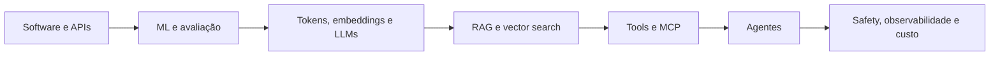

# Percurso: AI Engineering

## Resultado

Integrar modelos probabilísticos a produtos confiáveis, avaliáveis, observáveis
e economicamente sustentáveis.

## Sequência

1. Domine Python ou TypeScript, HTTP, dados, testes e filas.
2. Estude [fundamentos de IA](../artificial-intelligence/README.md) com foco em
   generalização, métricas e limites.
3. Construa uma chamada de modelo com saída estruturada, timeout e orçamento.
4. Implemente RAG separando ingestão, retrieval, geração e avaliação.
5. Adicione tools com schema estreito, autorização e idempotência.
6. Use [MCP](../ai-engineering/mcp/README.md) quando interoperabilidade justificar
   o novo limite de confiança.
7. Só então avalie um [agente](../agents/README.md) para decisões que realmente
   exigem adaptação em runtime.

## Checkpoints

- **Fundamentos:** construa um conjunto de avaliação antes de ajustar prompts.
- **Aplicação:** compare baseline sem LLM, modelo direto e RAG.
- **Proficiência:** trace custo, latência, retrieval e tool calls por requisição.
- **Sistemas:** modele ameaças, contenha ações e execute red-team de falhas.

## Projeto de síntese

Os [projetos RAG e AI Agent](../projects/README.md) devem compartilhar dataset de
avaliação. A promoção para agente só é aceita se superar o workflow em uma
métrica relevante sem violar orçamento ou segurança.

---

[← Arquitetura](software-architect.md) · [↑ Atlas](README.md) · [Pharos →](../PHAROS.md)
