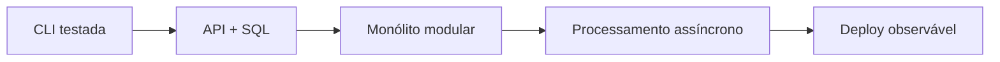

# Percurso: Engenharia de Software

## Resultado

Projetar, implementar, testar, entregar e operar software explicando as decisões
e seus custos. O percurso usa um serviço web como laboratório contínuo.

## Sequência

1. **Base:** [fundamentos](../fundamentals/README.md), Git e uma linguagem.
2. **Código sustentável:** coesão, acoplamento, composição, refactoring e testes.
3. **Dados:** SQL, modelagem, índices, transações e cache.
4. **Limites:** HTTP, contratos, autenticação e modelagem de domínio.
5. **Entrega:** Docker, CI, configuração, migrations e rollback.
6. **Operação:** logs, métricas, traces, SLOs e resposta a incidentes.
7. **Escala:** filas, particionamento, idempotência e consistência.

## Checkpoints

- **Fundamentos:** explique o caminho de uma requisição da rede ao banco.
- **Aplicação:** entregue uma API com testes, migration e documentação.
- **Proficiência:** diagnostique uma regressão usando perfil, plano SQL e traces.
- **Sistemas:** proponha uma evolução com capacidade, SLO, riscos e rollback.

## Projeto de síntese

Evolua os [projetos 1 a 9](../projects/README.md) sobre o mesmo domínio. Registre
cada mudança estrutural com um ADR e mantenha uma decisão explícita de quando
**não** separar serviços.

---

[← Atlas](README.md) · [↑ Atlas](README.md) · [Backend →](backend-engineer.md)
