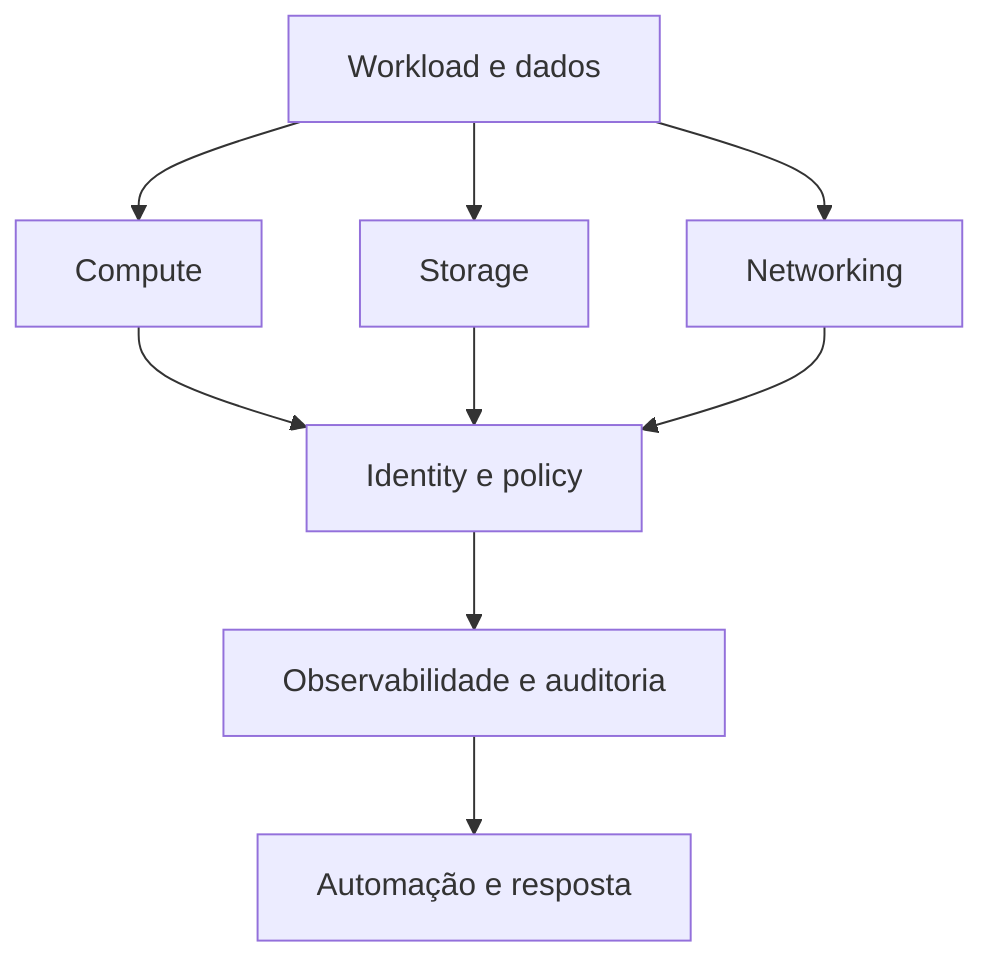

# Cloud Engineering

Cloud não elimina hardware ou operação; oferece recursos programáveis, modelos
de responsabilidade e economias próprias. A decisão útil começa por workload,
atributos de qualidade, competências da equipe e custo total.

## Modelo mental

## Conceitos fundamentais

- **região e zona:** domínio geográfico e de falha; nomes não substituem uma
  análise da arquitetura específica do provedor;
- **elasticidade:** adaptar capacidade à demanda; scaling tem atraso, limites e
  efeitos sobre estado;
- **managed service:** transfere parte da operação, nunca a responsabilidade
  sobre dados, configuração, acesso e uso correto;
- **shared responsibility:** a fronteira varia entre IaaS, PaaS e SaaS;
- **control plane e data plane:** configuração e tráfego possuem modos de falha
  diferentes;
- **infrastructure as code:** mudanças revisáveis e reprodutíveis, com estado,
  drift e secrets tratados explicitamente.

## Decisões

| Questão | Investigue |
| --- | --- |
| build ou managed | diferenciação, maturidade operacional, lock-in e custo |
| serverless ou serviço residente | padrão de carga, cold start, duração, limites e integração |
| uma ou várias regiões | RTO/RPO, residência de dados, consistência e complexidade |
| autoscaling | sinal, janela, estabilização, quotas e carga de dependências |
| multi-cloud | risco concreto mitigado versus menor profundidade e maior custo |

## FinOps como feedback de arquitetura

Alocação, tags e unit economics devem conectar custo a produto: custo por tenant,
job, requisição ou token. Reduzir uma fatura sem preservar confiabilidade pode
apenas converter custo cloud em incidente e trabalho humano.

## Segurança e operação

- identidade de workload com credenciais curtas;
- least privilege e separation of duties;
- encryption in transit/at rest com ciclo de vida de chaves;
- inventário, audit trail e políticas como código;
- backups restaurados em teste, não apenas “bem-sucedidos” no painel;
- quotas, budgets e circuit breakers contra consumo acidental.

## Exercício

Projete o mesmo serviço em VM, containers gerenciados e funções. Estime custo em
baixa e alta utilização, cold start, deploy, observabilidade, recuperação e
skills necessárias. Registre a decisão em um [ADR](../templates/adr.md).

## Referências oficiais

- [AWS Well-Architected Framework](https://docs.aws.amazon.com/wellarchitected/latest/framework/welcome.html)
- [Google Cloud Architecture Framework](https://cloud.google.com/architecture/framework)
- [Microsoft Azure Well-Architected Framework](https://learn.microsoft.com/azure/well-architected/)
- [FinOps Framework](https://www.finops.org/framework/)

---

[← Kubernetes](../kubernetes/README.md) · [↑ Início](../README.md) · [Observabilidade →](../observability/README.md)
