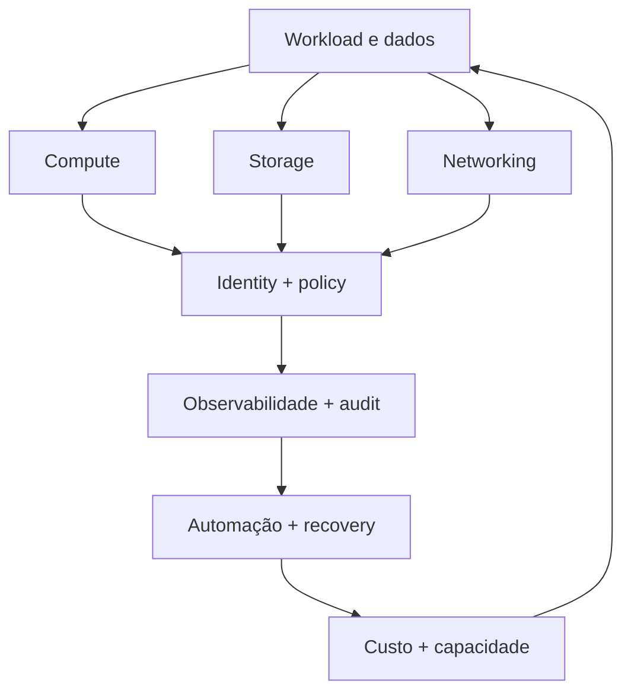
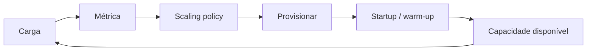

# Cloud Engineering

Cloud não elimina hardware, redes ou operação. Ela transforma infraestrutura em
recursos programáveis e oferece serviços com diferentes fronteiras de
responsabilidade. O ganho pode ser elasticidade, velocidade, alcance global e
redução de toil. O custo pode aparecer como lock-in, complexidade de IAM,
variabilidade de cobrança e dependência de control planes externos.

A decisão madura começa por workload e atributos de qualidade, não pela lista de
serviços do provedor.

## 1. Um modelo mental



Todo workload precisa responder, de alguma forma:

- onde computa?
- onde persiste?
- como trafega?
- quem pode acessar?
- como é observado?
- como recupera?
- quanto custa por unidade útil?

## 2. Região, zona e failure domains

Região é um agrupamento geográfico de infraestrutura. Availability Zone ou
conceito equivalente representa um domínio de falha dentro da região, conforme o
provedor.

"Multi-AZ" não é uma garantia universal. A aplicação precisa confirmar:

- quais componentes realmente atravessam zonas;
- onde replicas estão colocadas;
- se load balancer continua operando;
- se storage permite failover;
- como DNS/control plane se comporta;
- qual capacidade sobra depois da perda de uma zona.

Se três réplicas são distribuídas em três zonas, perder uma zona deixa duas.
Essas duas precisam suportar a carga restante. Alta disponibilidade exige
**capacidade durante falha**, não apenas distribuição nominal.

## 3. Control plane e data plane

Control plane recebe/configura intenção: criar instância, alterar policy,
provisionar rota. Data plane executa tráfego ou processamento efetivo.

Essa separação é essencial em incidentes. Um serviço pode continuar processando
requests com configuração existente mesmo que API de controle esteja degradada.
Outro pode depender do control plane em cada operação.

Ao adotar serviço gerenciado, pergunte:

- data plane continua funcionando se control plane cair?
- configuração nova pode ser aplicada?
- credenciais/tokens dependem de serviço externo?
- failover é automático ou exige API de controle?

## 4. Shared responsibility

Quanto mais gerenciado o serviço, mais operação o provedor assume, mas
responsabilidade do cliente nunca zera.

| Modelo | Provedor tende a assumir mais | Cliente continua responsável por |
| --- | --- | --- |
| IaaS | hardware, facilities, virtualization | OS, patching, aplicação, IAM, dados |
| containers gerenciados | parte do control plane/runtime | imagem, app, configuração, identidade, dados |
| database gerenciado | engine/patching/HA parcial | schema, queries, access, backup policy, dados |
| SaaS | aplicação e infraestrutura | usuários, configuração, dados, uso e integração |

A fronteira exata varia por serviço. Leia a documentação específica.

## 5. Compute: VM, container, function ou serviço especializado

### VM

Favorece controle do sistema operacional e workloads que exigem customização.
Cobra patching, image lifecycle e gestão mais direta de capacidade.

### Containers gerenciados

Favorecem empacotamento consistente e processos residentes sem necessariamente
operar Kubernetes. Podem ser excelente meio-termo.

### Serverless functions

Favorecem workloads orientados a eventos, escala variável e unidades curtas de
execução. Cobram limites de duração/runtime, cold start, observabilidade
distribuída e custo menos intuitivo em carga constante.

### Serviço especializado

Fila, banco, object storage, stream processor ou search gerenciado podem remover
muito código operacional. O trade-off é semântica específica e lock-in maior.

Não compare apenas preço por CPU. Compare custo total de operar e recuperar.

## 6. Elasticidade é um control loop

Autoscaling observa um sinal, toma decisão e adiciona/remove capacidade. Há
atraso entre demanda e capacidade útil.



Perguntas:

- qual métrica antecede saturação?
- quanto tempo leva para nova capacidade ficar pronta?
- dependências também escalam?
- quotas do provedor permitem a expansão?
- scale-down encerra trabalho em andamento?
- existe capacidade mínima para falha de zona?

Elasticidade não é instantânea e não corrige uma dependência fixa.

## 7. Storage: escolha por acesso e garantia

### Object storage

Excelente para blobs/objetos imutáveis ou versionados, alta durabilidade e
integração com pipelines. Não é filesystem POSIX comum.

### Block storage

Apresenta volumes usados por filesystems/bancos. Performance pode depender de
IOPS, throughput, tamanho e classe.

### File storage

Oferece compartilhamento por protocolo de filesystem, pagando semântica e
latência de rede.

### Databases gerenciados

Adicionam modelo de consulta, transações e operação da engine. "Managed" não
elimina modelagem, índices, migrations, connection limits ou restore drills.

Escolha começando por access patterns, consistência, durabilidade, RPO/RTO e
custo de transferência.

## 8. Networking é parte da arquitetura

VPC/VNet e equivalentes organizam endereços, routes e boundaries. Subnet pública
não significa necessariamente workload exposto; exposure depende de route,
gateway, load balancer, firewall/security groups e IPs.

Uma chamada entre serviços pode envolver:

```text
DNS → route → NAT/proxy/LB → firewall/policy → TLS → destino
```

Custos de egress e tráfego cross-zone/region podem alterar arquitetura e fatura.

### NAT também tem capacidade

NAT gateways/appliances têm limites e custo. Muitas conexões curtas podem
pressionar portas/connection tracking. Diagnóstico de "API externa instável" pode
terminar em exaustão de recursos de rede próprios.

## 9. IAM é o sistema nervoso de cloud

Cloud transforma quase tudo em API. IAM decide quem pode chamar quais APIs sobre
quais recursos.

Evite credenciais estáticas quando workload identity/roles temporárias estão
disponíveis.

Uma policy precisa responder:

- principal;
- ação;
- recurso;
- condições;
- duração/contexto.

`*:*` é fácil de operar e difícil de defender.

### Permission boundaries e organização

Em escala, não dependa apenas de policies individuais. Use controles
organizacionais, boundaries e separação entre ambientes para limitar blast
radius de credenciais comprometidas.

## 10. Infrastructure as Code

IaC transforma configuração em artefato revisável, reproduzível e testável.

Mas introduz estado e workflow próprios:

- source representa intenção;
- state pode mapear recursos reais;
- provider/API possui comportamento e versão;
- drift pode surgir por mudanças manuais;
- apply pode falhar parcialmente.

Uma pipeline de IaC precisa de preview/plan, review, permissões mínimas e política
para mudanças destrutivas.

### IaC não torna mudança automaticamente segura

Um `terraform apply` reproduzível pode reproduzir uma configuração perigosa com
excelente consistência. Validação de policy, testes e rollout continuam
necessários.

## 11. Managed services e lock-in

Lock-in não é binário. Existe em:

- API;
- formato de dados;
- operação;
- IAM;
- observabilidade;
- skills da equipe;
- volume de dados para migrar;
- serviços integrados.

Às vezes lock-in é uma boa troca. Um serviço gerenciado pode economizar anos de
engenharia. A pergunta é se o benefício atual compensa o custo de saída e se
existe um plano plausível quando o risco for relevante.

Evite construir abstração genérica para "trocar de cloud amanhã" sem cenário
real. Abstração também custa.

## 12. Alta disponibilidade e disaster recovery

### HA

Tenta manter serviço durante falhas esperadas, como perda de processo/node/zona.

### DR

Trata eventos maiores e recuperação de dados/serviço.

Defina:

- **RTO:** quanto tempo de indisponibilidade é tolerável;
- **RPO:** quanto dado pode ser perdido;
- dependências críticas;
- ordem de recuperação;
- autoridade para failover;
- critérios de failback.

Backup sem restore testado não é estratégia de DR.

### Multi-region cobra consistência

Distribuir leitura é relativamente simples. Distribuir escrita forte entre
regiões paga latência/coordenação. Active-active adiciona resolução de conflito,
routing e operação.

Use requisito de negócio para justificar a complexidade.

## 13. FinOps como feedback técnico

Fatura total é pouco acionável. Procure unit economics:

- custo por request;
- custo por tenant;
- custo por job;
- custo por GB processado;
- custo por token/inferência;
- custo por transação.

Isso conecta arquitetura ao valor produzido.

### Custos invisíveis

- egress;
- cross-zone traffic;
- logs/traces excessivos;
- snapshots esquecidos;
- IPs/load balancers ociosos;
- capacidade reservada mal dimensionada;
- ambientes temporários permanentes;
- retry que multiplica requests.

Otimização de custo sem SLO pode converter dólares em incidentes e toil.

## 14. Observabilidade de cloud

Além da aplicação, observe:

- quotas e throttling de APIs;
- capacidade/health de load balancers;
- NAT/connection tracking;
- storage latency/IOPS;
- replication lag;
- autoscaling decisions;
- IAM denies;
- control-plane audit;
- custo por dimensão.

Provider status page é fonte externa, não substituto de sinais do seu workload.

## 15. Segurança

Princípios:

- contas/projetos separados por ambiente quando apropriado;
- workload identity com credenciais curtas;
- least privilege;
- encryption in transit/at rest e lifecycle de chaves;
- egress/ingress controlado;
- secrets em serviço apropriado;
- audit logs protegidos;
- guardrails organizacionais;
- supply-chain verification;
- backup independente do mesmo blast radius.

Shared responsibility significa que configuração insegura do cliente continua
sendo insegura em serviço altamente gerenciado.

## 16. Modos de falha

| Falha | Sintoma | Evidência | Mitigação |
| --- | --- | --- | --- |
| quota esgotada | scaling/provision falha | API quota/throttle | capacity planning + quota request |
| AZ perdida sem headroom | serviço degrada | placement/capacity | reservar capacidade de falha |
| IAM amplo comprometido | mudança em massa | audit trail | boundaries + least privilege |
| NAT/ports saturados | outbound intermitente | connection/NAT metrics | pooling, capacidade, arquitetura |
| control plane indisponível | deploy/config falha | provider API errors | data-plane independence/runbook |
| restore não testado | backup existe, recuperação falha | restore drill | testes periódicos |
| autoscaling tardio | p99 explode antes de scale | queue + scaling timeline | sinal e warm capacity |
| egress inesperado | fatura cresce | cost allocation/flow | arquitetura e budgets |

## 17. Portabilidade versus profundidade

Multi-cloud pode ser requisito real para negociação, risco regulatório ou
continuidade. Também pode reduzir profundidade operacional porque a equipe precisa
conhecer duas plataformas e construir uma camada comum.

Antes de adotar, escreva o cenário de falha que multi-cloud resolve e compare com
alternativas:

- multi-region no mesmo provedor;
- backup/export independente;
- artefatos portáveis;
- contrato comercial;
- serviço secundário de DR.

Se o cenário não exige operação simultânea em duas clouds, não pague esse custo
por reflexo.

## 18. Laboratórios

### Beginner

Projete uma API simples em VM, container gerenciado e function. Liste as
responsabilidades que permanecem com a equipe.

### Intermediate

- crie autoscaling e meça tempo até nova capacidade ficar ready;
- simule quota insuficiente;
- compare custo por request em baixa e alta utilização.

### Advanced

- modele perda de uma zona e confirme headroom;
- faça restore de banco em ambiente isolado e meça RTO/RPO real;
- aplique IAM mínimo a um workload usando credencial temporária.

### Expert

Projete uma arquitetura multi-region para uma operação de escrita importante.
Compare active-passive e active-active em latência, consistência, failover,
reconciliação e custo. Execute um game day e registre as diferenças entre o
diagrama e a recuperação real.

## Referências

- AWS. [Well-Architected Framework](https://docs.aws.amazon.com/wellarchitected/latest/framework/welcome.html).
- Google Cloud. [Architecture Framework](https://cloud.google.com/architecture/framework).
- Microsoft Azure. [Well-Architected Framework](https://learn.microsoft.com/azure/well-architected/).
- FinOps Foundation. [FinOps Framework](https://www.finops.org/framework/).
- NIST. [Cloud Computing Synopsis and Recommendations](https://csrc.nist.gov/pubs/sp/800/146/final)
  oferece conceitos independentes de provedor.

---

[← Kubernetes](../kubernetes/README.md) · [↑ Início](../README.md) · [Observabilidade →](../observability/README.md)
