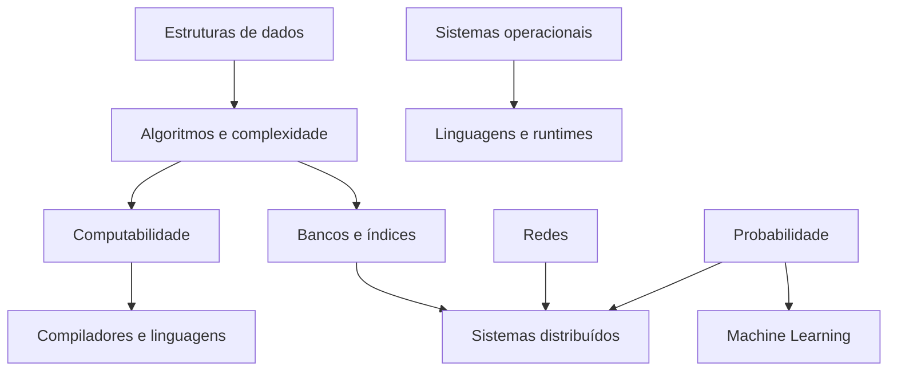

# Ciência da Computação

Ciência da Computação fornece modelos para raciocinar sobre informação,
algoritmos, máquinas e limites. A utilidade para engenharia aparece quando um
problema deixa de ser "qual biblioteca eu uso?" e passa a ser "qual propriedade
precisa permanecer verdadeira e qual custo é inevitável?".

Esta área não pretende virar um curso universitário comprimido. O objetivo é
conectar teoria a decisões observáveis em software real.

## Mapa do domínio

## 1. Algoritmos: invariantes antes de código

Um algoritmo é uma sequência de transformações que preserva propriedades até
produzir o resultado. Decorar implementações ajuda pouco se você não consegue
explicar por que funcionam.

Considere binary search. A ideia central não é o `while`. É o invariante de que,
se o elemento procurado existe, ele continua dentro do intervalo ainda não
descartado. Cada comparação elimina uma parte que não pode conter a resposta.

Esse raciocínio reaparece em produção:

- paginação mantém fronteiras de leitura;
- retry preserva identidade da operação;
- eleição de líder preserva regras de termo/epoch;
- migrações mantêm compatibilidade entre versões adjacentes;
- locks preservam exclusão sobre uma região de estado.

### Complexidade é uma função do input

Dizer `O(n log n)` sem declarar o que é `n` é incompleto. Em sistemas reais,
existem múltiplas dimensões: número de usuários, arestas, documentos, bytes,
partições e consultas simultâneas.

Além de tempo, analise:

- espaço auxiliar;
- I/O;
- número de chamadas remotas;
- paralelismo disponível;
- comportamento no pior caso;
- distribuição real dos inputs.

## 2. Estruturas de dados: escolha pela operação dominante

Estruturas representam compromissos entre layout, operações e invariantes.

| Estrutura | Operação favorecida | Onde aparece |
| --- | --- | --- |
| array | scan e acesso indexado | buffers, vectors, columnar storage |
| hash table | lookup exato | caches, symbol tables, maps |
| árvore balanceada | ordem e ranges | índices B-tree, schedulers |
| heap | próximo mínimo/máximo | priority queues, timers |
| trie | prefixo | routing, autocomplete |
| bloom filter | teste probabilístico de ausência | storage engines, caches |
| grafo | relações e caminhos | dependências, redes, social graph |

### Probabilística não significa incorreta

Um Bloom filter pode retornar falso positivo, mas não falso negativo sob seu
modelo normal. Isso parece uma fraqueza até perceber que ele serve como filtro
barato antes de uma operação cara. A pergunta correta é qual erro é permitido e
qual etapa posterior o corrige.

Essa ideia prepara o terreno para cache, sampling, approximate counting e
sistemas de busca.

## 3. Recursão, iteração e a máquina que executa

Recursão é uma forma de expressar decomposição, não uma garantia de eficiência.
Cada chamada pode consumir stack. Algumas linguagens otimizam tail calls em
contextos específicos; outras não.

Ao escolher entre recursão e iteração, considere:

- profundidade máxima;
- clareza do invariante;
- custo de stack frames;
- possibilidade de usar uma stack explícita;
- comportamento do runtime.

Traversal de árvore é um bom exercício porque força a distinguir estrutura do
controle de execução.

## 4. Grafos: quando o problema é relação

Muitos sistemas são grafos disfarçados: dependências entre serviços, rotas de
rede, módulos, autorização, workflows e lineage de dados.

### BFS e DFS não são apenas exercícios

BFS encontra caminhos mínimos em grafos não ponderados e consome memória pela
fronteira. DFS explora profundidade e é útil para detecção de ciclos,
componentes e ordenação topológica em DAGs.

Topological sort aparece em:

- build systems;
- migrações com dependências;
- schedulers;
- pipelines de dados;
- resolução de packages.

Uma dependência circular que quebra um build é a mesma família conceitual de um
ciclo em grafo dirigido.

## 5. Programação dinâmica: eliminar recomputação com estado

Dynamic Programming resolve problemas com subestrutura ótima e subproblemas
repetidos armazenando resultados intermediários. O aprendizado importante não é
memorizar knapsack. É reconhecer quando uma explosão combinatória contém estado
repetido.

Pergunte:

1. qual é o menor estado que determina o restante da decisão?
2. quais transições existem?
3. existe sobreposição de subproblemas?
4. quanto custa guardar resultados?

Esse raciocínio aparece em otimização, parsing, diff, alinhamento e planejamento.

## 6. Computabilidade e limites

Nem todo problema possui algoritmo que sempre produz uma resposta. O Halting
Problem é o exemplo clássico: não existe algoritmo geral que determine para todo
programa e input se a execução terminará.

Isso não significa que ferramentas estáticas sejam inúteis. Significa que elas
operam com restrições, aproximações ou incompletude. Type checkers, linters,
security scanners e analyzers escolhem regiões tratáveis do problema.

### Decidibilidade muda expectativas

Quando uma ferramenta "não consegue provar" segurança, ausência de deadlock ou
terminação, isso não implica automaticamente defeito da ferramenta. Pode haver
limite teórico, custo computacional proibitivo ou falta de informação.

## 7. Autômatos, linguagens e parsers

Regular expressions, finite automata, grammars e parsers estudam quais sequências
são válidas e como reconhecê-las.

Uma regex é excelente para linguagem regular. À medida que a estrutura exige
aninhamento arbitrário e contexto, gramáticas e parsers adequados tornam o
modelo mais claro.

Pipeline conceitual:

Esse mapa ajuda a entender compiladores, templates, query languages,
configuration DSLs e validação de syntax trees.

## 8. Sistemas operacionais: abstrações sobre recursos físicos

O sistema operacional oferece processos, memória virtual, filesystem, sockets e
scheduling. Essas abstrações criam isolamento e conveniência, mas não eliminam
limites físicos.

Perguntas que um engenheiro deve conseguir investigar:

- qual processo está consumindo CPU?
- quantas threads realmente executam?
- há page faults ou pressão de memória?
- file descriptors estão vazando?
- a aplicação espera disco, rede ou lock?
- o scheduler está dividindo CPU entre quantos concorrentes?

Containers e runtimes modernos ficam muito menos mágicos quando namespaces,
cgroups, virtual memory e syscalls já são familiares.

## 9. Redes: latência é composição de filas e protocolos

A rede não é apenas "mandar bytes". Dados são segmentados, roteados, retransmitidos,
controlados por congestionamento e protegidos por protocolos.

### TCP e QUIC

TCP oferece um byte stream confiável e ordenado sobre IP. Perda de pacote pode
bloquear progresso do stream até retransmissão. QUIC implementa transporte
confiável sobre UDP, incorpora TLS e permite múltiplos streams, reduzindo certos
efeitos de head-of-line entre streams.

A escolha de protocolo não corrige automaticamente um backend lento. Medir DNS,
connect, TLS, server time e transferência separadamente evita culpar a camada
errada.

### Congestion control é cooperação

Um sender não deve despejar dados ilimitados na rede. Algoritmos de congestion
control ajustam envio conforme sinais de capacidade e perda. A ideia geral de
feedback e backpressure reaparece em filas, streams e databases.

## 10. Bancos de dados como aplicação de CS

Bancos combinam estruturas, concorrência, storage e recuperação.

- B-trees favorecem ranges e page-oriented storage.
- LSM trees transformam writes aleatórias em append/merge, pagando compaction e
  read amplification.
- WAL registra intenção/mudança de forma durável antes de páginas finais.
- MVCC mantém múltiplas versões para coordenar leituras e escritas.
- query optimizers exploram alternativas e estimam custo.

Um índice não é um botão de performance. Ele materializa uma estrutura adicional
que precisa ser atualizada e escolhida pelo planner.

## 11. Probabilidade: raciocinar com incerteza

Engenharia observa amostras, não o universo inteiro. Latência, tráfego, falhas e
métricas de modelos são distribuições.

### Média, mediana e percentis

Média pode ser dominada por outliers. Mediana descreve o ponto central. Percentis
mostram cauda. Para latência, p99 significa que aproximadamente 99% das
observações do período ficaram abaixo daquele valor, não que um usuário sempre
terá 1% de requests lentas.

### Condicionalidade importa

`P(A|B)` não é `P(B|A)`. Essa confusão aparece em alertas, testes médicos,
detecção de fraude e debugging. Um sinal comum entre incidentes não
necessariamente torna incidente provável quando o sinal aparece, especialmente
se a taxa base for baixa.

### Sampling e viés

Uma amostra grande pode continuar ruim se não representar a população. Em
observabilidade e ML, perguntar "como os dados foram coletados?" pode ser mais
importante do que aumentar volume.

## 12. Compiladores e runtimes

Compiladores transformam programas preservando semântica relevante enquanto
produzem outra representação. Otimizações podem incluir constant folding,
inlining, dead-code elimination e register allocation.

JITs acrescentam informação de runtime: hot paths observados podem receber código
mais especializado. Isso explica warm-up, deoptimization e por que benchmarks
curtos podem enganar.

### Tipos também são computação

Type systems podem impedir classes de estados inválidos antes da execução. Mas
todo dado externo cruza uma fronteira onde validação runtime ainda é necessária.
TypeScript, por exemplo, apaga tipos estáticos no JavaScript emitido; um payload
HTTP continua não confiável.

## 13. Falhas de raciocínio frequentes

- comparar algoritmos apenas pelo Big O sem distribuição ou constantes;
- escolher estrutura pela familiaridade, não pelas operações;
- usar regex para linguagem estrutural complexa;
- assumir que mais paralelismo sempre reduz tempo;
- tratar média como representação completa de uma distribuição;
- confundir correlação com causalidade;
- acreditar que um benchmark sintético representa produção;
- atribuir ao framework um comportamento que nasce do OS, runtime ou rede.

## 14. Laboratórios progressivos

### Beginner

- implemente array dinâmico ou hash table simples e documente invariantes;
- implemente BFS e DFS sobre o mesmo grafo;
- escreva binary search e prove por que não descarta a resposta.

### Intermediate

- crie um pequeno parser com lexer e árvore sintática;
- implemente um servidor e observe sockets, threads e file descriptors;
- compare duas estruturas sob uma distribuição de acesso realista.

### Advanced

- construa um key-value store append-only com índice em memória e recovery;
- simule uma rede com atraso/perda e observe retransmissão/retry;
- implemente um scheduler simples ou event loop para entender filas de trabalho.

### Expert

Escolha uma hipótese de produção, por exemplo "o gargalo está no algoritmo".
Colete CPU profile, I/O, filas e distribuição de inputs. Produza um relatório que
aceite ou rejeite a hipótese e explique qual conceito de CS foi decisivo.

## 15. Projetos de síntese

- **Key-value store:** log, index, checksum, recovery e compaction simples.
- **Servidor HTTP:** limites, backpressure, cancelamento e métricas.
- **Interpretador:** lexer, parser, AST, environment e evaluator.
- **Simulador distribuído:** mensagens atrasadas/duplicadas e estados divergentes.
- **Mini query engine:** scan, filter, projection, join simples e comparação de
  planos.

Projetos valem mais quando o README contém hipóteses, medidas e falhas
observadas, não apenas screenshots do caminho feliz.

## Ordem sugerida

1. estruturas de dados, invariantes e análise de complexidade;
2. processos, memória, I/O e runtimes;
3. redes e protocolos;
4. bancos, concorrência e recovery;
5. probabilidade e sistemas distribuídos;
6. compiladores, linguagens formais e temas especializados.

## Referências

- [MIT OpenCourseWare, EECS](https://ocw.mit.edu/search/?d=Electrical%20Engineering%20and%20Computer%20Science)
  oferece cursos e materiais acadêmicos oficiais.
- [Teach Yourself Computer Science](https://teachyourselfcs.com/) organiza uma
  rota comunitária baseada em livros universitários.
- Cormen et al. *Introduction to Algorithms*. [MIT Press](https://mitpress.mit.edu/9780262046305/introduction-to-algorithms/).
- Bryant & O'Hallaron. [*Computer Systems: A Programmer's Perspective*](https://csapp.cs.cmu.edu/).
- Kurose & Ross. [*Computer Networking: A Top-Down Approach*](https://gaia.cs.umass.edu/kurose_ross/).
- [ACM Computing Classification System](https://dl.acm.org/ccs) ajuda a localizar
  subáreas e literatura.

---

[← Fundamentos](../fundamentals/README.md) · [↑ Início](../README.md) · [Linguagens →](../languages/README.md)
