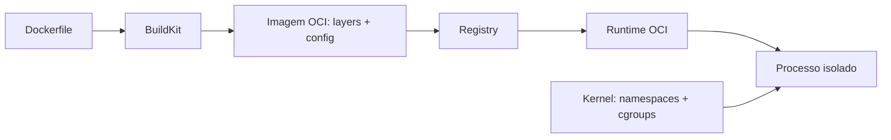

# Containers

Containers empacotam filesystem e configuração de processo, usando isolamento do kernel; não são máquinas virtuais leves em todos os sentidos. Esta trilha vai da imagem reproduzível ao runtime seguro.

## Trilha

- [Docker](docker/README.md): imagens, build, execução, redes e volumes.
- [Segurança e supply chain](security.md): provenance, capabilities, rootless e políticas.
- [Exercícios](exercises.md): build, debug e hardening.

## Modelo mental

Namespaces isolam visões de PID, mount, network, IPC e usuários; cgroups controlam/medem recursos; capabilities dividem privilégios de root. O kernel continua compartilhado, portanto boundary de segurança depende de configuração e threat model.

## Princípios

- imagem imutável, configuração/secret em runtime;
- um lifecycle principal por container, com sidecars apenas por responsabilidade clara;
- PID 1 deve receber sinais e reaproveitar processos filhos;
- limites de CPU/memória testados; OOM e throttling fazem parte do design;
- estado durável vive em volume/serviço com backup, não na writable layer;
- build reproduzível, dependências fixadas e artefato promovido entre ambientes.

## Referências

- Open Container Initiative. [Specifications](https://opencontainers.org/).
- Linux kernel. [Control Group v2](https://docs.kernel.org/admin-guide/cgroup-v2.html).
- Docker. [Documentation](https://docs.docker.com/).

---

[← Mensageria](../messaging/README.md) · [↑ Início](../README.md) · [Docker →](docker/README.md)
