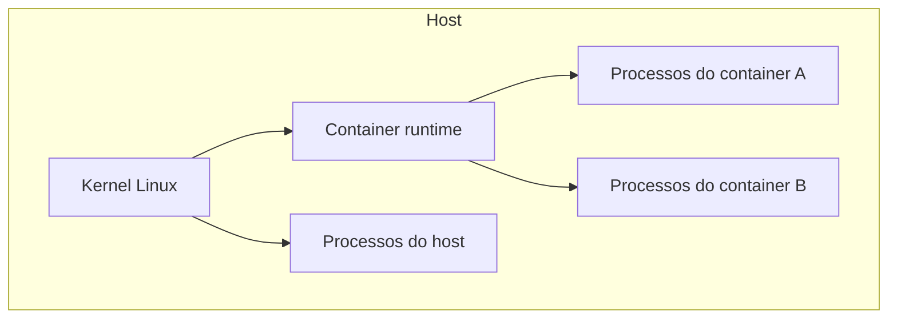
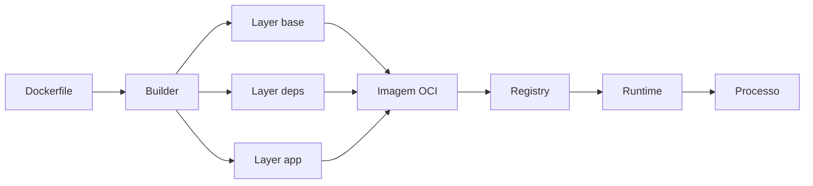

# Containers

Containers empacotam uma aplicação com filesystem e configuração de processo,
mas executam sobre o kernel do host. A ideia parece simples até aparecerem
questões de namespaces, cgroups, PID 1, filesystem em camadas, sinais, limites
de memória, permissões e supply chain.

Este guia constrói um modelo de execução antes de chegar ao Dockerfile.

## Trilha

- [Docker](docker/README.md): imagens, build, execução, redes e volumes.
- [Segurança e supply chain](security.md): provenance, capabilities, rootless e
  políticas.
- [Exercícios](exercises.md): build, debug e hardening.

## 1. Container não é uma VM pequena

Uma máquina virtual normalmente executa um kernel convidado sobre um hypervisor.
Um container executa processos normais do host com visões e limites controlados
pelo kernel.



Isso tem duas consequências importantes:

1. startup pode ser rápido porque não é necessário inicializar outro kernel;
2. a boundary de isolamento é diferente da de uma VM e precisa ser avaliada no
   threat model.

O termo "container" descreve a combinação de mecanismos e convenções. Não existe
uma syscall Linux chamada `container()`.

## 2. Namespaces: mudar a visão do processo

Namespaces isolam partes do ambiente que um processo enxerga.

| Namespace | Isola a visão de | Exemplo de efeito |
| --- | --- | --- |
| PID | processos | PID 1 dentro do container pode ser outro PID no host |
| mount | mounts/filesystem | container recebe sua própria árvore de mounts |
| network | interfaces, routes, ports | cada container pode ter stack de rede própria |
| UTS | hostname/domain | hostname independente |
| IPC | mecanismos IPC | filas/semaphores separados |
| user | IDs de usuário/grupo | root interno pode mapear para usuário não-root externo |
| cgroup | hierarquia de cgroups | visão isolada da organização de recursos |

Namespace não limita consumo. Ele muda a visibilidade. Limites entram
principalmente com cgroups.

## 3. Cgroups: recursos não são infinitos

Control groups organizam processos e controlam/medem recursos como CPU e memória.

### CPU

Um limite de CPU não significa reservar um core físico. Dependendo da
configuração, o processo recebe uma quota em janelas de tempo. Ao consumir a
quota, pode ser throttled até a próxima janela.

Sintoma típico:

- CPU do container parece "no limite";
- latência aumenta;
- aplicação não está bloqueada em I/O;
- métricas de throttling crescem.

Aumentar threads pode piorar o quadro porque o scheduler tem mais trabalho para
disputar a mesma quota.

### Memória

Memória é mais perigosa porque não existe um equivalente simples a "esperar a
próxima janela". Ao exceder limites, processos podem sofrer OOM kill.

Um container reiniciando com código aparentemente correto pode estar morrendo
por:

- heap configurado maior que o limite;
- cache sem bound;
- buffers de rede/arquivo;
- memory leak;
- page cache e working set maiores que o esperado.

Configure runtime e aplicação conhecendo o limite real do container.

## 4. A imagem OCI

Uma imagem é conteúdo imutável composto por layers e configuração. O runtime usa
essa descrição para criar o filesystem e iniciar o processo.



### Layers são conteúdo, não passos mágicos

Cada mudança de filesystem pode criar conteúdo endereçado por digest. Layers
podem ser reutilizadas entre builds/imagens. A ordem do Dockerfile afeta cache:
coloque mudanças frequentes depois de dependências estáveis quando fizer sentido.

Mas otimizar cache sem cuidar de reprodutibilidade gera builds rápidos e
imprevisíveis. Dependências e base images precisam de política de atualização e,
quando necessário, pin por digest.

## 5. Copy-on-write e writable layer

A imagem é imutável; o container recebe uma camada gravável. Alterar um arquivo
originado de uma layer pode exigir copy-on-write.

Essa camada não deve virar banco de dados acidental. Se o container for
substituído, estado local pode desaparecer.

Estado durável precisa de estratégia explícita:

- volume persistente;
- object storage;
- banco externo;
- fila ou serviço especializado.

A pergunta é: quem possui o dado e qual é o processo de backup/restore?

## 6. Build e runtime são trust boundaries diferentes

Multi-stage build permite usar compiladores e ferramentas numa etapa e copiar só
o artefato necessário para a imagem final.

```dockerfile
FROM golang:1.26 AS build
WORKDIR /src
COPY go.mod go.sum ./
RUN go mod download
COPY . .
RUN CGO_ENABLED=0 go build -o /out/app ./cmd/app

FROM gcr.io/distroless/static-debian13:nonroot
COPY --from=build /out/app /app
USER nonroot:nonroot
ENTRYPOINT ["/app"]
```

O exemplo ilustra princípios, não uma receita universal:

- toolchain não precisa estar no runtime;
- processo final não precisa ser root;
- superfície da imagem pode ser pequena;
- artefato pode ser promovido sem recompilar por ambiente.

Mesmo uma imagem pequena continua vulnerável se o binário ou dependências
contiverem falhas.

## 7. PID 1 e sinais

Dentro de um PID namespace, o processo principal normalmente ocupa PID 1. Ele
tem responsabilidades especiais, inclusive reaproveitar processos filhos
zumbis em certos cenários.

Quando um orquestrador encerra o container, ele normalmente envia um sinal e
espera um grace period. A aplicação precisa:

1. parar de aceitar novo trabalho;
2. propagar cancelamento;
3. terminar requests/jobs em andamento dentro do orçamento;
4. fechar conexões e buffers;
5. sair.

Ignorar sinais transforma deploy em interrupção de tráfego.

### Shell form versus exec form

```dockerfile
# Shell pode virar processo intermediário
ENTRYPOINT /app --serve

# Exec form entrega sinais diretamente ao processo alvo
ENTRYPOINT ["/app", "--serve"]
```

Entenda a árvore de processos em vez de assumir que ambas são equivalentes.

## 8. Networking de container

Um network namespace pode ter interfaces, routes e regras próprias. Em bridges
locais, pacotes atravessam interfaces virtuais e tradução/roteamento configurado
pelo runtime. Em Kubernetes, CNI e dataplane ampliam o modelo.

Problemas frequentes:

- aplicação escuta apenas em `127.0.0.1` e não fica acessível externamente;
- DNS interno não resolve como esperado;
- porta publicada no host não é a mesma coisa que porta em que o processo
  escuta;
- MTU ou overlay introduz fragmentação/perda;
- regras de firewall/policy impedem tráfego.

Diagnóstico deve seguir camadas: processo ouvindo, interface, route, DNS,
firewall/policy e destino.

## 9. Volumes e filesystem

Mounts conectam storage ao namespace. Existem diferenças entre bind mounts,
volumes gerenciados e filesystems remotos.

Pergunte:

- o dado precisa sobreviver ao container?
- vários writers acessam simultaneamente?
- qual semântica de fsync/consistência existe?
- qual latência e throughput são esperados?
- backup inclui o estado montado?

"Está num volume" não responde durabilidade.

## 10. Segurança: root dentro ainda importa

Namespaces reduzem visão, mas o kernel é compartilhado. Hardening típico inclui:

- usuário não-root;
- filesystem read-only quando possível;
- drop de Linux capabilities desnecessárias;
- `no-new-privileges`;
- seccomp/AppArmor/SELinux conforme plataforma;
- secrets montados/injetados em runtime, não gravados na imagem;
- base images mínimas e atualizadas;
- assinatura/provenance e scanning como defesa em profundidade.

### Capabilities

Linux divide parte do poder de root em capabilities como `NET_ADMIN` e
`SYS_ADMIN`. Dar `privileged` para resolver um problema de permissão remove várias
barreiras de uma vez. Descubra a capability ou acesso realmente necessário.

## 11. Supply chain

O container final é resultado de várias dependências:

```text
source → CI runner → package registry → base image → build tools → artifact → registry
```

Cada seta é uma oportunidade de alteração maliciosa ou acidental.

Controles úteis:

- revisão e branch protection;
- dependências verificadas/pinadas;
- runners com permissões mínimas;
- SBOM;
- provenance/attestation;
- registry com políticas de acesso;
- assinatura e verificação na promoção/deploy.

Scanning encontra classes conhecidas de problema. Ele não prova que o artefato é
seguro nem que foi produzido pelo source esperado.

## 12. Performance e tamanho

Imagem menor ajuda transferência e armazenamento, mas tamanho não é a única
métrica. Cold pull depende de layers ausentes no node e throughput do registry.
Uma base compartilhada pode ser cacheada em muitos nodes.

Na execução, observe:

- CPU usage e throttling;
- memory working set e OOM;
- filesystem I/O;
- network throughput/errors;
- startup/readiness time;
- quantidade de processos/threads/FDs.

Não confunda limite com request/reserva quando estiver em um orquestrador. O
scheduler pode usar requests para placement enquanto o runtime aplica limits.

## 13. Modos de falha

| Falha | Sintoma | Evidência | Correção |
| --- | --- | --- | --- |
| OOM | restart abrupto | exit reason, memory working set | reduzir uso ou ajustar limite/runtime |
| CPU throttling | p99 cresce sob carga | throttled time/periods | capacidade, quota ou trabalho |
| PID 1 ruim | shutdown perde requests | logs/sinais/process tree | exec form e graceful shutdown |
| estado na writable layer | dado some após replace | filesystem/container lifecycle | storage durável explícito |
| imagem mutável por tag | ambientes executam artefatos diferentes | digest real | promover por digest |
| secret na layer | credencial permanece no histórico | image inspection/SBOM | secret mounts/build secrets + rotação |

## 14. Debugging por hipótese

Quando "o container não funciona", não comece reinstalando Docker. Pergunte:

1. o processo iniciou?
2. qual exit code/reason?
3. recebeu a configuração esperada?
4. existe arquivo/mount esperado?
5. está ouvindo no endereço/porta corretos?
6. DNS e route funcionam do namespace?
7. CPU/memória/FD estão limitando?
8. permissions/capabilities bloqueiam uma syscall?

Esse funil reduz o espaço de busca.

## 15. Laboratórios

### Beginner

- construa uma imagem e identifique cada layer;
- compare shell form e exec form observando a árvore de processos;
- execute como usuário não-root.

### Intermediate

- aplique limite de memória e provoque OOM controlado;
- aplique quota de CPU e observe throttling;
- use volume e confirme o que sobrevive à substituição do container.

### Advanced

- faça multi-stage build e gere SBOM;
- remova capabilities até chegar ao mínimo funcional;
- quebre DNS/rede e diagnostique a partir do namespace.

### Expert

Monte um pipeline que produz imagem por digest, SBOM e provenance; promova o
mesmo artefato entre ambientes; injete falha de shutdown, OOM e registry
indisponível; documente o comportamento e o rollback.

## Referências

- Open Container Initiative. [Specifications](https://opencontainers.org/) define
  formatos de imagem e runtime OCI.
- Linux Kernel. [Namespaces](https://man7.org/linux/man-pages/man7/namespaces.7.html)
  e [Control Group v2](https://docs.kernel.org/admin-guide/cgroup-v2.html) explicam
  os mecanismos centrais.
- Docker. [Documentation](https://docs.docker.com/) cobre build, runtime, network
  e storage no ecossistema Docker.
- CNCF. [Cloud Native Security Whitepaper](https://github.com/cncf/tag-security/tree/main/security-whitepaper)
  oferece uma visão de segurança por lifecycle.

---

[← Mensageria](../messaging/README.md) · [↑ Início](../README.md) · [Docker →](docker/README.md)
